## 矩阵的定义

行列式是一个数、n*n 是方形

矩阵是一个数表、m*n

## 特殊矩阵

- 同型矩阵 -- 行数相同、列数相同
- 零矩阵 -- 元素都是0 、不同型的零矩阵是不同的
- 方阵 -- n*n
- 上下三角矩阵-- 都是方阵
- 单位矩阵E -- 主对角线为1，其他为0 -- EA=AE=A、E的n次方为n
- 对角矩阵 -- 主对角线为λ 其他为0 --Λ为大写的λ

## 矩阵的运算

### 矩阵相等--同型且每个元素对应相等

>  ！ 若A、B均为n*n，
>
> A=B --> |A|=|B| 反之不行

### 矩阵的加法 -- 同型

> 对应行列相加

>  |A+B|  ！= ｜A｜+｜B｜

### 矩阵的数乘

> A为n*n
>
> ｜k A｜=k的n次方｜A｜

### 矩阵的乘法

### 重点没有三大律

### 矩阵的转置

【四大性质】

### 方阵的行列式

AB为n阶方阵

### 方阵的幂

$$
A^{n} = AAA...AAA
$$

### 对称矩阵和反对称矩阵-方

## 伴随矩阵（方阵）

### ！！！万能公式 

> 时刻牢记，见到伴随矩阵就想到伴随矩阵

习题

【重点题目】

## 逆矩阵-方

### 逆矩阵定义

### 逆矩阵性质

### 可逆性的判定

### 公式法求逆矩阵

### 可逆考点

---

---

### &重点公式对照

### 逆矩阵求解方法结构体系

## 分块矩阵

### 分块矩阵的计算

### 重要结论

非对角分块矩阵，直接求，

【回顾】矩阵运算

- 相等   A=B，AB同型
- 加减   A+-B
- 数乘   kA 每行/每列都要乘k，行列式是单行
- 乘法   AB 没有（三大律-交换、零因子、消去）
- 转置 --1234点性质
- 行列式
  - 
- n次幂
- 伴随矩阵
- 逆矩阵
  - 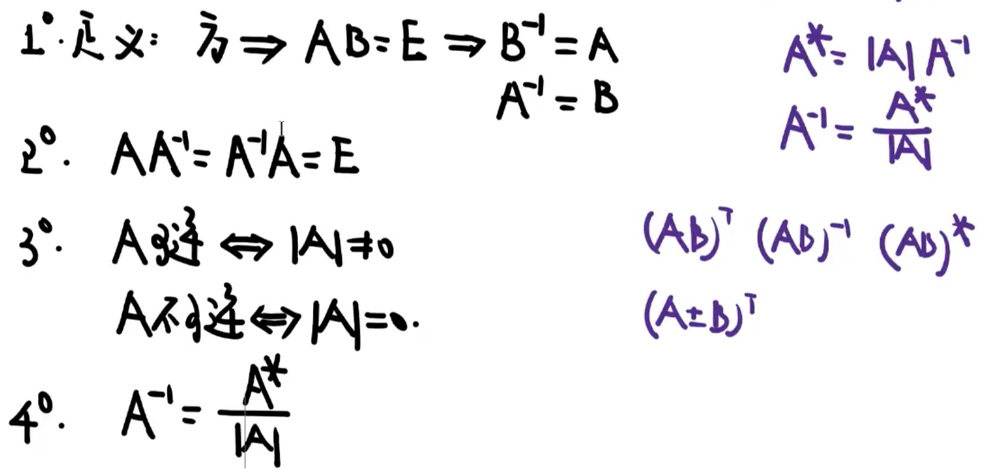

# 初等变换

> 矩阵--变换--箭头➡️
>
> 行列式--恒等变形--等号🟰

## 初等变换的定义

> 行、列

- 交换
- 倍乘
- 倍加

## 初等矩阵

>  E--进行一次初等变换
>
> 三种

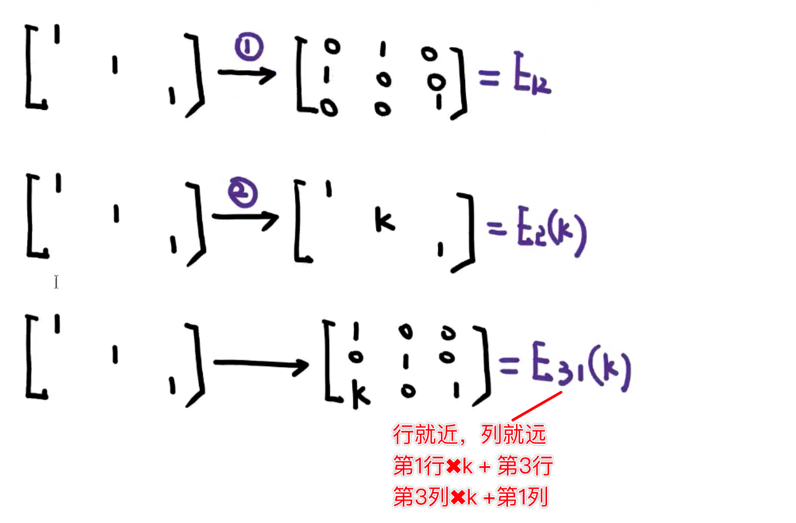

### 【左行右列】

- 初等矩阵**左乘给**一个矩阵A，就相当于让A进行一次相应的**行变换**
- 初等矩阵右乘给一个矩阵A，就相当于让A进行一次相应的**列变换**

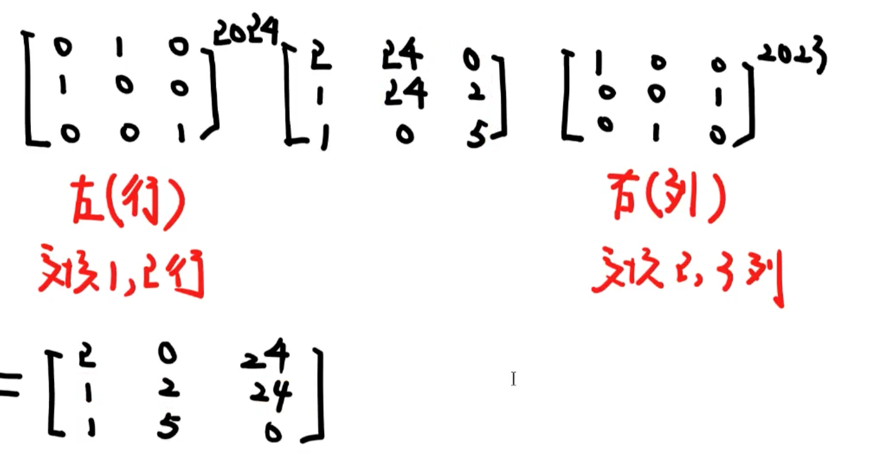

### 【黄金重点】

| 1      | E_{ij} | E_i(k) | E_ij(k) |
| ------ | ------ | ------ | ------- |
| 左(行) |        |        |         |
| 右(列) |        |        |         |
| 行列式 |        |        |         |
| 转置   |        |        |         |
| 逆矩阵 |        |        |         |
|        |        |        |         |

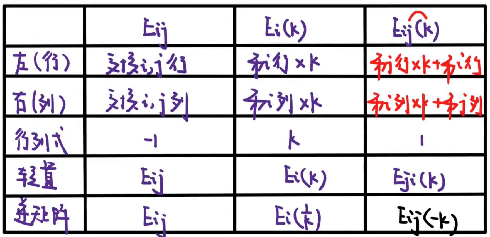

### 用初等行变换求逆矩阵

【注】若A矩阵可逆，则A一定可以经过**若干次初等行变换**到达单位矩阵

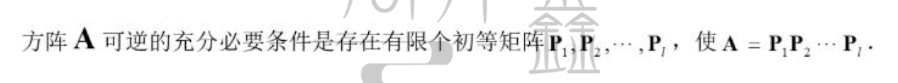

求逆矩阵

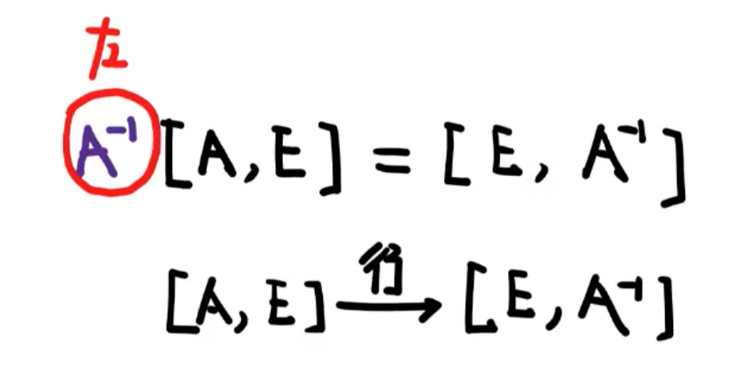

【小矩阵方程】若A可逆，求AX=B，｜A｜不等于0.

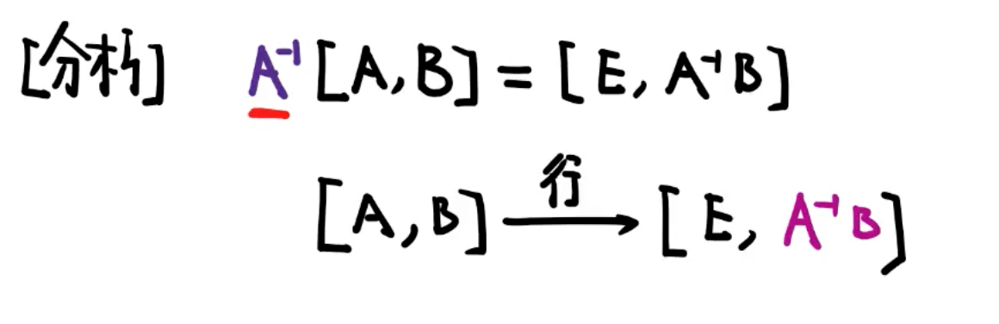

【考】行阶梯矩阵、行最简矩阵

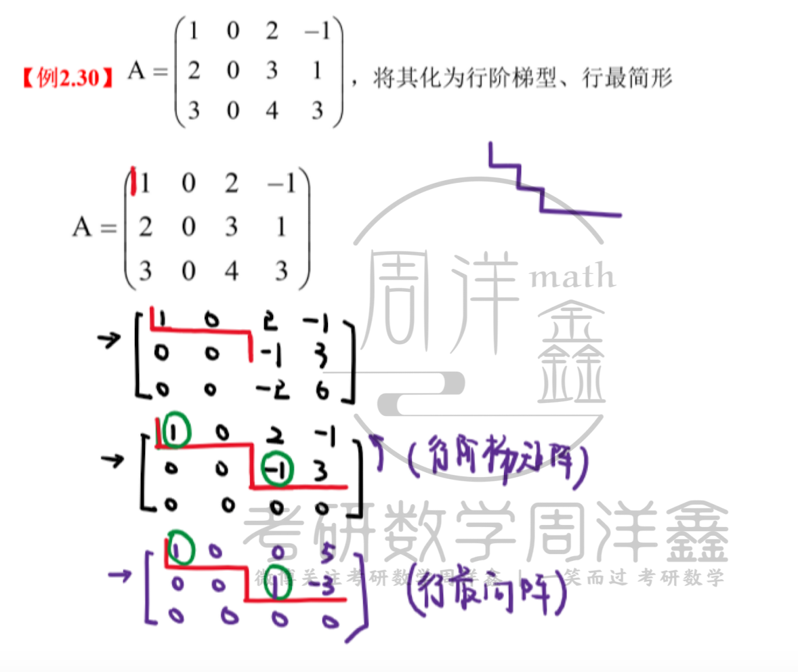

【回顾】

> 1. 初等变换（互换、倍乘、倍加）
> 2. 初等矩阵（一次初等变换）-- NB表
> 3. 左行右列
> 4. 行阶梯矩阵、行最简矩阵

# 矩阵的秩

k阶子式，任意取k行k列，相交位置的元素组成的k阶行列式

**秩：矩阵A存在一个r阶子式不为0，r+1阶子式全为0，r(A)=r;A中最高阶的非零子式。**

> r(A)<r,所有r阶子式全为零。
>
> r(A)>=r,存在一个r阶子式不为零。  

> r(A)=n  <==>  |A|不为0  <==>  A可逆 满秩
>
> r(A)=n  <==>  |A|=0        <==>  A不可逆 不满秩

> [***重要]
>
> A = 0  <==> r(A)=0
>
> 矩阵A两行不成比例  <==>   r(A)>=2
>
> A为非零矩阵              <==>   r(A)>=1 
>
> 三行不成比例不能推出秩大于等于3--可能初等行变换之后秩小于3

## 矩阵秩的计算方法

**【考】初等变换（行、列）不变秩！**

行阶梯矩阵的秩=非零行的行数

求秩和行列式的时候，可以进行行变换，列变换--可以但是没有必要

> 1. 行列式（方阵）
>    1. |A|不等于0  <==> r(A)==n
>    2. |A|=0            <==> r(A)<n
> 2. 初等变化法
>    1. A----行阶梯阵

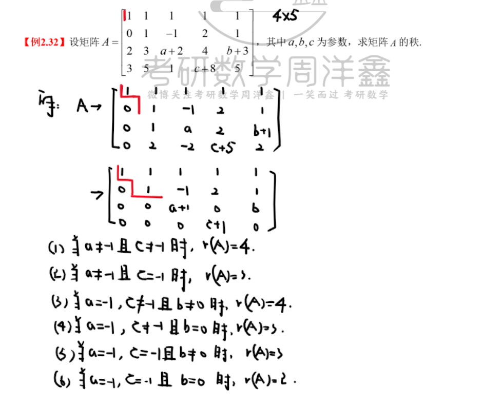

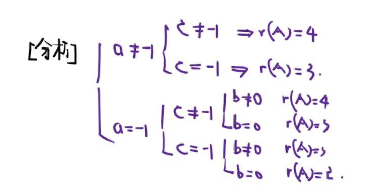

 

### 【重要】有关矩阵秩的重要结论

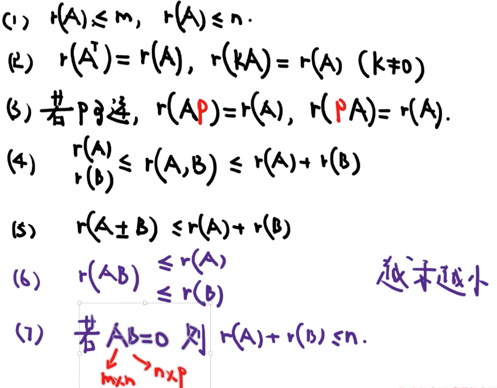

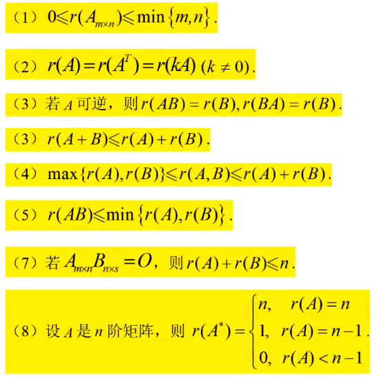

（9）分块矩阵

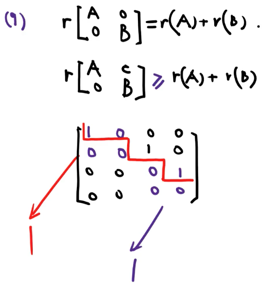

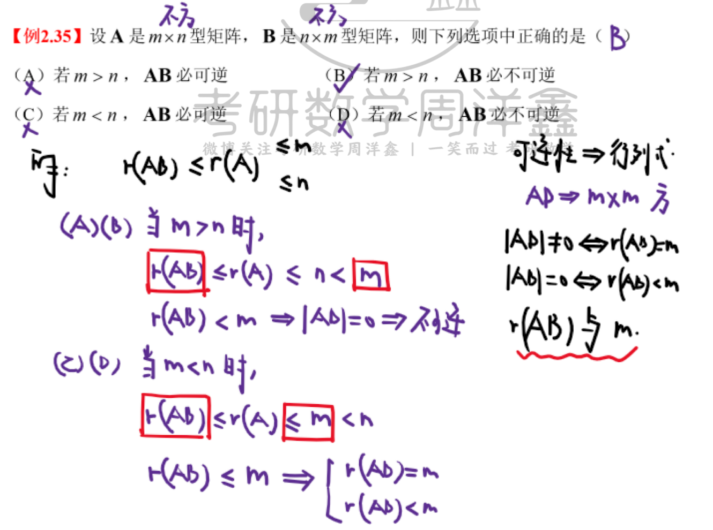

【记忆】

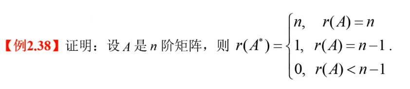

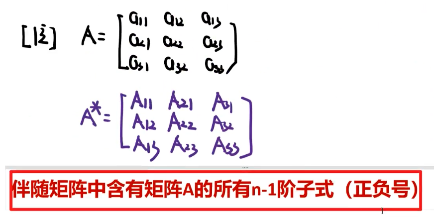

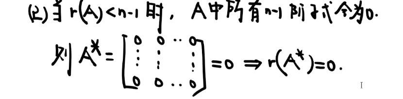

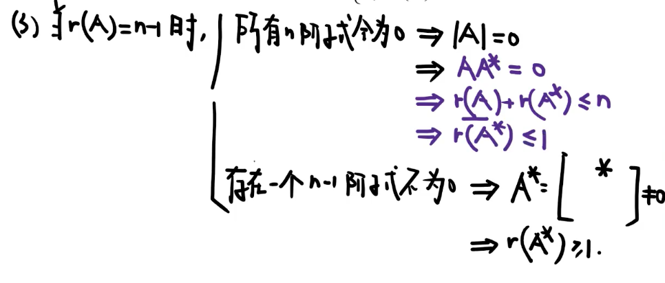

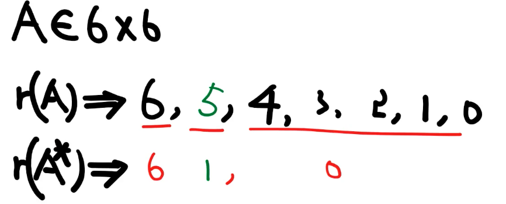

 

## 矩阵的等价

