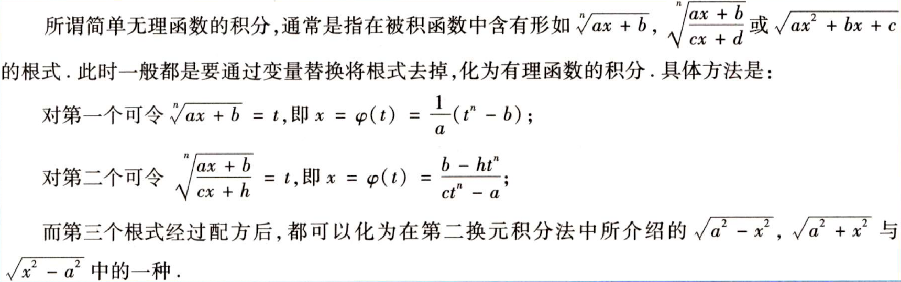
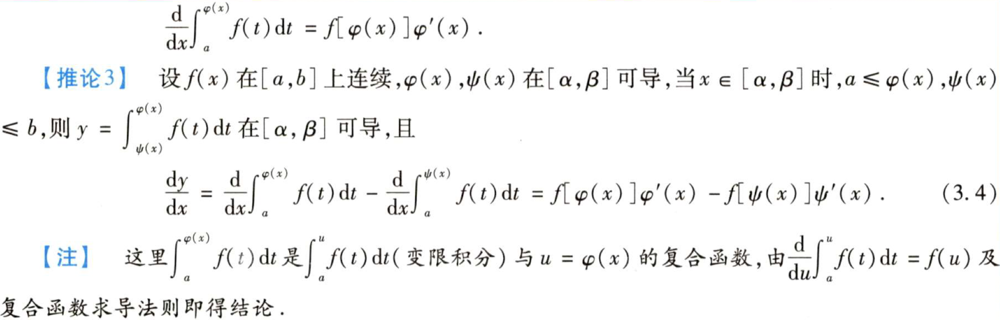

# 1.2.1 不定积分

> 从某种意义上讲，不定积分处于辅助地位，它的重要性就在于 为定积分的计算提供了一种简便快捷的工具 
>
> 分项积分法,分段积分法,换元积分法与分部积分法是最基本的方法.按函数分类的积分法中有理函数积分法则是最基本的。其他一些特殊函数类(如三角函数有理式，某些无理式)的积分法则是通过特定的换元法转化为有理函数的积分。

## 不定积分的性质

## 基本积分表

## 积分法则

### 分项积分

### 分段积分

- 定积分的分段积分
  - 弄清积分限与分段函数的分界点之间的位置关系，以便对定积分进行正确分段。
  - 被积函数中含有绝对值时，要去掉绝对值符号化为不含绝对值的分段函数并分段计算其定积分。
- 不定积分的分段积分
  - 
  - 
  - 

### 换元积分法(变量替换)

#### 不定积分的换元积分法

- 第一换元积分法（凑微分法）
  - 
  - 
- 第二换元积分法
  - 
  - 

#### 定积分的换元积分法

#### 常用变量换元

- 三角函数替换
  - 
- 幂函数替换
  - 
- 指数函数替换
  - 
- 倒替换

### 分部积分法

## 特殊类型的函数积分法

### 有理函数的积分

### 简单无理函数积分

### 三角函数有理式的积分

## 积分计算技巧

# 1.2.2 定积分与反常积分

## 定积分的定义

## 定积分的几何意义

## 函数在区间上的可积性

## 定积分的基本性质

### 线性性质

### 对区间的可加性质

### 有限值的改变不改变其可积性

### 比较定理

### 积分中值定理

### 连续非负函数的积分性质

## 基本定理

### 变限定积分

## 原函数

### 原函数存在定理

### 不定积分与变限定积分的关系

### 初等函数的原函数

## 牛顿-莱布尼茨公式

## 奇偶函数与周期函数的积分性质

### 对称区间上奇偶函数

### 周期函数的积分

## 利用定积分求某些n项和式数列的极限

## 反常积分

### 无穷区间的反常积分

### 无界函数的反常积分

> f(x)在点x=x0的任一领域内都无界，则称x=x0为函数f(x)的**瑕点**
>
> 无界函数的反常积分又称为瑕积分。

常见的反常积分

### 反常积分的运算法则

> 类似定积分，只是把其中一个端点设为无穷

### 反常积分收敛的比较判别法

- 比较原理
  - 
  - 大的收敛，小的收敛
  - 小的发散，大的发散
- 比较原理的极限形式
  - 

## 应用

### 微元分析法

分割-近似-求和-取极限

### 几何应用

#### 平面图形的面积

- 直角坐标系中
  - 用二重积分计算
  - 
- 极坐标系中
  - 
  - 
- 参数方程
  - 

#### 平面曲线的弧微分与弧长

- 直角坐标
  - 
- 参数方程
  - 
- 极坐标方程
  - 

#### 平面曲线的曲率

- 曲率半径r=1/K
- K的计算公式
  - 
  - 

### 空间图形的体积

- 旋转体积
  - 绕X轴
  - 
  - 绕Y轴
  - 
- 旋转面的侧面积
  - 直角坐标系
  - 
  - 参数方程
  - 
  - 极坐标
  - 

### 物理应用

#### 液体的静压力

#### 变力做功

#### 引力问题

#### 质心或形心问题

> P94

#### 函数在区间上的平均值

## 题型

>P95

### 题型一 有关原函数与定积分概念的命题

### 题型二 积分值的比较或积分值符号的判断

### 题型三 估计积分值

### 题型四 有关原函数的存在性问题

### 题型五 求分段函数的原函数

### 题型六  各类被积函数不定积分的计算

### 题型七 各类被积函数定积分的计算

### 题型八 累次积分-分部积分

### 题型九 由函数方程求积分

### 题型十 反常积分的计算与收敛性判断

### 题型十一 证明积分等式

### 题型十二 证明积分不等式

### 题型十三 关于变限积分的讨论

### 题型十四 一元函数积分的几何应用

### 题型十五 一元函数积分学的物理应用

### 题型十六 综合题

# 1.2.3 一元函数的泰勒公式

