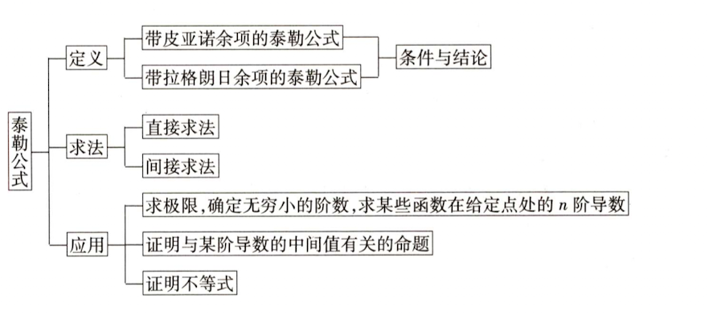

## 1.定义

$$
f(x)=T_n(x)+R_n(x)
$$

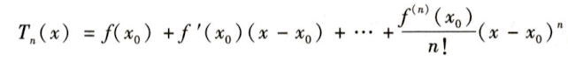

### 皮亚诺余项

$$
\begin{align} 
f(x)在点x=x_0处有n阶导，则有：
\end{align}
$$

### 拉格朗日余项

$$
\begin{align} 
f(x)在点x=x_0处有n+1阶导，则有：
\end{align}
$$

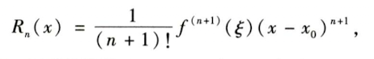

### 麦克劳林公式

x0=0时的泰勒，五个基本公式

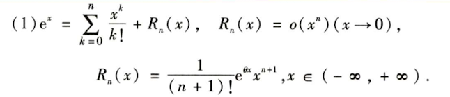
$$
e^x=1+x+\frac{x}{2!}+...+ \frac{x^n}{n!}
$$
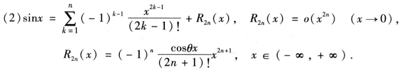
$$
sinx=x-\frac{x^3}{3!}+ \frac{x^5}{5!}+...+(-1)^n \frac{x^{2n+1}}{(2n+1)!}
$$
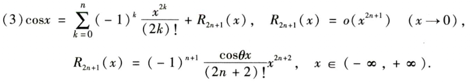
$$
cosx=1-\frac{x^2}{2!}+\frac{x^4}{4!}+...+(-1)^n\frac{x^{2n}}{(2n)!}
$$
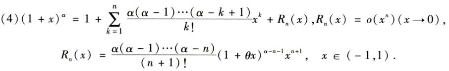
$$
(1+x)^{\alpha}=1+\alpha x+\frac{\alpha (\alpha -1 )x^2}{2!}+...+\frac{\alpha (\alpha-1)(\alpha-k+1)x^k}{k!}
$$
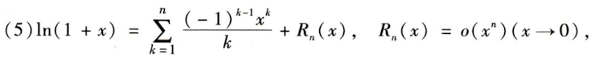

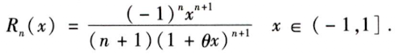
$$
ln(1+x)=x-\frac{x^2}{2}+\frac{x^3}{3}+...+(-1)^{n-1}\frac{x^n}{n}
$$
补充：
$$
\begin{align}
&\frac{1}{1-x}=1+x+x^2+...+x^n \\
&\frac{1}{1+x}=1-x+x^2+...(-1)^nx^n \\
&arctanx=x-\frac{x^3}{3}+\frac{x^5}{5}+...+(-1)^n\frac{x^{2n+1}}{2n+1} \\
\end{align}
$$

## 2.求解

>适用范围
>
>拉格朗日余项：可以用于区间[a,b]上
>
>- 证明不等式或者等式
>- 证明函数或者导数存在某种特征点
>
>皮亚诺余项：由于讨论x=x0的函数极限性质
>
>- 求x-x0的极限
>- 确定无求小的阶
>- 求f(x0)的n阶导数
>- 考察局部性极值问题

泰勒公式的唯一性定理

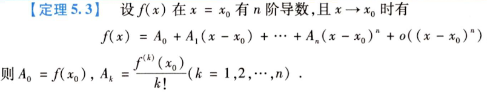

### 2.1 带皮亚诺余项

- 用初等函数的泰勒公式
- 四则运算-通过初等函数泰勒公式加减乘除得到
- 复合函数--变量替换（e^{-2x}-->e^{t}）
- 逐项求导或者积分--（对于求arctanx的5阶，可以先求导得到初等函数，展开到4阶之后积分）

应用：

- 求极限，通过泰勒公式选择合适的阶数进行求解

- 确定无穷小的阶，通过已知选取x0使得f（x0）=f'(x0)=...=0,最坏不为0的就是对应的阶数

- 求指定点x0点导数值，f(x0)的n次方 = n！A

  - 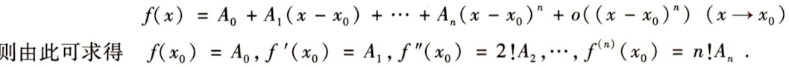

    

### 2.2 带拉格朗日余项

求n阶泰勒公式：

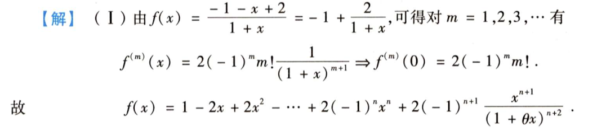

应用：

- 证明不等式
- 证明满足某种要求的点
  - 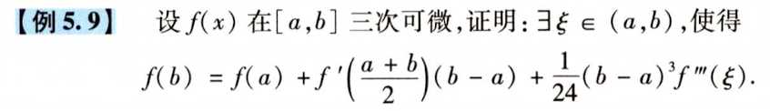

