## 基本概念

- 定义

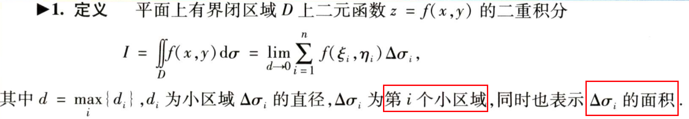

  f(x,y)在D上连续，则可积

- 几何意义

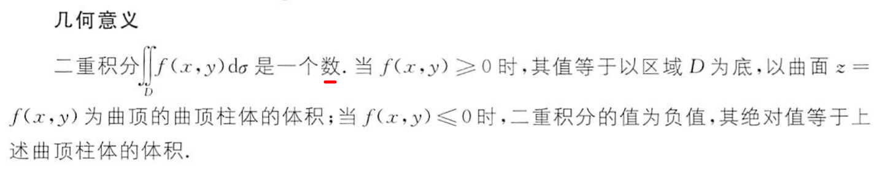

## 基本性质

> 选几个常用的

### **区域的可加性**

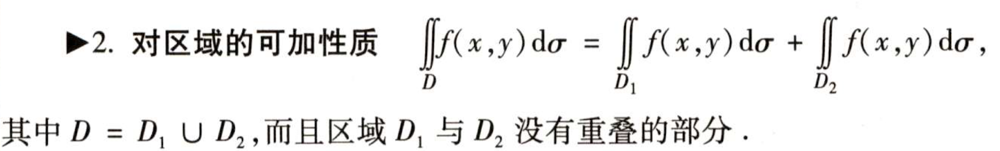

### **比较定理-不等式**

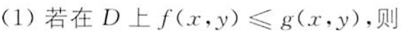

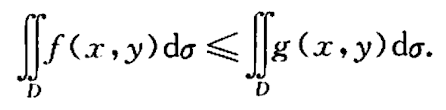

当f(x,y)恒等于g(x,y)时取等号

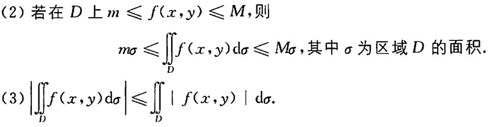

### **积分中值**

### 连续非负函数的积分

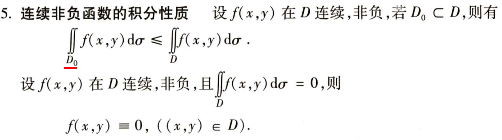

### 对称区域上奇偶函数

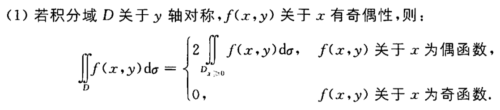

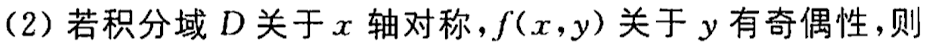

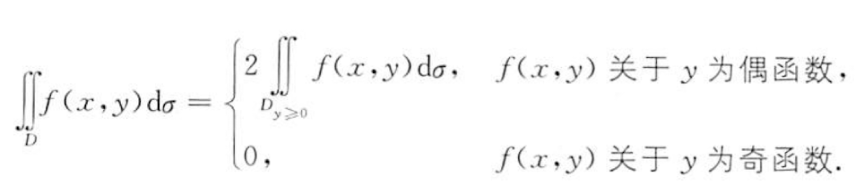

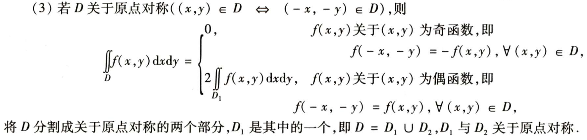

### **轮换对称性**

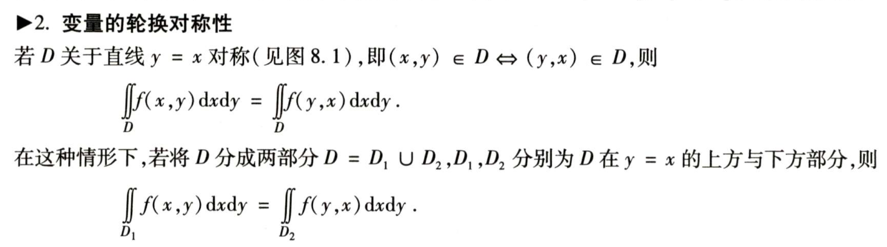

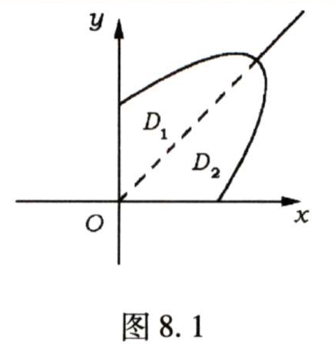

## 计算

### 计算公式

#### 直角坐标系中化二重积分为累次积分

- 先y后x

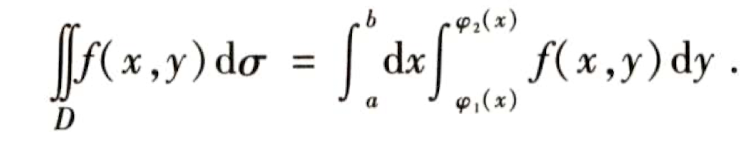

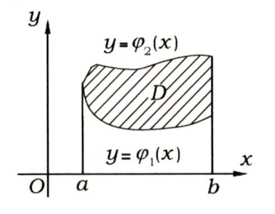

- 先x后y

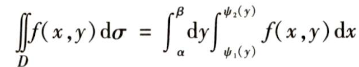

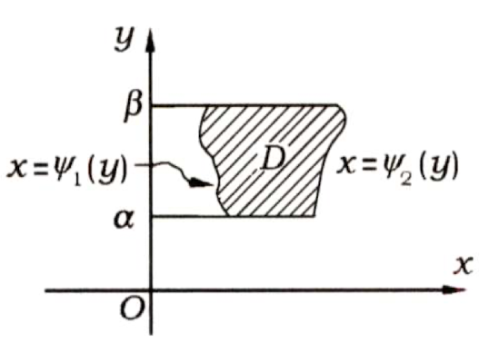

- 平移变量

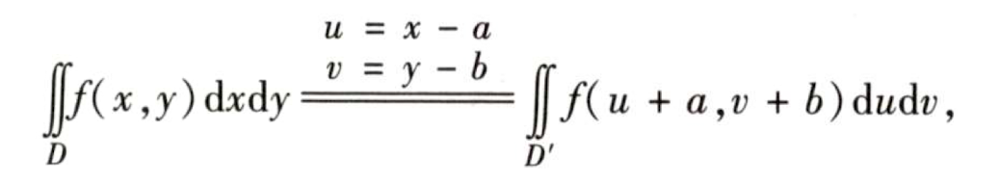

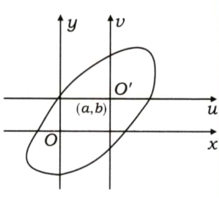

#### 二重积分的极坐标变换

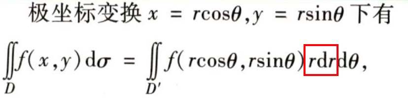

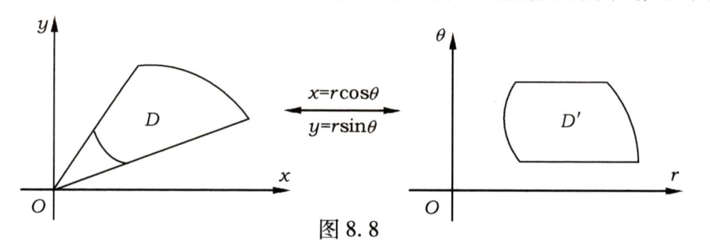

### 怎样用计算公式及简化计算问题

- 选择积分的次序
- 区域对称与被积函数的奇偶性
- 分块积分-区域分块或被积函数分块或需要分块才好计算的
- 选用极坐标或平移变换

## 计算公式的应用

- 题型一 概念和性质
- 题型二 积分值的比较与估计
- 题型三 交换积分顺序与计算累次积分
- 题型四 两种坐标系中累次积分的转换
- 题型五 二重积分的计算 --硬算
- 题型六 证明题 -不等式性质

## 做题总结

【1】极坐标累次积分怎么转化成直角坐标

​	 将积分域D的图画出来*

