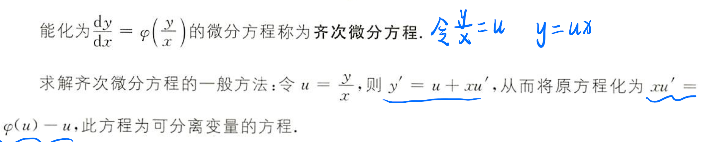
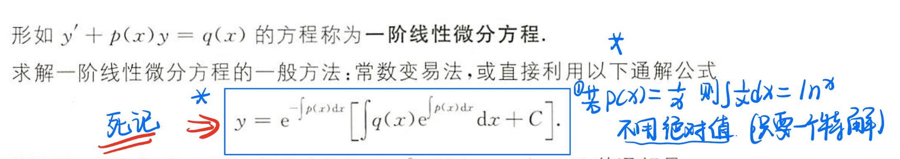
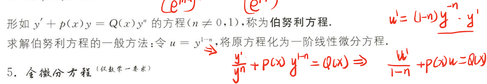
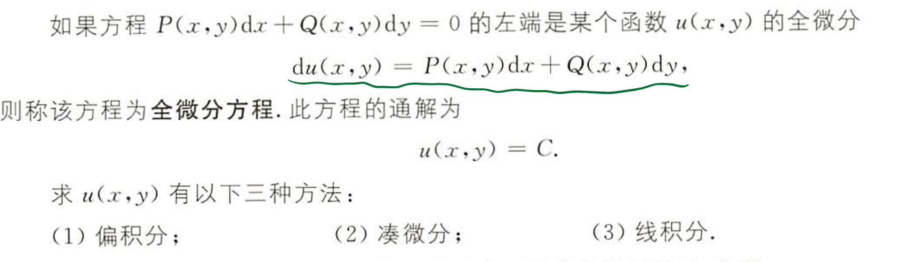
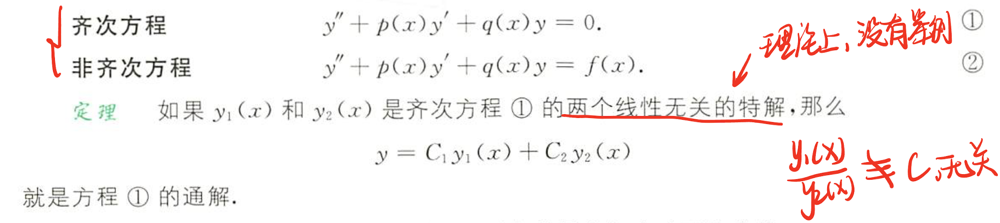
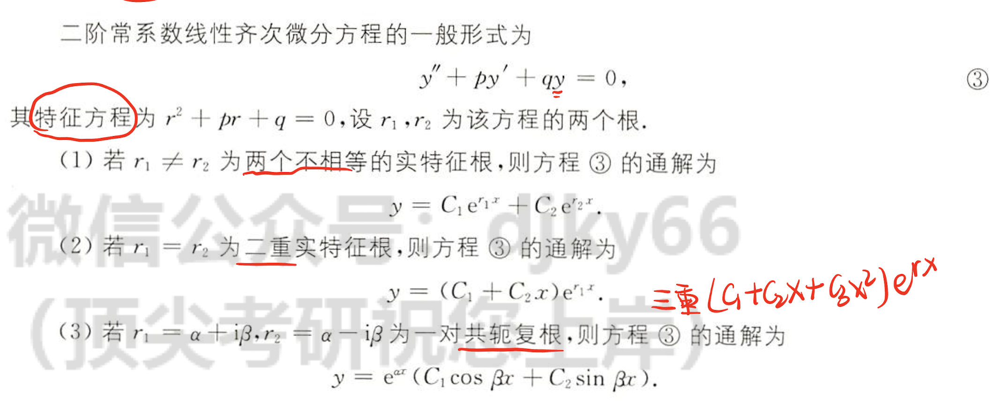
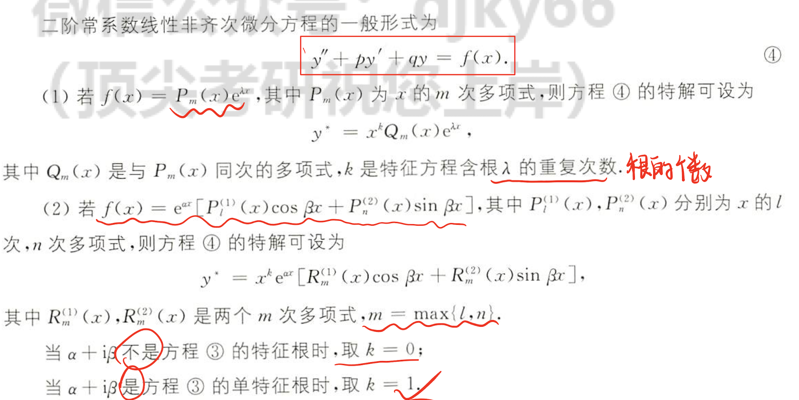
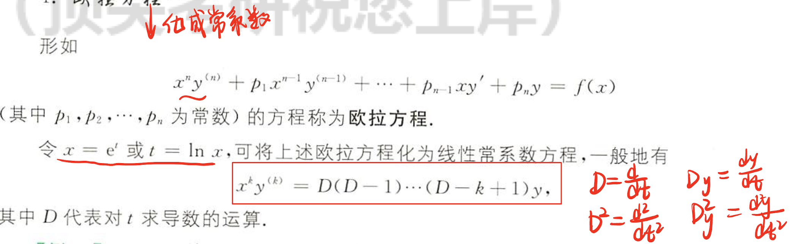

## 微分方程的基本概念

- 微分方程的阶 -- 未知数最高阶导数
- 微分方程的解 -- 满足微分方程的函数
- 微分方程的通解 -- 含有任意常数，且常数的个数与微分方程的阶数相同
- 微风方程的特解 -- 不含任意常数的解
- 初始条件 -- 确定特解的一组常数
- 积分曲线 -- 方程的一个解在平面上对应一条曲线

​	

## 3.1 一阶微分方程

### 可分离变量

$$
g(y)dy=f(x)dx
$$

### 齐次微分方程

### 一阶线性微分方程

### 伯努利方程-数一

### 全微分方程-数一

## 3.2 可降阶的高阶方程

$$
1.y^{(n)}=f(x)型的微分方程 \\
2.y^{''}=f(x,y^{'})型方程：\\令y^{'}=p,y^{''}=p^{'},则可以将原方程化为一阶微分方程.\\
3.y^{"}=f(y,,y^{'})型方程：\\令y^{'}=p,y^{''}=pdp/dy
$$

## 3.3 高阶线性微分方程

### 线性微分方程解的结构

### 常系数齐次线性微分方程

### 常系数非齐次线性微分方程

### 欧拉方程-数一

## 题型

## 做题总结

