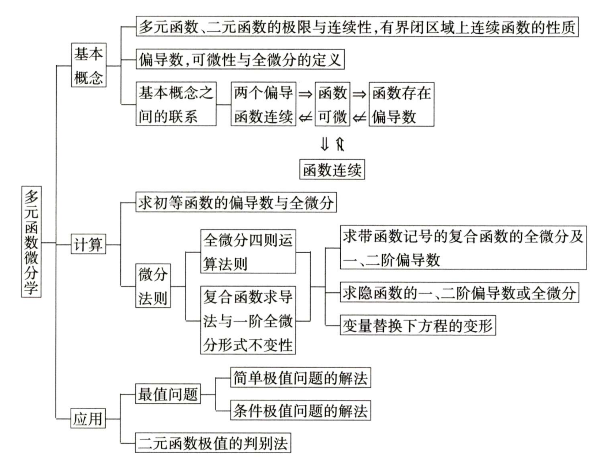

# 基本概念

## 极限

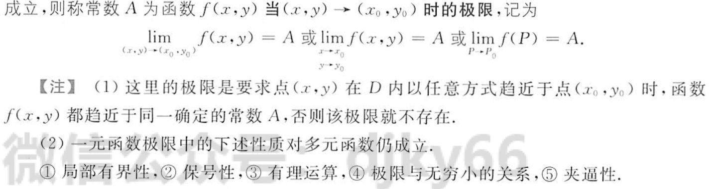
$$
以任意方式趋向(x_0,y_0)即以y=x^2和y=kx趋向于(x_0,y_0)的极限是一样的，多用于证明题
$$

## 连续性

1. 多元连续函数的和差积商仍为连续函数
2. 多元连续函数的复合函数也为连续函数
3. 多元初等函数在其定义域内连续
4. 有界闭区域D的上的连续函数能在D上取得最大最小值
5. 有界闭区域D上的连续函数能取得介于最大值和最小值之间的任何值

## 偏导数

### 偏导定义

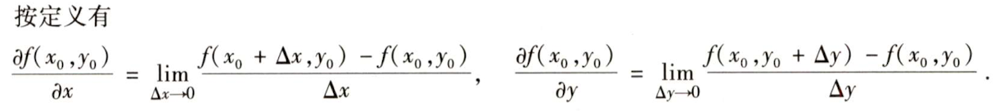

### 偏导的几何意义

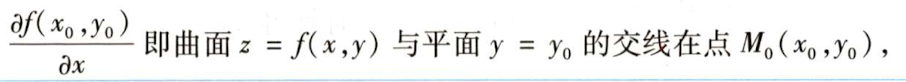

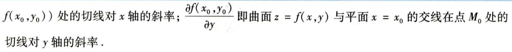

### 偏导计算

## 可微性与全微分定义

### 可微定义

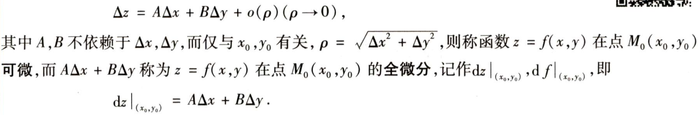

### 【重要】可微必要与充分条件	

1. 必要条件-->可微可推出

   - $$
     1.f(x,y)在(x_0,y_0)处连续 \\ 2.两个偏导都存在
     $$

2. 充分条件-->推出可微

   - $$
     1.两个偏导都存在 \\
     2.两个偏导在(x_0,y_0)处连续
     $$

### 联系

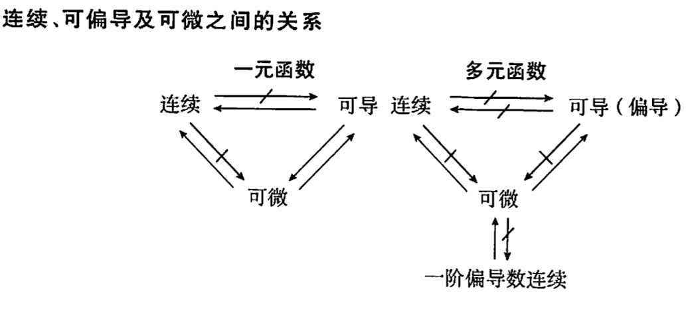

二元函数

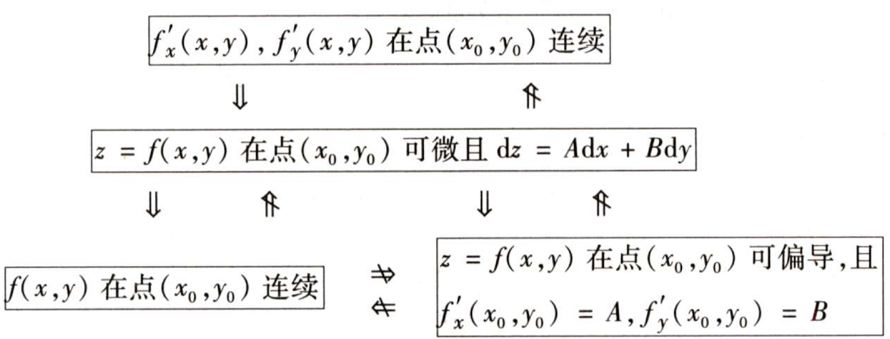

### 高阶偏导

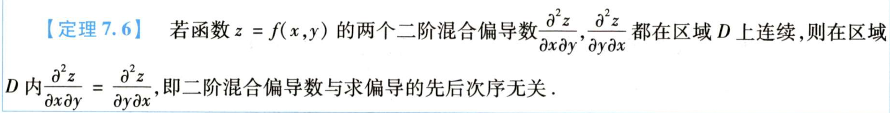

# 计算

## 微分法制

### 四则运算法则

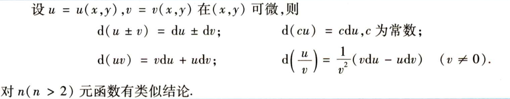

### 多元复合函数的微分

#### 多元与一元

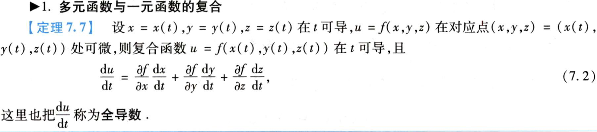

#### 多元与多元

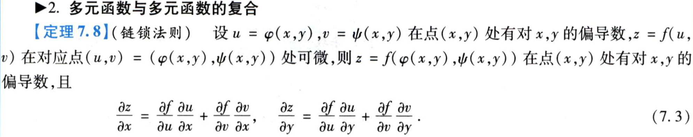

#### 一阶全微分形式不变性

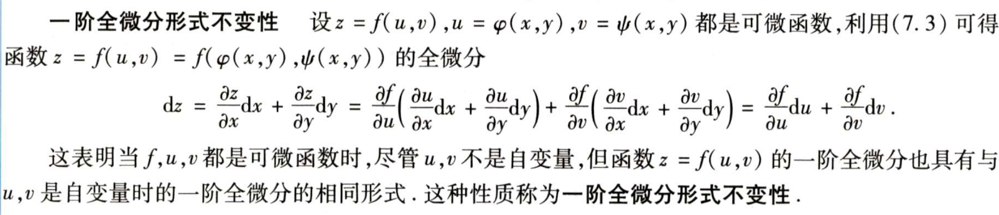

- 应用时，将du，dv算出来带入，要比之间算dx，dy简单

## 隐函数求导

#### 由方程式确定的隐函数

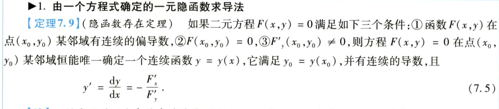

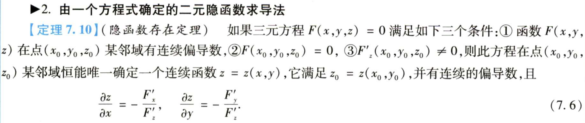

- 求解方法见书本P208，或PDF的P200，复习时务必看

#### 由方程组确定的隐函数

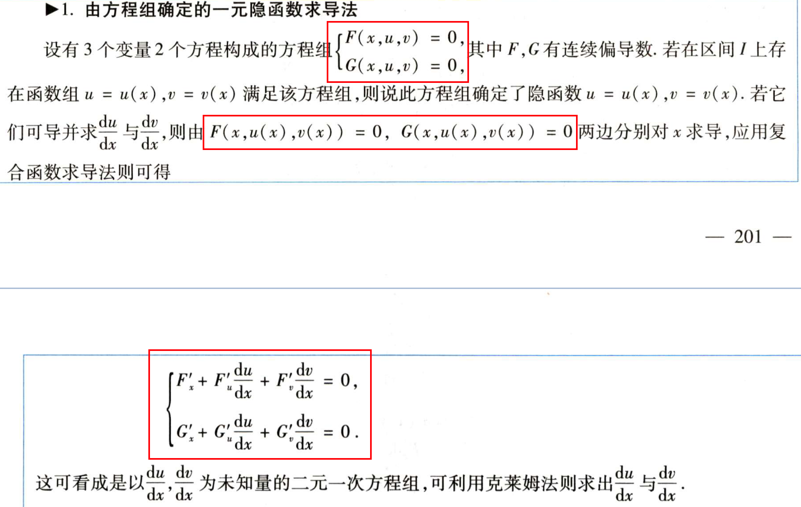

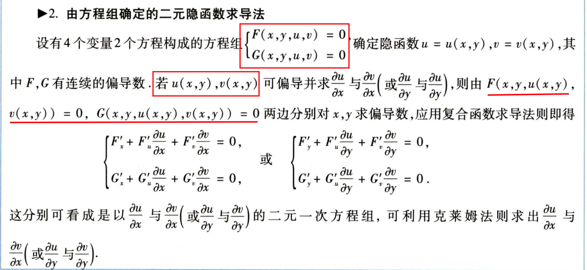

## 复合函数求导

1. 变量替换
2. 化为一元问题

## 多元函数的极值问题

### 极值、驻点

$$
f(x,y)>=f(x_0,y_o),则为极小值点,反之极大值点\\
驻点：同时使对x，y对偏导等于0的点
$$

### 取得极值点充分与必要条件

- 必要条件
  - 取得极值，则该处的偏导都为0
  - 具有偏导数的极值点必然是驻点，但是驻点不一定是极值点
- 充分条件
  - 
- 步骤
  - 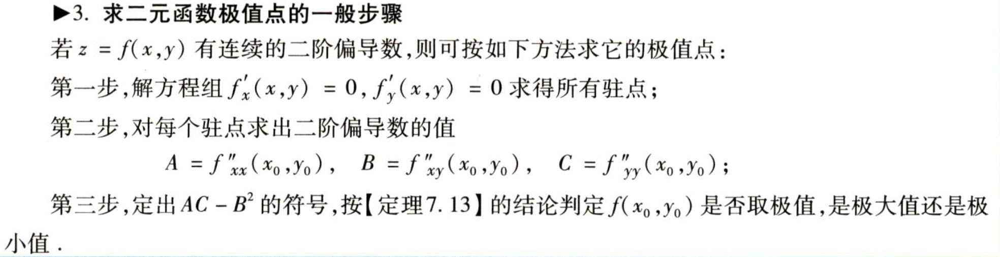

### 条件极值点的必要条件

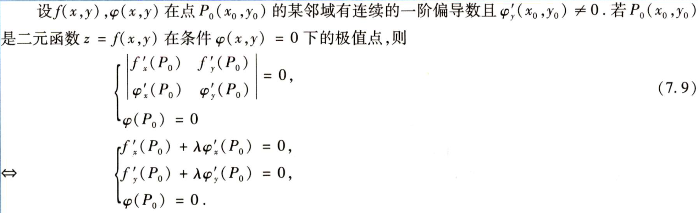

# 应用

## 多元函数的最大值最小值

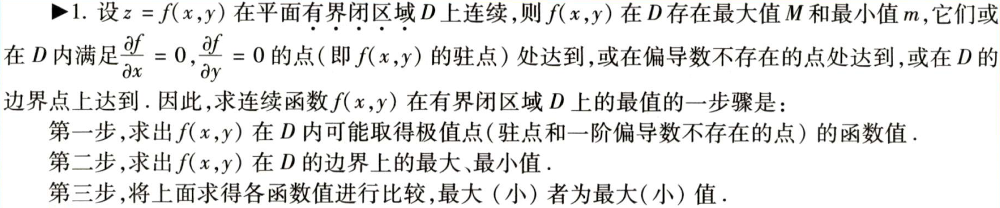

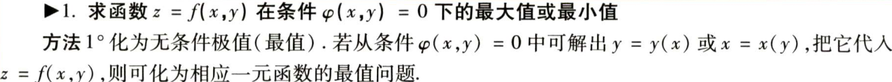

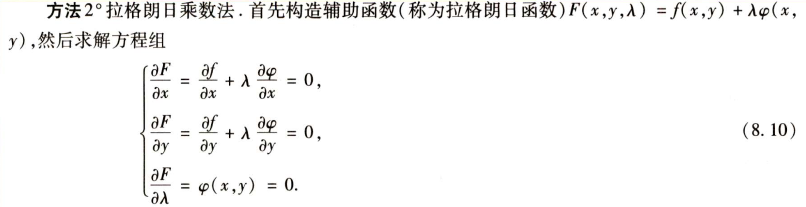

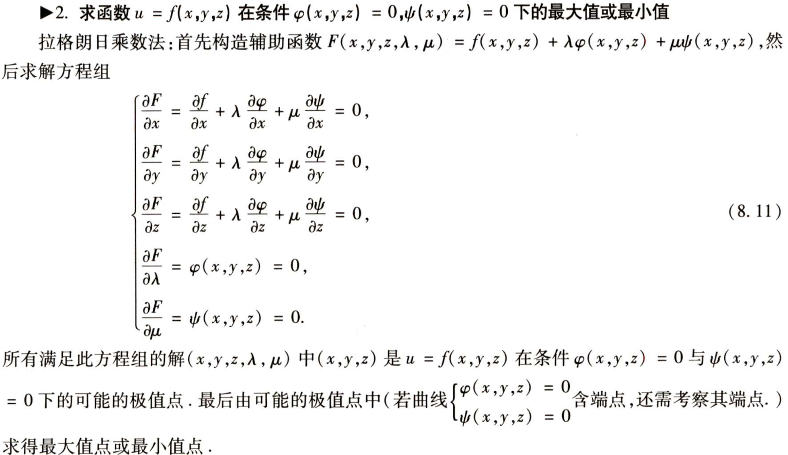

# 题型

- 题型一 有关多元函数偏导数与全微分概念的问题
- 题型二 求二三元各类函数的偏导数和全微分
- 题型三 变量替换下方程式的变形
- 题型四 多元函数的的最值问题
- 题型五 有关多元函数的综合题

# 做题总结

