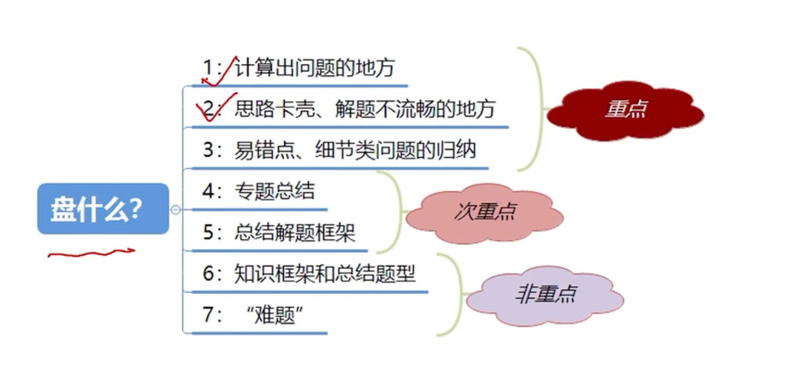
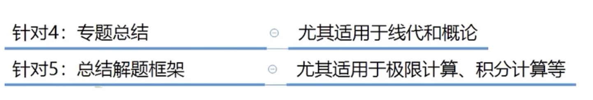

> 自己问题：不要把草稿过程写到刷题本上

## 1 计算出错

- 计算失误
  - 做好标记在没有细看答案前，自己再算一遍，最后用一两句简明的话总结
- 算的繁琐
  - 反思，做好标记，比较自己和答案较优的答案

## 2 思路卡壳、不流畅

为什么不流畅、怎么流畅起来

不流畅：

-  计算能力不过关
- 知识点遗忘或不熟悉 -- 做标记 查找工具书
- 题目难度超过你的能力

## 3 易错点、细节题的归纳

## 4 专题总计

## 5 总结解题框架

## 6 知识点框架和总结题型

> 用的书上面已经和详细了，应该更多时间在刀刃上

## 7 “难题”