https://www.bilibili.com/video/BV1HK4y1r7N4/?spm_id_from=333.788.b_636f6d6d656e74.6

https://blog.csdn.net/weixin_47187147/article/details/125615042

https://blog.csdn.net/weixin_47187147/article/details/124366836

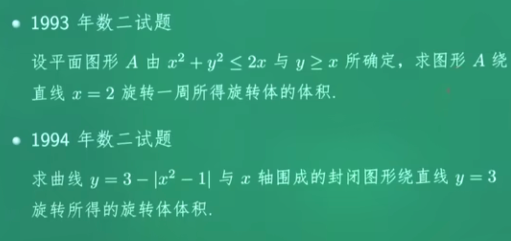

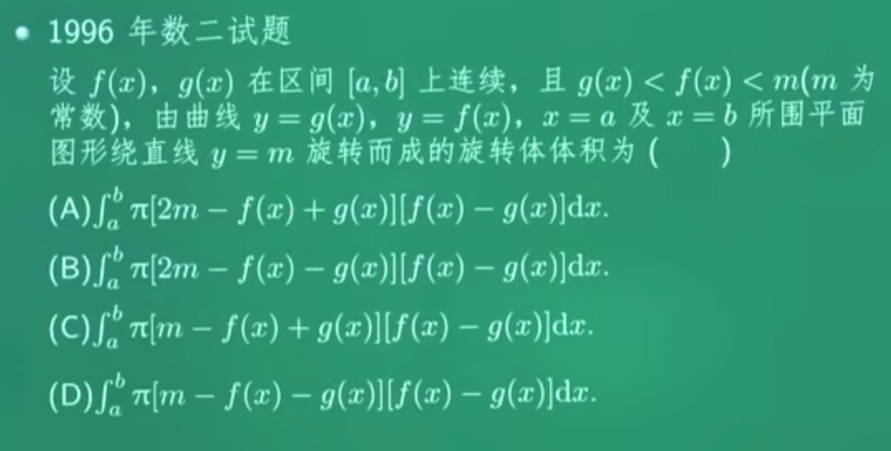

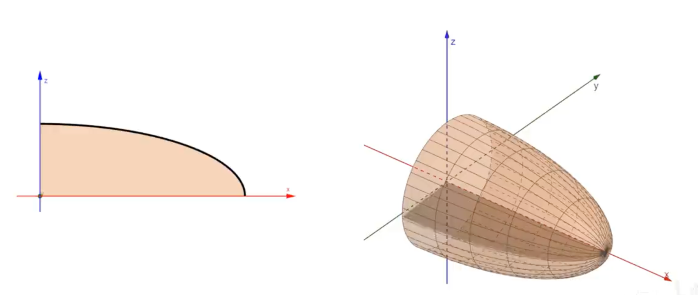

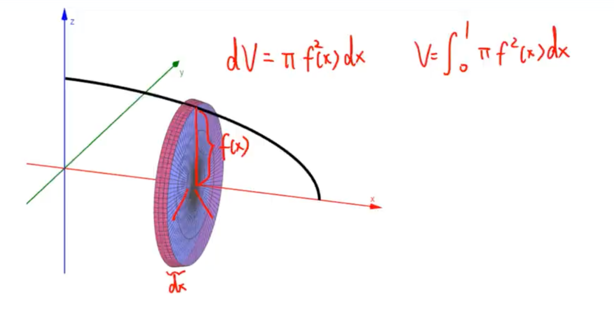

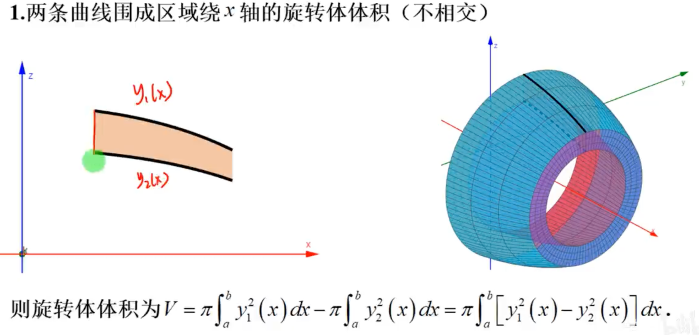

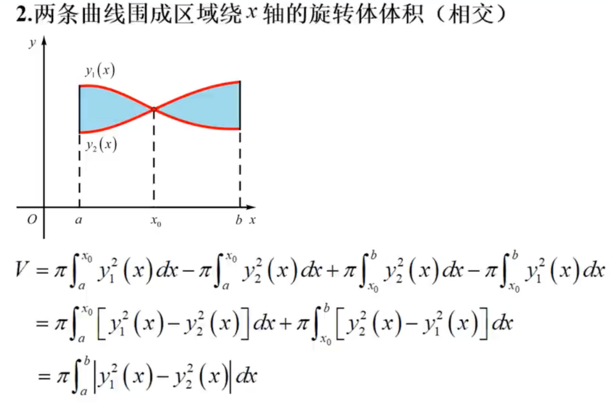

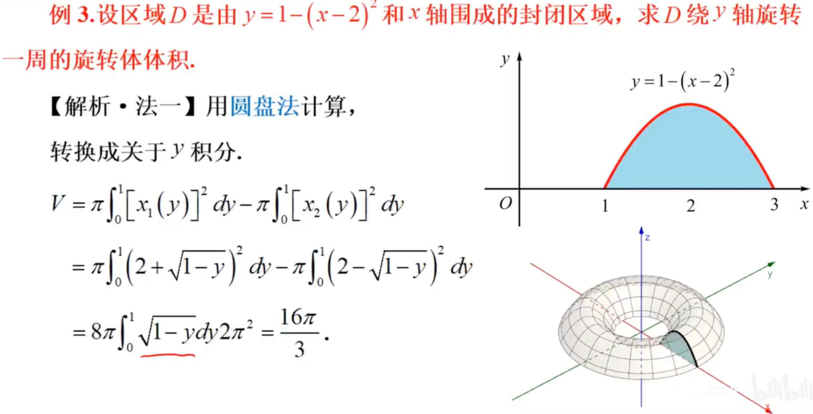

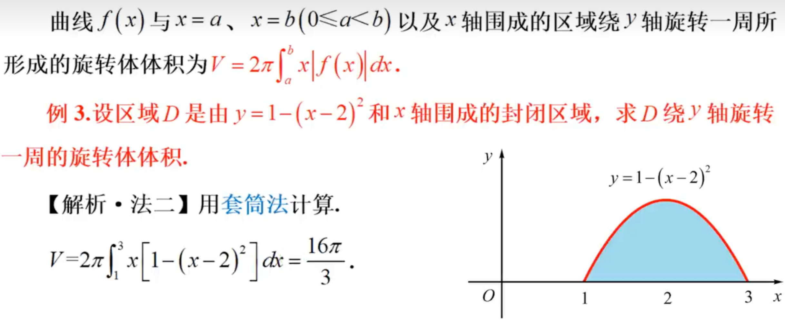

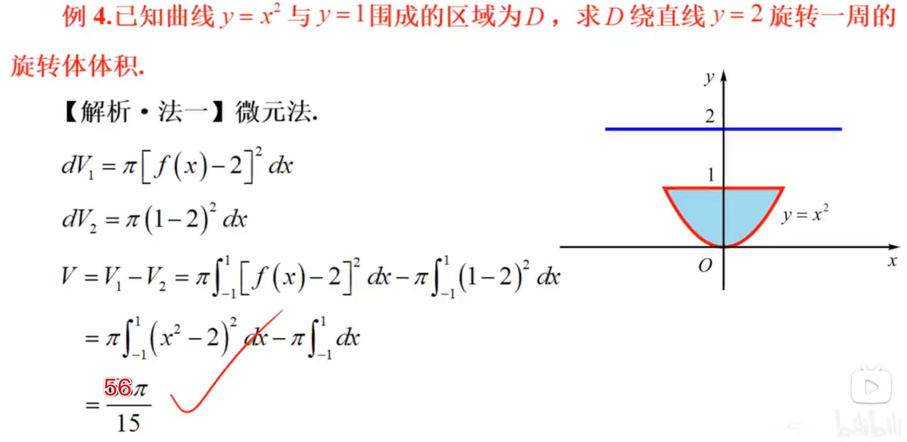

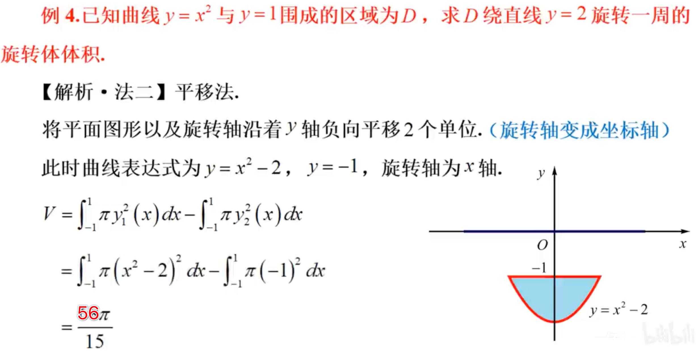

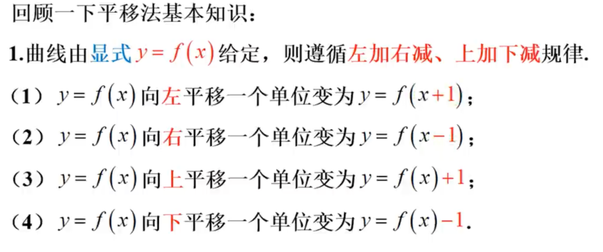

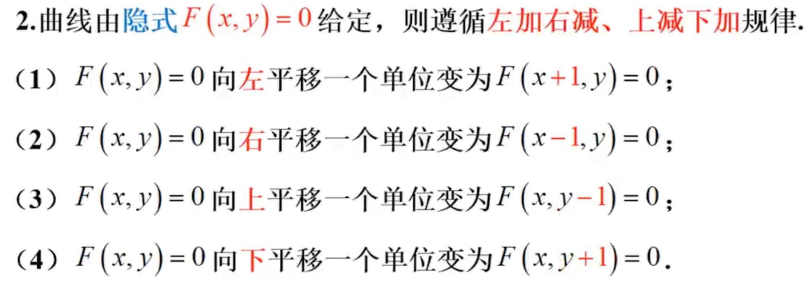

平移法针对函数平移：如果绕x=1旋转，则要把其变成绕y轴旋转，整个函数要左移一位 如y=x变成y=x+1

