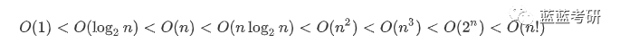
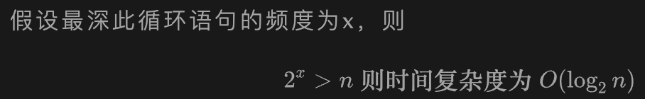
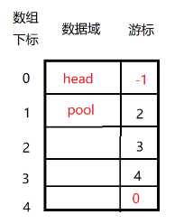
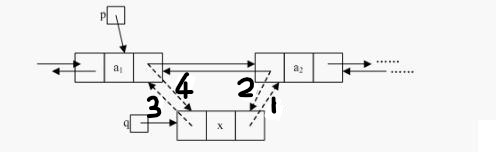
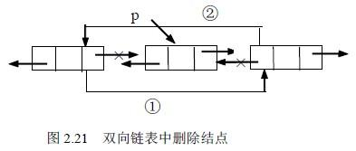

# 第一章 绪论

> 重点：时间空间复杂度求解

## 什么是数据

数据元素由多个数据项组成，数据项是最小的单位。

数据元素是数据的基本单位，处理数据的时候是以数据元素为一个整体进行考虑和处理。

数据对象就是相同性质数据元素的集合，集合之间存在的特定关系就是数据结构。


三要素：

- 逻辑结构
  - 集合、线性结构、树形结构、网状结构
- 数据运算
- 存储结构
  - 顺序存储 - 物理位置相邻
  - 链式存储
  - 索引存储 - 增加了索引表
  - 散列存储 - 根据元素关键词直接计算元素的存储地址


抽象数据类型ADT：数据类型定义+操作


## 复杂度

算法特征：有穷性、确定性、可行性、输入、输出

好算法：正确性、可读性、健壮性、高效低存储

### 时间复杂度

> 时间开销T(n)与问题规模n的关系
>
> 每句代码开销固定为1

```c
void loveYou(int n){// n为问题规模
 int i = 1;//爱你的程度  1 --1
 while(i<=n){        //2 ---3001
     i++;//3 --3000
     printf("I love you %d\n",i);//4 --3000
 }
 printf("I love you More Than %d\n",n)//5 --1
}
int main(){
    loveYou(3000);
}
```

T(3000)=1+3001+3000*2+1

判断

- 只考虑最高阶，使系数为1
- 加法--只保留最高阶，乘法--相乘
- 常见
  - 

- 如果是多层循环，则只需要关注最深层循环的次数

  - ```c
    while(i<=n){
     i = i * 2;
    }
    ```

  - 

- 

### 空间复杂度

> **空间复杂度 = 递归调用的深度**

算法原地工作：算法所需内存空间为常量

~~~c
void test(int n){
 int flag[n][n];
 int i;
}

假设一个int的变量占 4B，则所需内存空间=4 * n2。
  
void test(int n){
 int flag[n][n];
 int other[n];
 int i;
}

S(n) = O(n2) + O(n)+O(1) = O(n2)
~~~


# 第二章 线性表

> n个数据元素的有限序列
>
> 一个数据元素可以由若干个数据项（item）组成，这种情况常把数据元素成为记录（record），含有大量记录的线性表又称为文件。
> $$
> (a_1,a_2,a_3...a_i,...a_n) \\
> 除第一个和最后一个元素外，每个元素有一个直接前驱和一个直接后驱
> $$
> 

线性表的基本操作

- 操作的实现基于存储结构，存储结构不同，算法实现的也不同
- 数据元素大小，C语言中用sizeof(ElemType) -- ElemType-int-float...

| 操作                | 解释                                   |
| ------------------- | -------------------------------------- |
| InitList(&L)        | 构建一个空的线性表L                    |
| ListLength(L)       | 返回L中数据元素个数                    |
| LocateElem(L,e)     | 按值查找，查找值为e的元素              |
| GetElem(L,i)        | 按位查找，获取L中第i个位置元素的值     |
| ListInsert(&L,i,e)  | 在第i个位置插入新元素e，L的长度加1     |
| ListDelete(&L,i,&e) | 删除第i个元素，并用e返回其值，L长度减1 |
| PrintList(L)        | 输出表L中的值                          |
| Empty(L)            | L为空，返回true，否则返回false         |
| DestroyList(&L)     | 摧毁L，返回其内存                      |


## 2.1 顺序表示

> 特点：
>
> - 随机访问，在O(1)的时间下找到第i个元素
> - 存储密度高，只存储数据元素
> - 扩容不方便
> - 表中元素逻辑顺序和物理顺序相同
>
> 静态分配-表满就会溢出
>
> 动态分配-表满会自动开辟新的空间


### 定义

> 位序是从1开始，数组中元素的下标从0开始

#### 结构体

> 静态分配为例子

```c
// 定义结构体--元素和长度
typedef struct{
  int data[MaxSize];
  int length;
}SqList;
```

> 动态分配为例子

```c
typedef struct{
  int *data;//动态分配数组指针
  int MaxSize,length;
}SeqList;
```


#### 初始化

> 静态分配为例子

~~~c
//init - 最大长度的值初始化为0，长度为0
void InitList(SqList *L){
  for(int i=0;i<MaxSize;i++)
    L->data[i]=0;
  L->length=0;
}
~~~

> 动态分配为例子

~~~c
//init
void InitList(SeqList *L){
  L->data=(int *)malloc(InitSize*sizeof(int));
  L->length=0;
  L->MaxSize=InitSize;
}
~~~


#### 静态分配

```c
//静态分配
#include <stdio.h>
#define MaxSize 10 //定义最大长度

// 定义结构体--元素和长度
typedef struct{
  int data[MaxSize];
  int length;
}SqList;

//init - 最大长度的值初始化为0，长度为0
void InitList(SqList *L){
  for(int i=0;i<MaxSize;i++)
    L->data[i]=0;
  L->length=0;
}

//main
int main(){
  SqList L;
  InitList(&L);
  //测试
  for(int i=0;i<MaxSize;i++){
    printf("L.data[%d]=%d\n",i,L.data[i]);
  }
  return 0;
}

```

#### 动态分配

```c
//C动态分配语句
//mallo函数返回的实际是一个无类型指针，必须在其前面加上指针类型强制转换才可以使用
L.data=(ElemType *)malloc(sizeof(ElemType)*InitSize);
//C++动态分配
L.data=new ElemType[InitSize];
```


```c
//动态分配
#include <stdio.h>
#include <stdlib.h>
#define InitSize 10 //表长初始定义

typedef struct{
  int *data;//动态分配数组指针
  int MaxSize,length;
}SeqList;

//init
void InitList(SeqList *L){
  L->data=(int *)malloc(InitSize*sizeof(int));
  L->length=0;
  L->MaxSize=InitSize;
}

//增加动态数组的长度
void IncreaseSize(SeqList *L,int len){
  int *p=L->data;// 保存旧的数据指针
  L->data=(int *)malloc((L->MaxSize+len)*sizeof(int));// 重新分配更大的内存空间
  for(int i=0;i<L->length;i++){// 将旧数据复制到新内存空间
    L->data[i]=p[i];
  }
  L->MaxSize=L->MaxSize+len; //更新最大长度
  free(p); //释放旧的内存空间
}

//main
int main(){
  SeqList L;
  InitList(&L);
  IncreaseSize(&L,5);
  //测试元素
  for(int i=0;i< L.MaxSize;i++){ //此时L是一个结构体而不是指针，因此需要用L.MaxSize表示不能用L->MaxSize
    printf("L.data[%d]=%d\n",i,L.data[i]); 
  }
  return 0;
}
```


~~~c
//创造一个顺序表
void CreateList(Seqlist *L,int a[],int n){
    L->data = (int*)malloc(sizeof(int)*InitSize);
    for(int i=0;i<n;i++){
        L->data[i]=a[i];
        L->length++;
    }
}

//输出线性表
void PrintList(Seqlist *L){
    printf("顺序表中的元素为:\n");
    for(int i =0;i< L->length;i++){
        printf("%4d",L->data[i]);
    }
    printf("\n\n");
}

//线性表当前长度
void ListLength(Seqlist *L){
    return L->length;
}
~~~


### 插入

> 插入实现注意点
>
> - 第i位点下表为i-1
> - i以及之后的元素后移，从后往前赋值，下标为表长(相当于往后移了1位)=最后一个元素
> - 判断条件 j>=i,等号：把第i个元素移到下标为i的位置，也是后移了1位

```c
//静态分配
#include <stdio.h>
#include <stdbool.h>
#define MaxSize 10 //定义最大长度
// #define true 1
// #define false 0

typedef struct{
  int data[MaxSize];
  int length;
}SqList;

//插入
//位序是从1开始，数组中元素的下标从0开始
bool ListInsert(SqList *L,int i ,int e){ //在i处插入e
    if(i<1||i>L->length+1) //判断i的位置是否有效 i从1开始到表长
        return false;
    if(L->length>=MaxSize) //表满不能插入了
        return false;
    for(int j=L->length;j>=i;j--) //把第i个元素以及之后的元素往后移
        L->data[j]=L->data[j-1];
    L->data[i-1]=e; // 在位置i处加入e
    L->length++; //表长++
    return true;
}
```

复杂度：

> n = length

最好情况：直接在最后位，i=n+1，循环语句不执行 O(1)

最坏情况：表头插入，i=1，移动n次，O(n)

平均情况：求期望值，插入位置概率1/(n+1),移动次数 n-i+1 ，E=n/2 --O(n)


### 删除

~~~c
//删除
bool ListDelete(SqList &L,int i,int &e){
  if(i<1||i>L->length)
    return false;
  e=L->data[i-1]; //被删除的元素赋值给e
  for(int j =i;j<L->length;j++){
   	L->data[j-1]=L->data[j]; //找到删除元素位置，从后往前赋值
  }
  L->length--;
  return true;
}
~~~

复杂度

最好情况：删除表尾元素;O(1)

最坏情况：删除表头元素，移动除表头所有元素;O(n)

平均情况：求期望，被删概率1/n，移动n-i次 ，E=(n-1)/2;O(n)


### 按值查找

> 顺序查找

```c
int LocateElem(SqList L,int e){
  for(int i=0;i<L->length;i++){
    if(L->data[i]==e)
      return i+1; //下标为i，其位序为i+1
  return 0; //退出循环，查找失败
  }
}
```

复杂度

最好情况：查找元素在表头；O(1)

最坏情况：在表尾或不存在，比较0-n-1，共n次；O(n)

平均情况：概率1/n，在第i个位置的概率，期望E=(n+1)/2;O(n)


## 2.2 链式表示

> 单链表、循环链表、双向链表

### 2.2.1 单链表

> struct Lnode L; ==> LNode L;

定义：

```c
typedef struct Lnode{
  int data;
  struct Lnode* next;
}LNode，*LinkList; 
//将struct Lnode 重命名 LNode
//将struct Lnode* 重命名 *LinkList
```

#### 头插法建立

> 逆向建立单链表

```c
LinkList List_HeadInsert(LinkList &L){
  LinkList s;
  int x;
  L = (LinkList)malloc(sizeof(LNode));//创建头结点
  L->next=NULL;
  scanf("%d",&x);
  while(x!=9999){ // 9999 表示结束
    s = (LinkList)malloc(sizeof(LNode));//插入结点
    s->data=x;
    s->next = L->next;
    L->next = s;
    scanf("%d",&x);
  }
  return L;
}
```

#### 尾插法建立

> 正向建立单链表

~~~c
LinkList List_TailInsert(LinkList &L){
  int x;
  L = (LinkList)malloc(sizeof(LNode));
  LinkList s,r=L;
  scanf("%d",&x);
  while(x!=9999){
    s=(LinkList)malloc(sizeof(LNode));
    s->data=x;
    r->next=s;
    r=s;
    scanf("%d",&x);
  }
  r->next=NULL;
  return L;
}
~~~

#### 求表长

```c
int LinkList_len(LinkList L){
  int len =0;
  if(L==0) return 0;
  while(L->next){
    len++;
    L=L->next; //L是指针，刚开始指在第一个(或头结点)
  }
  return 0;
}
```

#### 单链表的查找

按序号查找

```c
LinkList getElem(LinkList L,int i){
  if(i<1) return NULL; //i按 1 2 3 4 的顺序来的
  int j =1;
  LinkList p = L->next; //把第一个结点指针赋给p
  while(p!=NULL && j<i){ // j<i 
    p=p->next;
    j++;
  }
  return p;//若i大于表长，则会返回NULL
}
```

按值查找

```c
LinkList locateElem(LinkList L;int e){
  LinkList p =L->next; // p给第一个结点
  while(p!=NULL && p->data != e){ 
    p=p->next;
  }
  return p;
}
```

#### 单链表的插入

后插--找到第i-1个元素

```c
p = getElem(L,i-1); //O(n)
s->next = p->next;
p->next = s;
```

前插-本质就是交换数据

```c
//O(1)
s->next = p->next;
p->next = s;
temp = p->data;
p->data = s->data;
s->data = temp;
```

#### 单链表的删除

```c
// 法一 O(n)
p = getElem(L,i-1);
q = p->next;
p->next = q->next;
free(q);

//法二 O(1) 数据覆盖
p->data = p->next->data;
p->next = p->next->next;
free(q)
```


#### 静态链表

> 用数组表示链表、需要预先分配一块连续的内存空间
>
> next==-1为结束




### 2.2.2 循环链表

循环单链表：r->next = head

- 若设置头指针，表尾插入元素 需要O(n)
- 设置尾指针r，r->next为头指针,O(1)

循环双链表：

- *p为尾结点 p->next == L
- 为空表时，prior和next都等于L


### 2.2.3 双向链表

> 单链表访问前驱结点的时间复杂度为O(n)，访问后驱结点时间复杂度O(1)

定义

```c
typedef struct DNode{
  int data;
  struct DNode *prior,*next;
}DNode,*DLinkList;
```

初始化-定义一个头结点

```c
void InitList(DLinkList &L){
  L = (DNode*)malloc(sizeof(DLinkList));
  L->prior == NULL;
  L->next == NULL;
}
```

插入操作



```c
void InsertDLink(DLinkList &L,DNode *p,int x){
  DNode* s = (DNode*)malloc(sizeof(DNode));
  s->data = s;
  s->next = p->next; // 1
  p->next->prior = s; // 2 
  s->prior = p; // 3 
  p->next =s; // 4 
} //1必须在4前面完成
```

删除操作



```c
void DeleteDLink(DLinkList &L,int i){
  if(i<1 || i>Length(L)){ //Length(L)求表长函数
    print("ERROR!");
    return;
  }
  DNode *p = GetElem(L,i-1); //等到第i-1个元素
  DNode *q = p->next;
  p->next = q->next; // 1
  q->next->prior = p; // 2
  free(q);
}
```


# 第三章 栈、队列和数组

## 栈

### 顺序栈


### 链栈


### 栈的应用


## 队列

### 循环队列


### 链栈


# 第四章 串

## 4.1 定义

## 4.2 串的模式匹配


# 第五章 树与二叉树

```c
01、树的基础性质(知道多少写多少)
02、树的结点与度、树高的关系
03、二叉树的结点与度和树高的关系
04、完全二叉树的性质，包含做完全二叉树计算题的技巧
05、线索二叉树的结论
06、特殊二叉树结论
07、平衡二叉树的结论
08、红黑树的定义与判断构造
09、画完全二叉树，顺序存储完全二叉树，注意数组下标
10、画满二叉树，顺序存储满二叉树，注意数组下标
11、中序线索二叉树的构造
12、写出双亲表示法、孩子表示法、孩子兄弟表示法
13、哈夫曼树的构造，写出构造过程	
14、根据哈夫曼树，写出哈夫曼编码
15、并查集的基本操作
16、树转换二叉树过程
17、森林转换二叉树
18、树森林遍历和二叉树遍历的对应关系
```

# 第六章 图


# 第七章 查找


# 第八章 排序

