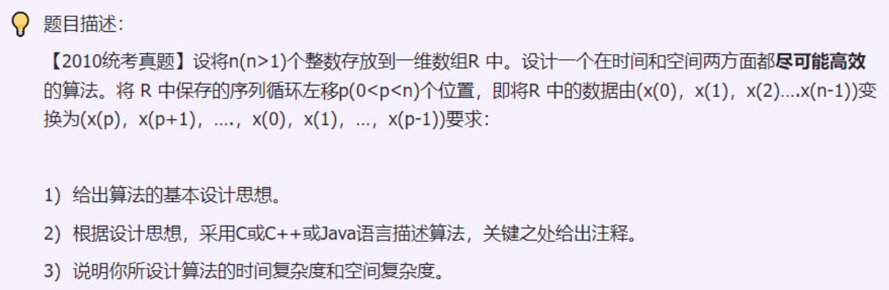
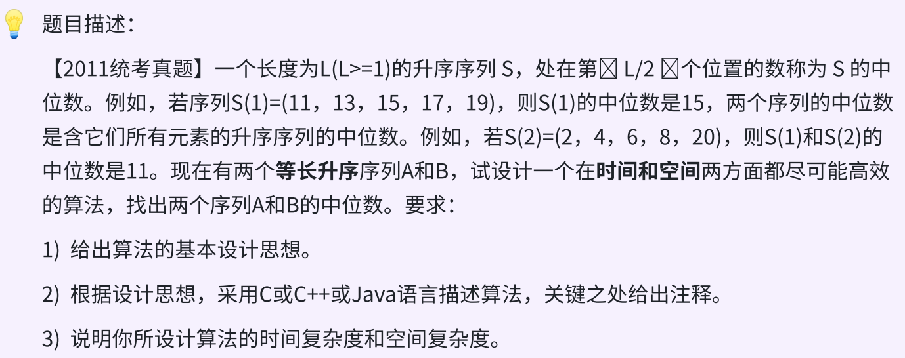
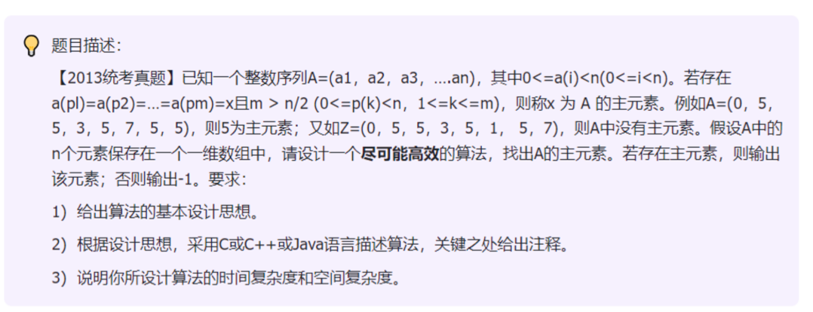
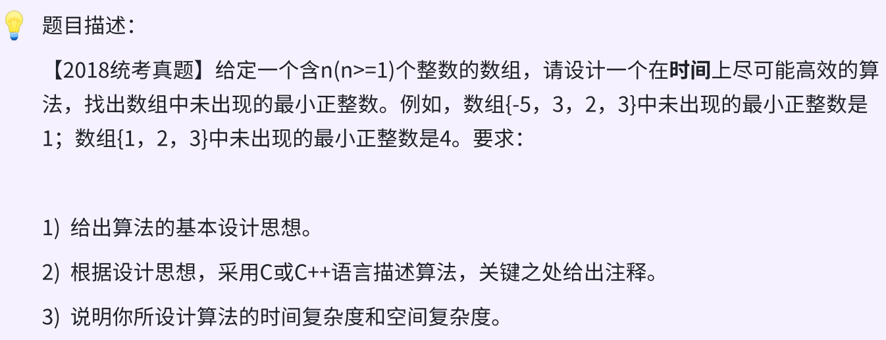
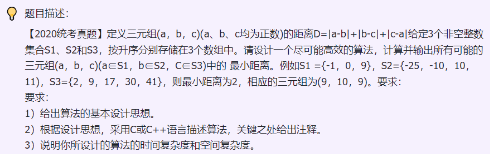
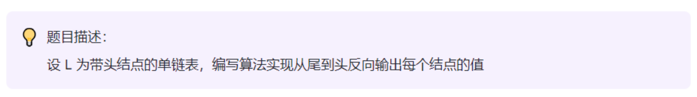
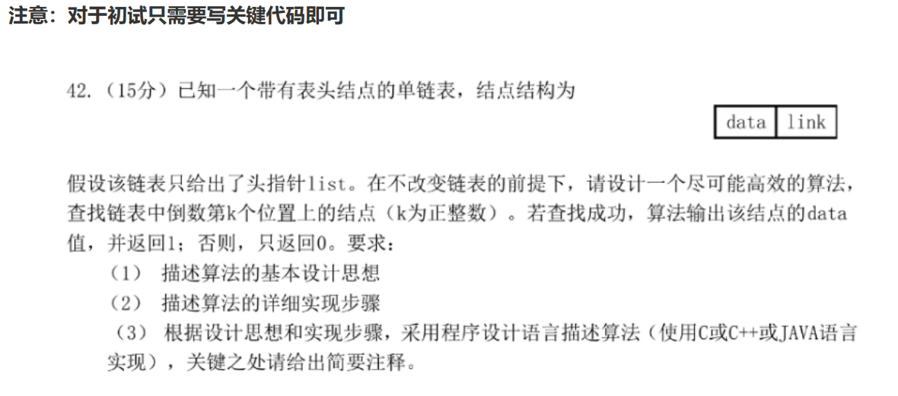
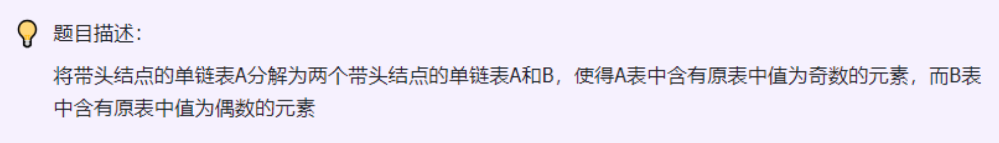
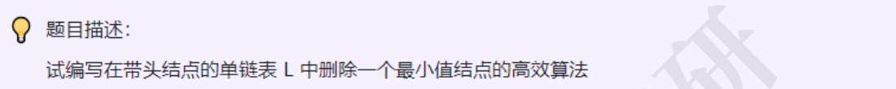

# 	Day1 

> 问题描述：for循环实现1+2+3+4...+10

> 思路：

```c
#include <stdio.h>
#include <stdlib.h>
//考试无特殊情况 能用数组用数组

//定义结构体
struct Student{
    char name[20];
    int num;
    float score;
};
//使用typedef
typedef struct student{

}stu,*student1;
// stu 时声明变量的别名 stu z; 等价struct student z; 
// student1是声明指针的别名 student y; 等价 struct student *y;


int main(){
    struct Student stu1;
    stu1.num = 10;
    //printf("%d\n",stu1.num);

    // 4.指针
    int a = 10;
    int* p = &a; //int*为定义一个指针 p 指向a的地址 
    *p += 5;
    //printf("*p=%d\n",*p);
    //printf("a= %d\n",a);
    //题目：for循环实现1+2+3+4+...+10
    int g[10];
    int sum=0;
    for(int i=1;i<=10;i++){
        g[i-1]=i;
        sum += g[i-1];
    }
    printf("sum=%d\n",sum); //55
    return 0;
}

```


# Day2

> 问题描述：接受一个只包含小写字母的字符串，然后输出该字符串反转后的字符串，字符串长度不超过1000
>
> 不考虑非法输入，输入的字符串长度小于20个字节

> 思路：
>
> - 设置两个指针p1,p2，p1指向第一个元素，p2指向最后一个元素
> - 遍历一半的元素，设置中间量temp保存临时变量
> - p2实现只要不指向\0就一直向后移动(while实现)，使用时p--使得p2刚刚指向最后一个字符
> - 进入下一个循环，此时p1指向第一个元素，p2指向最后一个，每次进行交换p1和p2的值，直到p1=p2

```c
//接受一个只包括小写字母的字符串，然后输出反转之后的字符串，字符串长度不超过1000
// #include <stdio.h>
// #include <string.h>
// int main(){
//     char string1[20]="aabcd";
//     char string2[20];
//     int j=sizeof(string1);
//     for(int i=0;i<sizeof(string1);i++){
//         string2[i]=string1[j-i-1];
//         printf("%c",string2[i]); //输出dcbaa
//     }
//     printf("\n");
// }

//答案
#include <stdio.h>
#include <string.h>
//定义一个翻转函数
char* solve(char* str){
    char *p1 = str;
    char *p2 = str;
    int temp =0;
    while(*p2!='\0'){
        p2++;
    }
    p2--;
    while(p1<p2){
        temp=*p1;
        *p1=*p2;
        *p2=temp;
        p1++;
        p2--;
    }
    return str;
}
int main(){
    char str[20];
    printf("输入一串字符串：");
    scanf("%s \n",str); //数组不带&,本身就是地址
    char *v = solve(str);
    printf("%s\n",v);
    return 0;
}
```


# Day3

> 问题描述：从顺序表中删除具有最小值的元素（假设唯一）并由函数返回被删元素的值。空出的位置由最后一个元素填补

> 思路：
>
> - 初始时候最小值为第一个元素，记录该元素下标
> - 从第二个元素开始遍历，对比和第一个元素的大小，如果更小，则更新最小值和其索引
> - 遍历结束找到最小值了，用最后一个元素覆盖，表长减1，并返回删除的值

```c
#include <stdio.h>
#include <stdlib.h>
#include <stdbool.h>

#define InitSize 50

typedef struct 
{
    int *data;
    int MaxSize, length;
} Seqlist;

// 初始化线性表
void init_Array(Seqlist* array){
    array->data = (int*)malloc(sizeof(int) * InitSize);
    int values[] = {1, 2, 3, 4, 5, 6, 7, 8, 9, 10, 11};
    array->length = sizeof(values) / sizeof(values[0]);
    for(int i = 0; i < array->length; i++){
        array->data[i] = values[i];
    }
}

// 输出线性表
void PrintList(Seqlist *L){
    printf("顺序表中的元素为:\n");
    for(int i = 0; i < L->length; i++){
        printf("%d ", L->data[i]);
    }
    printf("\n\n");
}

// 线性表当前长度
int ListLength(Seqlist *L){
    return L->length;
}

int removeMinValue(Seqlist* sequence){
    if(sequence->length == 0){
        fprintf(stderr, "顺序表为空！\n");
        return -1;
    }

    int minInd = 0;
    int minVal = sequence->data[0];

    for(int i = 1; i < sequence->length; i++){
        if(sequence->data[i] < minVal){
            minVal = sequence->data[i];
            minInd = i;
        }
    }

    int deleteVal = sequence->data[minInd];
    sequence->data[minInd] = sequence->data[sequence->length - 1];
    sequence->length -= 1;
    return deleteVal;
}

int main(){
    Seqlist L;
    init_Array(&L);
    PrintList(&L);
    int minVal = removeMinValue(&L);
    printf("删除的最小元素为: %d\n", minVal);
    PrintList(&L);
    free(L.data); // Don't forget to free the allocated memory

    return 0;
}


```


# Day4

> 问题描述：将顺序表L的所有元素逆置，要求空间复杂度为O(1)

> 思路：
>
> - 所有操作都在一个数组中进行
> - 定义两个指针first和end，分别指向第一个和最后一个元素
> - 使用一个while循环来进行数组元素的交换，条件是first<end
> - 使用temp保存中间值

```c
//设计高效算法,将L所有元素逆置
//空间复杂度为O(1)
//知识点：顺序表的遍历+双指针_下标

#include <stdio.h>
#include <stdlib.h>
#include <stdbool.h>
#define MaxSize 10

typedef struct {
    int data[MaxSize];
    int length;
}SqList;

//init - 最大长度的值初始化为0，长度为0
void InitList(SqList *L){ 
    //如果不用指针的话只是对函数的一个副本进行修改，而不是对原来的L进行修改
    //用*L相当于传递了一个指向L的结构体的指针，函数对L的修改会影响到实参的修改
    L->length=0;
    printf("初始化顺序表\n");
    for(int i=0;i<MaxSize;i++){
        L->data[i]=0;
        //printf("%d\n",L->data[i]);
    }
}

//输出线性表
void PrintList(SqList L){
    printf("顺序表中的元素为:\n");
    for(int i =0;i< L.length;i++){
        printf("%d ",L.data[i]);
    }
    printf("\n\n");
    printf("顺序表最大长度：%d\n",MaxSize);
    printf("顺序表当前长度：%d\n",L.length);
    printf("\n");
}

//线性表当前长度
int ListLength(SqList L){
    return L.length;
}

//插入
//位序是从1开始，数组中元素的下标从0开始
bool ListInsert(SqList *L,int i ,int e){ //在i处插入e
    if(i<1||i>L->length+1) //判断i的位置是否有效 i从1开始到表长
        return false;
    if(L->length>=MaxSize) //表满不能插入了
        return false;
    for(int j=L->length;j>=i;j--) //把第i个元素以及之后的元素往后移
        L->data[j]=L->data[j-1];
    L->data[i-1]=e; // 在位置i处加入e
    L->length++; //表长++
    return true;
}


//交换元素
void reverse(SqList *L){
    int temp;
    for (int i = 0; i < L->length/2; i++)
    {
        temp = L->data[i];
        L->data[i]=L->data[L->length-1-i];
        L->data[L->length-1-i]=temp;
    }
}

int main(){
    SqList L;
    InitList(&L); //&为取地址符，将地址作为参数传给函数
    //对于不涉及指针的函数参数，例如整数、字符等基本数据类型，直接通过值传递即可。
    //在这种情况下，不需要使用&操作符来传递变量的地址，
    //因为这些基本数据类型在函数调用时会被复制一份，函数对其进行的修改不会影响原始变量。
    int loc;
    printf("输入插入位置：\n");
    while(scanf("%d",&loc)== 1){        
        int num;
        printf("输入插入数字：\n");
        scanf("%d",&num);
        printf("输入插入位置：\n");
        ListInsert(&L,loc,num);
    }
    reverse(&L);
    PrintList(L);
    int l=ListLength(L);
    printf("%d\n",l);
}
```


# Day5 

> 问题描述：删除线性表中所有值为x的数据元素
>
> 长度为n,时间复杂度为O(n),空间复杂度为O(1)

> 思路：采用双指针
>
> - 一个指针p用于遍历顺序表中的元素，一个q用来记录当前有效元素的位置
> - q初始化为0，p遍历不为x的元素复杂给q，q++
> - 遍历完成之后，将顺序表的长度更新 length=q+1

```c
//设计高效算法,将L所有元素逆置
//空间复杂度为O(1)
//知识点：顺序表的遍历+双指针_下标

#include <stdio.h>
#include <stdlib.h>
#include <stdbool.h>
#define MaxSize 10

typedef struct {
    int data[MaxSize];
    int length;
}SqList;

//init - 最大长度的值初始化为0，长度为0
void InitList(SqList *L){ 
    //如果不用指针的话只是对函数的一个副本进行修改，而不是对原来的L进行修改
    //用*L相当于传递了一个指向L的结构体的指针，函数对L的修改会影响到实参的修改
    L->length=0;
    printf("初始化顺序表\n");
    for(int i=0;i<MaxSize;i++){
        L->data[i]=0;
        //printf("%d\n",L->data[i]);
    }
}

//输出线性表
void PrintList(SqList L){
    printf("顺序表中的元素为:\n");
    for(int i =0;i< L.length;i++){
        printf("%d ",L.data[i]);
    }
    printf("\n\n");
    printf("顺序表最大长度：%d\n",MaxSize);
    printf("顺序表当前长度：%d\n",L.length);
    printf("\n");
}

//线性表当前长度
int ListLength(SqList L){
    return L.length;
}

//插入
//位序是从1开始，数组中元素的下标从0开始
bool ListInsert(SqList *L,int i ,int e){ //在i处插入e
    if(i<1||i>L->length+1) //判断i的位置是否有效 i从1开始到表长
        return false;
    if(L->length>=MaxSize) //表满不能插入了
        return false;
    for(int j=L->length;j>=i;j--) //把第i个元素以及之后的元素往后移
        L->data[j]=L->data[j-1];
    L->data[i-1]=e; // 在位置i处加入e
    L->length++; //表长++
    return true;
}

//删除值为x的数据元素,时间复杂度O(n)
//step1查找不为X的值，重新装入数组
//step2设置k为新下标，每次不相等就装入并且k++
void ListDeleteX(SqList *L,int x){
    int k=0;
    for(int i=0;i<L->length;i++){
        if(L->data[i]!=x){
            L->data[k++]=L->data[i];
        }
    }
    L->length=k;
}


int main(){
    SqList L;
    InitList(&L); //&为取地址符，将地址作为参数传给函数
    //对于不涉及指针的函数参数，例如整数、字符等基本数据类型，直接通过值传递即可。
    //在这种情况下，不需要使用&操作符来传递变量的地址，
    //因为这些基本数据类型在函数调用时会被复制一份，函数对其进行的修改不会影响原始变量。
    int loc;
    printf("输入插入位置：\n");
    while(scanf("%d",&loc)== 1){        
        int num;
        printf("输入插入数字：\n");
        scanf("%d",&num);
        printf("输入插入位置：\n");
        ListInsert(&L,loc,num);
    }
    PrintList(L);
    ListDeleteX(&L,1);
    PrintList(L);
    int l=ListLength(L);
    printf("%d\n",l);
}
```


# Day6

> 题目描述：
>
> 从给定顺序表L中删除下标i~j（i<=j）的所有元素，假定i，j都是合法的

> 思路：
>
> - 把给定范围后面的数移到给定区间
> - 给定{0,1,2,3,4},范围 1-2 --把3和4挪到给定范围，再把顺序表长度缩小
> - 定义结构体SqList表示顺序表
>   - 整型数组arr存储数据
>   - 数组大小Maxsize
>   - 表长length
> - 定义函数进行操作
>   - init_Array 用于初始化顺序表，从输入端读入length，然后读入length个整数
>   - del_arr 用与删除指定位置的元素。接受三个参数：顺序表array，i删除元素的起始位置，j删除元素的结束位置，len当前顺序表元素的个数
>     - 定义两个变量p和q,分别初始化为j+1和i。
>     - 使用循环使得array.arr[q]=array.arr[p]
>     - 更新length,删除元素个数(j-i+1)
>   - printArray 用于打印顺序表的元素，接受两个参数：array是打印的顺序表，length是顺序表中元素的个数。采用循环遍历数组arr，打印其元素。
> - main内容
>   - 定义一个测试数组test，计算长度
>   - 定义一个顺序表array，对其进行初始化init_Array
>   - 删除i-j位置的元素
>   - 打印元素printArray

```c
#include <stdio.h>
#define Maxsize 100

//定义结构体
typedef struct SqList{
  int arr[Maxsize];
  int length;
}Array;

//初始化数组--参数为指针，也可以理解为数组，数组相当于有自己的地址
void init_Array(Array* array){
  scanf("%d",&(array->length));//输入数组长度
  for(int i =0;i<array->length;i++){
    scanf("%d",&(array->arr[i]));
  }
}

//删除指定位置元素
del_arr(Array* array,int i,int j){
  int p =j+1;
  int q =i;
  while(p<array->length){
    array->arr[q]=array->arr[p];
    q++;
    p++;
  }
  array->length = array->length-(j-i)-1;
}

//打印表中元素
void printArray(Array* array){
  for(int i =0;i<array->length;i++){
    printf("%d",array->arr[i]);
  }
  printf("\n");
}

int main(){
  int test[]={1,2,3,4,5};
  int len = sizeof(test)/sizeof(test[0]);
  //init SqList other way
  //Array array = {{1,2,3,4,5},5};
  Array array;
  array.length = len;
  for(int i =0;i<len;i++){
    array.arr[i]=test[i];
  }
  //初始化顺序表
  //init_Array(&array);
  del_arr(&array,1,1);
  printArray(&array);
  return 0;
}

```

# Day7 

> 题目描述：
>
> ​	有个存放整数类型的顺序表L，设计算法将L中所有⼩于等于表头元素的整数放在前半部分，⼤于表头元素的整数放在后半部分

> 思路：
>
> - 定义顺序表结构体 --Day6
> - 定义函数partition
>   - 定义两个指针，一个从前向后遍历，找到大于表头的整数，一个从后往前遍历，找到小与表头的元素
>   - 遍历过程中，左指针指的元素大于表头元素，右指针指的元素小于表头元素，则交换指向元素的值。
>   - 判断两个指针相遇，则表示整个顺序表已经遍历完成

```c
#include <stdio.h>

void partition(int* sequence,int length){
  if(sequence == NULL || length == 0){
    return -1;//错值返回
  }
  int pivot = sequence[0];//表头元素作为枢轴
  int left =1; //左指针指向第二个元素
  int right = length -1;//右指针指向最后一个元素
  
  while(left <= right){// =是为了保证循环结束的时候right指向左边最后⼀个⼩于表头值的元素
    //左指针大于pivot的元素
    while(sequence[left]<=pivot){
      left++;
    }
    //右指针小于pivot的元素
    while(sequence[right]>pivot){
      right--;
    }
    if(left < right){
      //交换元素
      int tmp = sequence[left];
      sequence[left]=sequence[right];
      sequence[right]=tmp;
      left++;
      right--;
    }
  }
  //把表头元素放到中间去
  int tmp = sequence[0];
  sequence[0]=sequence[right];
  sequence[right]=tmp;
}
```

~~~c
//可运行代码
#include <stdio.h>
#define Maxsize 100

//定义结构体
typedef struct SqList{
  int arr[Maxsize];
  int length;
}Array;

//初始化数组--参数为指针，也可以理解为数组，数组相当于有自己的地址
void init_Array(Array* array){
    printf("输入数组长度:\n");
    scanf("%d",&(array->length));//输入数组长度
    for(int i =0;i<array->length;i++){
        printf("第%d个值为\n",(i+1));
        scanf("%d",&(array->arr[i]));
    }
}

//打印表中元素
void printArray(Array* array){
  for(int i =0;i<array->length;i++){
    printf("%d ",array->arr[i]);
  }
  printf("\n");
}

void partition(Array *sequence,int length){
  if(sequence->length == 0){
    return;//错值返回
  }
  int pivot = sequence->arr[0];//表头元素作为枢轴
  int left =1; //左指针指向第二个元素
  int right = length -1;//右指针指向最后一个元素
  
  while(left <= right){
    //左指针大于pivot的元素
    while(sequence->arr[left]<=pivot){
      left++;
    }
    //右指针小于pivot的元素
    while(sequence->arr[right]>pivot){
      right--;
    }
    if(left < right){
      //交换元素
      int tmp = sequence->arr[left];
      sequence->arr[left]=sequence->arr[right];
      sequence->arr[right]=tmp;
      left++;
      right--;
    }
  }
  //把表头元素放到中间去
  int tmp = sequence->arr[0];
  sequence->arr[0]=sequence->arr[right];
  sequence->arr[right]=tmp;
}


int main(){
    //int test[9]={5,1,9,4,3,2,6,8};
    Array test;
    init_Array(&test);
    printArray(&test);
    partition(&test,9);
    printArray(&test);

}
~~~


# Day8

> 问题描述：从**有序**顺序表中删除其值在给定值 s 与 t 之间(要求s或 t 不合理或顺序表为空，则显⽰出错信息并退出运行

> 思路：
>
> - 先判断s,t的合法性
> - 遍历顺序表，判断给定的值是否在区间，将不在的形成一个新数组
> - 函数del_ArrByLim
>   - 判断合法性	要求s、t>0,s<t
>   - 设置两个指针，一个在前端，一个遍历数组，如果对应值不在（s,t）直接，则把值赋给前面指针，前面指针++

```c
#include <stdio.h>
#define Maxsize 100

//定义结构体
typedef struct SqList{
  int arr[Maxsize];
  int length;
}Array;

//初始化数组--参数为指针，也可以理解为数组，数组相当于有自己的地址
void init_Array(Array* array){
    printf("输入数组长度:\n");
    scanf("%d",&(array->length));//输入数组长度
    for(int i =0;i<array->length;i++){
        printf("第%d个值为\n",(i+1));
        scanf("%d",&(array->arr[i]));
    }
}

//打印表中元素
void printArray(Array* array){
    printf("数组元素为：\n");
    for(int i =0;i<array->length;i++){
        printf("%d ",array->arr[i]);
    }
    printf("\n");
}

//主要函数
void del_ArrByLim(Array* array,int s,int t){
    if(s>=t || s<0){
        printf("输入的数据有误,s应该小于t s大于0!\n");
        return;
    }
    int k=0;
    for(int i = 0;i<array->length;i++){
        if(array->arr[i]<s || array->arr[i]>t){
            array->arr[k]=array->arr[i];
            k++;
        }
    }
    array->length=k;
}

int main(){
    Array array;
    init_Array(&array);
    printArray(&array);
    int s,t;
    printf("输入删除值的范围：\n");
    scanf("%d %d",&s,&t);
    del_ArrByLim(&array,s,t);
    printArray(&array);
    return 0;
}
```


# Day9

> 问题描述：从有序(升序)顺序表中删除所有其值重复的元素，使表中所有元素的值均不同

> 思路：
>
> - 采用双指针法，一个指向当前元素，一个指向下一个元素
> - 遍历顺序表，比较两个指针的值
> - 如果当前元素的值等于下一个元素的值，则将下一个元素删除，不相等则将两个指针同步移动到下一个位置
> - 重复上面步骤

```c
#include <stdio.h>
#include <stdbool.h>
#define Maxsize 100

//定义结构体
typedef struct SqList{
  int arr[Maxsize];
  int length;
}Array;

//初始化数组--参数为指针，也可以理解为数组，数组相当于有自己的地址
//数组的赋值： 一旦数组被定义，就不能再使用花括号直接给数组赋值。数组元素只能逐个进行赋值，或者使用循环等方法进行批量赋值。
void init_Array(Array* array){
    array->length = 8;//c语言中不能用花括号赋值
    int values[] = { 1,2,3,3,4,5,5,6};
    for(int i =0;i<array->length;i++){
        array->arr[i]=values[i];
    }
}

//打印表中元素
void printArray(Array* array){
    printf("数组元素为：\n");
    for(int i =0;i<array->length;i++){
        printf("%d ",array->arr[i]);
    }
    printf("\n");
}

void removeDuplicates(Array* array){
  if(array == NULL || array->length == 0){
    return;
  }
  int currentIndex = 0; //初始指针指向第一个元素
  for(int i=1;i<array->length;i++){
    if(array->arr[i]!=array->arr[currentIndex]){
      currentIndex++;
      array->arr[currentIndex]=array->arr[i];
    }
  }
  array->length=currentIndex+1;
}


int main(){
    Array array;
    init_Array(&array);
    removeDuplicates(&array);
    printArray(&array);
}
```


# Day10

> 问题描述：从顺序表中删除其值在给定值s与t之间(包含s和t，要求s<t)的所有元素，若s或t不合理或顺序表为空，则显示出错误信息并退出

> 思路：
>
> - 先判断s,t条件合不合法,不合法给出提示信息
> - 遍历顺序表，判断改值是否在指定区间，若在则交换
> - 修改顺序表长度

```c
#include <stdio.h>
#include <stdbool.h>
#define Maxsize 100

//定义结构体
typedef struct SqList{
  int arr[Maxsize];
  int length;
}Array;

//初始化数组--参数为指针，也可以理解为数组，数组相当于有自己的地址
//数组的赋值： 一旦数组被定义，就不能再使用花括号直接给数组赋值。数组元素只能逐个进行赋值，或者使用循环等方法进行批量赋值。
void init_Array(Array* array){
    array->length = 8;//c语言中不能用花括号赋值
    int values[] = {1,5,6,8,4,5,5,6};
    for(int i =0;i<array->length;i++){
        array->arr[i]=values[i];
    }
}

//打印表中元素
void printArray(Array* array){
    printf("数组元素为：\n");
    for(int i =0;i<array->length;i++){
        printf("%d ",array->arr[i]);
    }
    printf("\n");
}

//主要函数
void del_ArrByLim(Array* array,int s,int t){
    if(s>=t || s<0){
        printf("输入的数据有误,s应该小于t s大于0!\n");
        return;
    }
    int k=0;
    for(int i = 0;i<array->length;i++){
        if(array->arr[i]<s || array->arr[i]>t){
            array->arr[k]=array->arr[i];
            k++;
        }
    }
    array->length=k;
}

int main(){
    Array array;
    init_Array(&array);
    printArray(&array);
    int s,t;
    printf("输入删除值的范围：\n");
    scanf("%d %d",&s,&t);
    del_ArrByLim(&array,s,t);
    printArray(&array);
    return 0;
}
```


# Day11

> 问题描述：将两个有序顺序表合并为⼀个新的有序顺序表

> 思路：
>
> - 采⽤辅助空间的⽅式，也就是空间换时间，顺序表的扩容实际很耗费时间。
> - 创建一个新的顺序表，用于存储合并后的结果
> - 定义两个指针分别指向两个有序表的起始位置
> - 比较两个指针指向元素的值，将小的插入到新的顺序表中，并且指针移动到下一个位置，重复至一个表全部插入到新的表格中
> - 将剩余表格元素依次插入到新的表格中
> - 返回合并后的新顺序表

```c
#include <stdio.h>
#include <stdlib.h>
#define Maxsize 100

//定义结构体
typedef struct SqList{
  int arr[Maxsize];
  int length;
}Array;

//初始化数组--参数为指针，也可以理解为数组，数组相当于有自己的地址
//数组的赋值： 一旦数组被定义，就不能再使用花括号直接给数组赋值。数组元素只能逐个进行赋值，或者使用循环等方法进行批量赋值。
void init_Array(Array* array){
    array->length = 8;//c语言中不能用花括号赋值
    int values[] = {1,2,3,4,5,6,7,8};
    for(int i =0;i<array->length;i++){
        array->arr[i]=values[i];
    }
}

//打印表中元素
void printArray(Array* array){
    printf("数组元素为：\n");
    for(int i =0;i<array->length;i++){
        printf("%d ",array->arr[i]);
    }
    printf("\n");
}

Array mergerSortSequence(Array* array1,Array* array2){
    Array array3;
    //= (Array*)malloc(sizeof(Array)); // 分配内存空间
    int k1=0,k2=0,k3=0;
    while(k1<array1->length && k2 < array2->length){
        if(array1->arr[k1]<=array2->arr[k2]){
            array3.arr[k3++]=array1->arr[k1++];//k++是先赋值再++、++k先++在赋值
        }
        else{
            array3.arr[k3++]=array2->arr[k2++];
        }
    }
    while(k1 < array1->length){
        array3.arr[k3++]=array1->arr[k1++];
    }
    while(k2 < array2->length){
        array3.arr[k3++]=array2->arr[k2++];
    }
    array3.length = k3;//为什么不是k3+1
    return array3;
}

int main(){
    Array array1,array2;
    init_Array(&array1);
    printArray(&array1);
    init_Array(&array2);
    printArray(&array2);
    Array array3 = mergerSortSequence(&array1,&array2);
    printArray(&array3); 
  	//array3通过malloc函数动态分配得到的内存，mergerSortSequence()内部返回的是指向动态分配内存的指针，此时array3作为指针变量
    //free(&array3);
    return 0;
}
```


# Day12

> 问题描述：已知在⼀维数组A[m+n]中依次存放两个线性表(a1，a2，a3，...am)和(b1,b2,b3,...bn).编写一个函数，将数组中两个顺序表的位置互换，即将(b1,b2,b3...bn)放在(a1,a2,a3...an)的前面

> 思路：
>
> - 两个线性表分别 a-m b-n
> - 先把整个数组逆置，然后前n个逆置，也就是把b的顺序换回来，a同理
> - 函数输入参数
>   - 数组arr[]
>   - 开始下标start,结束下标end

```c
//总是报错，函数可以用指针和结构体实现
//但是实现的时候一直报错，也不知道问题出现在哪
//现在状态不好，休息一下
#include <stdio.h>
#include <stdbool.h>
#define Maxsize 100

//定义结构体
typedef struct SqList{
  int arr[Maxsize];
  int length;
}Array;

//初始化数组--参数为指针，也可以理解为数组，数组相当于有自己的地址
//数组的赋值： 一旦数组被定义，就不能再使用花括号直接给数组赋值。数组元素只能逐个进行赋值，或者使用循环等方法进行批量赋值。
void init_Array(Array* array){
    array->length = 11;//c语言中不能用花括号赋值
    int values[] = {1,2,3,4,5,6,7,8,9,10,11};
    for(int i =0;i<array->length;i++){
        array->arr[i]=values[i];
    }
}

//打印表中元素
void printArray(Array* array){
    printf("数组元素为：\n");
    for(int i =0;i<array->length;i++){
        printf("%d ",array->arr[i]);
    }
    printf("\n");
}

//整个数组元素翻转函数
//用指针可以直接改变内存中的值
void reverseAtoB(Array* array,int i ,int j){
    int* first = &(array->arr[i]);
    int* end = &(array->arr[j]);
    while(first < end){
        int temp = *first;
        *first = *end;
        *end = temp;
        first++;
        end++;
    }
}
void reverseAtoB1(Array array,int i ,int j){
    while(i<j){
        int temp = array.arr[i];
        array.arr[i]=array.arr[j];
        array.arr[j]=temp;
        i++;
        j++;
    }
}


//多个数组翻转
void arrayResver(Array* array,int n){
    // reverseAtoB(array,0,array->length -1);
    // reverseAtoB(array,0,n-1);
    // reverseAtoB(array,n,array->length -1);
}
void arrayResver1(Array array,int m,int n){
    reverseAtoB1(array,0,m+n-1);
    reverseAtoB1(array,0,n-1);
    reverseAtoB1(array,n,m+n-1);
}

int main(){
  Array array;
  init_Array(&array);
  //printArray(&array);
  arrayResver1(array,5,6);
  printArray(&array);
}
```


# Day13 

> 问题描述：在⼀个⼆维数组array中（每个⼀维数组的⻓度相同），每⼀⾏都按照从左到右递增的顺序排 序，每⼀列都按照从上到下递增的顺序排序。请完成⼀个函数，输⼊这样的⼀个⼆维数组和 ⼀个整数，判断数组中是否含有该整数。
>
> [[1,2,8,9],[2,4,9,12],[4,7,10,13],[6,8,11,15]]
>
> 给定一个target=7，返回true
>
> 给定一个target=3，返回false
>
> 数据范围：长宽n,m[0,500] 值的大小0～10<sup>9</sup>
>
> 进阶：空间复杂度O(1),时间复杂度O(n+m)
>
> |  1   |  2   |  8   |  9   |
> | :--: | :--: | :--: | :--: |
> |  2   |  4   |  9   |  12  |
> |  4   |  7   |  10  |  13  |
> |  6   |  8   |  11  |  15  |
>
> 

> 思路：
>
> - 由于数组是行递增，列递增，则可以通过这个属性定位搜索target
> - 初始位置可以在右上角
>   - 如果当前元素=target，则直接返回
>   - 如果当前元素大于target，则搜索向左 9->8
>   - 如果当前元素小于于target，则搜索向下 9->12
> - 越界，则返回false

```c
#include <stdio.h>
#include <stdbool.h>

bool serchInArray(int** array,int rows,int cols,int target){
  //搜索起始位置
  int row = 0;
  int col = cols - 1;
  while(row < rows && col >= 0){
    if(array[row][col]==target){
      return true;
    }else if(array[row][col] > target){
      col--;
    }else{
      row++;
    }
  }
  return false;
}
```

# Day14

> 问题描述：折半查找（BinarySearch）-二分查找
>
> 适合**有序**的顺序表-随机访问，
>
> 基本思想：将给定的值愈表中间值进行比较，如果为匹配成功则返回，否则根据与表中值的比较关系如果小于表中间值，则在前半部分有序表中继续查询。

> 思路：
>
> - 给定一个查找值target，初始化左-left右-right指针，分别指向数组起始位置和结束位置
> - 遍历数组，直到left>right结束查找
>   - 将中间元素与target比较
>   - 等于则返回
>   - 小于target，则在右侧
>   - 大于target，则在左侧
> - 遍历结束没有找到，则不在表中

```c
//折半查找
int binarySearch(int arr[],int len,int target){
  int left =0;
  int right = len -1;
  //直到left>right结束查找 -- 使用while
  while(left<right){
    int mid = (left+right)/2;
    if(arr[mid]==target){
      return mid;
    }else if(arr[mid]<target){
      left=mid+1;
    }else{
      right=mid-1;
    }
  }
  return -1;
}
```


# Day15

> 问题描述：在数组中找到第K小的元素(从小到大处于第K个位置的元素)
>
> 快速排序模版直接背

> 思路：
>
> - 排序之后直接输出下标为K-1的元素
> - 排序法一
>   - 可以采用冒泡，把最小的冒到前面，那么冒的第K个元素就是要求的
>   - O(Kn)
> - 排序法二
>   - 建小根堆，一次上浮时间复杂度是logn，建堆时间O(n),弹前K个元素时间复杂度O(n+klogn)
>   - 可以直接用简单的选择排序，进行k趟排序就可以了

```c
//简单选择排序
int	selectionSort(int arr[],int len，int k){
  for(int i=0;i<k;i++){//k趟遍历
    int min=i;
    for(int j=i+1;j<n;j++){//遍历待排序部分
      if(arr[j]<arr[min]){
        min=j;
      }
      int temp = arr[i]; 
      arr[i]=arr[min];
      arr[min]=temp;
    }
  }
  return arr[k-1];
}
```


# Day16

> 问题描述：
>
> 1. 冒泡排序
>    - 多次比较和交换相邻元素，将大的元素放到数组末尾
>    - 时间O(n^2)
>    - 空间O(1)
> 2. 选择排序

> 思路：
>
> 1. 冒泡排序
>    - 从头遍历数组，比较相邻元素，前一个大于后一个，则交换位置
>    - 先比较前两个1和2，大的放2上面，然后比较2和3，依次类推
>    - 总共需要比较n-1次,每轮比较次数也是递减的n-1-i，i从0开始
> 2. 选择排序
>    - 分有序部分和待排序部分
>    - 从待排序部分选择最小元素，放到有序部分
>    - 每次操作有序部分+1，待排序部分-1

```c
#include <stdio.h>
//冒泡排序
// int n[10] = {25,35,68,79,21,13,98,7,16,62 };

void bulleSort(int arr[],int len){
    for(int i =0;i<len-1;i++){ //10个元素，比较9轮，也就是下标从0-8
        for(int j =0;j<len-1-i;j++){//随着轮次越多，比较次数越少，第一轮9次，第二轮8次  
            if(arr[j]>arr[j+1]){
                int temp = arr[j+1];
                arr[j+1]=arr[j];
                arr[j]=temp;
            }
        }
        printf("\n第%d轮比较之后排序\n",i+1);
        for(int k=0;k<len;k++){
            printf("%d\t",arr[k]);
        }
    }
    printf("\n冒泡排序结束后的排序:\n");
    for(int k=0;k<len;k++){
        printf("%d\t",arr[k]);
    }
}

int main(){
    int a[10]={25,35,68,79,21,13,98,7,16,62 };
    bulleSort(a,10);
}
```

```c
//选择排序

void 	selectionSort(int arr[],int len){
  for(int i=0;i<n-1;i++){//n-1趟,最后一个时不用遍历
    int min=i;
    for(int j=i+1;j<n;j++){//遍历待排序部分
      if(arr[j]<arr[min]){
        min=j;
      }
      int temp = arr[i]; 
      arr[i]=arr[min];
      arr[min]=temp;
    }
  }
}
```


# Day17

> 问题描述：快速排序、直接插入

> 思路：
>
> 1. 快排(Quick Sort)：递归的将数组划分为较大和较小的两个数组
>    - 分区操作，选择基准元素和两个指针的移动，将数组分两个部分
>    - 递归实现，快排将两个子数组分别进行排序
> 2. 直接插入法

```c
//Quick Sort
// 1.通过基准元素(选择第一个元素)将数组分成两个子数组
//用到一个while low<high
// 2.比基准元素小的放前面，大的放后面
// 操作方法：一个指针从前面找大于pivot的，一个从后面找小于pivot的，然后交换位置，用到两个while
// 3.继续对子数组进行操作

//快排：选第一个元素为基准元素，设置两个指针，分别从前后查找；第一个元素用变量pivot拿出来，然后high从后往前找比pivot小的值，然后放到low的位置，low再从前往后找，找到比pivot大的，放到high的位置。完成第一个数组的分区，之后调用函数对子数组分区。
void quickSort(int* arr,int left,int right){
  if(left>=right) return;//一个元素时不用操作
  int pivot = arr[left];
  int low = left;
  int high = right;
  while(low < high){
    while(low<high && arr[high]>=pivot) high--;
    arr[low]=arr[high];
    while(low<high && arr[low]<=pivot) low++;
    arr[high]=arr[low];//使得最后一个空出来的值是low指向的
  }
  arr[low]=pivot;
  //递归使其他的
  quickSort(arr,left,low-1);
  quickSort(arr,low+1,high);
}
```

~~~c
//直接插入排序
//把数组分为有序部分和无序部分，前面为有序部分
//用无序部分的第一个数，插入到前面的有序部分
//设置两个循环，第一个是遍历后面n-1个数，第二个是遍历前面有序表
// 1 2 3 5 ｜ 4 9 2    5-j 4-i
void insertionSort(int arr[],int n){
  for(int i =1;i<n;i++){
    int temp = arr[i];
    int j = i-1;
    while(j>=0 && arr[j]>temp){
      arr[j+1]=arr[j];
      j--;
    }
    arr[j+1]=temp;
  }
}
int main(){
  int a[10] ={1,4,3,5,2,6,9,8,7};
  int n=9;
  insertSort(a,n);
  
}
~~~


# Day18

> 问题描述：
>
> 

> 思路：
>
> 采用单个或多个移位涉及到数据会覆盖到情况，因此总是想不通
>
> 正确方法是从整体考虑，直接移位完成，从数组方面考虑，移位p位之后，ab-->ba
>
> - 把数组分成两部分，前一部分为p个元素的a数组，后一部分为n-p个元素的b数组
> - 移位p之后，由数组ab-->ba
> - 采用逆置数组的方法，先分别逆置a和b，最后逆置整个数组

```c
//逆置数组
void reverseArray(int arr[],int start,int end){
  while(start<end){
    int temp = arr[start];
    arr[start]=arr[end];
    arr[end]=temp;
    start++;
    end--;
  }
}

//循环左移
void Converse(int arr[],int n,int p){
  if(p>n || p<0) return;
  reverseArray(arr,0,p-1); //O(p/2)
  reverseArray(arr,p,n-1); //O((n-p)/2)
  reverseArray(arr,0,n-1); //O(n/2)
}
//没有涉及到其他数组 空间复杂度O(1)
```


# Day19

> 问题描述：
>
> 

> 思路：
>
> 暴力解法：合并成2L的有序表，然后找到中位数
>
> 稍微优化：操作过程其实不需要确定整个2L的序列，只需要找到前L个元素就可以，中位数就是 2L/2=L
>
> - 可以设置一个计数器来标记所有循环的次数，当循环次数为L时就返回当前的值-也就是中位数
> - 用while做循环，设置count为计数器，设置两个指针分别指向两个表idex1、idex2
> - 循环里套着两种情况 arr1[idex1]<arr2[idex2]或者arr1[idex1]>arr2[idex2].--直接用一个if...else..解决
> - 由于只找第n个数，因此不用做表的合并，只用查找出来即可
> - 此时在if...else...设置的count可以很好的判断比较次数，每次比较前先++count(因为count从0开始)然后再比较
> - 在原有的if...else...中套一个if来判断是否是第n次比较-n为L表长 ++count==n ，如果是，就让中间值等于此时的数arr1[idex1]或arr2[idex2]

```c
//暴力优化
int Search(int arr1[],int arr2[],int n){//AB等长
  int median=0,count=0;
  int idex1=0,idex2=0;
  
  //找到升序列表中第n位元素
  while(idexl<n && idex2<n){
    if(arr1[idex1]<arr2[idex2]){
      if(++count == n){
        midian = arr1[idex1];
      }
      idex1++;
    }else{
      if(++count == n){
        mdian = arr2[idex2];
      }
      idex2++;
    }
    if(count >= n){
      return median;
    }
  }
  return 0;
}
```


# Day20

> 问题描述：
>
> 

> 思路：
>
> - 如果有一半一样的元素x，说明x为主元素，返回x。否则没有主元素，返回-1。--类似找众数
> - 把数组先排序，如果有主元素一定在n/2处，否则没有主元素
> - 没有主元素判断-当n/2前后都为x时，才能确定x为主元素，否则不为。

```c
// 快排
void quickSort(int* arr,int left,int right){
  if(left>=right) return;//一个元素时不用操作
  int pivot = arr[left];
  int low = left;
  int high = right;
  while(low < high){
    while(low<high && arr[high]>=pivot) high--;
    arr[low]=arr[high];
    while(low<high && arr[low]<=pivot) low++;
    arr[high]=arr[low];//使得最后一个空出来的值是low指向的
  }
  arr[low]=pivot;
  //递归使其他的
  quickSort(arr,left,low-1);
  quickSort(arr,low+1,high);
}
void mainElement(int arr,int len){
  if(arr[len]/2-1 == arr[n]/2 && arr[len]/2+1 == arr[n]/2){
    return arr[n]/2;
  }
  return -1;
}

```


# Day21

> 问题描述：
>
> 
>
> 

> 思路：

```c

```


# Day22

> 问题描述：
>
> 
>
> 

> 思路：

```c

```


# Day23

> 问题描述：手写尾插法创建链表

> 思路：

```c

```


# Day24

> 问题描述：手写头插法创建链表

> 思路：

```c

```


# Day25

> 问题描述：
>
> 

> 思路：

```c

```


# Day26

> 问题描述：
>
> 
>
> 

> 思路：

```c

```


# Day27

> 问题描述：
>
> 
>
> 

> 思路：

```c

```


# Day28

> 问题描述：
>
> 
>
> 
>
> 思路：

```c

```


# Day29

> 问题描述：
>
> 
>
> 

> 思路：

```c

```


# Day30

> 问题描述：
>
> 
>
> 

> 思路：

```c

```


# Day31 

> 问题描述：求二叉树最大深度

> 思路：

```c

```


# Day32

> 问题描述：递归先序遍历

> 思路：

```c

```


# Day33 

> 问题描述：
>
> 递归中序遍历
>
> 递归后序遍历

> 思路：

```c

```


# Day34

> 问题描述：

> 思路：

```c

```


# Day35 

> 问题描述：

> 思路：

```c

```


# Day36

> 问题描述：

> 思路：

```c

```


# Day37 

> 问题描述：

> 思路：

```c

```


# Day38

> 问题描述：

> 思路：

```c

```


# Day39 

> 问题描述：

> 思路：

```c

```


# Day40

> 问题描述：

> 思路：

```c

```


# Day41 

> 问题描述：

> 思路：

```c

```


# Day42

> 问题描述：

> 思路：

```c

```


# Day43 

> 问题描述：

> 思路：

```c

```


# Day44

> 问题描述：

> 思路：

```c

```


# Day45 

> 问题描述：

> 思路：

```c

```

