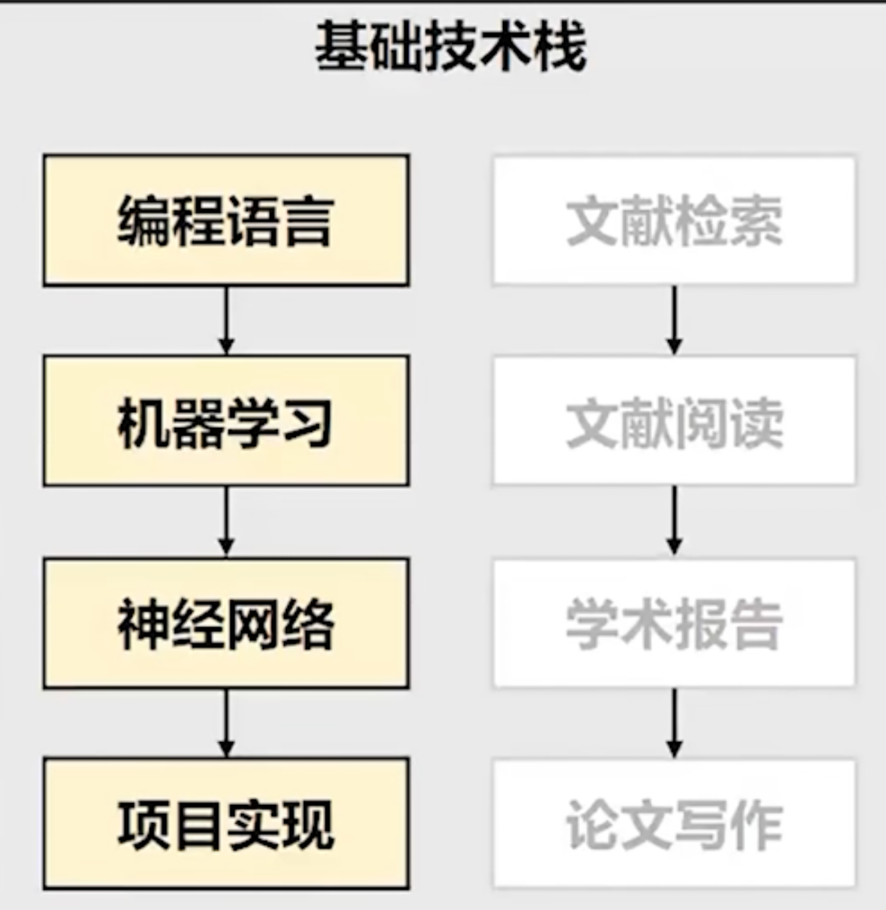
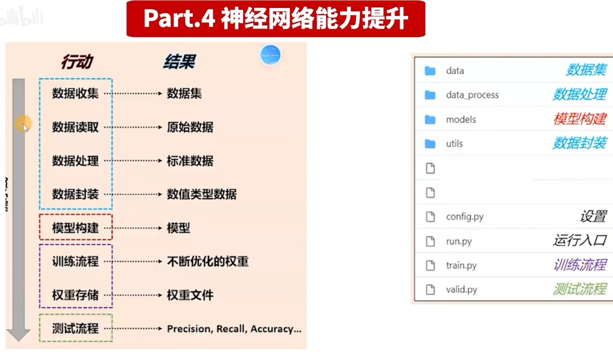
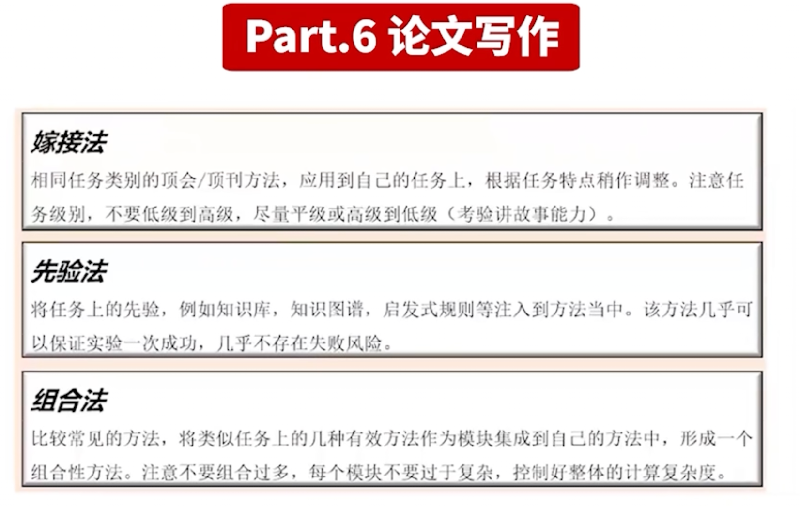
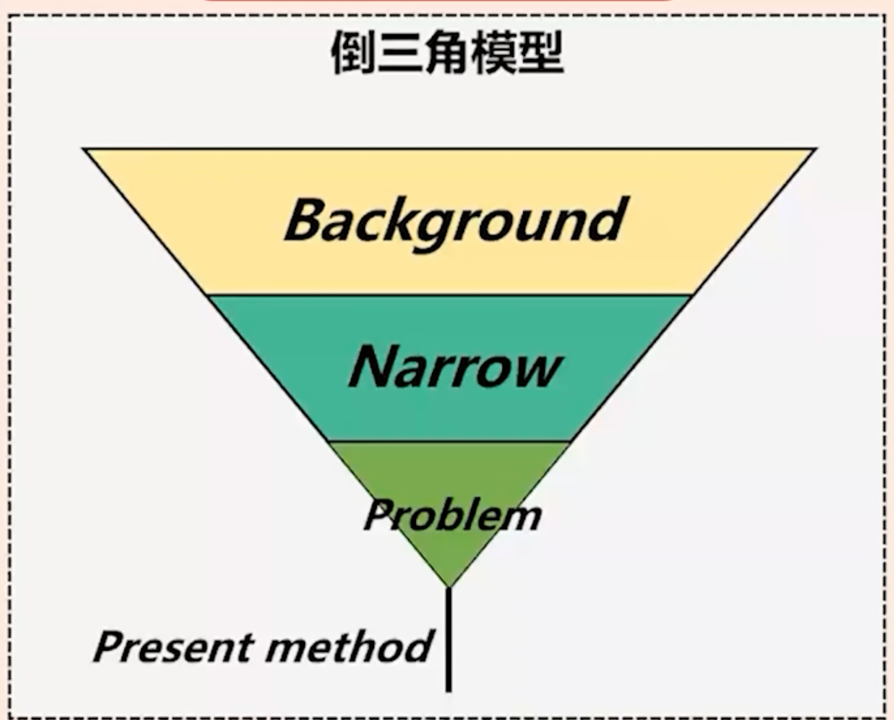
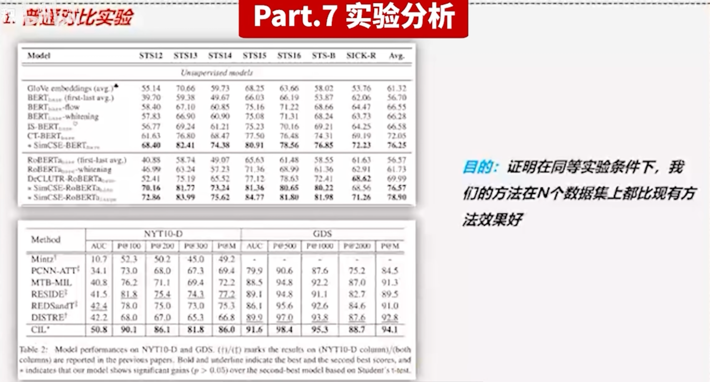
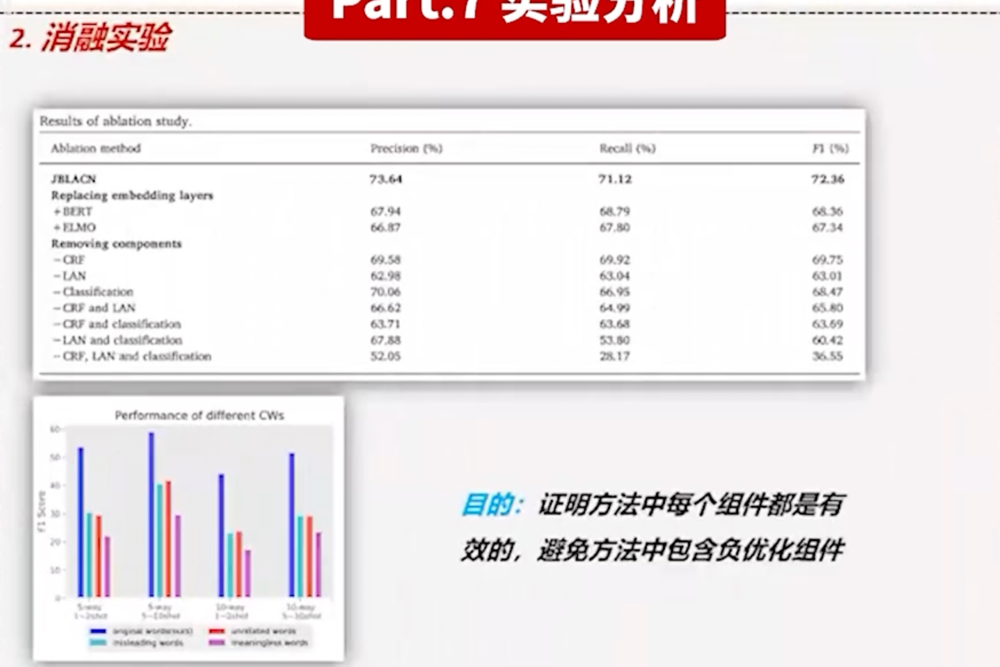
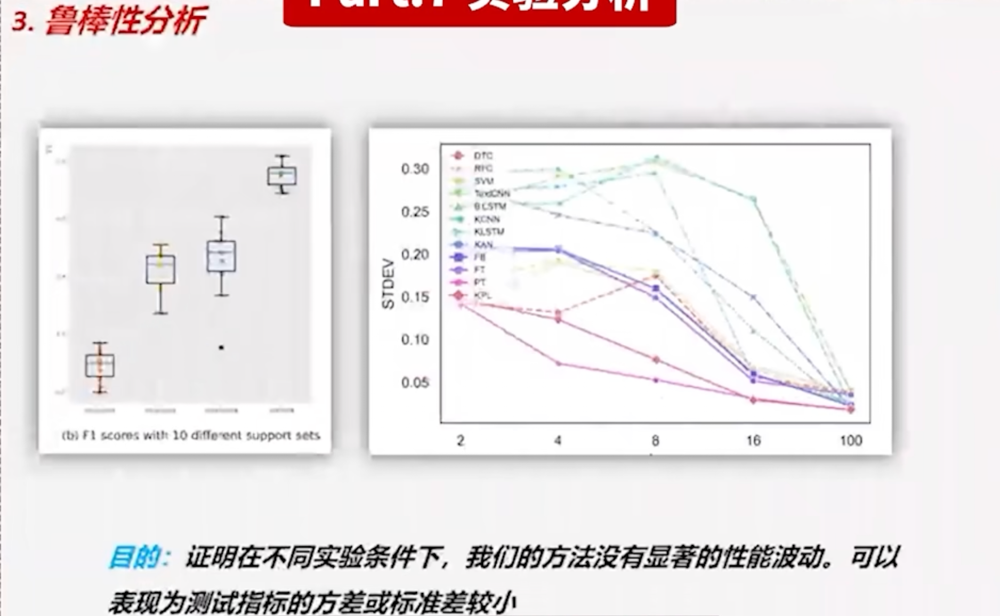
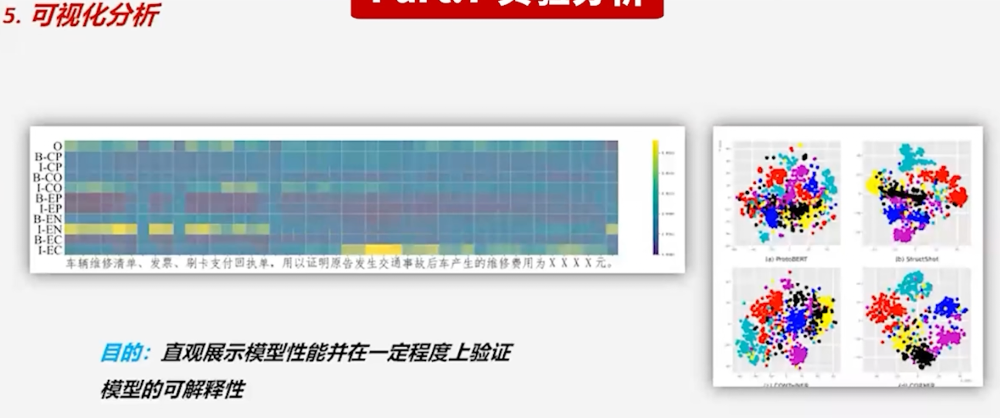
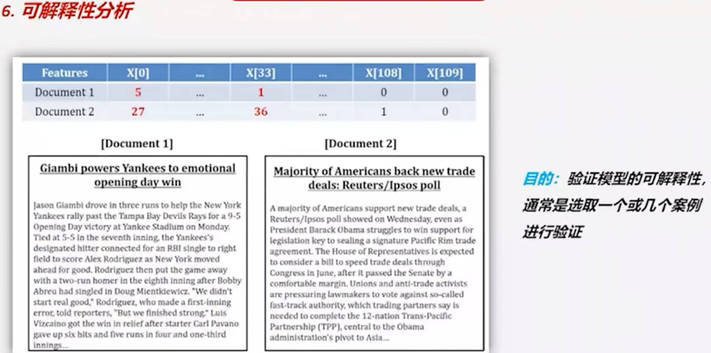

# 计算机研究生技术栈

项目：c和java

纯科研：python

- python编程从入门到实践--流畅的python--统计学习方法(李航)
- 算法题--leetcode
- kaggle-- 机器学习算法项目
- 神经网络与深度学习
- 李沐《动手学深度学习》

编程语言能力提升

机器学习能力提升

神经网络能力提升

文献检索能力提升

论文写作

实验分析

生活方式

- 生活是自己的，只有自己才是自己一辈子的负责人
- 科研不是生活的全部，多培养没有目的的爱好- pure happy --否则科研失败就难以接受
- 谋事在人 成事在天

