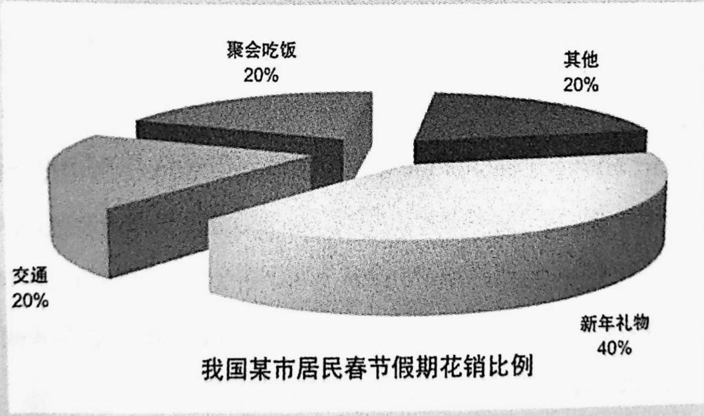
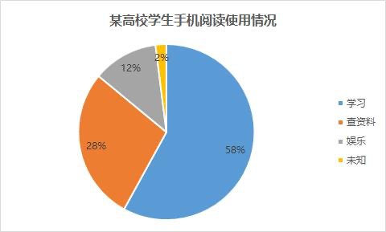
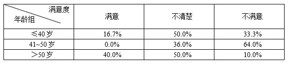
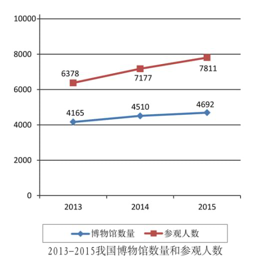
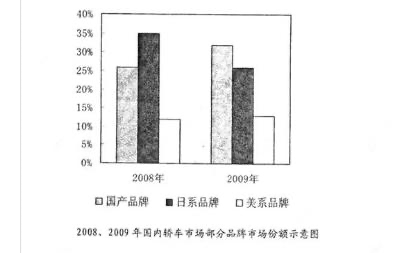

策略：重要程度- 语言>结构>内容

- 以人为本 -- 本身/社会/自然
- 漂亮词/句 -- 温暖原则/复杂句，同义替换
- 结构 --  起承转合

# Para 1

## 1-1 引出主题

> chart图表/graph图/table表格
>
> line chart/bar chart/pie chart  线性图/柱状图/饼状图

### 1-1-1.提供信息

> The chart provides information about ...
>
> chart --> graph/table/line chart/bar chart/pie chart 
>
> provide --> present/show/indicate/reflect
>
> information --> data/figure/statistic

【2020】该饼状图展示了某高校学生通过手机进行阅读的 不同目的。

The pie chart presents different reading purposes of college students through using mobile phones in a certain college.

【2018】该饼状图展示了某城市 2017 年期间消费者在选择 餐厅时的关注因素。

The pie chart presents different factors of consumers’ concern on choosing restaurants (dinning places) in a certain city in 2017.

### 1-1-2. 比较

> The chart compares the number(numbers) of A with that(those) of B

【例子】线状图比较了美国人口增长的速率和物种灭绝的速率。

The line charts compare the growth rate of U.S. population with extinction rate of wildlife species.

【2017】该线状图比较了博物馆和访问者的上升趋势。

The line chart compares the upward tendency of museums with that of visitors.

### 1-1-3. 展示不同

> The chart shows the differences about/of ... in ...

【2010】柱状图展示了手机定制在发展中国家和发达国家的不同之处。

The bar chart shows differences of mobile-phone subscription in developing countries and developed countries(ones).

【2012】表格展示了公司不满意状况在不同年龄层 的不同之处。

The table shows differences of dissatisfaction among different age groups in a certain company.

The table shows staff’s dissatisfaction of three different age groups in a certain company.

### 1-1-4.某方面变化

> The chart clearly reflects the changes in the statistics of A and B during the past ..years.

【2014】城市人口 urban population, 农村人口 rural population

The bar chart clearly reflects the changes in the statistics of urban population and rural population during the past 20 years.

### 1-1-5.反映趋势

> **The chart** **clearly mirror**/echo/reflect **a** **noticeable**/conspicuous/notable/visible/evident/obvious/upward/downward **trend**/tendency/inclination **that..**
>
> 越来越
>
> an increasing number of people are doing 多
>
> a decreasing .. 少

【2021】某市居民健身方式调查 上图清晰地反映出一个显著的趋势：越来越多的人经常进行 体育锻炼。 

The chart above clearly mirrors a noticeable trend that an increasing number of people usually take exercises.

## 1-2 描述图表

> 描述图表=如表所示+基本公式

### 1-2-1 静态图： 饼状图， 表格， 孤立的柱状图

- 整体-局部-突出点

（一）整体：该图表由…组成。

The chart consists of A, B and C.

The chart is composed of A , B and C.

【 2015 】春节消费的数量由礼品、交通和其他组成。

In 2015, the amount of cost in Spring Festival is composed of gifts, traffic and others.

（二）局部：…的比例是/占…。

The proportion/percentage/share/number of … is/was/presents / accounts for … .

【2020】 学习知识的占比是 59.5%。

The proportion of acquiring knowledge accounts for 59.5%.

（三）突出点：最大/小/显著的比例是/来自于…

The largest/smallest/ most obvious proportion/share is/ comes from …

【2017】 最显著的两个部分来自于欣赏风景和缓解压力。

The two obvious parts come from sightseeing and alleviating stress.

补充： 

- 各自地 respectively 

- 在所有类别中 of all categories 

- 具体而言：to be specific, specifically, specifically speaking 

- 当我们更仔细地看，我们会发现：When taking a closer look, we can find that .

- 显然，最重要的...要素是... :Obviously, the most important ... factors are ...

【2018】消费者选择餐厅的关注要素

整体：饼状图由特色、服务、环境、价格等不同的比例组成。

The pie chart consists of different proportions of feature, service, environment and price.

局部：具体来说，这些因素占 36.3%，……，…及 4.7%。

To be specific, the number of these factors accounts for 36.3%, …, … and 4.7% respectively .

突出点：仔细一看，我们会发现最重要的 3 个因素是特色、服务和环境。

When taking a closer look, we can find that the most important three factors are character, service and environment.

### 1-2-2 动态图 - 有时间变化，对比

第一种：the numbers of 主题n+变化v+程度adv+范围{时间/数量}

第二种：the number of 主题+变化+程度+时间范围，ranging from …(数1)  to …(数2)

number -> figure(s), amount 总 量 ， rate 速 率 ， proportion 比 例 份 额 ， percentage 百分比

- 主题 总主题=B and C
  - 在发展中国家和发达国家的手机定制 
  - **mobile phone subscription** in **developing countries** and **developed ones**
- 变化  注意过去式
  - 上升 increase/rise/grow/ascend  
  - 下降 decrease/decline/diminish/descend
- 程度  浅--深
  - slightly
  - slowly
  - steadily
  - significantly
  - sharply
- 范围
  -  从 1 到 10：from 1 to 10
  - 从 1990 年到 2000 年：from 1999 to 2000
  - 从 1990 年的 1 到 2000 年的 10： from 1 in 1900 to 10 in 2000
  - 从 1990 年的 1900 到 2000 年的 1990：from 1900 in the year of 1990 to in the year of 2000

【2010】手机在发展中国家和发达国家的不同销量 

根据图表，发展中国家的手机用户量从 2000 年不到 10 亿增长到 2008 年的 40 亿。

As is indicated in the chart, the number of mobile-phone users in developing countries increases from under 1 billion in 2000 to 4 billion in 2008.

补充：

- 差异对比

 There was an increase/a decline of ..(量) in ...(主题词) during the period from ...(时间1)...(时间2).

从时间1到时间2，主题词增长或下降了

【2011】不同汽车品牌的销量 

国产品牌汽车的销量从 2008 年到 2009 年有 8%的增长。

There was an increase of 8% in sales of domestic cars during the period from 2008 to 2009.

数据1相当于数据2，有个...(量)的增长或下降

The number of 主题 1 was 数据1 in 时间1 compared to 数据2 in 时间2， showing an increase / a decline of … （量）。 

The number of 主题词 was only 数据1， compared with a record of 数据2， about …（量） up/down.

【2011】中国汽车的销量在2009年占比35%，相较于2008的25%，有个10%的增长

The percentage of sales of domestic car was 35% in 2009 compared to 25% in 2008,showing an increase of 10%. 

【2011】日本汽车销量在2009年只有25%，相较于2008年的35%，有大约10%的下降。

The proportion of sales of Japanese cars was only 25% in 2009,compared to 35% in 2008,about 10% down.

- 波状图

尽管...(主题词)的数字波动不定，但是总趋势是上升的/下降的。

Although the number of ... varies, the whole tendency tends to be increasing/decreasing.

Upward/downward

没变化

A的数据不变。The number of A is flat.

A的数据维持稳定在 X%。 The number of A remains steady at x%.

【2011】中国汽车的份额保持在 35%。

The proportion of Chinese cars remains steady at 35%.

【2010】手机在发展中国家和发达国家的订阅数量

从 2000 年到 2008 年，发达国家的手机用户数量稳定在一个更低的水平。

From 2000 to 2008,the number of mobile-phone users in developed countries remains steady at a lower level.

- 两个变量 -- 变量一公式。 关联词， 变量二公式。

  - 通用：

    -  meanwhile， 与此同时 

    - And … during the same period/at the same time

  - 相同
    - 近似地是 ：Likewise, similarly, 
    - 递进：furthermore, moreover, what’s more , even worse, more importantly

  - 相反
    - However, yet, but, 
    - Ironically, unfortunately, regrettably 
    - in contrast, by contrast, on the contrary ,

## 1-3 图表总结

1.尽管数字孤立，事实上，紧密联系。

Isolated as the figures seem to be, as a matter of fact, they are connected to one another closely.

2.绘图者的真正目的不是数据本身，而是要引导我们去探究其原因。 

The draftsman’s real purpose is not the statistics, but to lead us to find the reasons.

3.事实上，作者真正要告诉我们的不只是数字。 

As a matter of fact, what the author tries to show us is more than statistics.

【2010】 英语二：手机在发展中国家和发达国家的不同增长：

1. 话题引起: 该柱状图呈现了不同趋势 of 手机销量 in 发展中国家和发达国家
2. 如柱状图所示，发达国家手机的数量缓慢增长从 2000 年的 5 亿 到 2008 年的 10 亿。
3. 与此同时，发展中国家手机的数量从 2000 的低于 0.5 billion缓慢上升到2003 年的 0.8billion, 在此之后它从 2004 年的超过 1billion 显著上升到 2008 年的 4 billion.

4. 尽管图表抽象 abstract, 但寓意深刻。

The bar chart

## 1-4 第一段总结 

> 线状图-变化-突出变化
>
> 饼图-静态-突出点

### **线状图**

> 第一种：单线上升
>
> 第二种： 单线下降
>
> 第三种：两线同时上升
>
> 第四种：两个单线同时下降
>
> 第五种： 两个线一上升一下降（C 不变）
>
> 第六种：一上一下一波浪

#### 第一种：单线上升

1. 引出主题： 线状图反映了 A 主题的信息。

2. 图表描述：具体而言 To be (more) specific / Specifically speaking，A 的数据从 1990 的 1 上升到 2000 年的 50.

3. 图表总结：事实上，作者真正要告诉我们的不只是数字。

1)  The line chart clearly mirrors a upward trend of/about A.

2) To be specific, the number of A increases from 1 in 1990 to 50 in 2000.

或 (To be more specific, the number of A increased from 1990 to 2000, ranging from 1 to 50.)

3) As a matter of fact, what the author tries to show us is more than statistics.

#### 第二种： 单线下降

1. 线状图反映了 A 主题的信息。

2. 具体而言 To be (more) specific / Specifically speaking，A 的数据从 1990 的 50 下 降到 2000 年的 1.

3. 事实上，作者真正要告诉我们的不只是数字。

(1) The line chart provides information about A.

(2) To be specific, the number of A decreased from 100 in 2010 to 1 in 1990.

(3) As a matter of fact, what the author tries to show us is more than statistics.

#### 第三种：两线同时上升

1. 线状图比较了 A 和 B。
2. 具体而言，A 的数据从 1990 的 1 缓慢地上升到 2000 年的 10 。
3. 然而，B 的数据从 5 显著地上升到 100 同一时期 during the same period 。

4. 尽管数字看似孤立，但紧密联系。

1) The line chart provides information about A and B.

2) To be specific, the number of A increased slightly from 3 in 1990 to 5 in 2010.

3) Yet, the figure of B rose significantly from 5 to 100 during the same period.

4) Isolated as the figures seem to be, they are connected to one another closely.

#### 第四种：两个单线同时下降

1. 线状图比较了 A 和 B。

2. 具体而言，A 的数据从 1990 的 10 缓慢地下降到 2000 年的 1 。

3. 然而，B 的数据从 100 显著地下降到 5 同一时期 during the same period 。

4. 尽管数字看似孤立，但紧密联系。

1) The line chart provides information about A and B.

2) To be specific, the number of A decreased slightly from 10 in 1990 to 1 in 2010.

3) Yet, the figure of B fall significantly from 100 to 5 during the same period.

4) Isolated as the figures seem to be, they are connected to one another closely.

#### 第五种： 两个线一上升一下降（C 不变）

1. 线状图呈现了 A，B 和 C 的数据。

2. 具体而言，A 的数据从 1990 年的 1 显著上升到 2000 年的 100.

3. 然而，B 的数据从 100 陡然下降到 1，同一时期。

4. 与此同时，C 保持在 50.

5. 尽管数字孤立，但紧密联系。

1) The line chart presents the information about A, B and C.

2) To be specific, the numbers of A increase significantly from 1 in 1990 to 100 in 2000. 

3) Yet, the numbers of B decrease sharply from 100 to 1 during the same period.

4) Meanwhile, the number of C remains steady at 50.

5) Isolated as the figures seem to be, they are connected to one another closely.

#### 第六种：一上一下一波浪

1. 线状图呈现了 A， B 和 C 的数据。

2. 具体而言，A 的数据从 1990 的 1 猛烈上升到 2000 年的 500.

3. 然而，B 的数据从 50 稳步下降到 10 同一时期。

4. 与此同时，尽管 C 的数据变化不定，但总趋势是上升的。

5. 尽管数字孤立，但紧密联系。

1) The line chart provides information about A, B and C.

2) To be specific, the number of A increases sharply from 1 in 1990 to 500 in 2000.

3) Yet, the number of B decreases from 50 to 10 during the same period.

4) Meanwhile, although the number of C varies, the whole tendency tends to be increasing/upward.

5) Isolated as the figures seem to be, they are connected to one another closely.

### **柱状图**

> （一）第一种：同一变量在不同时间段的变化
>
> （二）第二种：同一变量不同时期下降
>
> （三）第三种：两个变量不同时期不同程度上升。（突出明显变化）
>
> （四）第四种：两个变量同时下降，程度不同（突出明显变化）
>
> （五）第五种：三个变量一上一下一持平（2011）

#### （一）第一种：同一变量在不同时间段的变化

- 写法一

1. 该柱状图展示了主题词从 1990 年到 2010 年的变化。The chart shows how …changes

2. 具体而言， A 的数字在 1990 年是 5.
3. 然而，A 的数字从 2000 年的 10 显著上升到 2010 年的 100.
4. 尽管数字孤立，但紧密联系。

1) The bar chart shows how A changed from 1990 to 2010.

2) To be specific, the number of A was 5 in 1990.

3) Yet, the number of A increased significantly from 10 in 2000 to 100 in 2010.

4) Isolated as the figures seem to be, they are connected to one another closely.

- 写法二

1. 该柱状图展示了主题词从 1990 年到 2010 年的变化。 The chart shows how …changes.

2. 具体而言，A 的数字从 1990 的 5 缓慢上升到 2000 年的 10.

3. 然而，它猛然上升到 2010 年的 100.

4. 尽管数字孤立，但紧密联系。

1) The bar chart shows how A changed from 1990 to 2010.

2) To be specific, the number of A increased slowly from 5 in 1990 to 10 in 2000.

3) Yet, the number of A increased sharply to 100 in 2010.

4) Isolated as the figures seem to be, they are connected to one another closely.

- 写法三

1. 柱状图展示了 A 如何变化。

2. 具体而言，A 的数字从 1990 年的 5 缓慢地上升到 2000 年的 10， 在此之后 after which 它 it 陡然上升到 2010 年的 100.

3. 尽管数字孤立，但紧密联系。

1) The bar chart shows how A changed from 1990 to 2010.

2) To be specific, the number of A increased slowly from 5 in 1990 to 10 in 2000, after which it rose sharply to 100 in 2010.

3) Isolated as the figures seem to be, they are connected to one another closely.

#### （二）第二种：同一变量不同时期下降

1. 柱状图展示了 A 如何变化。

2. 具体而言，A 的数字从 1990 年的 100 陡然下降到 2000 年的 10， 在此之后 after which 它 it 缓慢下降到 2010 年的 5.

3. 尽管数字孤立，但紧密联系。

1) The bar chart shows how A changes from 1990 to 2010.

2) To be specific, the number of A decreases sharply from 100 in 1990 to 10 in 2000, after which it descends slowly to 5 in 2010.

3) Isolated as the figures seem to be, they are connected to one another closely.

#### （三）第三种：两个变量不同时期不同程度上升。（突出明显变化）

1. 柱状图比较了 A 和 B 。

2. 具体而言，A 的数字从 1990 的 5 稳步地上升到 2010 年的 15.

3. 然而，B 的数字从 1990 年的 10 缓慢上升到 2000 年的 15， 在此之后它陡然上升到了 2010 年的 100.

4. 尽管数字孤立，但紧密联系。

1) The bar chart compares the upward trend of A with that of B.

2) To be specific, the number of A increases steadily from 5 in 1990 to 15 in 2010.

3) Yet, the number of B rises slowly from 10 in 1990 to 15 in 2000, after which it ascends sharply to 100 in 2010.

4) Isolated as the figures seem to be, they are connected to one another closely.

#### （四）第四种：两个变量同时下降，程度不同（突出明显变化）

1. 柱状图比较了 A 和 B 。

2. 具体而言，A 的数字从 1990 的 15 稳步地下降到 2010 年的 5.

3. 然而，B 的数字从 1990 年的 100 陡然下降到 2000 年的 15， 在此之后它缓慢下降到 了 2010 年的 10.

4. 尽管数字孤立，但紧密联系。

1) The bar chart compares A with B.

2) To be specific, the number of A decreases steadily from 15 in 1990 to 5 in 2010.

3. Yet, the number of B declines sharply from 100 in 1990 to 15 in 2000, after which it descends slowly to 10 in 2010.

4. Isolated as the figures seem to be, they are connected to one another closely.

#### （五）第五种：三个变量一上一下一持平（2011）

1. 柱状图呈现了 A，B 和 C 的不同。

2. 具体而言，A 的数字从 2000 年的 5 缓慢上升到 2010 年的 10.

3. 然而，B 的数字从 100 陡然下降到 10 同一时期。

4. 与此同时，C 保持在 15 不变。

5. 尽管数字孤立，但紧密联系。

1) The bar chart shows the differences in A, B and C.

2) To be specific, the number of A increases slowly from 5 in 2000 to 10 in 2010.

3) Yet, the figure of B decreases sharply from 100 to 10 during the same period.

4) Meanwhile, the number of C remains steady at 15.

5) Isolated as the figures seem to be, they are connected to one another closely.

### 饼状图

> 静态图：整体-局部-突出点
>
> （一）第一种：一个饼一个量（结合其他图表考察）
>
> （二）第一种图的变形：
>
> （三）第二种：一个变量的单一变化（上升 increase / 下降 decrease）
>
> （四）第三种：两个变量，此消彼长。

#### （一）第一种：一个饼一个量（结合其他图表考察）

1. 饼状图呈现了 B 在 A 中的百分比。

2. 具体而言，B 的份额占 20%。

3. 尽管数字孤立，但紧密联系。

1) The pie chart presents the percentage of B in A.

2) To be specific, the proportion of B accounts for 20%.

3) Isolated as the figures seem to be, they are connected to one another closely.

#### （二）第一种图的变形：

1. 如饼状图所示， A 的数量由 B,C，D 和 E 组成。

2. 具体而言，B，C，D 和 E 的百分比各自 respectively 占 40%， 20%，20%和 20%。

3. （突出点）更仔细地看 when taking a closer look，可以发现 B 的数据最大 we can find that … 。

4. 尽管数字孤立，但紧密联系。

1) As is indicated in the pie chart, the amount of A is composed of B, C, D and E. 或 The pie chart presents information about A, which is composed of B, C, Dand E.

2) To be specific, the proportion of B, C, D and E accounts for 40%, 20%, 20% and 20% respectively.

3) When taking a closer look, we can find that the biggest one is B.

4) Isolated as the figures seem to be, they are connected to one another closely.

#### （三）第二种：一个变量的单一变化（上升 increase / 下降 decrease）

1. 饼状图展示了 B 在 A 中的份额变化从 1990 年到 2010 年。（the different proportion of B in A 或者 differences about the proportion of B in A ）

2. 具体而言，B 的百分比从 20%增长到 40%。

3. 尽管数字孤立，但紧密联系。

1) The pie charts present the differences about the proportion of B in A from 1990 to 2010.

2) To be specific, the percentage of B increases from 20% to 40%.
3) Isolated as the figures seem to be, they are connected to one another closely.

#### （四）第三种：两个变量，此消彼长。

> 一个饼分两边 A增B减
>
> The impact of high-tech on modern life/study/traffic/work.
>
> | A    | e-books      | online-shopping   | online-course     | e-pay    | shared transport | online communication       | email |
> | ---- | ------------ | ----------------- | ----------------- | -------- | ---------------- | -------------------------- | ----- |
> | B    | printed-book | in-store shopping | in-class teaching | cash pay | public traffic   | face to face communication | mail  |

1. 饼状图呈现了 A 和 B 的份额不同。
2. 具体而言，A 的百分比从 1990 年的 20%上升到了 2010 年的 40%。
3. 然而，B 的百分比从 80%下降到 60%同一时期。
4. 尽管数字孤立，但紧密联系。

1. ( 就….而言 in terms of the impact of high-tech on our modern life/study/work/traffic), The pie charts showcase the different proportions between/about/of A and B
2. To be specific, the percentage of A increases from 20% in 1990 to 40% in 2010.
3. Yet, the number of B decreases from 80% to 60% during the same period.
4. Isolated as the figures seem to be, they are connected to one another closely.

### 表格

>（一）第一种：四个常量在同一个图中（等于饼状图变形）
>
>（二）第二种：多个变量同时上（同时下/有上有下）转化成线状图或柱状图

【注意】图表描述前前添加一句： 更仔细地看，最大的变化是… （突出点）。

 When taking a closer look, one can find the biggest difference is …

### 真题

#### （一）静态图

【2015】某市居民春节礼品消费

1. 话题引起：该饼状图展示了中国某城市居民春节消费的不同情况。
2. 图表描述：
   - （整体）具体而言，消费的总量是由新年礼物、交通、聚会和其他组成。
   - （局部）他们的数据各自是 40%，20%，20%和 20%。
   - （突出点）更仔细地看，可以发现礼品消费的数量最大。
3. 图表总结：尽管数字孤立，但彼此之间紧密联系。

1. The pie chart presents different proportions of residents’ consumption in a Chinese city during Spring Festival. ( , which is composed of ... )
2. To be specific, the amount of cost is composed of New-Year gift, traffic, party and others.
3. The number of these elements accounts for 40%, 20%, 20% and 20% respectively.
4. When taking a closer look, we can find that the biggest part comes from expense on New Year’s gifts.
5. Isolated as the figures seem to be, they are connected to one another closely.

【2020】某高校学生手机阅读使用情况

1. 话题引起：上面的饼状图展示了某高校学生通过手机进行阅读的不同目的。
2. 图表描述：具体而言，学习知识、获取信息、消磨时间和其他的占比分别为 58%， 28%， 12% 和 2%。 更仔细地看，我们会发学习在所有类别中占比最 大。
3. 图表总结：尽管数字孤立，但彼此之间紧密联系。

1. The pie chart presents different reading purposes of students using mobile phones in a certain college.
2. To be specific, the percentage of learning knowledge, acquiring information, killing time and others accounts for 58%， 28%， 12% and 2% respectively. When taking a closer look, we can find that learning knowledge is the biggest proportion of all categories.
3. Isolated as the figures seem to be, they are connected to one another closely.

【2012】某公司员工工作满意度调查

1. 引出话题：该表格展示了某公司三个不同年龄层员工的工作满意度。
2. 图表描述：具体而言，41-50 岁员工满意度的数据为 0。 相比之下，50 岁 以上的人工作满意度最高，为 40%。
3. 图表总结：事实上作者真正要告诉我们的不只是数字。

1. The table shows employees’ job satisfaction of three different age groups in a company.
2. To be specific, the number of satisfaction degree from employees aged between 41 to 50 is 0. By contrast, the employees over 50 years old **share the highest level of** satisfaction, **with a percentage reaching up to 40%.**
3. As a matter of fact, what the author tries to tell us is more than statistics.

#### （二）动态图

【2017】博物馆数量和参观人数的增长

1. 话题引起：该线状图比较了中国博物馆的上升趋势和参观人数的上升趋势从 2013 年到 2015 年。
2. 图表描述：具体而言，博物馆的数量从 2013 年的 4165 家缓慢增长到 2015 年的 4692 家。相比之下，访问者的数量同期上升显著，从 6.378 亿到 7.811 亿。
3. 图表总结：尽管数字孤立，但彼此之间紧密联系。

1. The line chart compares the upward tendency of Chinese museums with that of visitors. 
2. To be specific, the number of Chinese museums increased slowly from 4.16 thousand in 2013 to 4.69 thousand in 2015. By contrast, the number of visitors ascended significantly during the same period, ranging from 637.8 million to 781.1 million. 
3. Isolated as the figures seem to be, they are connected to one another closely.

【2011】不同汽车品牌的国内市场份额

1. 话题引起：该柱状图展示了国产汽车、日系汽车和美系汽车在 2008 年和 2009 年的不同市场份额。
2. 图表描述：国产汽车的市场份额从 2008 年的 25%上升到 33%， 上升了 8%。 然而，日系汽车的市场份额却从 35%急剧下降到 25%，下降了 10%。 与此同 时，美系品牌所占比例保持不变在 25%。
3. 图表总结：略

1. The bar chart shows us different market shares of Chinese, Japanese and American cars in the year of 2008 and 2009 in China.
2. To be specific, the proportion of Chinese brands in domestic market increased 25%in 2008 to 33% in 2009, showing an increase of 8%. By contrast, the figure of Japanese cars dropped sharply by 10% from 35% to 25%. Meanwhile, the percentage of American cars remained steady at 10%.
3. 略

# Para 2

中间段论证 -- 三种方法

> 原因后果论证
>
> 举例论证
>
> 对立观点论证

## 2-1 原因后果论证

> 交代现象-引出原因-具体原因-引出后果-具体后果

### 2-1-1 交代现象

1. 事实上，这个看似简单的图表微妙地揭示了当下吸引我们注意的一个流行现象（： … 主 题词或主题句）
   - Actually, this seemingly simple chart subtly discloses a prevailing phenomenon(that has attracted our attention.)
   - 【2020】 某高校学生手机阅读目的调查
     - 事实上，这个看似简单的图表微妙地揭示了当下吸引我们注意的一个流行现象：越来越多的大学生在日常生活中频繁使用手机。
     - Actually,this seemingly simple chart subtly discloses a prevailing phenomenon that an increasing number of college students frequently use mobile phone. 
   - 【2017】 年博物馆参观人数上升
     - 事实上，这个看似简单的图表微妙地揭示了当下吸引我们注意的一个流行现象：越来越多的 现代人喜欢花时间在艺术上。
     - Actually,this seemingly simple chart subtly discloses a prevailing phenomenon that an incresing number of modern people would like to spend time on arts.
2. 实际上，这个图表只是一个流行现象的缩影。
   - In fact, this chart is a miniature of a prevalent phenomenon.(: that) -- miniature popular/prevailing/prevalent
   - 【2018】消费者选择餐厅的关注要素
     - 事实上，这个图表是一个普遍现象的缩影，越来越多的消费者选择一家餐馆是因为它的特色、 服务和环境，而不是价格。
     - In fact,this chart is a miniature of a prevalent phenomenon that an increasing number of consumers choose a restaurant because of it's feature,environment and service rather than price.
3. 显然，这个抽象的图表微妙地揭示了……和……
   - Apparently, the abstract chart has subtly revealed the relationship between ... and ... .
   - 【2017】博物馆和游客访问量上升 --apparently obviously evidently
     - 显然，这个抽象的图表微妙地揭示了博物馆的增长趋势和游客的激增之间的关系。
     - Apparently,the abstract chart has subtly revealed the relationship between the upward tendency of museums and boom of visitors.
4. 这真的是作者想要告诉我们的吗？当然不是了。
   - Is this just what(all) the author tries to tell us? Certainly not.

### 2-1-2 引出原因

1. 除了以下几点，我找不到更好的理由了。第一，… 。 第二, … 。
   - I can think of no better reasons than the following ones. Firstly, … , Secondly, … .
2. 到底是什么导致了这一现象？这是个发人深思的问题。
   - What exactly contributes to this phenomenon(主题词)? It is a thought-provoking question.
   - 【2019】毕业生去向调查
     - 到底什么导致了职业规划的多样化呢？这是个发人深思的问题。
     - What exactly contributes to the diversity of career planning?It's a thought-provoking question. 
   - 【2014】 城市化进程 urbanization / development of cities大城市 / metropolis大都市
     - What exactly contributes to the development of metropolis?It's a thought-provoking question. 
3. 你可能会思考，为什么会产生这个现象呢？
   - Why, you may wonder, does this phenomenon(主题词) emerge? / emerge/come into being
   - 【2012】员工不满意度调查
     - 你可能会思考，为什么投诉和抱怨会出现呢？
     - Why,you may wonder, does complaint/dissatisfaction emerge?
4. 考虑到这个问题的重要性，有必要指出其背后的原因。
   - Considering the significance of the present situation, we ought to point out the causes behind it.
   - significance / detriment/harm/ pros and cons
5. 在我看来，有两个基本要素可以解释这一现象。
   - Two(several) fundamental(key/primary) factors, in my mind, could account for this social phenomenon.
   - account for -- contribute to 
6. 为了解释这一趋势，人们想到了各种原因。
   - To account for this trend, people have come up with a wide variety of reasons.
   - 【2010】手机在不同国家的销量
     - 为了解释不同的增长趋势，人们想到了各种原因。
     - To account for different upward trend, people have come up with a wide variety of reasons. 

### 2-1-3 具体原因(🌟)

1. 第一点原因

   - ...可以是词组/短语/主题词/doing xx

   - 首先，…可能对它产生了重要的影响。
     - To begin with, … might exert great influence on it.

   - 首先,…可能导致了这个问题。
     - Firstly, … might cause the problem.

   - 一方面，这种情况可能是......的结果。
     - For one thing, this situation might be the result of ... .

2. 第二点原因

   - ...接句子

   - 第二点原因是…
     - The second reason is that …

   - 此外,…
     - What’s more, / Furthermore,/ Moreover,

3. 找不到两个原因只写最重要的

   - 也许，主要原因是…
     - Perhaps, the primary reason is that …
   - 最重要的是,…
     - Most importantly, ….
   - 最主要的是，通过数据我们可以看出..... 所占比例最大/最小， 或许是因为 ... ...
     - Primarily, we can see from the data that ... take up the largest/smallest proportion, perhaps because ... .

### 2-1-4 引出后果

1. 通用结果

   - 因此,
     - so/thus/hence/as a result/
     - 坏的结果 as a consequence
   - 似乎不止一个直接或者间接的影响与主题词相关，这些我们都无法忽视。
     - There seem to be more than(不止) one direct or indirect effects involved in … , which none of us can fail to notice. Firstly, … . Secondly, …
     - 【2020】 智能手机的流行
     - There seem to be more than one direct or indirect effects involved in the popularity of smartphones,which none of us can fail to notice. 

2. 坏的结果

   - 如果我们视而不见的话，上述问题将会产生严重后果。
   - The problem mentioned above is bound to generate severe consequences, if we keep turning a blind eye to it.

3. 虚拟结果

   如果没有这个事情的话，我们可能无法感受到生活的幸福。然而，如果这个事情消极的影响继续发生的话，我们可能要付出昂贵的代价。

   Were there no such thing, never could we feel the happiness of life. Yet, were the opposite facet of this situation to continue, we would pay a high price.

   - 正面话题：如果没有好的话题，将无法…
     - 【2013】如果没有兼职工作，我们可能无法拥有更多工作经验。
     - Were there no part-time jobs, never would we obtain more working experience.
   - 负面话题：如果情况恶化，昂贵代价
     - 【2012】如果员工不满意的情况恶化，我们需要付出昂贵代价。
     - Were the situation of staff dissatisfaction to continue,we would pay a high price.

### 2-1-5 具体后果

1. 方法一：重复问题或加重问题
2. 直接举例子
   - For example, ... 事例
   - As a result, an increasing number of people have come to realize the fact mentioned above. 人的意识
   - The problem/situation/case mentioned above has come into being, which might become worse/better in the future. 既定事实

### 2-1-6 原因的拓展

> 第二段：原因段
>
> 第三段：措施段
>
> 坏的情况：以前没有措施--现在得有措施
>
> 好的情况：过去已经有措施--建议加强某些措施，建议继续某些措施

环境保护为例 通过措施推-->原因  <<===>>  **写作文的时候先想措施然后倒推原因**

措施:1.立法; 2.处罚; 3.媒体宣传;4.个人意识

原因:1.过去缺少相关规定 2. 过去缺少处罚 3. 过去缺少宣传或曝光 4.过去缺少意识

1. 媒体：宣传
   - 负面：媒体可能不恰当地夸大了这件事。
     - The mass media might inappropriately exaggerate the issue.
     - 【2015】过度礼品消费：媒体可能不恰当地夸大了礼品的作用。
     - The mass media might inappropriately exaggerate the function of gifts.
   - 正面：大众媒体，如广播、电视和网络，适当地宣扬并鼓励这一事情。
     - The mass media, such as radio, television and the internet, might appropriately advocate and encourage this issue.
     - 【2013】鼓励在校大学生兼职 -- 大众媒体，如广播、电视和网络，适当地宣扬并鼓励在校大学生做兼职。
     - The mass media,such as radio,television and the internet, might appropriately advocate and encourage college students to do part-time jobs.
     - 【2014】鼓励农民工 -- 大众媒体，如广播、电视和网络，适当地宣扬并鼓励农民工去大城市工作。
     - The mass media,such as radio, television and the internet, might appropriately advocate and encourage rural workers to find jobs in metropolis.
2. 政府：执行
   - 负面：因为缺少管控…的法律才导致了…趋势的扩大。
     - A lack of laws and regulations to control … leads to the expanding trend of … .
     - 【2012】员工不满意度调查 -- 因为缺少政策去提高员工薪酬才导致了不满意的趋势扩大。
     - A lack of policies to increase staff's salary leads to the expanding trend of complaint.
   - 正面：正是相关法律法规的执行促使这一个令人惊喜的趋势出现。
     - It is the enforcement of relevant laws and regulations that makes this surprising trend come into being.
     - 【2019】本科毕业生去向调查 -- 正是相关政策的执行促使大学生创业的出现。
     - It's the enforcement of relevant policies that makes self-employment of college students come into being.
3. 社会：关注
   - 负面 
     - 社会缺少对…的关注导致了 …/A lack of attention (from…) on … leads to …
     - 对…的过多关注导致了… /Too much attention (from…) on … leads to …
     - 【2014】对城市建设的过多关注导致了经济的不平衡发展。
       - Too much attention on city construction leads to unbalanced development of economy.
     - 【2015】对包装 packaging 的过多关注导致了过度的 excessive 礼品消费
       - Too much attention on packaging leads to excessive consumption of gifts.
   - 正面
     - 对…的关注促进了… 的发展。 Due attention paid to … has stimulated the rapid development of … .
     - 【2010】对高科技 high-tech 的关注促进了手机的迅速发展。
     - Due attention paid to high-tech has stimulated the rapid development of mobile phone.
4. 个人:意识
   - 负面：个人缺乏…的意识导致了…
     - A lack of the consciousness of … results in …（结果）。
     - 【2012】个人缺乏自我提升的意识导致了对工资和工作环境的不满意。
       - A lack og the consciousness of self-improvement results in complaint about salary and working environment.
   - 正面：个人已经提高了…的意识。
     - The public has enhanced the consciousness of … .
     - 【2019】大学生已经提高了提升竞争力的意识。
       - The college students has enhanced the consciousness of improving competitiveness/competence.

## 2-2 科学调查

> 1.借助权威机构之口将例证普遍化、权威化
>
> 2.用法：放在论点之后做论证

1. 根据最近一个权威机构的调查表明， ...
   - According to one latest survey conducted by a certain national authority, ...
   - almost …% of the people might hold the same view.
   - almost …% of the people might hold the same view that ...
   - almost …% of the people might do similarly in the same situation.
   - almost …% of the people might do sth..
2. 最近一项调查可以支持我的观点。这项由......进行的调查，在调查了......（某人）之后， 发现大部分受访者宣称...... 。
   - A recent survey can back up my point. The survey conducted by ... after polling ...has found that a significant percentage of respondents claimed that ...

真题

- 【2016】在校大学生旅游目的调查 -- 根据北京大学的最近一项调查表明，接近 80%的大学生 college students 认同：旅游可以帮助他们提升 improve/develop 社交能力 social skills/ability。
  - According to one latest survey conducted by Peking University,almost 80% of college students hold the same view that travelling can improve their social skills.
- 【2019】毕业去向调查 -- 最近一项调查可以支持我的观点。这项由中国社科院（the Chinese Academy of Social Sciences）进行的查，在调查了中国 50 所高校的在校大学生之后，发现大部分受访者宣称考研变成了毕业后的首选 。
  - A recent survey can back up my point.The survey conducted by the Chinese Academy of Social Sciences after polling Chinese undergraduate students among 50 universities has found that a significant percentage of respondents claimed that  taking enterance exam to graduate school becomes their preference after graduation.
- 【2021】某市居民体育锻炼方式调查 --这项由中科院进行的调查，在调查了 1000 个老年人（senior citizens）之后，发现大部分 受访者认为：和朋友家人一起（with friends and family members）跳广场舞 （dancing in the square）对身体健康(body health) 有好处( be beneficial for )。
  - A recent survey can back my point.The survey conducted by the Chinese Academy of Social Sciences after polling 1000 senior citizens has found that a significant percentage of respondents claimed that dancing in square with friends and family members is beneficial for body health.

## 2-3 观点与利弊分析

引出争议-正方观点+理由和例子+反方观点+理由和例子

1. 引出争议
   - 当谈及..., 仁者见仁智者见智。
     - When it comes to ..., views vary from person to person.
   - 历史上，人们对于....... 的现象从未像今天这样讨论得这么激烈。
     - Never before in history has the phenomenon of ... been talked so much as nowadays.
   - 关于是否..... 的问题，每个人观点不同。
     - Concerning the issue of whether ... , people’s views vary from person to person.
2. 正方观点例子
   - For one thing, some people might hold the view that ...
   - What’s more, they also claim that ...
   - For example, ...
3. 反方观点例子
   - For another, the rest might hold the other side of this picture. ( hold the opposite view. )
   - Furthermore, they also argue that ...
   - For instance, ...

缩减版：

事实上，这一现象大家一直有争论。诚然，一部人可能认为…. 然而，其他的人都不同 意这一观点。他们得理由是：第一， … 。 第二， … 。 比如说…

- In fact, this issue（whether …or not ） has long been a matter of debate.
- Admittedly, a minority of people may hold the view that … to some extent.
- Yet, a majority of people hold the other side of this picture.
- For one thing, … . For another, … . For instance, …

常见理由

- ...有利地
  - Sth. is beneficial for 
- ...有害得
  - Sht. is detrimental to 
- A的优点远大于其缺点
  - The advantages of A far outweight its disadvantages.
- A的优点远大于B的缺点
  - The advantages of A are much greater than those of B.

## 2-4 中间段训练

【2020】高校学生手机阅读目的调查

1. 具体意义
   - 毫无疑问，这幅图表揭示了日常生活中一个常见的社会现象： 手机对大学生生活的影响。
   - Undoubtedly,the pie chart symbolically reveals a social phenomenon in the daily life: the influence of mobile phones on college students' life.
2. 引出争议
   - 当谈及使用手机的目的，仁者见仁智者见智。
   - When it comes to the purposes of using mobile phones, views vary from person to person. 
3. 正方观点+理由+调查
   - 一方面，有些人认为，手机有益于学习。进一步说， 他们认为手机可以学习知识和获取信息。根据一项调查表明，接近 90%的大 学生认为手机使得查阅学习资料 search material 更快 。
   - On the one hand,some people hold the view that cellphones are beneficial for learning.Furthermore,they also argue that mobile phones can help them learn knowledge and obtain information.According to one latest survey, approximately 90% of college students believe that smartphones enable us to search material much faster.
4. 反方观点+理由
   - 另一方面， 其他人不同意 hold the other side of this picture。进一步说，他们认为，过度依赖手机 depend on/rely on 只是消磨时 间。Overly/ extensively
   - On the other hand, the rest might hold the opposite view.Moreover,they argue that overly depending on smartphones is nothing but killing time.

> 1. Undoubtedly, the pie chart symbolically reveals a common social phenomenon: the influence of mobile phones on college students’ life.
>
> 2. When it comes to the purpose of using the phone, views vary from person to person.
>
> 3. On the one hand, some people argue that cell phones are beneficial for learning. Furthermore, they believe that mobile phone can help them learn knowledge and obtain information. According to a survey ,approximately 90% of college students hold the view that mobile phones make searching material faster.
>
> 4. On the other hand, others hold the other side of this picture. Moreover, they argue that overly depending on mobile-phone is nothing but killing time.

【2010】手机在不同国家的销量

1. 引出原因
   - 到底什么导致了不同的增长趋势？这发人深思。
   - What exactly contributes to different upward trend?It's a thought-provoking questions.
2. 具体原因
   - 【广告 增长】首先，大量的广告宣传手机的好处并鼓励人 们购买和使用手机。所以，越来越多的发展中国家和发达国家的居民能够负 担 起 手 机 。
   - Firstly,the mass advertisements might appropriately advocate the advantage of mobile phones and encourage people to buy and use telephones.An increasing number of residents in both developed and developing countries can afford the price of mobile phones.
   - 【政策 不同】其次，正是发展中国家的政策的执行（关于进口手机 imported mobile phones 的政策）使得销量差距 sales contrast/gap 得以发生 come into being。
   - Secondly,it is the enforcement of relevant policies about imported mobile phones that makes the gap of sales come into being.
   - 【经济 增长】最后一点
   - Last but not least,the economic boom has greatly improved people's financial situation.Thus,the demand for mobile phones has correspondingly increased for several reasons.
3. 结果
   - 因此，大量的手机涌入我们的日常生活，尤其在发展中国家。
   - Therefore,oceans of smartphones flood into our daily life,especially in developing countries.

> 1. What exactly contributes to different upward trends? It is a thought-provoking question.
> 2. Firstly, the mass advertisements might appropriately advocate the advantage of mobile-phones and encourage people to buy and use telephone. An increasing number of citizens in both developed and developing countries can afford the price of mobile-phones.
> 3. In addition, it is the enforcement of relevant policies and regulations about imported mobile phones that makes the gap of sales come into being.
> 4. Last but not least,the economic boom has greatly improved people's financial situation.Thus,the demand for mobile phones has correspondingly increased for several reasons.
> 5. Therefore, tons of smart phones flood into our daily life, especially in developing countries.

【2021】中间段

1. 具体意义：毫无疑问，这个图表象征性揭示了一个道理 a wisdom：不论何种形式 no matter what kind of form is ， 锻 炼 taking exercise 很 重 要 important = of utmost importance
   - Undoubtedly,the symbolic meaning of the chart reveals a wisdom: no matter what kind of form is,of utmost importance is taking exercise.
2. 例子
   - 引出例子：上述观点可以由下面的调查所证明。
   - The point is best illustrated by the following report.
   - 科学数据：根据中科院最近做的调查，再调查了一千位老年人之后，发现，大部分回访者认同与家人朋友一起跳广场舞有利于身体健康。
   - The survey conducted by the Chinese Academy of Social Sciences,after polling one-thousand citizens,has found that a significant percentage of respondents hold the same view that dancing in the square with friends and family numbers is beneficial for body heath.
   - 例子总结：这个例子告诉我们一个道理：健康是福。
   - The case teaches us a wisdom that health is happiness.

> ① Undoubtedly, the symbolic meaning of the chart reveals a wisdom: no matter what kind of form is, of utmost importance is taking exercise. ②The point is best illustrated by the following survey. ③ The survey conducted by Chinese Academy of Social Sciences, after polling one-thousand senior citizens, has found that a significant percentage of respondents claimed that dancing in the square with friends and family members is beneficial for body health. ④The example teaches us a wisdom that health is happiness.

# Para 3

## 3-1 预测趋势

> 引言+结论

1. 引言
   - 总而言之
   - 考虑到上述问题的方方面面，我像大多数人一样，可以得出结论：…
     - Considering every aspect of this issue, I, as most of others will do, safely draw a conclusion that …
   - 不管怎样，不管它的作用是积极的还是消极的，可以肯定的是…
     - Anyhow, whether it is positive or negative, one thing is certain that …
   - 考虑到所有这些因素，我们可以预测……
     - Taking all these factors into account/considerations, we may predict that ...
2. 结论
   - 假设： 如果这个好/坏的事情继续发生的话，这个趋势可能朝着更好/更坏的方向发展。
     - If the exciting/disturbing thing continues, it will be going on for the better /worse.
   - 结论：现在，人们….的趋势正在增加/减少，而且我认为短时间内这种趋势不会改变。
     - Nowadays, there is a growing / decreasing tendency for sb. to do sth., which I believe will not change in a short time.
   - 措施：要想扭转这一趋势并非易事，这需要充分意识到…
     - To reverse the trend is not a piece of cake, which requires a good awareness of …
   - 随着...的步伐加快和压力不断加大，...的数量在未来十年将继续增长/减少。
     - With the quickening pace and ever-increasing pressure of ..., the number of ... will keep growing/decreasing in the forthcoming decade.

## 3-2 建议措施

1. 统一做法：扬长避短
   - 因此，我们应该取其精华，去其糟粕。
     - Therefore, we should take advantage of the fruits and avoid the opposite facet.
   - 因此，正如常言道，我们应该吸取精华，忽略缺点。
     - We should, therefore, as the common saying goes, “absorb the essence and neglect the drawbacks”.
2. 不同主体不同做法： 固定主体 + to do something
   - 媒体宣传
     - The mass media, such as radio, television and the internet, should make every effort to propagate and advocate it.
     - 正负中 负面词:end, prevent, put an end to
   - 政府立法
     - 制定法律：It is essential that laws and regulations should be worked out and enforced to do sth..
     - 教育公民：The government has the responsibility to educate/encourage every citizen to do sth.
   - 公民意识
     - 社会公众提高…的意识。
     - The public should enhance the consciousness of …
     - 我们应该采取实际行动做某事。
     - We ourselves ought to take practical actions to do sth..
     - .. 的培养有赖于社会每个成员的积极参与。
     - The cultivation of ... depends on the active participation of every citizen of our society.

## 3-3 憧憬未来

1. 如果所有措施付诸实现，前途一片光明。
   - If all the solutions are turned into reality, the prospect will become more desirable.
2. 通过等待和希望，我们一定可以实现最终目标。
   - Through/ By waiting and hoping, we will be able to achieve our ultimate goal.
3. 倒装句
   - Only with these measures taken can we do something.
   - Only in this way can we do something.
     - expect a more harmonious society
     - expect a more harmonious society
     - make life more meaningful/colorful
     - seize the moment
