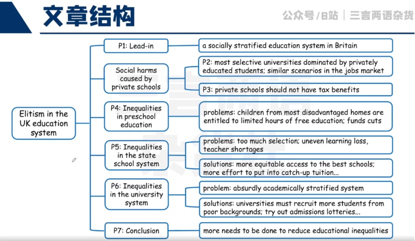

## 一、教育背景词汇

### 学校、学制、招生相关

- private education
- privately educated students
- private school / independent school
- state school (system)
- public school (Britain / US)
- grammar school
- academy
- comprehensive school / comprehensive
- selective university / school
- top-performing school
- early years / childhood education
- private tuition
- school admissions

### 不同家庭背景

- children born to / into privilege

- children from less / disproportionately affluent backgrounds
- children from poorer / low-income backgrounds
- children from (more / most) advantaged / disadvantaged homes

## 二、不平等现象

### 社会不平等现象、社会特权

- socially stratified education system
- elitist country / elitist education system
- privilege / privileged
- social injustice
- uneven learning loss

- The system is academically **stratified to absurd / dangerous levels.**
- a socially stratified education system that **funnels those born to privilege into the highest-status jobs, while holding back** children from disadvantaged backgrounds
- **a bigger attainment gap between** richer and less affluent children in this generation
- In acting as a conveyor belt to the most sought-after jobs, **they shut out other, more able, young people** who lack those advantages.

## **三、改良措施**

- **open up more equitable access to** the country’s best schools
- children from more disadvantaged backgrounds **should be given priority in school admissions**
- **channel far more effort into catch-up tuition** in the wake of the pandemic
- get the best-quality teachers to **schools serving the most disadvantaged areas**
- universities **should be set much more stringent targets to** recruit more students from disadvantaged backgrounds
- **guarantee a place to** the top-performing students at every school
- **experiment with admissions lotteries** for...
- **expand subsidies to cover** all young people

## 四、实用搭配

- be awarded for
- funnel sth. into
- born to / into sth.
- hold back
- cream sb. / sth. off
- make up
- a product of
- go into sth.
- open up
- act as / like sth.
- get access to sth.
- have impact on sth.
- be entitled to sth.
- endow sb. with sth.
- by the back door
- on average

- be channelled into
- in the wake of
- across the board
- in turn
- be opened up to sb.
- experiment with sth.
- be expanded to
- regardless of

## 五、实用句式

### 表类似

- as is / was / does / did...

Two-thirds of the senior judiciary were privately educated as were six out of 10 civil service permanent secretaries.

### 表并列/递进

- This is not a sth. of..., but also of...

This is not a product simply of their raw ability, but also of the vast resources that go into their education.

- Beyond sth. / that…, ...

Beyond that, there is too much selection by postcode; the best-performing comprehensives are least likely to accept children from disadvantaged backgrounds.

## 练习

## 1.教育不平等有哪些表现？

> - 和谁有关
>   - children from high-income / affluent / advantaged backgrounds
>   - children from low-income / poorer / disadvantaged backgrounds
>   - parents
> - 主要体现在哪些方面
>   - grades in exams
>   - private tuition
>   - selective / prestigious / top-performing schools
>   - educational attainment

- ① 家境优渥的学生普遍成绩更好，家境贫困的学生成绩更差
  - Students from affluent backgrounds generally **get high grades in exams** while students from low-income backgrounds **get low grades**.
  - 👇
  - Students from affluent backgrounds generally **attain higher grades in exams than those** from low-income backgrounds.
  - 👇
  - Students from affluent backgrounds generally **outdo** those from low-income backgrounds **in exams**.
  - **添加新信息使句子更长，而不是重复已知信息**

- ① 家境优渥的学生普遍成绩更好，家境贫困的学生成绩更差 为什么？
  - Students from affluent backgrounds generally outdo those from low-income backgrounds in exams because wealthy parents often pay for private tuition to support their children.
  - 👇 **with + n +doing**
  - Students from affluent backgrounds generally outdo those from low-income backgrounds in exams, with wealthy parents often paying for private tuition to support their children.
  - 👇with提前
  - With wealthy parents often paying for private tuition to support their children, students from affluent backgrounds generally outdo those from low-income backgrounds in exams.

- ① 家境优渥的学生普遍成绩更好，家境贫困的学生成绩更差 为什么？导致什么结果？
  - With wealthy parents often paying for private tuition to support their children, students from affluent backgrounds generally outdo those from low-income backgrounds in exams. As a result, the disadvantaged students fail to be admitted to the top-performing schools.
  - 👇**现在分词引导结果状语** with提前也是为了更好的将其串进去
  - With wealthy parents often paying for private tuition to support their children, students from affluent backgrounds generally outdo those from low-income backgrounds in exams, leaving the latter ones unable to be admitted to the top-performing schools.

- ② 家境更好的学生往往能去顶尖大学
  - Students from more advantaged backgrounds are often admitted to prestigious / top-performing universities.
  - 👇**不要一直用同样的主语，可以用被动语态**
  - Top-performing universities are more likely to admit / accept students from more advantaged backgrounds.
  - 👇
  - Top-performing universities are (disproportionately) dominated by students from more advantaged backgrounds.
- ② 家境更好的学生往往能去顶尖学校 有什么影响？
  - Top-performing universities are disproportionately dominated by students from more advantaged backgrounds.
  - 👇添加修饰句子
  - Top-performing universities are disproportionately dominated by students from more advantaged backgrounds, which creates a wider attainment gap between richer and less affluent children.
  - 👇**a wider attainment可以更具体**
  - Top-performing universities are disproportionately dominated by students from more advantaged backgrounds, who, in turn, will get the highly-paid / high-status jobs because of their strong educational backgrounds.

## 2.如何应对教育不平等问题？

> - 谁应该采取行动
>   - universities / schools
>   - the government / the ministry of education / the authorities
> - 采取什么行动
>   - provide equitable access to top-performing schools
>   - guarantee a place to the top-performing students
>   - give priority to children from disadvantaged backgrounds
>   - get best-quality teachers to schools in the most disadvantaged areas
>   - expand/grant subsidies to cover more young people
> - 提建议常见句型
>   - To..., XX should/could...
>   - One solution to sth. / way to address inequalities is to do sth. / that...

- ① 学校应该采取什么行动？
  - To ensure educational equality, prestigious universities should admit more students from less affluent backgrounds.
  - 👇admit --> give priority to 
  - To ensure educational equality, prestigious universities should give priority to students from less affluent backgrounds.
  - 👇by+方法，使句子更饱满
  - To ensure educational equality, prestigious universities should give priority to students from less affluent backgrounds by guaranteeing a place to the top-performing students at schools in disadvantaged areas.

- ②政府应该采取什么行动？

  > 政府一半是强制性措施，给资金等

  - To avoid teacher shortages across the country, the authorities should particularly consider how to send the best-quality teachers to schools in the most disadvantaged areas.
  - One solution to educational inequalities is to grant more subsidies to students from disadvantaged backgrounds.

