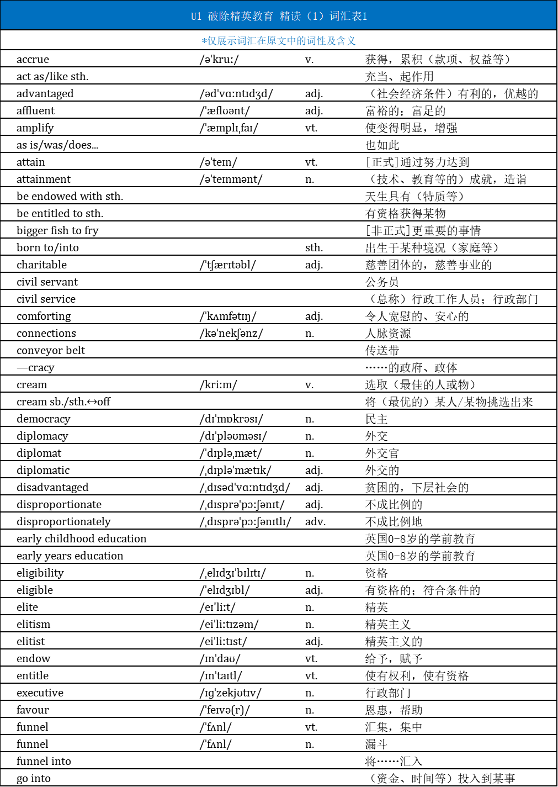

## Title

**The Observer view on radical change being needed to overcome elitism in education**

The Observer 《观察家报》卫报的子报，每周日 

The Guardian 《卫报》

view 和报纸出现的时候表示社论

The FT view 《金融时报》社论

The Post's view 《华盛顿邮报》社论

~~~python
radical
elitism/elite/elitist
~~~

 ## introduction

In acting as a conveyor belt to the most sought-after jobs, many schools shut out more able young people

> sought-after 受欢迎的
>
> seek (after) for 追求某物/找寻某物
>
> Ex.
>
> trump sth. Up --> trumped-up 捏造的
>
> strip sth. down --> stripped-down 精简的

shut sb. out of sth.把某人排除在某物外

act as/like sth. 充当、起作用

conveyor belt 	传送带

 ## paragraph 1

Meritocracy is one of society’s most powerful myths. 

>  meritocracy 任人唯贤，精英管理
>
> - meritocratic 精英管理的
>
> - merit 优秀品质
>
> - -cracy ...的政府、政体
>
> - democracy 民主
>
> - technocracy 技术官僚治国
>
> myth 神话，**错误观点**，迷思
>
> - 比较普遍但是错误的观念
> - urban myth/legend 都市传说

It is comforting to believe we live in a fair world where people are rewarded for a mixture of talent and effort. 

> comforting=reassuring  令人宽慰的，安心的
>
> Where 关系副词，引导的从句有主谓宾，做定语
>
> a mixture of A and B

But Britain remains an elitist country in which a socially stratified education system funnels those born to privilege into the highest-status jobs, while holding back children born to parents who have never benefited from such opportunities.

> in which 引导定语从句
>
> stratified education system 分层的教育体系
>
> funnel A into B 将A汇入B
>
> - n 漏斗
> - v 汇集
>
> hold back 阻止
>
> 主句  Britain remains an elitist country 
>
> 定语从句 stratified education system funnels ... into , holding back ...
>
> 翻译的时候定语句太长，可以将其独立成句

 ## paragraph 2

So Keir Starmer’s pledge to remove the charitable status of private schools, and requiring them to charge VAT on fees, is a welcome move.

- charitable status 慈善
- pledge --serious promise （政府、机构）的承诺
- private school = independent school 私立学校
- state school 公立学校
- public school 美国--公立学校 英国--私立学校

 Just 7% of children attend private schools. Yet privately educated young people make up almost one in three undergraduates at the country’s most selective universities. 

> 只有7%的学生在私立学校学习，但是国家筛选最严格的学校里1/3学生由私立教育的学校培养的。

- VAT = Value Add Tax 增值税
- postgraduate 研究生
- undergraduate 本科生
- selective university 严格筛选的学校

In the jobs market, the figures are even worse: two-thirds of the senior judiciary were privately educated **<u>as</u>** were six out of 10 civil service permanent secretaries, more than half of diplomats and more than four in 10 senior media editors. 

- figure 情况
- judiciary 法官
- civil service permanent secretaries 常务次官

> As is/were ..也如此

This is not a product simply **of** their raw ability, but also **of** the vast resources that **go into** their education, the social connections and favours it opens up and the other forms of cultural capital it endows.

> 两个of并列，两个it指代education

- product 这里翻译成产物
- raw ability 天生能力
- go into 投入
- social connections 人脉资源
- cultural capital 文化资本
- endow 赋予

## paragraph 3

Private schools create social harms. In acting as a conveyor belt to the most sought-after jobs they shut out other, more able, young people who lack those advantages. 

- able 有能力的

They cream young people from disproportionately affluent backgrounds out of the state system, which has a negative impact on attainment for everyone else.

- cream n. 冰淇淋 v.选取
- disproportionately 不成比例的，默认是占多数的那方
- affluent background 富裕背景

 It is wrong in principle that these schools should accrue the tax benefits of charities.

- in principle 原则上
- accrue 累积
- tax benefir 税收优惠

## paragraph 4

 To combat inequality in the education system, there are bigger fish to fry. 

- combat inequality 对抗不平等
- bigger fish to fry 更重要的事

Three- and four-year-olds from some of the most disadvantaged homes – 80% of those in the bottom third of the income distribution – are entitled only to 15 hours of free education a week if their parents do not meet eligibility requirements for more free hours, whereas those that do get access to 30 free hours a week.

> 注意破折号加入的补充说明
>
> 他们中的80%有1/3在收入分配的底层
>
>  whereas those that do
>
> 和上面的不满足做对比，表示有资格的这些人每周有30个免费小时的教育时长

- entailed 有资格的
- eligibility 资格

This is an astonishing social injustice given the impact high-quality early years education can have for children from less affluent backgrounds, amplified by the fact that funding cuts for early years provision have had the sharpest impact on the poorest areas.

- astonishing 令人吃惊的
- injustice 不公
- early years education 早期教育
- Amplify 增强

> 这样的高质量的早期教育（富人都享有）对家境不富足的孩子会产生巨大影响，这样的社会不公令人震惊，更不公的是（amplified by the fact），削减早期教育对最贫困的地区影响最为深刻。

## paragraph 5 

In the state school system, there remains too much selection – both explicit, in the form of grammar schools, and by the back door. 

>Explicit 明显的
>
>by the back door 走后门的

Where they still exist, grammar schools are disproportionately dominated by children from more advantaged backgrounds, with parents often paying for private tuition to support them through the 11-plus. 

- grammar school 公立文化学校，类似中国的重点中学
- be disproportionately dominated by 
- 11-plus 11岁入学考试
- Private tuition 私人教师

Children from low-income backgrounds do worse on average in areas where there is selection at 11. Grammar schools should therefore be abolished. 

Beyond that, there is too much selection by postcode; the best-performing comprehensives are least likely to accept children from disadvantaged backgrounds. 

- postcode 邮政编码--补充：英国邮政可以反映许多地区信息，可以理解为学区房这样的政策
- the best-performing comprehensive 公立综合中学

The Sutton Trust educational charity estimated in 2017 that living near a good comprehensive added about 20% to house prices. 

- Trust 信托
- 类似学区房价格上涨

To open up more equitable access to the country’s best schools, children eligible for the pupil premium – a good indicator of deprivation – should be given priority in school admissions in the same way children in care are. 

- equitable 公正的
- deprivation 贫穷
- in care 由政府照看

> 建议为了抵抗地区的影响，给一些贫困地区孩子读书的指标

Far more effort must be channelled into catch-up tuition in the wake of the pandemic; experts fear that uneven learning loss during Covid-19, with children from poorer backgrounds suffering the most, will mean there is a bigger attainment gap between richer and less affluent children in this generation. 

- channel A into B 将A用于B
- in the wake of （不好的事）随之而来
- uneven  不平整的

And there needs to be far less focus on structural reform – there is no evidence that the government’s academy reforms have done anything to improve standards across the board – and more on how to get the best-quality teachers to schools serving the most disadvantaged areas, to avoid teacher shortages affecting these areas the most.

- Across the board 全面的

## paragraph 6 

The university system in the UK is academically stratified to absurd levels, with a difference of one or two A level grades pushing a young person towards a different institution altogether. 

> 大学也分层，一两个A- level 成绩差就让学生去到完全不一样的学校

This in turn creates a very socially stratified system, in which the institution a young person attends is treated as a shorthand for their employment potential. 

- Shorthand 速记法，代名词

> 大学就直接决定了他们的工作潜能

As a condition of funding, universities should be set much more stringent targets to recruit more students from disadvantaged backgrounds – those eligible for the pupil premium make up just 2% of admissions to the most selective universities, despite being 13% of all young people. 

> condition 先觉条件

Oxford and Cambridge should be opened up to a much more diverse group of students – perhaps by guaranteeing a place to the top-performing students at every school, or by experimenting with admissions lotteries for all those who meet a minimum grade requirement for their subject.

- Oxbridge 牛津剑桥大学
- admissions lotteries 录取博彩--抽取录取名额

The taxpayer subsidy that is channelled to the disproportionately middle-class group of young people who go to university through subsidised loans, around £30,000, should be expanded to cover all young people regardless of the post-18 educational route they choose.

> taxpayer subsidy 纳税人补贴

## paragraph 7

Starmer’s pledge to impose VAT on private school fees is a start. But it could only ever play a limited role in achieving an education system that opens up opportunities to all children, regardless of the circumstances of their birth.

 

