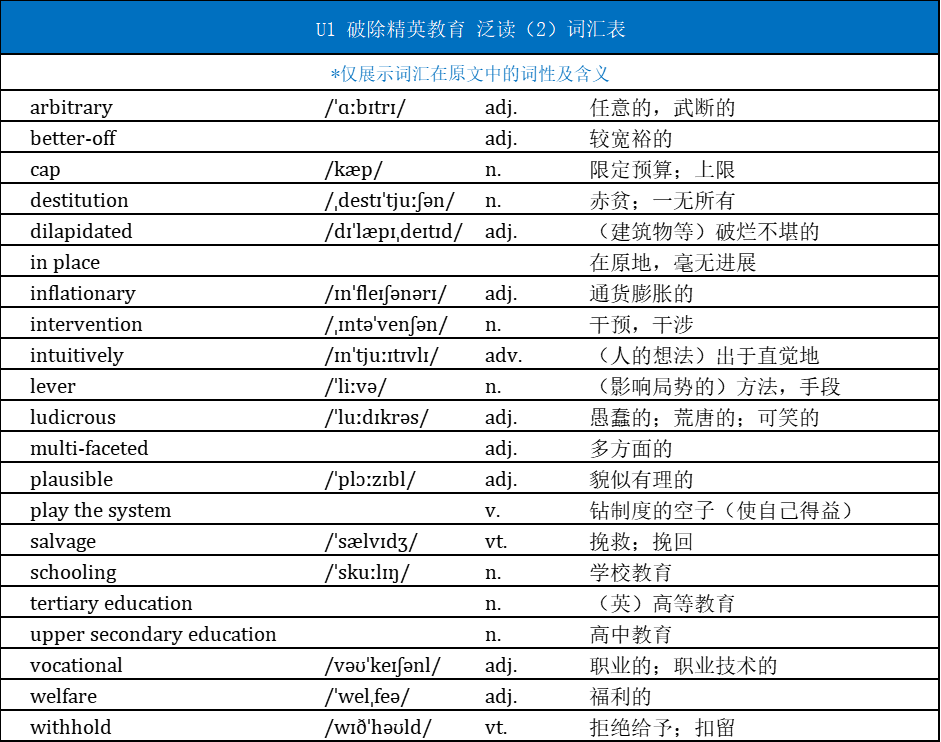

## Title

**The truth is that schools do little to reduce inequality**


 ## Introduction

Education cannot compensate for the failure to implement redistributive social policies

- compensate 弥补
- Redistributive 再分配的


 ## paragraph 1

One casualty of Covid was the UK exam season, which was cancelled for two years due to lockdowns. 

- casualty 受害者


**A-level grades were set** by schools instead, with little external moderation **and**, unsurprisingly, **shot up**, meaning [a lot more young people than usual **found** themselves at highly selective universities. ]

- moderation 对考试给分的审查
- shoot up 迅速增加
- Unsurprisingly  不出意外的

> and 连接 两个谓语动词 were set 和shot up 
>
> found 为宾语从句的谓语动词
>
> a lot more sth. than usual 比以为更多
>
> with 引导的句子为插入语，有两个逗号

This year, the government began the painful job of resetting and deflating the system. 

- deflate 减轻，使下降


Inevitably, that meant more missed university offers, causing angst for students and parents caught up in the mess.

- angst 焦虑，担忧
- catch up 牵扯进，卷入


## paragraph 2

It’s important to remember, though, that the post-Covid **resumption of this annual bunfight** over places at the most selective or “high-tariff” institutions predominantly **affects** only a small portion of society. 

- Resumption 重新开始，继续进行
- bunfight 争吵，激烈辩论
- high-tariff 高门槛的
- predominantly 主要的
- Post-Covid 疫情之后， post-war 战后

> 恢复了每年的争吵，关于名牌大学或高门槛大学的入取，不过只影响了社会的一小部分人


Around five times more **students** from the highest-income quintile **will end up** at these high-tariff universities, with all the future benefits that brings, than **will make it** from the lowest income one.

-  quintile 五分之一

- > 收入五分位组（income quintile）是社会统计学中的一个概念。研究者将所有人的人均可支配收入按从高到低的顺序排列，平均分为五个等分，处于最高20%的收入群体为高收入组，处于最低20%的收入群体为低收入组。
  >
  > 后缀-ile常见于统计学词汇中，比如quartile“四分位数”、decile“十分位数”、percentile“百分位数”等

```python
five times 五倍
students from highest-incom quintile(收入前20%) 和 the lowest income one（收入后20%） 比较，前者完成高门槛大学的是后者的5倍
# 使用的结构
five times more A will do sth. than B will do sth.
```


## paragraph 3

A comprehensive overview from the Institute for Fiscal Studies earlier this month showed just how embedded social inequality is in the education system. 

- comprehensive overview （全面的概述）综述

- embedded 根深蒂固的

- > 财政研究所（Institute for Fiscal Studies）是专门研究英国的税收和公共政策的一所经济研究所，总部设在英国伦敦。他们通过研究帮助政策制定者了解政策对个人、家庭和企业的影响。


There has been virtually no change in the school “disadvantage gap” between children on free school meals and their peers in the past 20 years. 

- > 免费校餐（free school meal）是英国政府为家境困难的孩子提供的校餐，是判断孩子家境的一个指标。
  >
  > 劣势差距（disadvantage gap）是指贫困学生和比他们更富裕的同龄人之间的成绩差距。这是英格兰政府衡量教育不平等程度的一个指标。


The belief that education can somehow “fix” inequality seems unfounded.

- unfounded 无事实根据的


## paragraph 4

That doesn’t mean education policymakers shouldn’t consider inequality in their decisions. 


It’s certainly possible to make society even less fair by making it easier to buy access to premium institutions. 

- premium 优质的；高端的


We can see this in the remaining parts of the UK with grammar schools, which are dominated by the children of parents who can afford tutors, and where those from low income families do particularly poorly.

- tutor 家庭教师、私人教师
- do particularly poorly 成绩表现差

 

## paragraph 5

Moreover, as the IFS point out, t**he funding system** for English schools **has become** significantly less progressive over the past decade and **the adult skills system is a mess**, all of which makes it harder to mitigate inequalities.

-  progressive 进步的，先进的，开明的
- mitigate 减轻，缓和


Austerity has also taken its toll: the financial gap between private and state schools has doubled since 2010. 

- austerity （政府开支的）紧缩，缩减
- take its toll 造成损害


But even if **there was**, as there should be, **an entirely comprehensive system,** funded at a substantially higher level, it would not come close to fixing inequality.

- substantially 非常地，巨大地

 

## paragraph 6

For a start, in a free, liberal society **it is not possible or desirable to prevent parents doing whatever they can to support their children**, and **inevitably those with more resources will find ways to play the system and gain** advantage. 

- play the system 钻制度的空子（使自己得益）

> in a free,liberal society 做状语，表示在XX环境下
>
> and 连接两个情景 


It’s also the case that any improvement in state schools will benefit all pupils, rich and poor. 

- case 事例
- Pupil  学生数量


Overall, the school system has got better over the past few decades, but the disadvantage gap has stayed the same.


We can hardly expect schools deliberately to withhold support from better-off students.

- withhold  拒绝给予；扣留
- better-off 较宽裕的


## paragraph 7

Politicians, from all parties, love the idea that education is the answer to inequality. 

> education is the answer to inequality


It’s intuitively plausible, appeals to those who see personal merit and hard work as the primary cause for differences in wealth, and avoids having to talk about the real problems. 

- intuitively 直觉上
- plausible 貌似合理的

> it 代指上一句的education is the answer to inequality
>
> 评价1: intuitively plausible
>
> 评价2: appeals to those （see sth. as sth. 把什么视作什么）
>
> 评价3: avoid the real problems


**But the reality is that states can only meaningfully reduce inequality** by providing substantial financial support to those who need it, through either the welfare system or labour market interventions. 

- welfare system 社会福利系统
- labour market  劳动力市场
- intervention 干预


The most equal countries in the world are not those with the best education systems but those with more redistributive social policies.

- redistributive social policies 社会再分配政策

 

## paragraph 8

At the moment, financial support in England is getting less generous. 

> less generous


Arbitrary benefits caps introduced by the government in 2016 are combining with an inflationary crisis to push ever more people into very deep poverty and destitution.

- arbitrary adj. 任意的，武断的
- cap 预算上限
- inflationary 通货膨胀的
- destitution 赤贫，一无所有

> 武断的福利上限结合通货膨胀危机，让更多的人陷入赤贫
>
>  deep poverty and destitution 一起表示赤贫


 It is ludicrous to expect schools to salvage a situation in which children are going hungry and cold in overcrowded, dilapidated housing. 

- luducrous 愚蠢的；荒唐的；可笑的
- salvage 挽救；挽回
- dilapidate （建筑物等）破烂不堪的


If, as a society, we genuinely care about reducing poverty, we have some obvious levers to pull that we are choosing to leave untouched.

- genuinely 真正地
- Lever（影响局势的）方法，手段

> choosing to leave untouched 选择置之不理

 

## paragraph 9

None of this means that education is not vital to society and the economy. 

- vital 至关重要的

> None + not 双重否定表肯定
>
> 教育对社会和经济还是很重要的


Under-investment, particularly in upper secondary and tertiary vocational education, is one cause of the UK’s multi-faceted productivity challenge. 

- upper secondary education 高中教育
- tertiary educationn（英）高等教育
- vocational  职业的；职业技术的
- multi-faceted  多方面的

> 教育投资不足给英国的生产力带来多方挑战


A better-educated citizenship is a noble goal that brings many benefits to a society. 

- citizenship 公民身份


But, once a country has moved past full access to schooling, **education will do little to reduce inequality** if all the main drivers of that inequality are left in place. 

- schooling 学校教育
- in place 在原地

> once 引导让步状语从句


Pretending it can do so is preventing us from acknowledging what really needs to change.

 