# Title

**Why Are People Weird About Only Children?**

- weird 奇怪的，不寻常的
- Get/be weird about it 对某事表现怪异 （多用与口语）
- only children 独生子女

 ## introduction

“Onlies” don’t seem to be any worse off than kids with siblings. So why do stereotypes about them persist?

- only-onlies = only children 
- silblings 兄弟姐妹
- worse off 情况更糟的
- better off 情况更好的
- Stereotype  刻板印象
- stereotype of/about
- Persist 持续存在

> 为什么会存在偏差呢？

## para 1

When I was a child, my lack of siblings was often a source of bewildered concern. Don’t you get lonely? people would ask. But as I grew up, sympathy was overtaken by suspicion. You’re such an only child became a recurring mantra, whether I’d asserted a strong opinion or played sick to avoid dodgeball. 

- a source of 
- bewildered 困惑的，不知所措的
- concern 忧虑
- sympathy 同情 syn- 同步
- empathy 共鸣
- overtake 超越
- suspicion 怀疑
- recurring 反复出现的
- mantra 惹人厌的老话
- assert 坚称
- paly sick 装病
- dodgeball 躲避球游戏

> "我"是独生子-别人问我是否孤独-长大之后再次回忆-
>
> sympathy was overtaken by suspicion 怀疑超过同情，
>
> （1.可以理解为别人怀疑我的性格而不是同情？？2.或者是我怀疑这个事实的正当性而不接受同情？？）
>
> > 随着长大，别人对我的怀疑超过了同情✅
>
> whether 是否
>
> （我是否是有强大的观念还是只是害怕而去逃避这个话题？）

In the cultural consciousness, only children are frequently pegged as weirdos: maladjusted, selfish, spoiled, uncompromising, or just unusually precocious. We are at once pitied for our sibling-less childhood and judged for the supposed eccentricities it left us with.

- peg 对。。形成固定看法，归类
- peg sb. as sth. 把某人单作。。
- weirdon 怪人
- maladjusted 不适应社会环境的
  - mal- 坏的
  - well adjusted 完全适应环境的
- uncompromising 不妥协的，强硬的
- precocious 早熟的
- at once 立刻
- pity 同情，怜悯
- supposed 假定的
- eccentricity （可数）怪癖；（不可数）古怪行为

> 文化偏见的共识，独生子女性格古怪
>
> it left us with. 
>
> it 指代sibling-less childhood 
>
> with+eccentricities

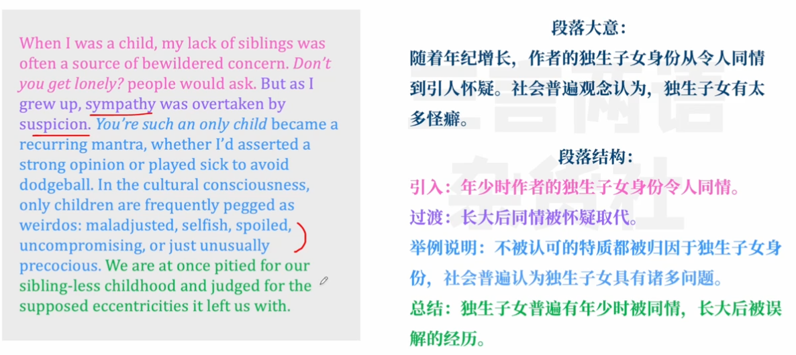

##  para 2

Research doesn’t support the idea that only children are any worse off than those with siblings, but kids as young as 8 have still been found to hold prejudices against only kids. 

- prejudice against sb. 对某人的偏见

> 八岁孩子对独生子女有偏见

You can hardly blame them: That bias is woven right into our lexicon. The moniker “only child”—rather than, say, “solo” or “individual” child—suggests a sense of deprivation. It’s one consonant away from “lonely child.” Where does this weirdness about only children come from?

- bias 偏见
- bias against/towards/in favor of 针对/偏袒/支持...的偏见
- weave 使组合成
- be woven into 融入
- lexicon 某一个学科、个人或群体的全部词汇 --可以用于表示我们认知体系里面所说的那些东西
- Moniker 名字，绰号
- deprivation 丧失，缺乏
- deprivation of sth.
- consonant 辅音
- vowel 元音

> 固有偏见是怎么来的呢
>
> 使用的绰号是 only children 而不是solo ,indicidual，only就意味着缺失的感觉
>
> lonely 和only 就只差一个辅音了！

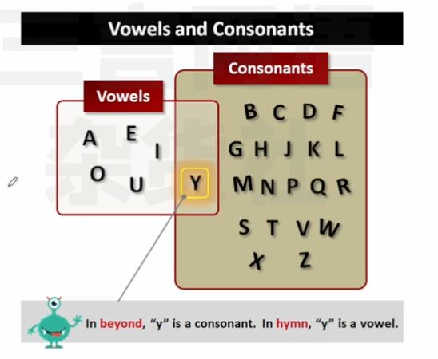

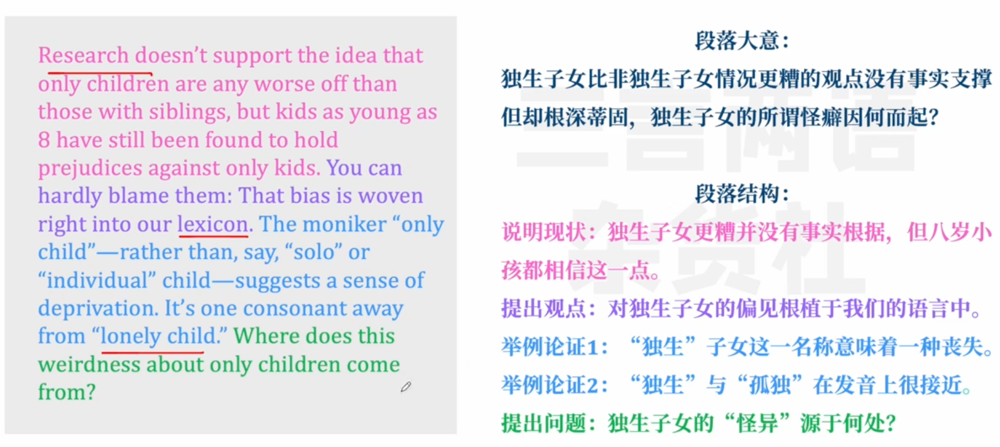

 ## para 3

The mythic persona of the only child can be traced back as far as 1896, when a Clark University fellow named E. W. Bohannon conducted a study of “Peculiar and Exceptional Children.” 

- mythic = mythical，fictitious 虚构的
- persona 表面形象
- trace 追溯
- trace sth. back to 某事可追溯到
- fellow 学术团体成员；（本文）**研究员**，研究生，大学董事
- peculiar 奇怪的
- exceptional 不寻常的，特殊的 👇
- exceptional 优异的=outstanding 👆

> 偏见可以追溯到1896

After observing more than 1,000 children, he declared of the 46 onlies, “They have imaginary companions, do not go to school regularly, if at all, do not get along with other children well, as a rule, and are generally spoiled by indulgence.” 

- imaginary 想象中的
- companion 朋友，同伴
- 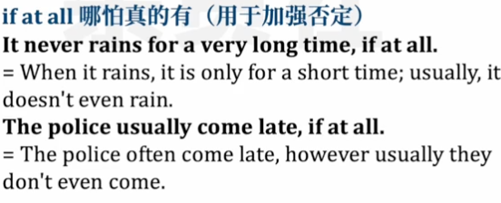
- as a rule 通常，一般来说
- Indulgence 纵容，放任
- self-indulgence  自我放纵
- Self-indulgent 自我放纵的

> 观察1000个小孩后，得出他们不爱和其他孩子打交道，而是幻想虚拟的伙伴，但是只有46个独生子女

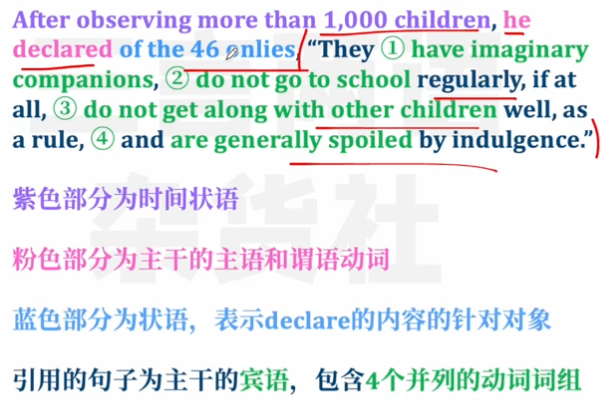

Notably, many of his subjects lived in isolated farmhouses, where they worked long hours; it made sense, then, that kids with siblings would be better-adjusted than those who hardly interacted with other children at all.

- notably 尤其 =especially， in particular
- subject 研究对象 
- isolated 偏僻的=remote
- farmhouse 农舍
- Better-adjusted 适应得更好

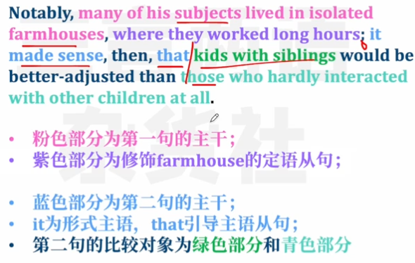

> 离异家庭的影响 ✖️
>
> 研究对象来自偏远农舍，这就使这个观点说得通了，作者质疑这个研究员的研究对象不具有普遍性。

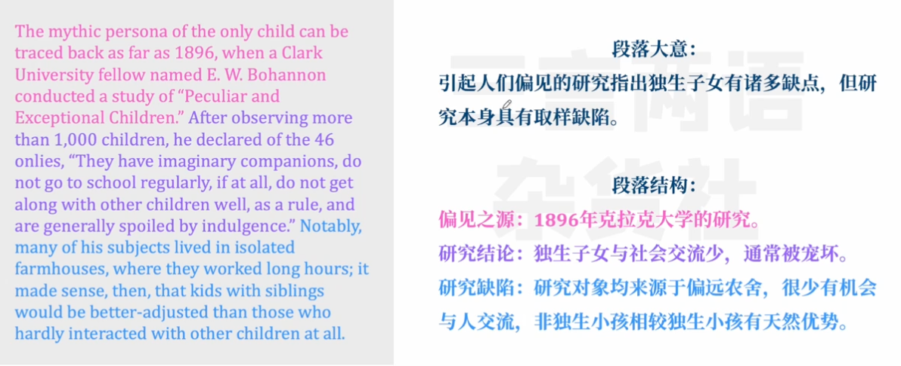

## para4 

Depictions of onlies in movies, TV, and literature haven’t helped our case. **Eloise**, the children’s-book character who lives at the Plaza Hotel, and **Veruca Salt**, who’s tossed into the garbage chute at Willy Wonka’s Chocolate Factory, **are both spoiled brats.**

- depiction 描述。刻画=description
- case 状况，情形
- toss 扔，抛
- garbage chute 垃圾槽
- spoiled brats 被宠坏的孩子

> 电视剧刻画独生子女不好的形象 spoiled brats

Hermione Granger is the annoying know-it-all of the Harry Potter series. Indeed, being an only child is regularly used to convey otherness, whether exceptionally bad or good.

- Know-it-all  自以为无所不知的
- otherness 相异性、

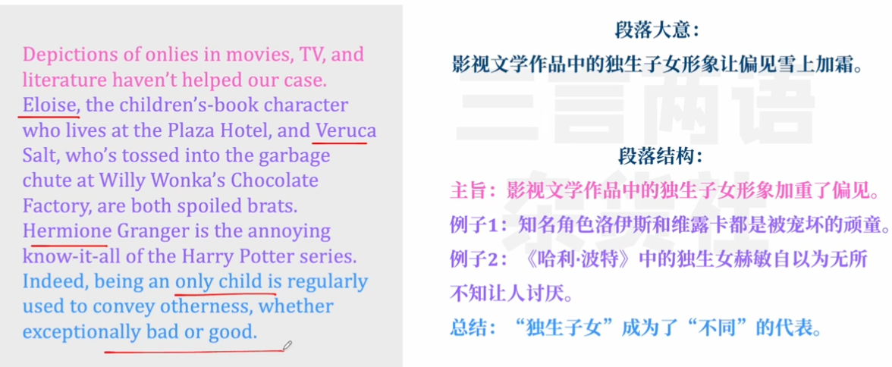

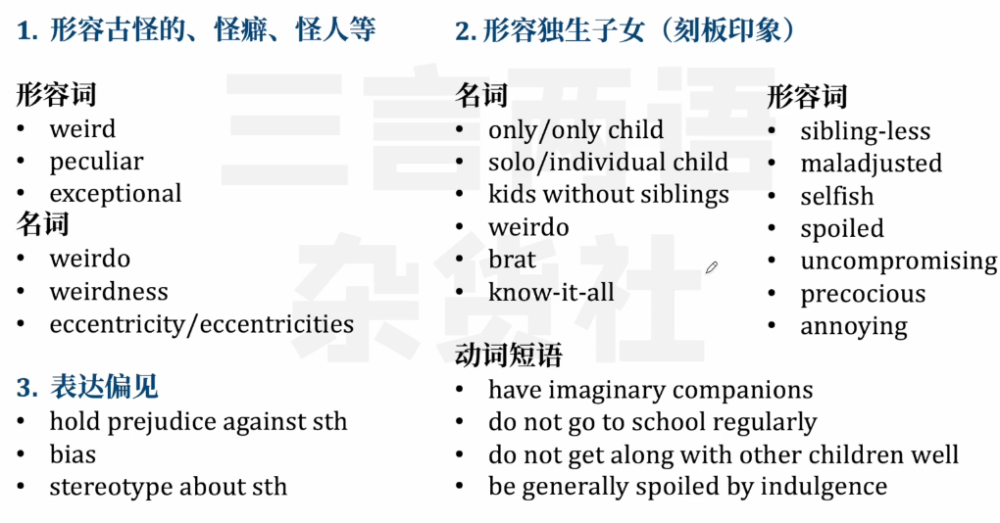

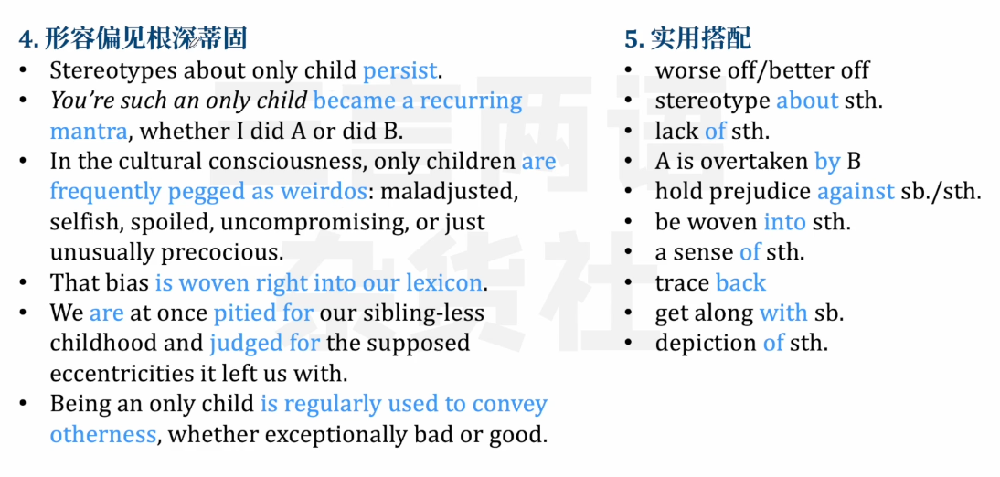

 ## para 5

Today, only children are much more common than they’ve been in the past. Our World in Data reports that the average number of births per American woman shrank from 3.6 in 1957 to 1.7 in 2021. 

> 出生率是下降的

According to Toni Falbo, who researches only children, financial considerations and career ambitions may take precedence over having multiple children—especially now, with record-high student-loan debt and child-care costs. 

> 一个孩子的在金融条件和职业上面都有更好的优势

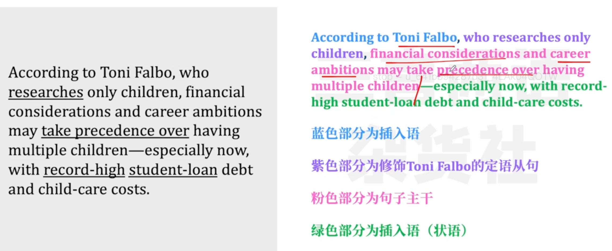

Women are also having a child later in life than ever before, leaving less time to do it again. Still, Falbo believes that onlies agitate people’s understanding of what a family should look like.

> 现在女性生孩子时间越来越晚了
>
> - agitate 使不安

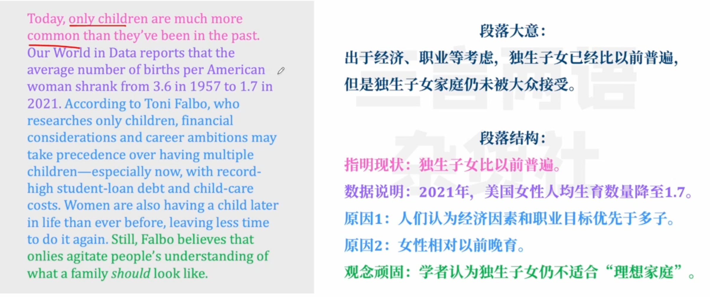

 ## para 6

Of course, sibling relationships can be rich and formative; maybe some people can’t imagine growing up without a built-in playmate and confidant. 

> 当然，兄弟姐妹也很重要

But other relationships can fulfill these functions—and perhaps without the typical sibling conflicts and competitiveness. Research shows that only children tend to be closer to their parents and to regard them with more warmth and respect than people with siblings do. 

> 其他除兄弟姐妹的关系也很重要，独生子女在这方面有优势-如和父母更亲近

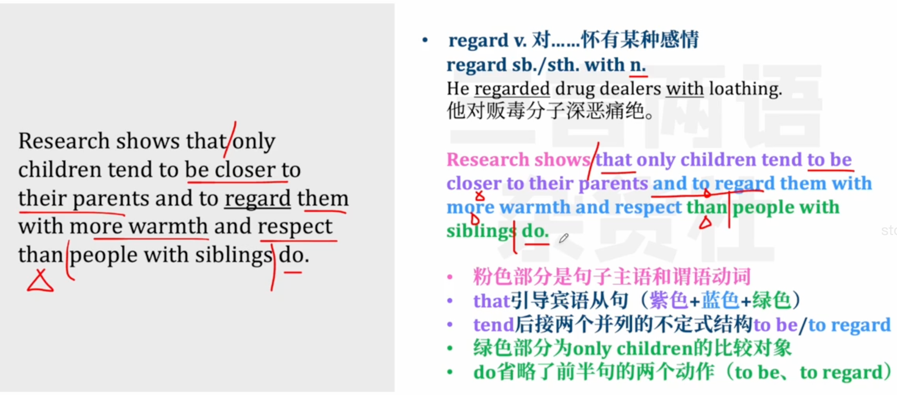

They may feel more at ease interacting with teachers, probably because they speak mostly with adults at home. And unlike Bohannon’s junior farmers, kids today spend most of their waking hours with peers, at school and during playdates and extracurriculars.

> 更好的和大人交流，如老师

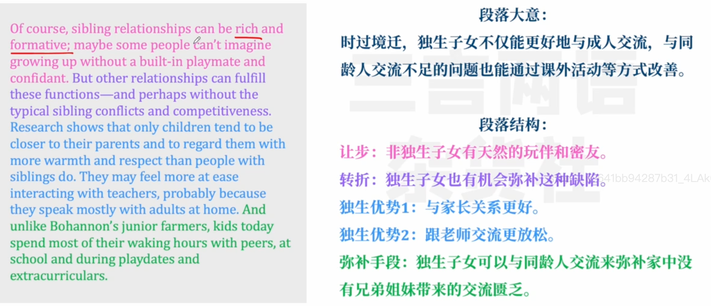

 ## para 7

Indeed, most contemporary studies don’t find any notable disadvantages for only children. Onlies actually tend to have higher intelligence-test scores and more ambitious educational goals—perhaps in part because they face less competition for their parents’ emotional and financial resources.

> 没有明显的研究证明独生子女有哪些劣势，他们甚至能在学习测试上有更高的分数

But these advantages seem to even out in adulthood. According to a National Institute of Child Health and Human Development study, only children and children with siblings ultimately have the same employment rates, marriage outcomes, levels of mobility, and average number of kids.

> 不过事实是独生子女和有兄弟姐妹的人在各种社会表现上没有明显的差距

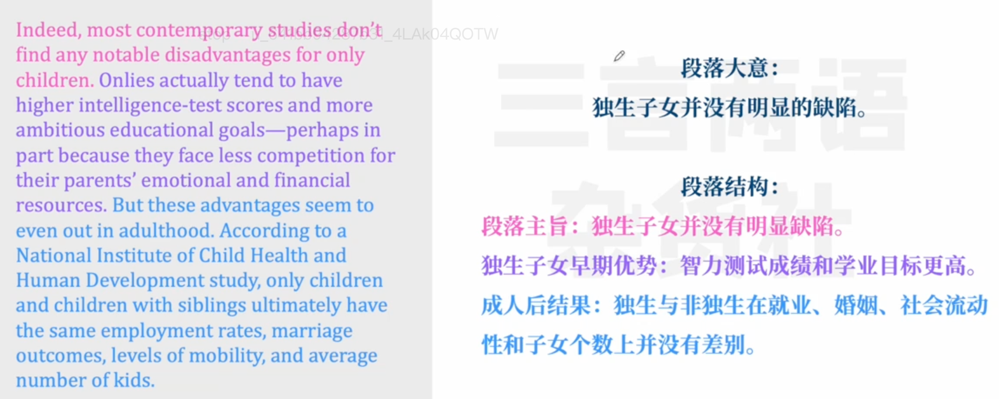

 ## para 8

The one trait that might separate them is sociability. A longitudinal study—for which more than 400,000 teenagers were interviewed in 1960, and again one, five, and 11 years after they graduated from high school or were supposed to—concluded that onlies are more interested in solitude and less likely to join group activities.

> 做了一个实验，证明独生子女更喜欢独处

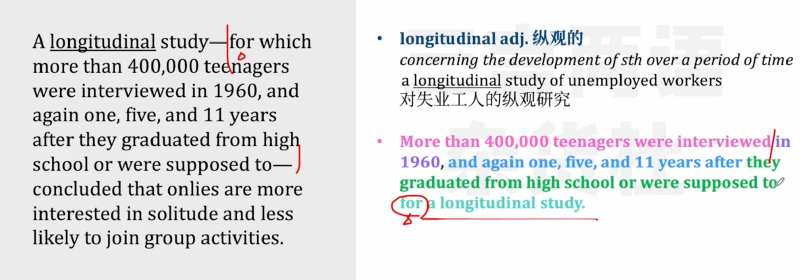

(As a kid, I spent long hours every summer tearing through Scholastic-book-fair hauls, thinking I was in the best possible company among fictional characters, unaware that I was tanking my sociability score.)

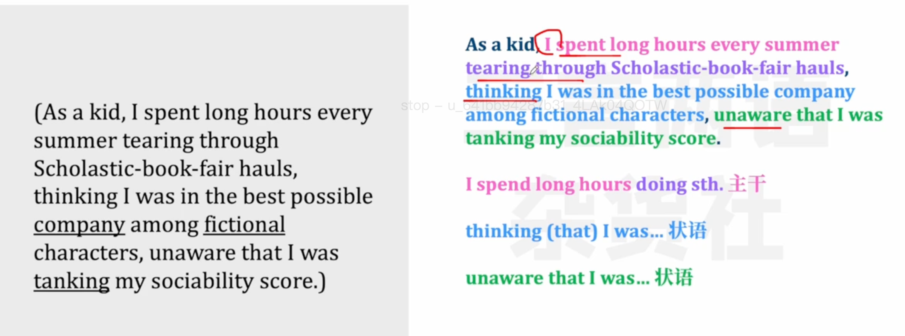

And in 2016, researchers in China took MRI brain scans and found that, compared with kids with siblings, onlies showed greater flexibility—a measurement of creativity—but lower agreeableness.

> 中国的一个实验证明独生子女更灵活但是不那么有亲和力

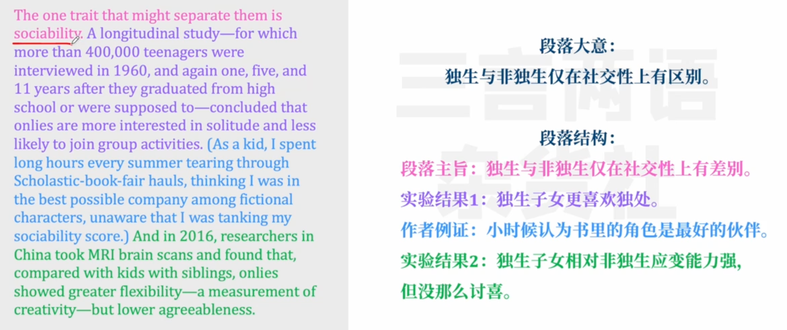

 ## para 9

Then again, it’s possible that onlies tend to be less sociable because the culture doesn’t embrace them. That’s generally the issue with studying only children: It’s tough to distinguish inherent only-child qualities from those that develop in a sibling-centric world. 

> less sociable

Bohannon’s stereotype has stuck to the culture like gum to a shoe, and as an only, I’ve spent years trying to pick it off. I wrote this entire essay arguing that only children aren’t self-obsessed or lacking in social skills. 

> 改变偏见

But now that I’ve reached the end, I’m not sure whether I’ve proved that idea or undermined it. Detailing how normal only children are is, perhaps, exactly what an only child would do.

> 事实只有only-child知道

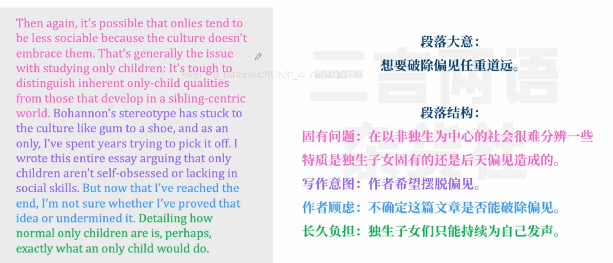

## 表达

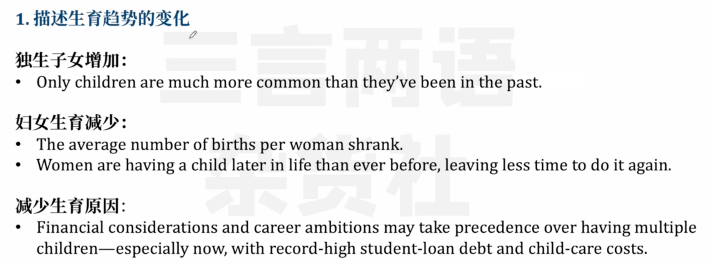

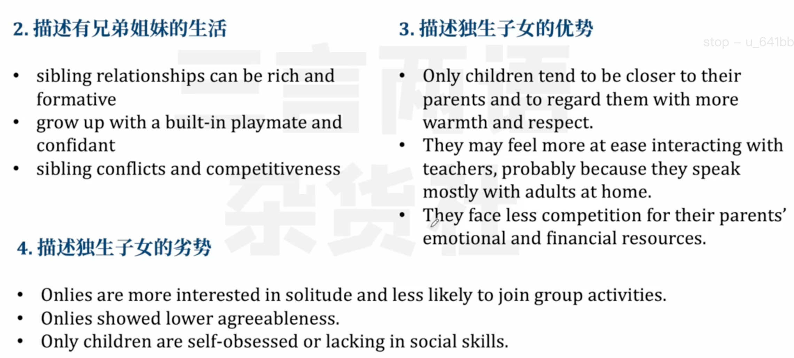

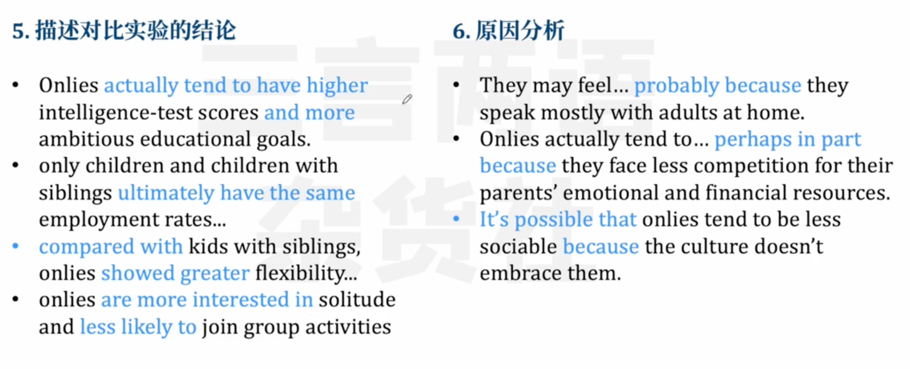