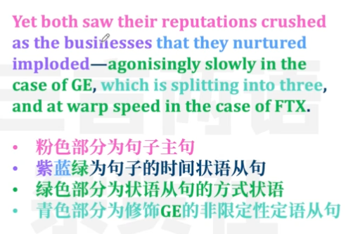

**From GE to FTX, beware the Icarus complex**

- General Electric 通用电气公司
- FTX公司（加密货币交易所）
- beware 担心，小心 beware of sth./sb.
- lcarus complex 伊卡洛斯情结 -过大野心的人容易失败
- complex (心理学)情结
  - inferiority complex 自卑情结
  - Electra complex 恋父情结
  - Oedipus complex 恋母情结

The guardians of American capitalism too often fall for too-good-to-be-true narratives

- too-good-to-be-true 好的让人难以置信的
- narrative 故事

 

## 1

It is hard to think of two more different firms than GE, a once-exalted symbol of American inventiveness, and FTX, a Bahamas-based fly-by-night crypto exchange. 

- exalted 地位高的
  - exalt 赞扬
- Inventiveness 创造力
- Fly-by-night 不可靠的，唯利是图的
- crypto exchange 加密货币交易所

Besides high-pitched voices, it is hard to think of two people with less in common than the late Jack Welch, GE’s legendary former CEO, and Sam Bankman-Fried, FTX’s disgraced founder. 

- High-pitched 尖声的，声调高的
- Low-pitched 声音低沉的
- late 已故的
- disgraced 丢脸的
  - disgrace 耻辱

The former, son of working-class parents, was fiendishly competitive about profits, had a frat-boy approach to life, and was as much at home on a golf course as he was on the factory floor. 

- fiendishly 极其地
- frat-boy （美国兄弟会男孩般）吵闹
  - frat = fraternity 美国兄弟会
- be/feel at home 舒适自在，不拘束
- a golf course 高尔夫球场
- the factory floor 工厂车间

The latter, son of Stanford law professors, is scruffy, nerdy, a player of “League of Legends”, and claims to be motivated to make money only so that he can give it away.

- scruffy 糟蹋的 = shabby 衣衫褴褛的
- nerdy （尤指男子）愚蠢的
- nerd 书呆子
- League of Legends 英雄联盟
- Effective Altruism 有效利他主义

## 2

Both men share the experience of having been considered the corporate messiahs of their generations. 

- corporate 公司的
- corporation 大公司
- messiah 救星=the Messiah = Christ
- Savior  救世主

Welch was hailed as the greatest CEO of the 20th century.

- hail 赞扬
  - hail sb./sth. As sth.称赞某人某事为...
- CEO = Chief Executive Officer
  - C-suite/C-level 所有的首席
  - CFO 首席财务官
  - COO 首席运营官
  - CIO 首席信息官

The 30-year-old Mr Bankman-Fried wore a halo of sorts on his mop-haired head not just for trying to bring a semblance of respectability to the chaos of crypto, but for appearing to do it to promote the greater good of humanity. 

- halo （圣人、天使头上的）光环
- halo effect 光环效应
- of sort 勉强算的= of a sort
- -haired ...头发的
  - mop 蓬松凌乱的头发
  - Long-haired 长发的
  - dark-haired 黑发的
- Semblance 假象
  - a/some semblance of
- resemblance 相似
  - Simil- 相似
  - Similar 相似的
- Respectability 体面
  - respectable 体面的
- the greater good （需要牺牲换来的）更大的利益

Yet both saw their reputations crushed as the businesses that they nurtured imploded—agonisingly slowly in the case of GE, which is splitting into three, and at warp speed in the case of FTX. 

- nurture 发展，孕育（计划等）
- implode （组织或系统）崩溃，瓦解
  - explode
  - implicit
  - explicit
- agonisingly 及其痛苦地
  - Agonising 令人痛苦的
  - Anony 极大的痛苦
- in the case of 就某事而言
- Warp speed 极高速
  - warp （靠扭曲时空实现的）太空旅行

You could call it the Icarus complex. They both flew too close to the sun. But where was Daedalus?

- Daedalus （希腊神话人物）代达罗斯

Why do the self-interested stewards of American capitalism—Wall Street, venture capitalists, investors, the business press—so often fall victim to too-good-to-be-true corporate narratives?

- self-interested 自私自利的
- self- + n./v-ed/v-ing 自身的，独自的
  - Self-destruction 自我毁灭
  - self-induced 自我导致的
- steward 财产管理者
- capitalism 资本
  - venture capitalist  风险投资者
  - venture capital  风险资本
- the press 报刊，杂志
  - the national/local press 地方/全球报刊
  - The music/sporting press 音乐/体育报刊
- fall victim to sth. 成为某事的受害者

 ## 3

Read “Power Failure”, William Cohan’s 800-page extravaganza on the firm founded in 1892 as the General Electric Company, and it is instantly clear how important brilliant people are to business success—and how their brilliance can become a dangerous vulnerability. 

- power failure 停电，断电
- extravaganza 巨作，铺张华丽的娱乐表演
- a book on sth. 关于某事的书
- brilliance 非凡的才能，才华
- brilliant 聪颖的
- vulnerability 脆弱性，弱点
- vulnerable 脆弱的

GE had not only the inventor, Thomas Edison, to thank for its start in life; Charles Coffin, a visionary businessman, set it on the path to lasting greatness. 

- start 有利形势，有利条件
- visionary 有远见的，有眼光的
- vision 远见卓识
- set sth. on the path to 将某事领上...的道路

Welch, who took over as CEO in 1981, stood on a similar pedestal. 

- pedestal 雕像的底座
- put/place sb. on a pedestal 崇拜某人
- knock sb. off a pedestal 讲某人赶下神坛

 

The author describes in beautifully reported detail Welch’s mastery of the chemistry behind GE’s products, such as plastics, as well as his abilities as a leader to cajole, charm, party with and, yes, annihilate staff. 

> describe + 直接描述的内容 
>
> in detail 

- mastery 精通
- Cajole 哄骗、劝诱 = coax
- cajole/coax sb. into doing sth.
- party 玩乐
- annihilate 毁灭
  - nihil- 无，没有
  - nihilism 虚无主义

From the point of view of profits, it worked. Under him GE achieved quarter after quarter of earnings growth and a market value that grew from $12bn in 1981 to $400bn when he stepped down in 2001.

- market value 市值
- market capitalisation (market cap)
- step down 辞职，下台 = step aside

## 4

But such success inevitably over-seduces investors.

- over-seduce 过度引诱，过度吸引
- seduce v.引诱
- over-+adj./v./n. 过分。。。
  - overanxious 过度焦虑的
  - overpopulation 人口过多

No one, apart from short-sellers, has an interest in peering through the hype.

- short-seller 做空者
- short-selling/selling short/shorting n.做空
- Short-sell/short v.做空
- peer v. 盯着看，凝视
  - Peer through/into 凝视
- hype 炒作
  - hype up sth. 炒作某物
  - Much-hyped 广受吹捧的

Under Welch, GE’s mythology—and no doubt M&A fees —meant that Wall Street mostly turned a blind eye to the growing role GE Capital, an unregulated bank, played in enabling the firm to meet its “stretch” profit targets. 

- mythology 错误的信念
- myth n.错误的观念
- M&A并购
  - mergers and acquisitions
  - merger n. 并购
  - acquisition 收购
- trun a blind eye to 对。。。视而不见，熟视无睹
- GE Capital 通用电气资本
- stretch n. (肢体的)伸展、张开

Under Jeff Immelt, his successor, its size became an Achilles heel.

- Achilles heel n. 阿喀琉斯的脚踝，致命弱点

## 5

Likewise Mr Bankman-Fried, whose net worth reached $26bn at its peak, played the iconoclastic whizz kid and raised almost $2bn from investors.

- net worth 净资产
- at sth's peak 达到某物的巅峰
- play 假装
- iconoclastic 有悖传统信仰的
- iconoclasm 对传统（习俗、思想）的否认
- icon 偶像，圣象
- whizz kid 神通

All appear to have been blindsided by the disastrous relationship between FTX and Alameda Research, his trading firm.

- all 代指投资者
- blindside 使。。。措手不及
- be blindsided by

Even now its founder continues to act casually. *The New York Times* reports that since FTX’s collapse, he is unwinding by playing video games. 

- The New York Times 《纽约时报》
- unwind 放松
- wind 给机器上发条

Perhaps this is multitasking 3.0: blowing enemies to bits while blowing fortunes to smithereens.

- multitasking 同时执行多项任务
- web 3.0 币圈，元宇宙等等
- blow sth. to smithereens 把。。。炸成碎片
- smithereens 碎片

## 6

Such spectacular failures are more likely in finance because shuffling money around is a confidence game. 

- spectacular 惊人的
- shuffle 将...移来移去
- shuffle sth. around 
- confidence game （骗钱的）骗局 = confidence trick

But in the case of GE, as Mr Immelt sought to wind down the firm’s dependence on GE Capital, he is also accused of bungling the acquisition of the power business of Alstom, a French rival, which brought his firm closer to the brink. 

- Wind down (活动，强度或规模)逐渐减小
- bungle （因出错或手脚笨拙）把...搞砸
- brink n. （尤指不好的事件、状态等的）边缘
  - pull sth. Back from the brink of sth. 把某物从某物的边缘拯救回来

It is a reminder that industrial businesses can also hide danger—and that it’s worth peering under the bonnet even of makers of adored products, such as Teslas and iPhones.

- bonnet 引擎盖
- look under the bonnet  仔细检查
- look under the hood 

## 7

Hagiographies in the financial press add to the risks.

- hagiography 吹捧性的传记
- financial press 财经媒体

 Like a modern-day Welch, Mr Bankman-Fried graced the covers of both *Forbes* and *Fortune* in less than a year. 

- modern-day 现代版的
- grace 为...增色
- Forbes 《福布斯》
- Fortune 《财富》
- Fortune 500 财富500强公司

Mr Cohan relates how Welch crafted his own media image, too. 

- relate 叙述，讲述
- craft 精心打造

Not only did he develop close relationships with the journalists who covered GE. He had a “catch-and-kill” approach to problematic stories.

- cover 报道
- catch-and-kill 一般不会发布这个报道
  - hush money 封口费

One former *Wall Street Journal* reporter, who wrote a book on the underside of Welch’s tenure at GE, was so bruised by the experience that he turned to God.

- Wall Street Journal 《华尔街日报》
- underside （事物的）阴暗面
- tenure （重要职务的）任期
- bruised （情感上）受伤害的
- turn to God 信仰上帝

## 8

And yet the truth is, for all their hubris, some business titans are in a league of their own, which is why it is so hard for investors to be dispassionate. 

- for all = despite 尽管
- hubris 傲慢，自大
- titan 泰坦，巨子，伟人
-  in a league of one's own 做得比任何人都好
- dispassionate 不动感情的，不带偏见的

Welch’s reputation may have cratered, but a thoughtful book like Mr Cohan’s suggests that in the long run he will be vindicated. 

- crater 急剧下滑
- vindicate 证明...正确

As one executive puts it, most of his decisions were the right ones. For now, Mr Bankman-Fried’s name is in the dirt.

- put 说，表达

Perhaps a forthcoming tome being pitched by Michael Lewis, author of “The Big Short”, will reveal what caused the house of cards to fall. 

- forthcoming 即将到来的
- tome （有学术价值的）巨著，大部头
- pitch 推销，宣传

- The Big Short 《大空头》
- a house of cards 脆弱的组织

But why weren’t investors, whose money was on the line, the keenest of all to get the inside story?

-  on the line 处于危险之中 = at risk
- inside （组织或团体）内部的

