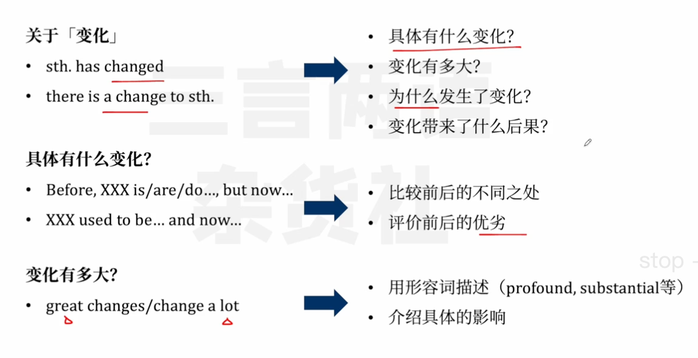

## 精读

**The Culture Wars Look Different on Wikipedia**

 

The site is tackling more controversial edits, the results of which can reverberate across the internet.

 

For more than 15 years, Wikipedia discussed what to call the third child of Ernest Hemingway, a doctor who was born and wrote books as Gregory, later lived as Gloria after undergoing gender-affirming surgery, and, when arrested for public disorderliness late in life, used a third name, Vanessa. Last year, editors on the site finally settled the question: The Gregory Hemingway article was deleted, and its contents were moved to a new one for Gloria Hemingway. This would be her name going forward, and she/her would be her pronouns.

 

Wikipedia’s billions of facts, rendered as dry prose in millions of articles, help us understand the world. They are largely the brain behind Siri and Alexa. They have been integrated as official fact-checks on conspiracy-theory YouTube videos. They helped train ChatGPT. So, unsurprisingly, when you search Google for “Gregory Hemingway,” it follows Wikipedia’s lead: You are told about Gloria instead.

 

In Wikipedia’s early days, the question of what to call Gloria Hemingway would have been treated as a quick mission to locate a fact in established publications such as The New York Times. Joseph Reagle, a Wikipedia expert at Northeastern University, told me the site has an inherent “conservatism,” faithfully reporting whatever secondary sources say about a subject.

But in recent years, something has begun to change. Wikipedia’s editors are no longer simply citing dated sources; instead, they are hashing out how someone would want to be understood. But even though these deliberations touch on some of the most controversial issues around—and reach conclusions that reverberate far beyond Wikipedia’s pages—they are shockingly civil and thoughtful for the internet today.

 

The breakthrough idea of Wikipedia was supposed to be its biggest vulnerability. “The encyclopedia anyone can edit” threw open the gates to whoever had something to contribute, turning Wikipedia into one of the most visited websites on the internet. But who was to trust something “anyone” may have written? The site definitely has inaccuracies; any student working on a research project has gotten a spiel about how Wikipedia will lead them astray. 

Of course, only a tiny percentage of Wikipedia’s visitors actually take up the offer to contribute. There are campaigns to draw in new editors, especially given that the existing ones skew heavily white and male, but the most reliable motivation for getting involved seems to be the urge to fix something wrong as opposed to create something new. Articles typically start off small and stubby, perhaps even inaccurate, and are steadily improved and corrected.

The desire to fix something wrong—in this case, articles that have not kept up with the times—is meant to play out on an article’s “Talk page,” a companion page dedicated to discussing edits. Take the debate over Gregory versus Gloria. Last February, Hemingway’s Talk page fielded a proposal on what name to use. There was a week of debate, long discussions in which a dozen or so editors grappled with how Hemingway would have wanted to be perceived. 

The discussion ended with a hung jury: seven editors for Gloria, seven for Gregory. An experienced editor, Sceptre, stepped in and ordered the article to be renamed. The decision was appealed, and an administrator concluded that Sceptre had made a tough call that was ultimately reasonable. On the biggest social-media sites, such a decision might have descended into endless mudslinging. Instead, everyone has respected the outcome and moved on. The article hasn’t been touched in five months.

 

Exactly how these deliberations play out is different from article to article, but what’s changed is that Wikipedia is no longer automatically outsourcing the decision to a judgment of the past. Wikipedia’s editors have begun grappling with tough, even existential questions that might have traditionally been the domain of historians rather than encyclopedias.

 

There has been an attempt to interrogate understandings of the past by renaming the articles about a series of places whose names contain *squaw*, including the California valley where the 1960 Winter Olympics were held. On occasion, editors would propose such a move, noting that *squaw* is considered a slur against Native Americans. Others would say that as an encyclopedia meant to be helpful to people, Wikipedia should use the most common name. “The Olympic Games of Squaw Valley” are embalmed in the past, so how can the name “Squaw Valley” be removed? 

In September, when the federal government said it would begin the process of officially scrubbing *squaw* from place names, a proposal to rename the article about the California valley succeeded. Case closed.

 

Wikipedia has long represented a fundamentally unique form of information production—it isn’t credentials based, or top-down like Britannica. That’s not to say that it’s perfect; the site has all the secret hierarchies, obscure rules, and confusion we’d expect. At times, it has been a vector of misinformation. But as the site takes on thornier edits, what it means to be a Wikipedia editor is changing too. By wading into factual dilemmas instead of deferring to secondary sources, editors have assumed a new level of authority. The results will be choppy and contradictory; proposals for tweaks will come from ordinary readers and editors who have been moved by offense, and questions will be decided through deliberation, often with great self-seriousness.

After all, these small decisions do have real consequences. Wikipedia results spread across the internet, often influencing what we think of as reality. Indeed, Google “Squaw Valley,” and you don’t see the term at the very top. Google does, however, suggest the question “Does Squaw Valley still exist?,” which it answers with a Wikipedia excerpt explaining that it remains but that the name has been changed “due to the derogatory connotations of the word ‘squaw.’”

## 写作

### 表达汇总

### 介绍维基百科编辑规则的变化

> 关于变化
>
> 
>
> - 具体有什么变化？
>   - 比较前后的不同之处
>   - 评价前后的优势
> - 变化有多大？
>   - 用形容词描述
>   - 介绍具体的影响
> - 为什么发生了变化？
> - 变化带来了什么后果？

### 介绍过去20年手机功能的变化

