**Should tech platforms be liable for the content they carry?**

 

America’s Supreme Court grapples with their fiercely contested “Section 230” immunity

 

In 1941, in “The Library of Babel”, Jorge Luis Borges imagines a vast collection of books containing every possible permutation of letters, commas and full stops. Any wisdom in the stacks is dwarfed by endless volumes of gibberish. With no locatable index, every search for knowledge is futile. Librarians are on the verge of suicide.

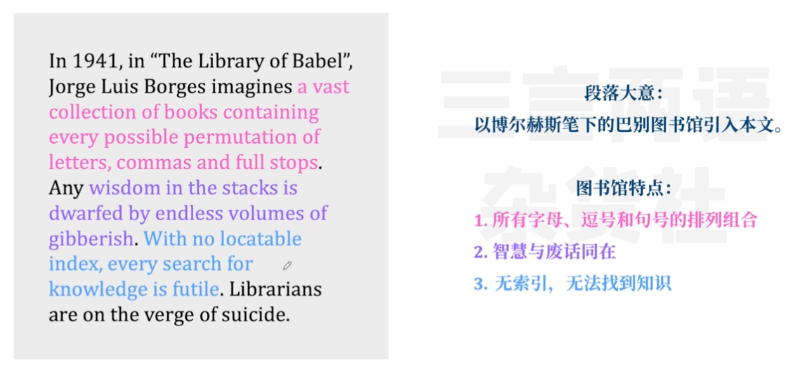

 

Borges’s nightmarish repository is a cautionary tale for the Supreme Court next week, as it takes up two cases involving a fiercely contested provision of a nearly 30-year-old law regulating web communications. If the justices use Gonzalez v Google and Taamneh v Twitter to crack down on the algorithms online platforms use to curate content, Americans may soon find it much harder to navigate the 2.5 quintillion bytes of data added to the internet each day.

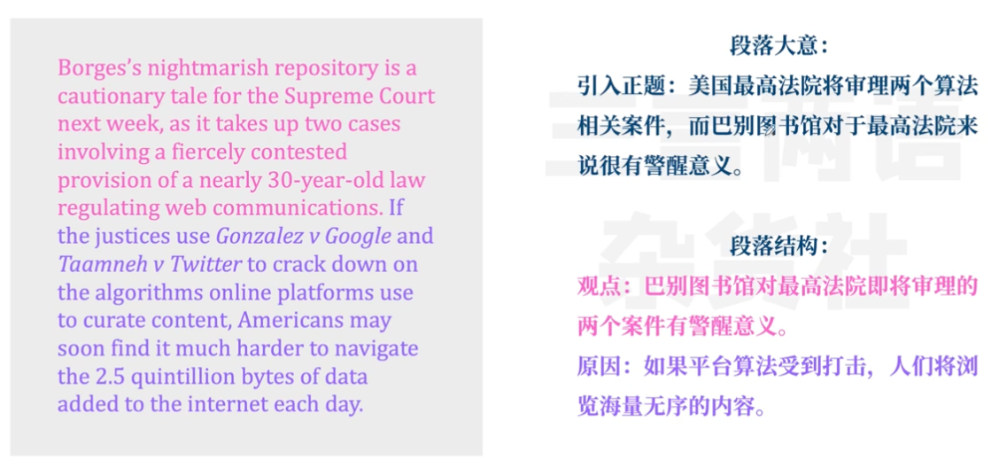

The law, Section 230 of the Communications Decency Act of 1996, has been interpreted by federal courts to do two things. First, it immunises both “provider[s]” and “user[s]” of “an interactive computer service” from liability for potentially harmful posts created by other people. Second, it allows platforms to take down posts that are “obscene…excessively violent, harassing or otherwise objectionable”—even if they are constitutionally protected—without risking liability for any such content they happen to leave up.

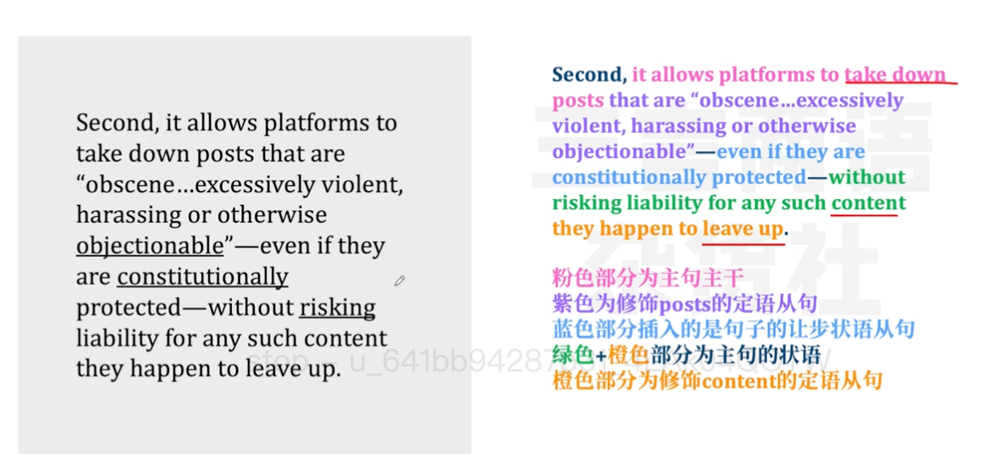

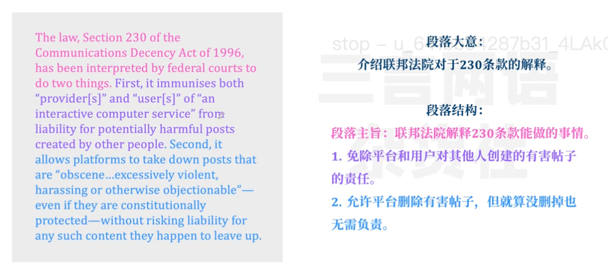

 

Disgruntlement with Section 230 is bipartisan. Both Donald Trump and Joe Biden have called for its repeal. Scepticism on the right has focused on licence the law affords technology companies to censor conservative speech. Disquiet on the left stems from a perception that the law permits websites to spread misinformation and vitriol that can fuel events like the insurrection of January 6th 2021.

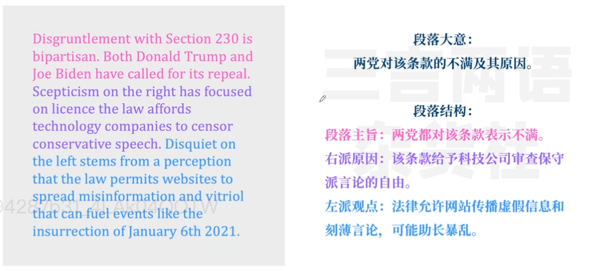

 

Tragedy underlies both Gonzalez and Taamneh. In 2015 Nohemi Gonzalez, an American woman, was murdered in an Islamic State (IS) attack in Paris. Her family says the algorithms on YouTube (which is owned by Google) fed radicalising videos to the terrorists who killed her. The Taamneh plaintiffs are relatives of Nawras Alassaf, a Jordanian killed in Istanbul in 2017. They contend that Section 230 should not hide the role Twitter, Facebook and Google played in grooming the IS perpetrator.

 

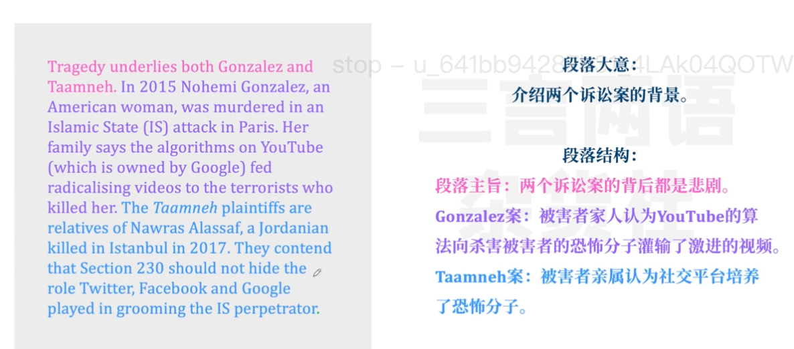

The Biden administration is taking a nuanced stand against the tech giants. In its brief to the justices, the Department of Justice says Section 230 protects “the dissemination of videos” on YouTube by users—including terrorist training videos by the likes of IS. But the platform’s “recommendation message[s]” are another story, the department says. These nudges, auto-loaded videos in a user’s “Up next” sidebar, arise from “YouTube’s own platform-design choices” and should not be protected under the umbrella of Section 230.

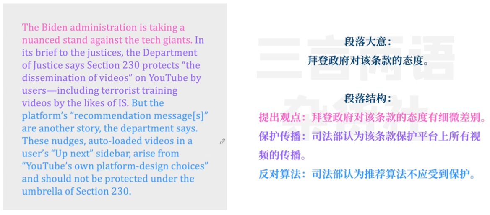

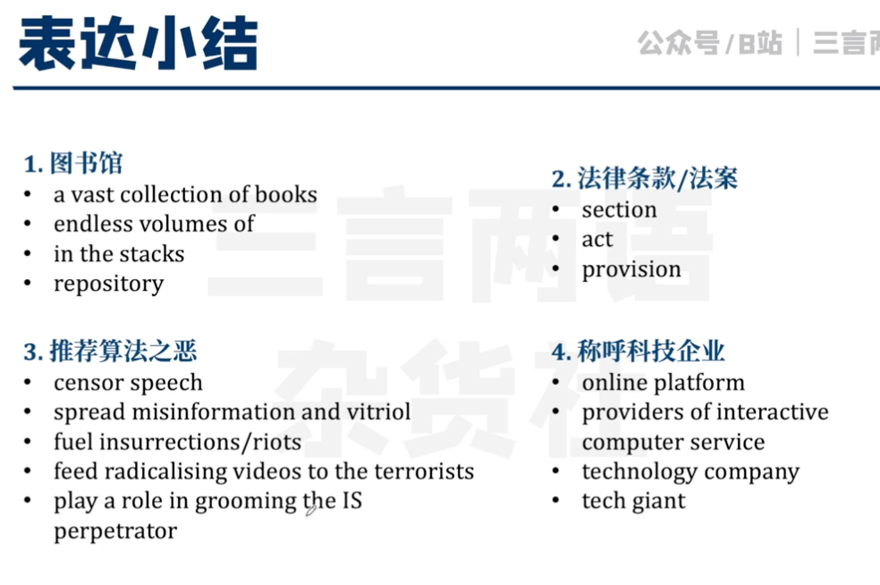

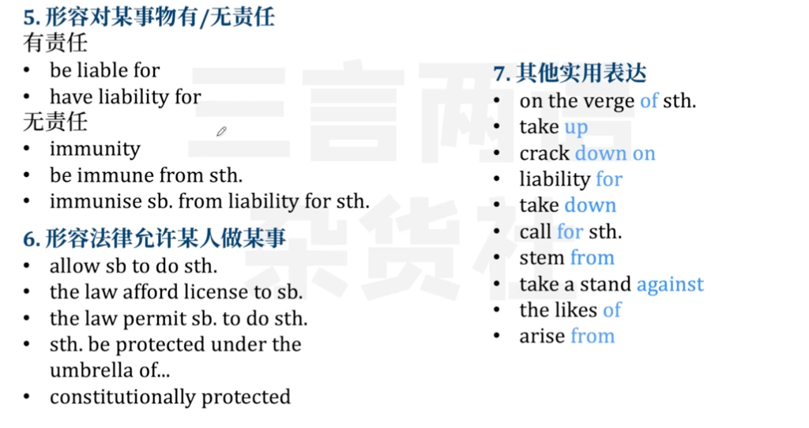

Some 30 amicus (or friend-of-the-court) briefs urge the justices to rein in social-media websites’ immunity from lawsuits. The Anti-Defamation League, a civil-rights group, writes that the companies’ strategy of keeping us “scrolling and clicking” through targeted algorithms threatens “vulnerable communities most at risk of online harassment and related offline violence”. Ted Cruz, a senator, along with 16 fellow Republican lawmakers, decries the “near-absolute immunity” that lower courts’ decisions have conferred “on Big Tech companies to alter and push harmful content” under Section 230.

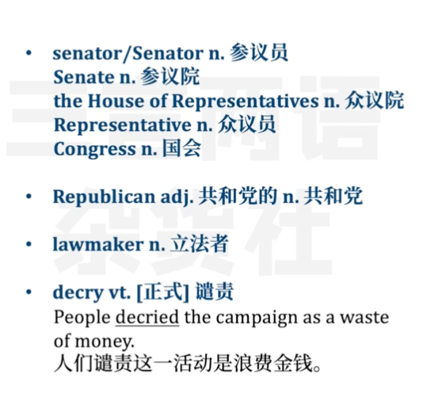

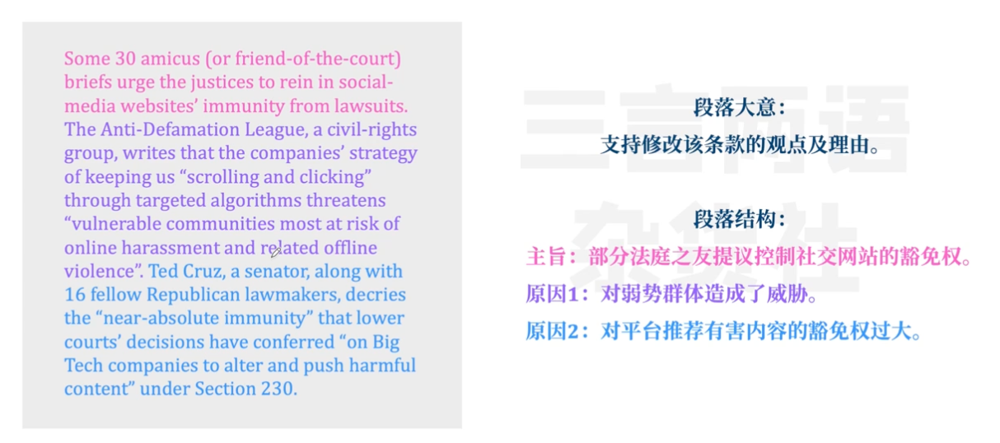

But nearly 50 amicus briefs opposing a rejigging of Section 230 warn of unintended consequences. An internet resembling Borges’s useless library is one worry. Meta, which owns Facebook, notes that “virtually every online service” highlights content that is “relevant” to particular users. The algorithms matching posts with users are “indispensable”, the company says, to sift through “thousands or millions” of articles, photos or reviews. Yelp adds that holding companies liable for restaurant reviews posted by users would “trigger an onslaught of suits”. Kneecapping Section 230 would be “devastating” for Wikipedia and other small-budget or non-profit sites, its parent foundation warns.

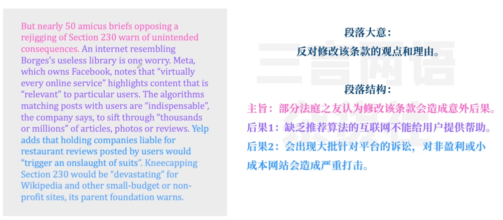

 

Danielle Citron and Mary Ann Franks, law professors at the University of Virginia and University of Miami, argue that the courts have long misread Section 230. There is, they say, no “boundless immunity…for harmful third-party content”. But Mike Masnick, founder of Techdirt, a blog, thinks such a reconceptualisation of the law would invite “havoc”. The crux of Section 230, he says, is pinning responsibility for harmful speech on the “proper party”: the person who made the content, not the “tool” he uses to communicate it. If that distinction disappears, Mr Masnick cautions, vexatious lawsuits would blossom whenever “someone somewhere did something bad with a tool”.

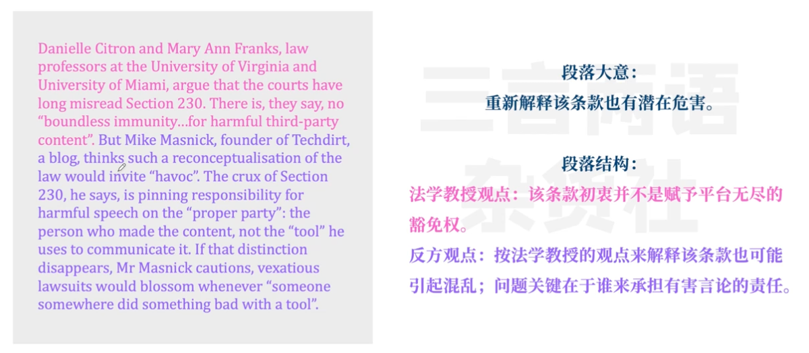

Thomas Wheeler, who chaired the Federal Communications Commission under Barack Obama, worries that tech companies have too much freedom to “bombard” users with potentially harmful content. When platforms “alert specific users” of videos or articles, Mr Wheeler says, “conduct becomes content” and should no longer receive Section 230 protection. Some advocates of curbed immunity distinguish between benign and destructive algorithms. “Somebody has to draw a line,” Mr Wheeler says. The question facing the justices is whether a line can be found with something to recommend it.

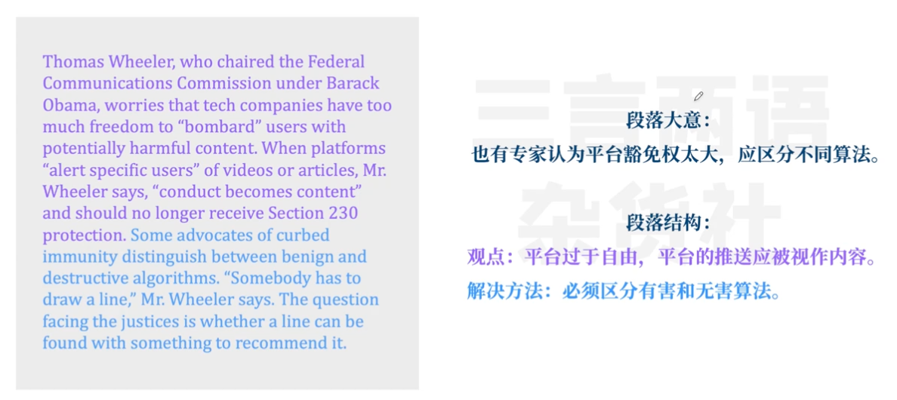

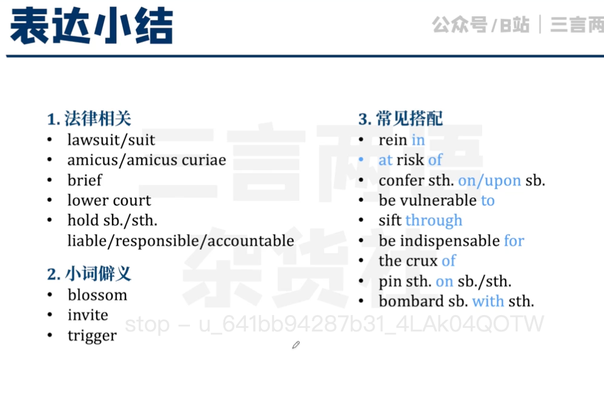

