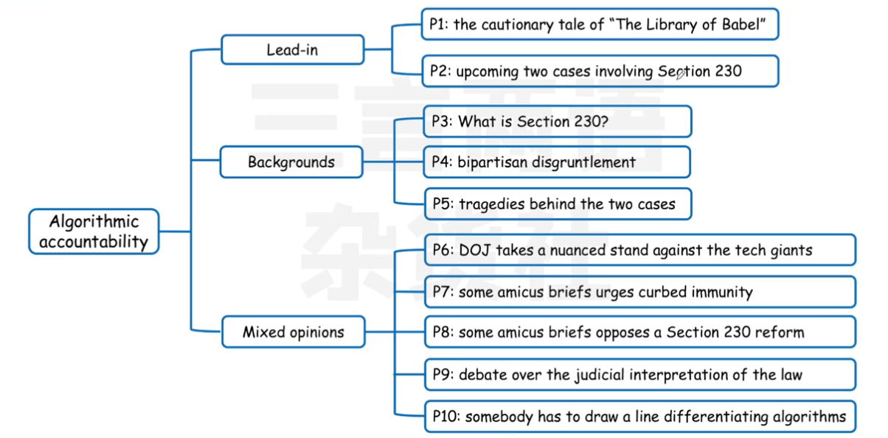
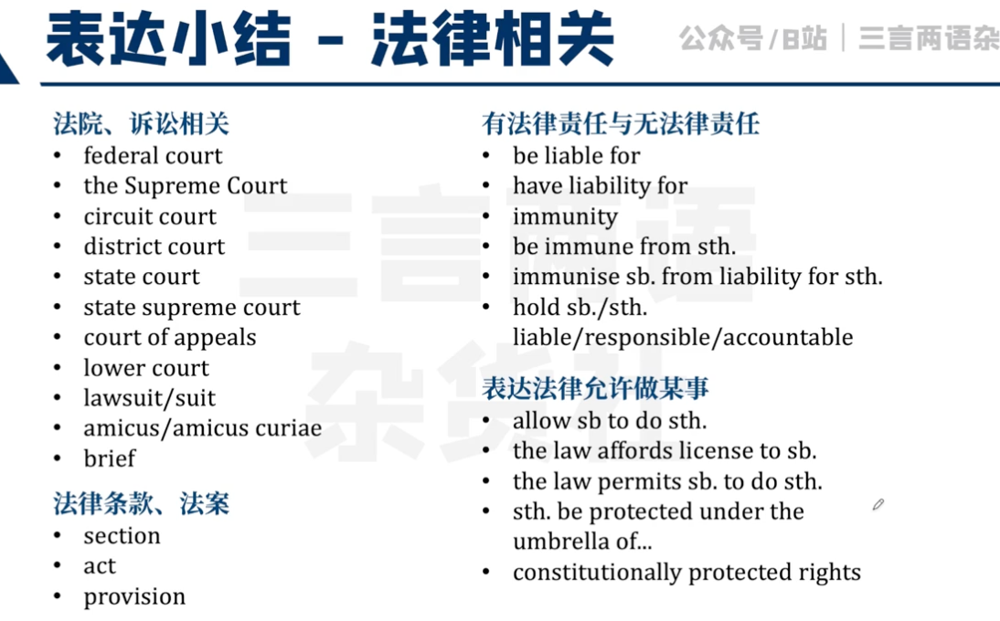
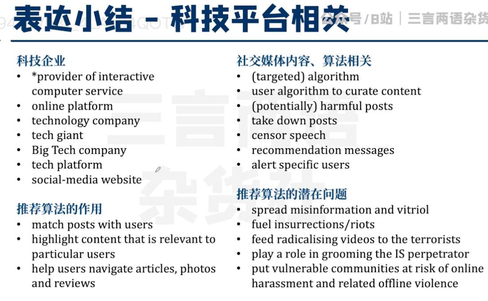
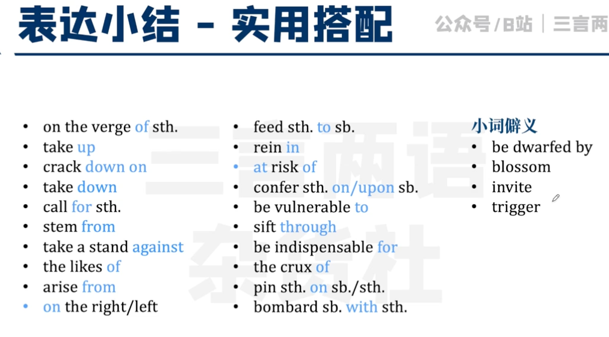
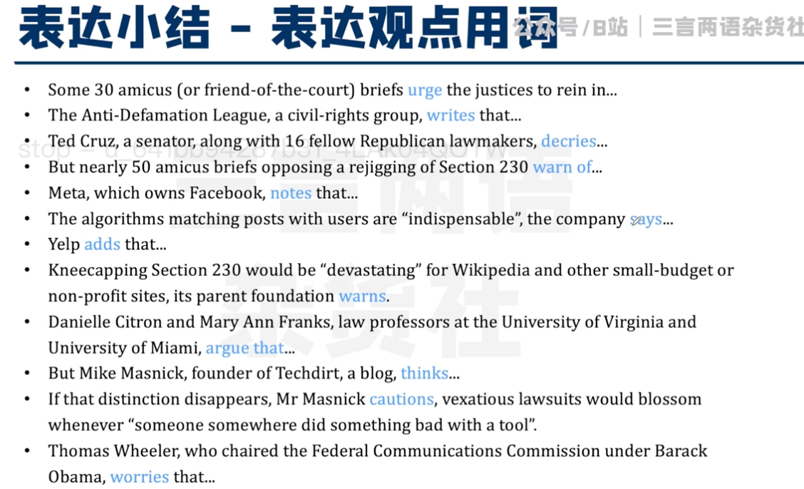
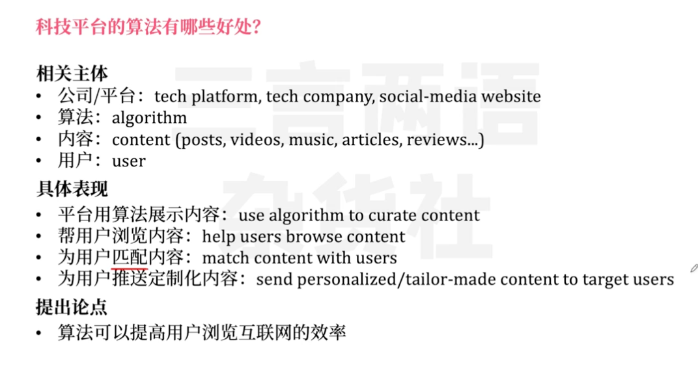
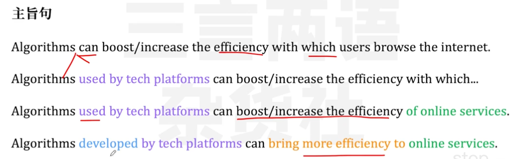
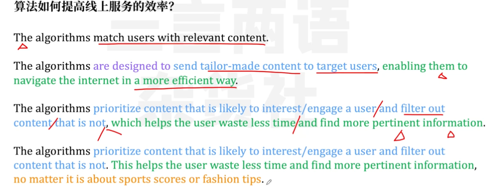
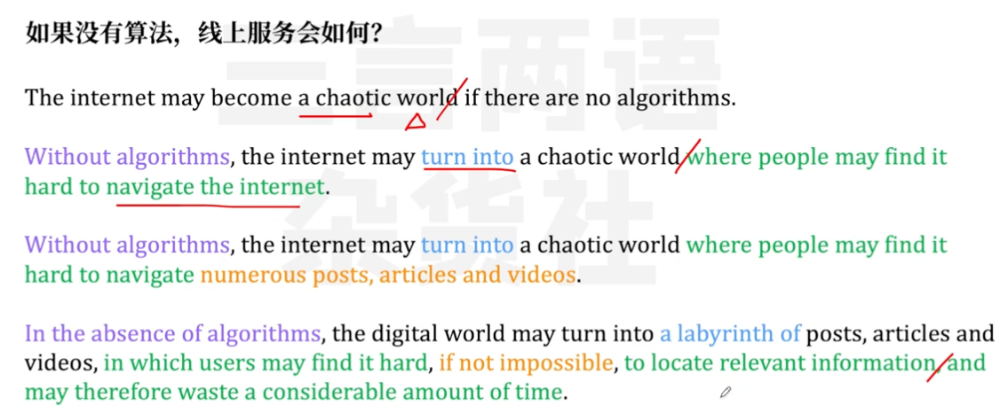

## 表达

## 科技平台有哪些好处？

> 写段落
>
> 盘算你能写什么内容--推出你的论点--写出段落

主旨句

> 算法可以提高用户浏览互联网的效率

Algorithms can boost/increase the efficiency with which users browse the internet.

- Algorithms 可以扩充 
- effciency 可扩充

论点

> 如何提高线上服务的效率 

The algorithms match users with relevant content.

> 如果没有算法，线上服务会如何？

The internet may become a chaotic world if there are no algorithms.

## 算法给用户带来了哪些坏处？

