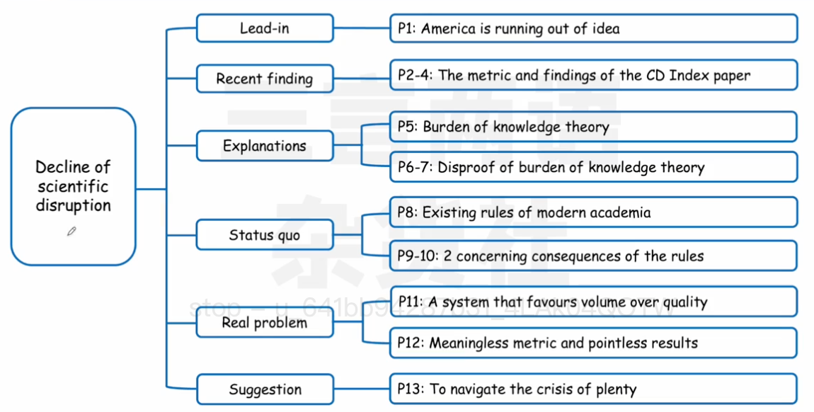
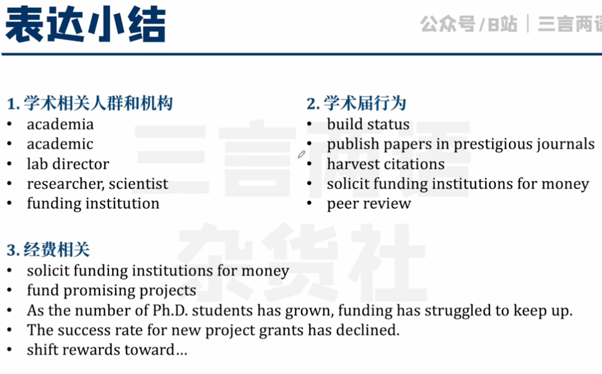
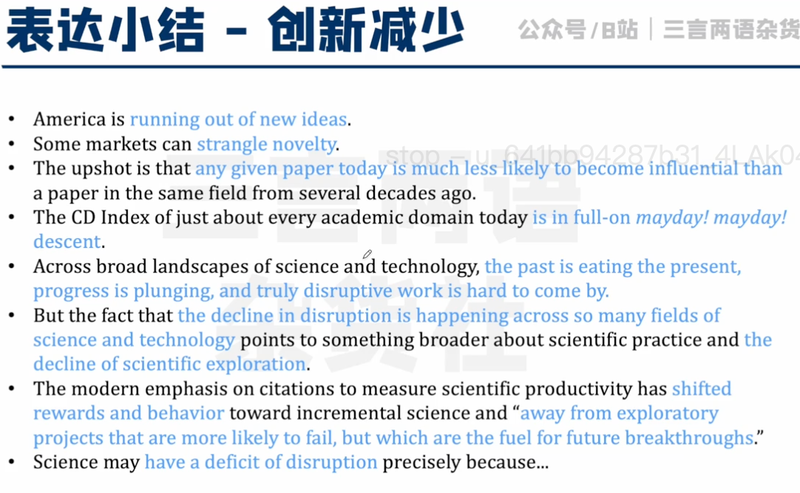
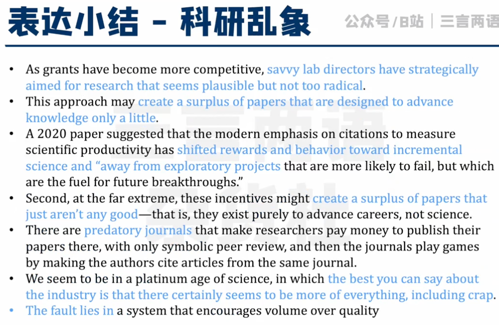
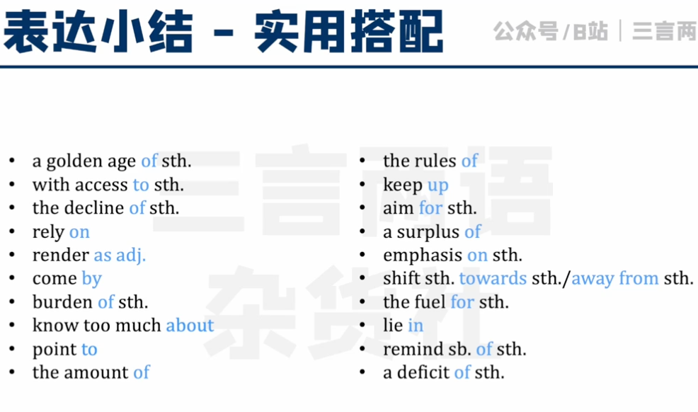
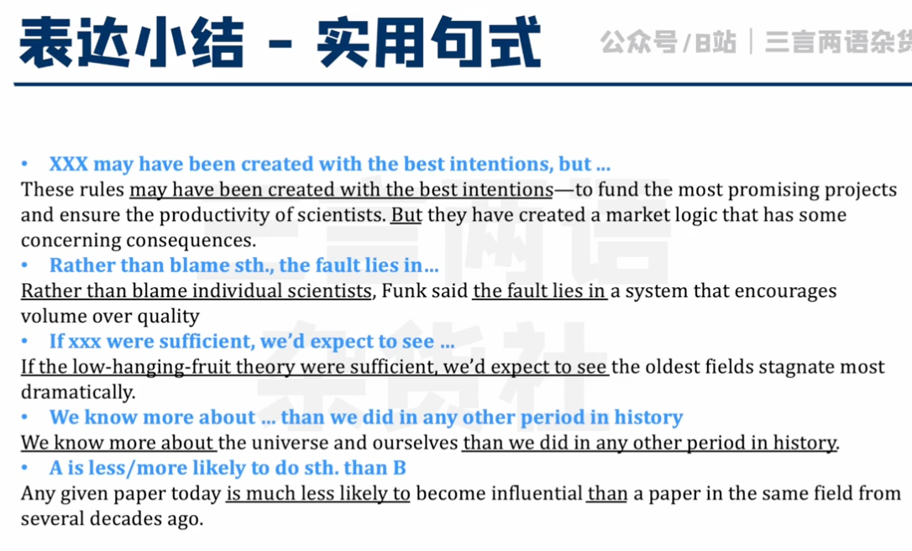
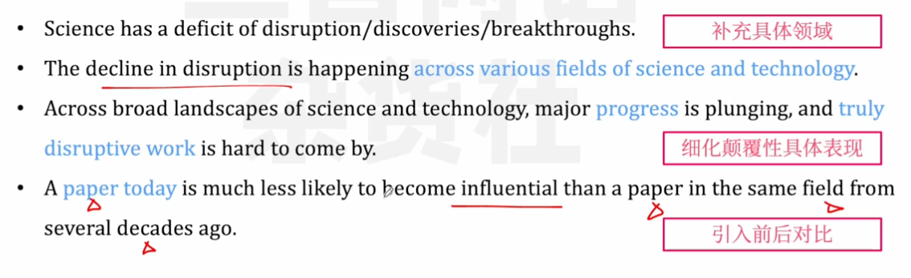
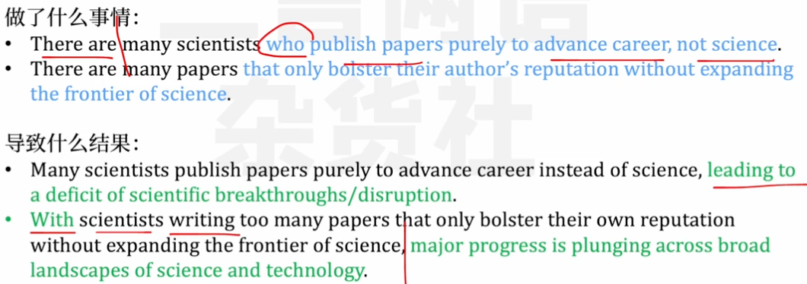
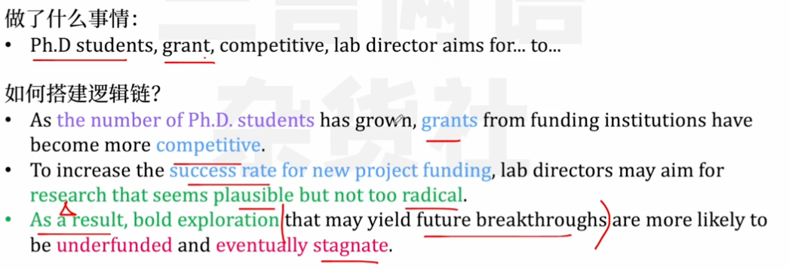
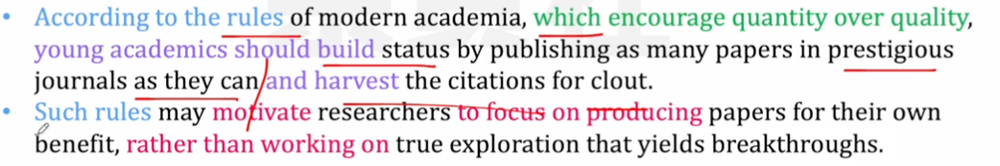

## 表达小节

## 连续

### 描述科学颠覆性不足

表示颠覆性：innovation, disruption,disruptive,discovery,breakthrough

表示不足、减少：a decline in.../of...,a deficit of ...,plunge

### 介绍科学发展缺乏颠覆性的原因

相关维度：

- 科研人员：scientists, researchers,academics,authors of paper

  - 

- 科研经费：funding, grant

  - 

- 学术界：academia rules

  - 具体表现：

    - a system that encourages quantity and quality
    - academics should build status by publishing papers and harvest the citations for clout

  - 如何导致影响

    - 

      

