**The Consolidation-Disruption Index Is Alarming**

CD指数

C-巩固现有的成果

D-打破现有的颠覆性成果-从而推动社会前进

 

Science has a crummy-paper problem.

 

We should be living in a golden age of creativity in science and technology. We know more about the universe and ourselves than we did in any other period in history, and with easy access to superior research tools, our pace of discovery should be accelerating. But America is running out of new ideas.

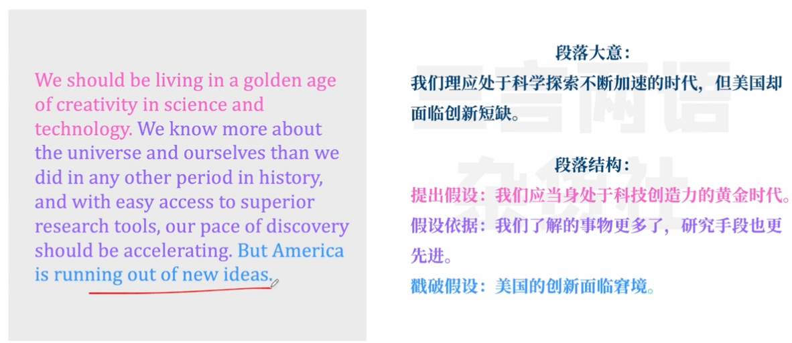

In the past year, I’ve traced the decline of scientific breakthroughs and entrepreneurship, warned that some markets can strangle novelty. This year, a new study titled “Papers and Patents Are Becoming Less Disruptive Over Time” inches us closer to an explanation for why the pace of knowledge has declined. The upshot is that any given paper today is much less likely to become influential than a paper in the same field from several decades ago.

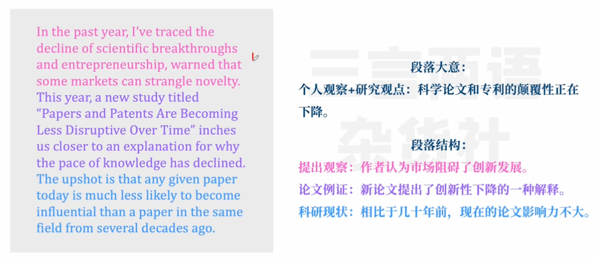

 

The researchers relied on a metric called the Consolidation-Disruption Index—or CD Index—which measures the influence of new research. For example, if I write a crummy literature review and no scientist ever mentions my work because it’s so basic, my CD Index will be extremely low. If I publish a paradigm-shifting study and future scientists exclusively cite my work over the research I rendered irrelevant, my CD Index will be very high.

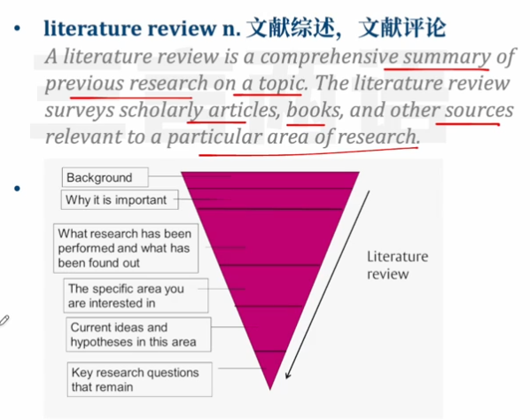

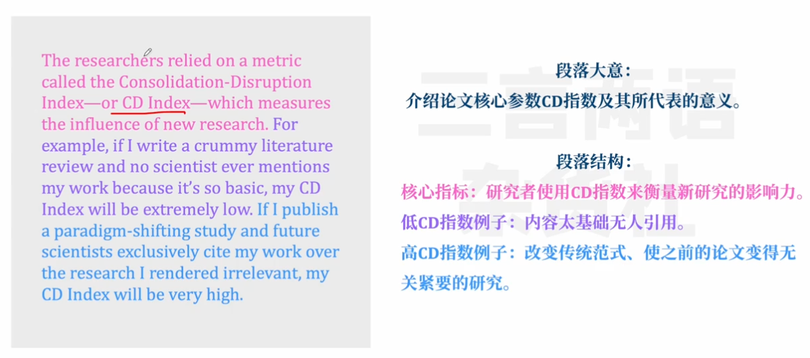

This new paper found that the CD Index of just about every academic domain today is in full-on mayday! mayday! descent. Across broad landscapes of science and technology, the past is eating the present, progress is plunging, and truly disruptive work is hard to come by.

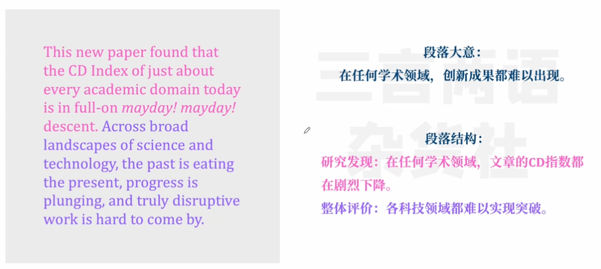

 

**Why is this happening?**

 

One possibility is that disruptive science is becoming less productive as each field becomes more advanced and the amount of knowledge new scientists have to acquire increases. This is sometimes called the “burden of knowledge” theory. Just as picking apples from a tree becomes harder after you harvest the low-hanging fruit, science becomes harder after researchers solve the easiest mysteries. This must be true, in some cases: Calculating gravity in the 1600s basically required a telescope, pen, and paper. Discovering the Higgs boson in the 21st century required constructing a $10 billion particle collider and spending billions more firing subatomic particles at one another at near–light speed.

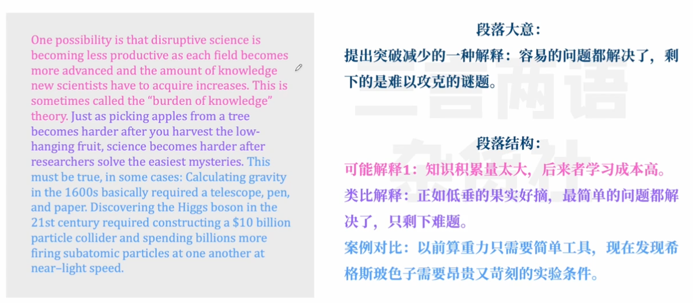

 

However, the disruption paper’s co-authors seemed interested in explanations beyond the burden-of-knowledge theory. “If the low-hanging-fruit theory were sufficient, we’d expect to see the oldest fields stagnate most dramatically. ” said Russell Funk, a co-author. “But the fact that the decline in disruption is happening across so many fields of science and technology points to something broader about scientific practice and the decline of scientific exploration.”

 

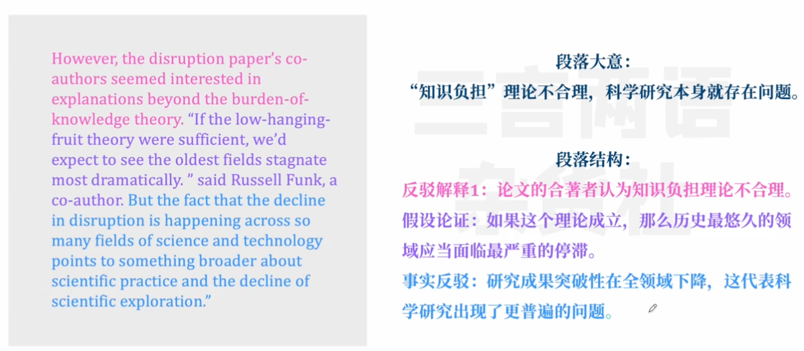

In other words, if science is getting less productive, it’s not just because we know too much about the world. It’s because we know too little about how to conduct research in a way that gets the best, most groundbreaking results.

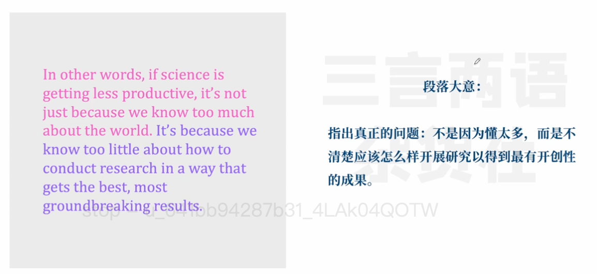

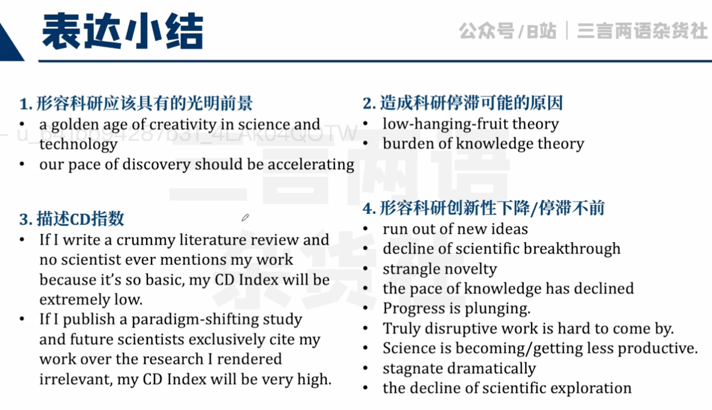

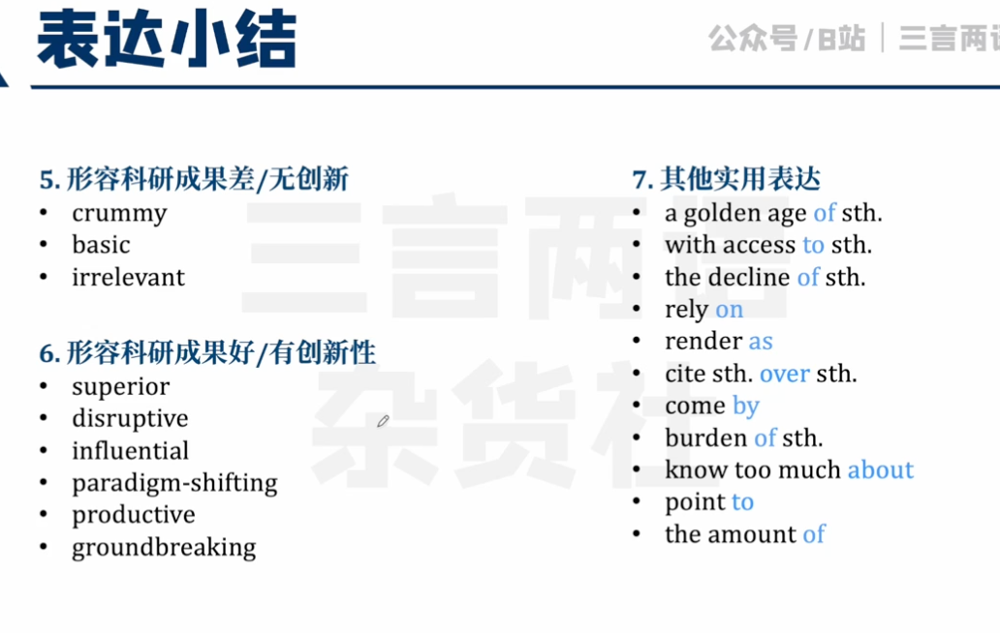

According to the rules of modern academia, a young academic should build status by publishing as many papers in prestigious journals as she can, harvest the citations for clout, and solicit funding institutions for more money to keep it all going. These rules may have been created with the best intentions—to fund the most promising projects and ensure the productivity of scientists. But they have created a market logic that has some concerning consequences.

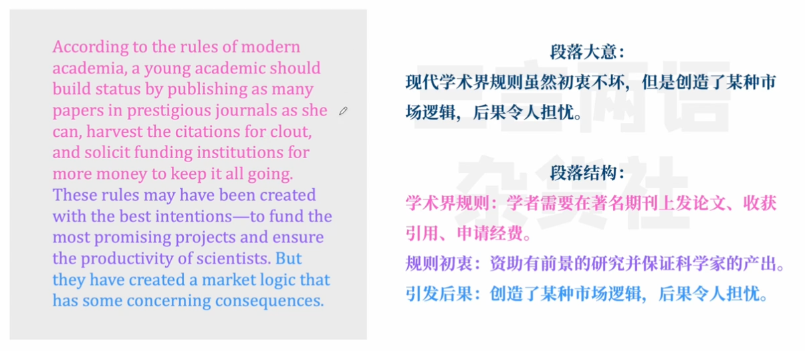

First, these rules might discourage truly free exploration. As the number of Ph.D. students has grown, National Institutes of Health funding has struggled to keep up. Thus, the success rate for new project grants has mostly declined in the past 30 years. As grants have become more competitive, savvy lab directors have strategically aimed for research that seems plausible but not too radical. This approach may create a surplus of papers that are designed to advance knowledge only a little. A 2020 paper suggested that the modern emphasis on citations to measure scientific productivity has shifted rewards and behavior toward incremental science and “away from exploratory projects that are more likely to fail, but which are the fuel for future breakthroughs.”

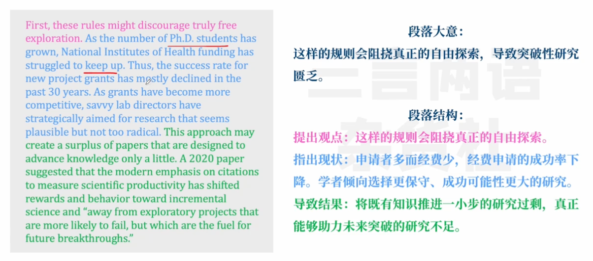

 

Second, at the far extreme, these incentives might create a surplus of papers that just aren’t any good—that is, they exist purely to advance careers, not science.

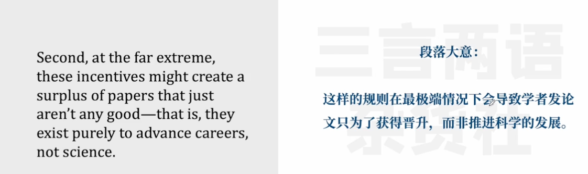

Rather than blame individual scientists, Funk said the fault lies in a system that encourages volume over quality: “There are journals, which I’d consider predatory journals, that make researchers pay money to publish their papers there, with only symbolic peer review, and then the journals play games by making the authors cite articles from the same journal.”

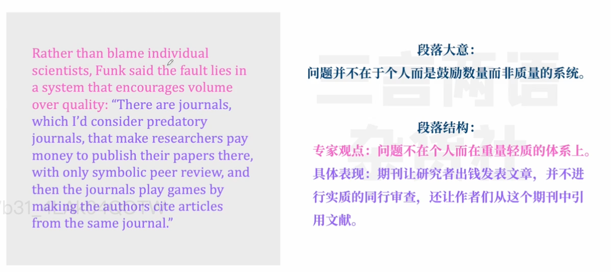

 

It reminded me of the dark side of Moneyball: When any industry focuses too much on one metric, it can render the metric meaningless and warp the broader purpose of the industry. Just as we are living in a platinum age of television—more quantity but perhaps not more quality—we seem to be in a platinum age of science, in which the best you can say about the industry is that there certainly seems to be more of everything, including crap.

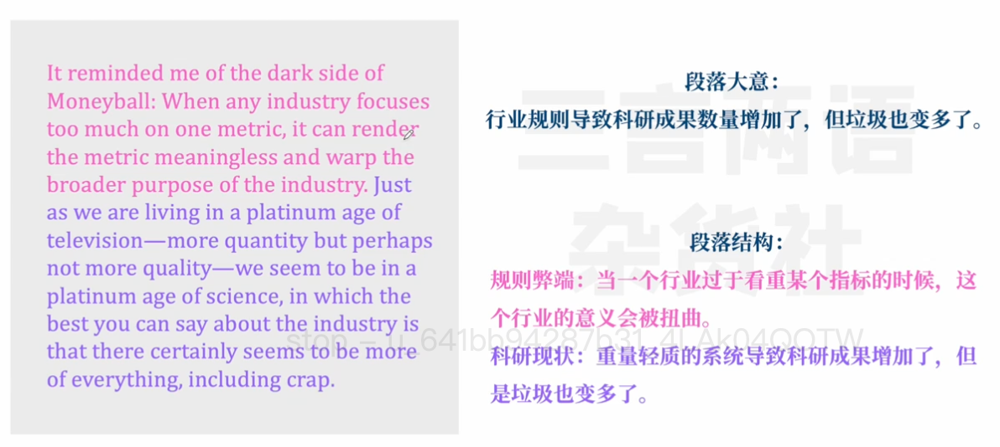

 

It’s a useful reminder that abundance is not a sufficient end point; rather, it’s an input. Science may have a deficit of disruption precisely because the industry doesn’t know how to navigate its crisis of plenty—too much knowledge to synthesize, and too many papers bolstering their authors’ reputation without expanding the frontier of science.

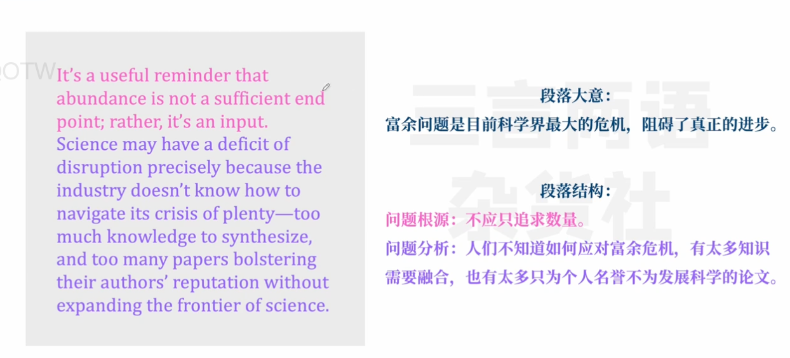

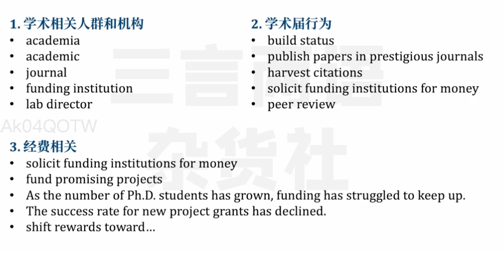

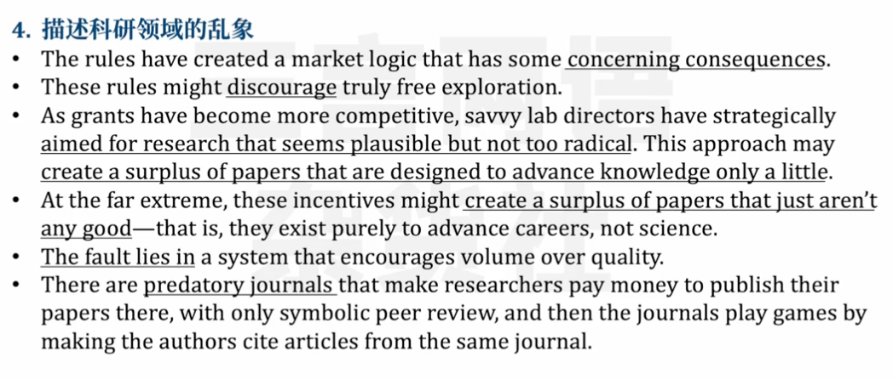

