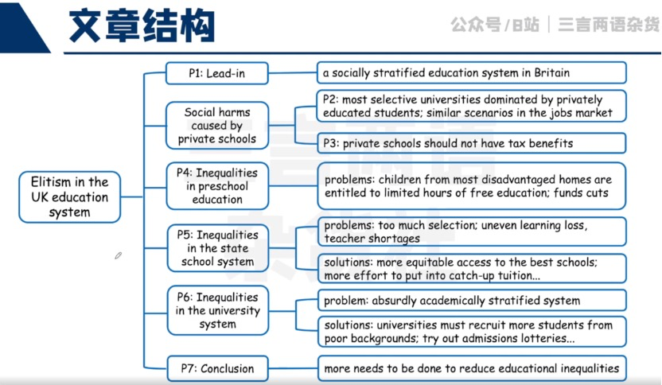

## 一、教育背景词汇

### 学校、学制、招生相关

- private education
- privately educated students
- private school / independent school
- state school (system)
- public school (Britain / US)
- grammar school
- academy
- comprehensive school / comprehensive
- selective university / school
- top-performing school
- early years / childhood education
- private tuition
- school admissions

### 不同家庭背景

- children born to / into privilege

- children from less / disproportionately affluent backgrounds
- children from poorer / low-income backgrounds
- children from (more / most) advantaged / disadvantaged homes

## 二、不平等现象

### 社会不平等现象、社会特权

- socially stratified education system
- elitist country / elitist education system
- privilege / privileged
- social injustice
- uneven learning loss

- The system is academically **stratified to absurd / dangerous levels.**
- a socially stratified education system that **funnels those born to privilege into the highest-status jobs, while holding back** children from disadvantaged backgrounds
- **a bigger attainment gap between** richer and less affluent children in this generation
- In acting as a conveyor belt to the most sought-after jobs, **they shut out other, more able, young people** who lack those advantages.

## **三、改良措施**

- **open up more equitable access to** the country’s best schools
- children from more disadvantaged backgrounds **should be given priority in school admissions**
- **channel far more effort into catch-up tuition** in the wake of the pandemic
- get the best-quality teachers to **schools serving the most disadvantaged areas**
- universities **should be set much more stringent targets to** recruit more students from disadvantaged backgrounds
- **guarantee a place to** the top-performing students at every school
- **experiment with admissions lotteries** for...
- **expand subsidies to cover** all young people

## 四、实用搭配

- be awarded for
- funnel sth. into
- born to / into sth.
- hold back
- cream sb. / sth. off
- make up
- a product of
- go into sth.
- open up
- act as / like sth.
- get access to sth.
- have impact on sth.
- be entitled to sth.
- endow sb. with sth.
- by the back door
- on average

- be channelled into
- in the wake of
- across the board
- in turn
- be opened up to sb.
- experiment with sth.
- be expanded to
- regardless of

## 五、实用句式

### 表类似：

- as is / was / does / did...

Two-thirds of the senior judiciary were privately educated as were six out of 10 civil service permanent secretaries.

### 表并列/递进

- This is not a sth. of..., but also of...

This is not a product simply of their raw ability, but also of the vast resources that go into their education.

- Beyond sth. / that…, ...

Beyond that, there is too much selection by postcode; the best-performing comprehensives are least likely to accept children from disadvantaged backgrounds.

## 练习

