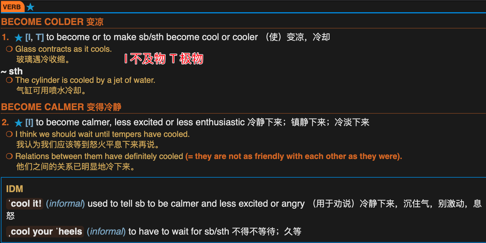
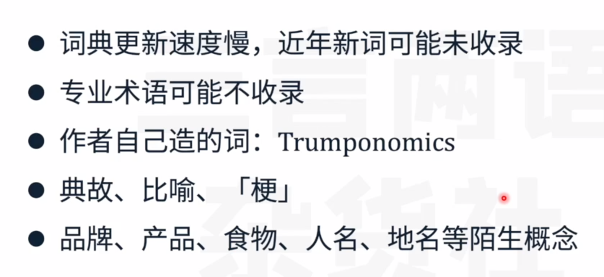

# Part1 英文-->中文

> 为什么查单词
>
> 
>
> 用什么查词
>
> 

## 一、查词内容

以cool为例子

### 1. 看词性

动词

### 2. 感受例句

非正式使用和正式使用

IDM 习语

### 3. 同义词辨析

> 可看可不看

### 4.搭配

> 牛津搭配字典
>
> 写作翻译时用

### 5. 近反义词

> 近反义词字典

## 二、查单词步骤

> 拿到一个句子，先确定整个句子的主题，确定待查字的词性

### 举例

eg.

查词

分析原文句子tuck作为动词，从动词的三个解释来看并不能有效的进行翻译匹配

那么就进行词组查询，结合后面的in 组成tuck in查询

可以看到tuck in有两个解释，结合句子后面的老师傅们的手艺可能失传，这里翻译成赶紧来大吃一顿是可行的

### 练习

1-空头

2-靠跌价获取利益的，空头交易的

3-短期的

### 网页搜索

- 网页版词典（Vocabulary.com,Dictionary.com）
- 搜索引擎--百度、必应、谷歌
- 中文网页查惯用说法

# Part2 中文--> 英文

> 
>
> - 找到词汇-->反复验证

### 练习1

- 有道翻译（https://youdao.com/）
- 语料库（https://fraze.it/）

先在有道（或者其他的翻译）查到赘肉

比较给出的翻译单词，然后在翻译软件中进行验证，如果没有找到具体翻译可以去例句中查找。

### 练习2

搜索

这里可以看到出现一个数字figure，和预想的data有什么区别，可以在词典里面查找

这里还是不能确定，可以在语料库里查找，进行例句的比较

可以看到figure的使用次数是比data更频繁的

