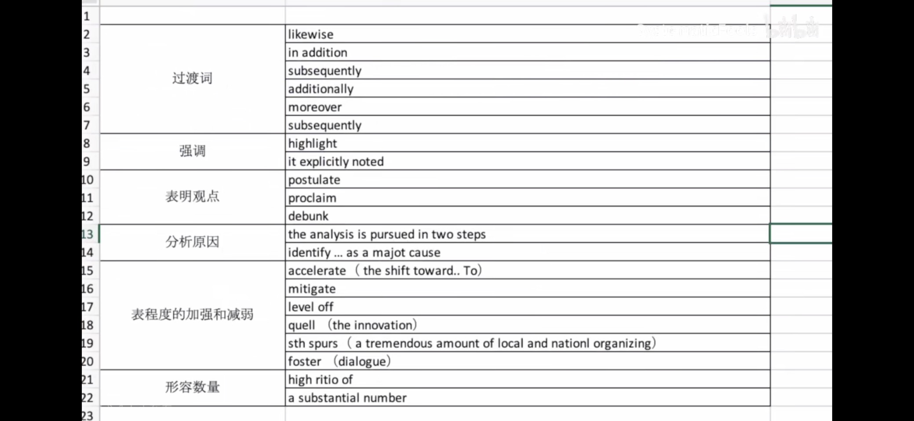

如何背、整理单词？

> 用意群理解英语
>
> 词汇分主动和被动
>
> 注意词汇结构
>
> 真实语境中学习单词

## 一、过程
初步识记（刷单词，有印象）

到初步运用（阅读中看得懂）

再到深度运用（写作中表达准确地道）

## 二、具体步骤

1. 背单词的app刷单词
   重点在大量、反复、快速刷，即阅读材料中出现了之后看得懂。

2. 阅读中积累单词。
   - 选择全英的英文材料（能看得懂80%以上）。
   - 积累的单词以实用性为主，即以后可以一定用得上的。
     - 根据自己写作常用的结构及内容整理；
     - 同义词整理（表达相同的意思，需要不同的表达）；
     - 易混词总结（长得很像之类的）
   - 联系语境，用词组或者句子把该单词相应的用法积累下来。
   - 用Excel等熟悉的工具整理，方便修改及查找。
   - 阅读词汇升级为写作词汇
     - 作文写完一定要用自己积累的东西不停改（写作是越改越好，不是写的越多越好）
     - 哪些表达可以用得上，自己没有用的
     - 哪些表达更加高级、地道，自己用的比较低级
     - 相同表达进行同义词替换（不局限同种词性，比如可以把adj换成n，意思不变）
     - 句式表达的替换（主被动互换）

## 三、阅读步骤

> 看书前准备：①拿出笔 ②打开空Excel表（积累好的表达） ③打开谷歌翻译，随时查单词

1. 第一步：非常非常认真地看摘要（研究背景、研究目的、研究方法、研究结构）
2. 第二步：看文章小标题，了解文章结构
   - 快速浏览小标题
   - 初步了解文章结构
3. 第三步：读文章
   - 逐句阅读，重要的地方做标记
   - 不懂的单词查谷歌
   - 不懂的句子多读几遍，分析结构
   - 把好的单词和表达记在Excel表上
4. 第四步：回顾文章内容
   - 根据个人理解回顾文章
   - 复写结构，回忆要点
   - 不确定的部分重新读一遍
5. 第五步：整理刚才积累的单词和表达

