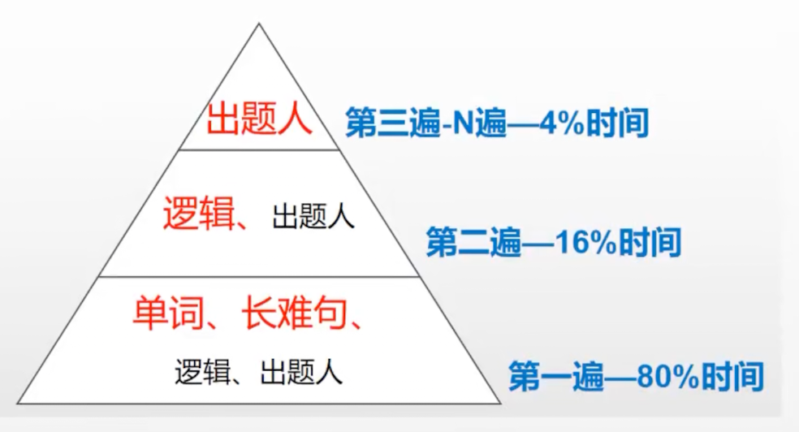

- 掐点做题
  - 按照考试时间做题，不可松懈

- 解释对错
  - 给自己讲解清楚，没有给自己讲清楚不算会
- 精读全文
- 积累词句

刷真题遍数

- 文章每一个长难句都拆解
- 出现的所有单词都认识
- 每一篇文章的逻辑和结构，都有分析
- 每一个选项的错误和正确的原因，也就是出题人的思路都尽量去揣摩

多刷一遍，对单词和长难句更熟悉

第一遍刷题

- 扫一眼全文，标序号
- 看选项
- 边读全文边动笔，长难句分析，代词指出含义，难懂的地方写中文含义
- 分析文章逻辑，概括每段大意，接着分析文章结构，时间顺序？家庭背景？作者自己背景？
- 开始做题，修正答案--不许边做题边查单词
- 抄写答案解析，多了就慢慢懂得套路，很笨很有效
- 精读文章，查生词，不会的单词都查出来，抄英文意思，短语例句，常见使用场景
- 复习，到图书馆第一件事就是复习

时间：第一遍很慢，每篇至少一个小时，虽然很慢，但是进步很明显

- Step 1 计时做第一遍真题（在卷子上写上开始的时间，精确到几分）
- Step 2 忍住不要对答案
- Step 3 把不会的生词、长难句逐个搞懂 --自己分析
- Step 4 口译+手译，搞懂全文 --口述全文，长难句用笔写下来
- Step 5第二遍做题
- Step 6 代入出题人思维，对答案--思考选项为什么这样
- Step 7 复盘大总结
  - 01整理单词到笔记本上；
  - 02 复盘长难句。一定要把句子的主干，从句主干都找对，还要知道过去分词等在句子中做什么成分、有什么作用；
  - 03复盘翻译，对照译文修改自己的翻译—准确+通顺；
  - 04 总结复盘——用笔写出来，把出错的同类题目放一起