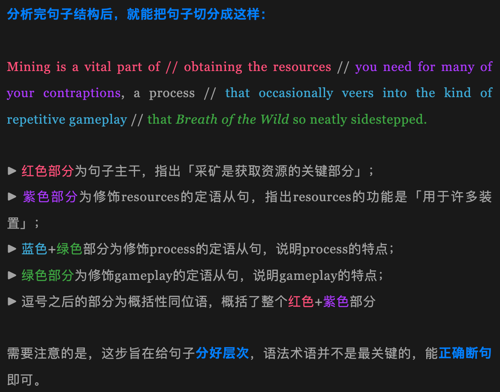
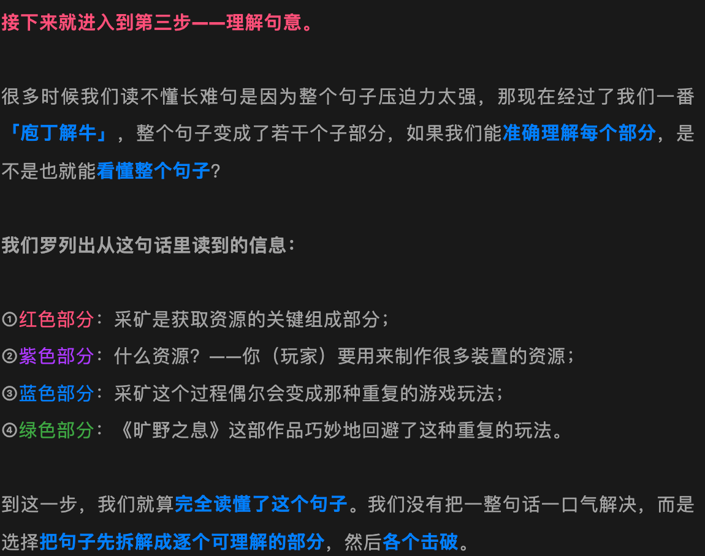
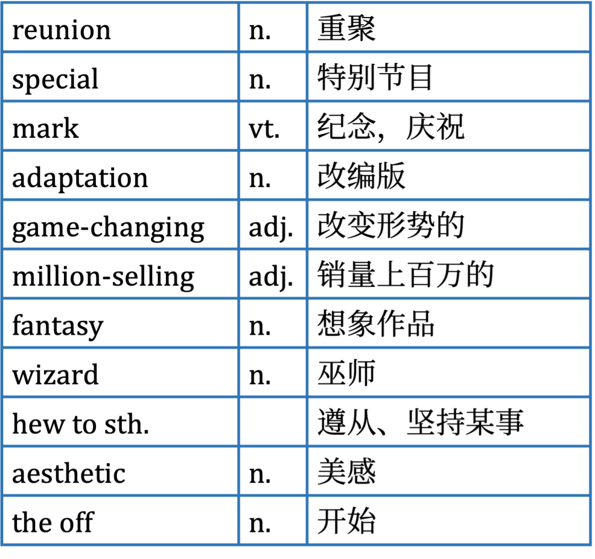
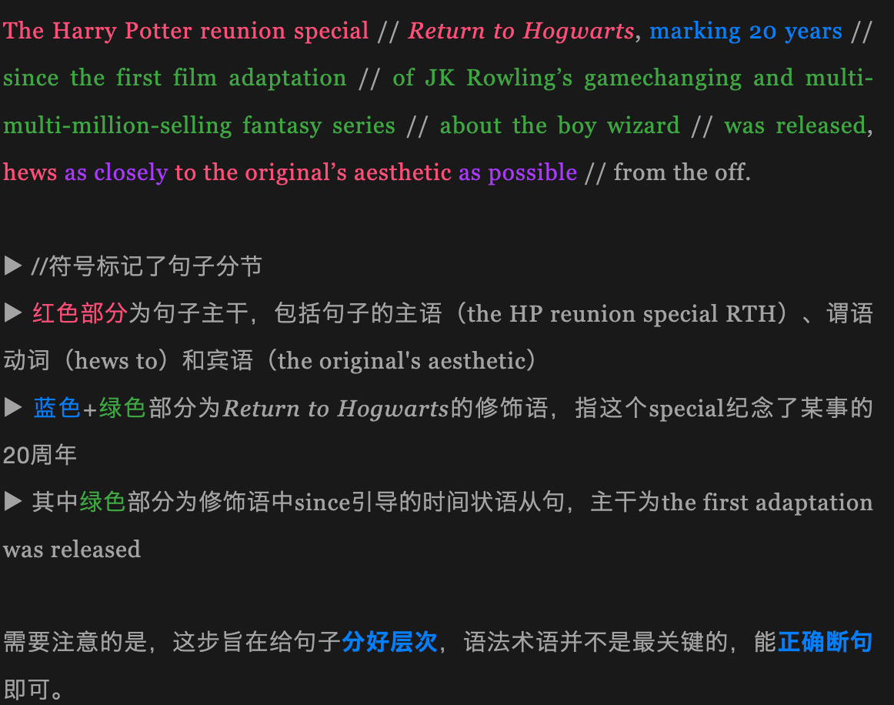
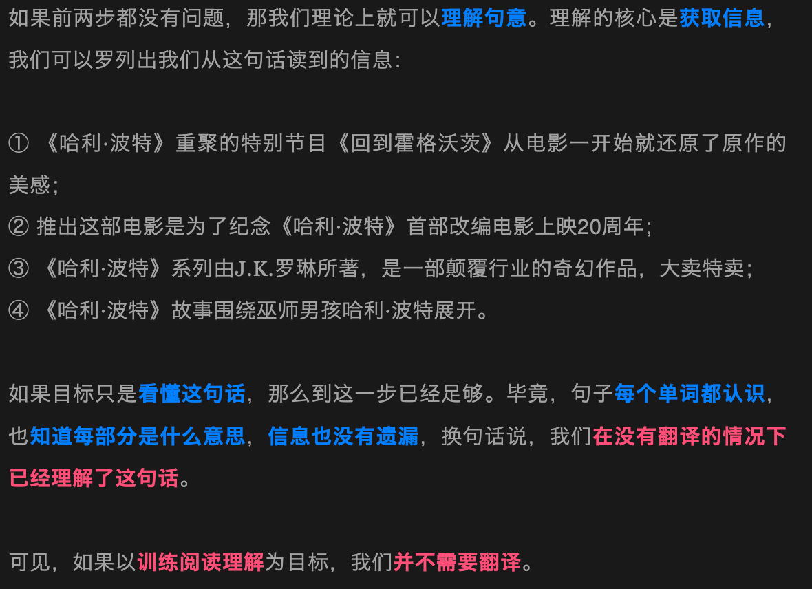
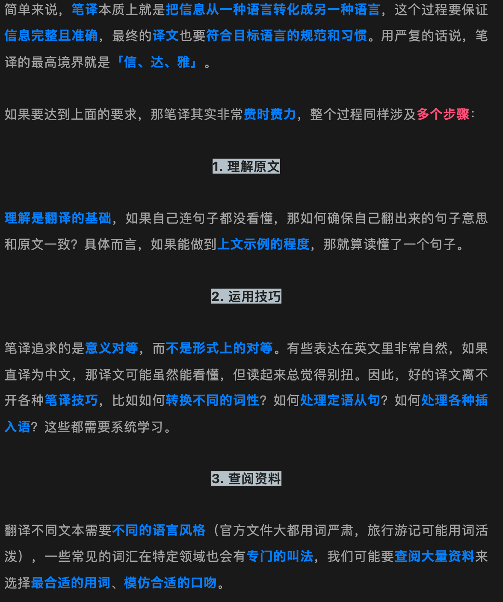

https://mp.weixin.qq.com/mp/appmsgalbum?__biz=MzI1MTE5MTE4Mg==&action=getalbum&album_id=2362740767817007105&scene=173&from_msgid=2247518494&from_itemidx=1&count=3&nolastread=1#wechat_redirect

## 学习方法｜读长难句时不要再「翻译」了！

> 问题：
>
> - 每个单词都认识，但是还是看不懂一个长难句
> - 把英文翻译成了中文，但是还是看不懂这个长难句
>
> 导致
>
> - 根本是讲单词放一起进行中译中，依靠自己想象重新解释

原因

### 单词不一定能查准

英语一词多译非常普通，知道其中一个含义并不够，需要认真查词典

### 没有搭配意识

不知道哪些单词可以放一起来理解，要有搭配意识才能更好的切割句子

### 语法知识有漏洞

如果不懂各种从句，各种时态，那么阅读的时候句子中各部分之间的关系，比如哪部分修饰另一部分，那部分是因哪部分是果

### 正确理解

1. 查清每个单词在句子中的含义
2. 分析句子结构并合理断句
3. 理解句意

前两步相辅相成

通过单词在文中的词性和含义来确定哪部分应该划为一个意群。反过来，通过句子结构来推测某个单词在文中的词性，进而在词典中快速找到单词的释义。

**词义的判断**、**语法结构辨析**、**逻辑的梳理**无一例外都要经过**刻意的练习**才能提高。大家初期可能感觉比较吃力，但要相信**持续磨练**的力量，循序渐进，**量变总有一天会产生质变**！

---

## 学习方法｜学外刊需要逐句翻译吗？我看未必

> 为什么要翻译外刊文章

### 目的一：为了练阅读理解

> 如果为了阅读，不需要通过翻译成中文来理解英文

读懂了本身，要有三大事情要解决：

- 查清词义
- 合理断句
- 理解句意

实战：

The Harry Potter reunion special *Return to Hogwarts*, marking 20 years since the first film adaptation of JK Rowling’s gamechanging and multi-multi-million-selling fantasy series about the boy wizard was released, hews as closely to the original’s aesthetic as possible from the off.

查清词义

合理断句

理解句意

### 目的二：为了练习笔译

