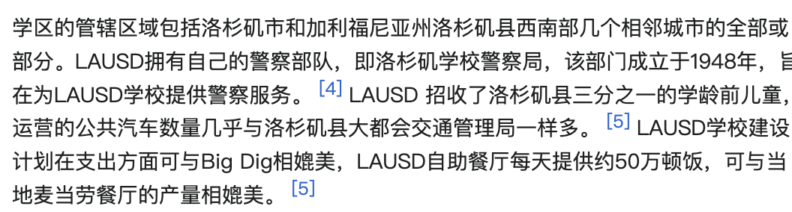
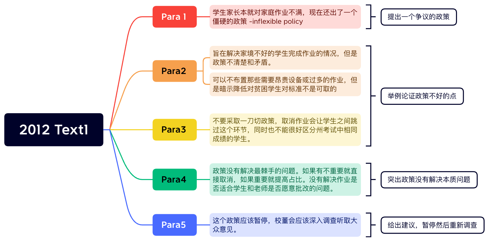

# 2010

## **Text 1**

①The longest bull run in a century of art-market history ended on a dramatic note with a sale of 56 works by Damien Hirst, *Beautiful Inside My Head Foreve*r, at Sotheby’s in London on September 15th 2008. ②All but two pieces sold, fetching more than ￡70 million, a record for a sale by a single artist. ③It was a last victory. ④As the auctioneer called out bids, in New York one of the oldest banks on Wall Street, Lehman Brothers, filed for bankruptcy.

①The world art market had already been losing momentum for a while after rising bewilderingly since 2003. ②At its peak in 2007 it was worth some $65 billion, reckons Clare McAndrew, founder of Arts Economics, a research firm—double the figure five years earlier. ③Since then it may have come down to $50 billion. ④But the market generates interest far beyond its size because it brings together great wealth, enormous egos, greed, passion and controversy in a way matched by few other industries.

①In the weeks and months that followed Mr. Hirst’s sale, spending of any sort became deeply unfashionable. ②In the art world that meant collectors stayed away from galleries and salerooms. ③Sales of contemporary art fell by two-thirds, and in the most overheated sector, they were down by nearly 90% in the year to November 2008. ④Within weeks the world’s two biggest auction houses, Sotheby’s and Christie’s, had to pay out nearly $200 million in guarantees to clients who had placed works for sale with them. 

①The current downturn in the art market is the worst since the Japanese stopped buying Impressionists at the end of 1989. ②This time experts reckon that prices are about 40% down on their peak on average, though some have been far more fluctuant. ③But Edward Dolman, Christie’s chief executive, says: “I’m pretty confident we’re at the bottom.”

①What makes this slump different from the last, he says, is that there are still buyers in the market. ②Almost everyone who was interviewed for this special report said that the biggest problem at the moment is not a lack of demand but a lack of good work to sell. ③The three Ds—death, debt and divorce—still deliver works of art to the market. ④But anyone who does not have to sell is keeping away, waiting for confidence to return.

\21. In the first paragraph, Damien Hirst’s sale was referred to as “a last victory” because_______.

［A］the art market had witnessed a succession of victories

［B］the auctioneer finally got the two pieces at the highest bids

［C］*Beautiful Inside My Head Forever* won over all masterpieces

［D］it was successfully made just before the world financial crisis

\22. By saying “spending of any sort became deeply unfashionable” (Line 1~2, Para. 3), the author suggests that_______.

［A］collectors were no longer actively involved in art-market auctions

［B］people stopped every kind of spending and stayed away from galleries

［C］art collection as a fashion had lost its appeal to a great extent

［D］works of art in general had gone out of fashion so they were not worth buying

\23. Which of the following statements is NOT true?

［A］Sales of contemporary art fell dramatically from 2007 to 2008.

［B］The art market surpassed many other industries in momentum.

［C］The art market generally went downward in various ways.

［D］Some art dealers were awaiting better chances to come.

\24. The three Ds mentioned in the last paragraph are_______.

［A］auction houses’ favorites        ［B］contemporary trends

［C］factors promoting artwork circulation   ［D］styles representing Impressionists

\25. The most appropriate title for this text could be_______.

［A］Fluctuation of Art Prices        ［B］Up-to-date Art Auctions

［C］Art Market in Decline         ［D］Shifted Interest in Arts

##  **Text 2**

①I was addressing a small gathering in a suburban Virginia living room—a women’s group that had invited men to join them. ②Throughout the evening, one man had been particularly talkative, frequently offering ideas and anecdotes, while his wife sat silently beside him on the couch. ③Toward the end of the evening, I commented that women frequently complain that their husbands don’t talk to them. ④This man quickly nodded in agreement. ⑤He gestured toward his wife and said, “She’s the talker in our family.” ⑥The room burst into laughter; the man looked puzzled and hurt. ⑦“It’s true,” he explained. ⑧“When I come home from work I have nothing to say. ⑨If she didn’t keep the conversation going, we’d spend the whole evening in silence.”

①This episode crystallizes the irony that although American men tend to talk more than women in public situations, they often talk less at home. ②And this pattern is wreaking havoc with marriage.

①The pattern was observed by political scientist Andrew Hacker in the late 1970s. ②Sociologist Catherine Kohler Riessman reports in her new book *Divorce Talk* that most of the women she interviewed—but only a few of the men—gave lack of communication as the reason for their divorces. ③Given the current divorce rate of nearly 50 percent, that amounts to millions of cases in the United States every year—a virtual epidemic of failed conversation.

①In my own research, complaints from women about their husbands most often focused not on tangible inequities such as having given up the chance for a career to accompany a husband to his, or doing far more than their share of daily life-support work like cleaning, cooking, social arrangements. ②Instead, they focused on communication: “He doesn’t listen to me,” “He doesn’t talk to me.” ③I found, as Hacker observed years before, that most wives want their husbands to be, first and foremost, conversational partners, but few husbands share this expectation of their wives.

①In short, the image that best represents the current crisis is the stereotypical cartoon scene of a man sitting at the breakfast table with a newspaper held up in front of his face, while a woman glares at the back of it, wanting to talk.

\26. What is most wives’ main expectation of their husbands?

［A］Talking to them.             ［B］Trusting them.

［C］Supporting their careers.          ［D］Sharing housework.

\27. Judging from the context, the phrase “wreaking havoc” (Line 2, Para. 2) most probably means_______.

［A］generating motivation           ［B］exerting influence

［C］causing damage             ［D］creating pressure

\28. All of the following are true EXCEPT_______.

［A］men tend to talk more in public than women

［B］nearly 50 percent of recent divorces are caused by failed conversation

［C］women attach much importance to communication between couples

［D］a female tends to be more talkative at home than her spouse

\29. Which of the following can best summarize the main idea of this text?

［A］The moral decaying deserves more research by sociologists.

［B］Marriage break-up stems from sex inequalities.

［C］Husband and wife have different expectations from their marriage.

［D］Conversational patterns between man and wife are different.

\30. In the following part immediately after this text, the author will most probably focus on _______.

［A］a vivid account of the new book *Divorce Talk*

［B］a detailed description of the stereotypical cartoon

［C］other possible reasons for a high divorce rate in the U.S.

［D］a brief introduction to the political scientist Andrew Hacker

##  **Text 3**

①Over the past decade, many companies had perfected the art of creating automatic behaviors—habits—among consumers. ②These habits have helped companies earn billions of dollars when customers eat snacks or wipe counters almost without thinking, often in response to a carefully designed set of daily cues.

①“There are fundamental public health problems, like dirty hands instead of a soap habit, that remain killers only because we can’t figure out how to change people’s habits,” said Dr. Curtis, the director of the Hygiene Center at the London School of Hygiene & Tropical Medicine. ②“We wanted to learn from private industry how to create new behaviors that happen automatically.”

①The companies that Dr. Curtis turned to—Procter & Gamble, Colgate-Palmolive and Unilever—had invested hundreds of millions of dollars finding the subtle cues in consumers’ lives that corporations could use to introduce new routines.

①If you look hard enough, you’ll find that many of the products we use every day—chewing gums, skin moisturizers, disinfecting wipes, air fresheners, water purifiers, health snacks, teeth whiteners, fabric softeners, vitamins—are results of manufactured habits. ②A century ago, few people regularly brushed their teeth multiple times a day. ③Today, because of shrewd advertising and public health campaigns, many Americans habitually give their pearly whites a cavity-preventing scrub twice a day, often with Colgate, Crest or one of the other brands.

①A few decades ago, many people didn’t drink water outside of a meal. ②Then beverage companies started bottling the production of far-off springs, and now office workers unthinkingly sip bottled water all day long. ③Chewing gum, once bought primarily by adolescent boys, is now featured in commercials as a breath freshener and teeth cleanser for use after a meal. ④Skin moisturizers are advertised as part of morning beauty rituals, slipped in between hair brushing and putting on makeup.

①“Our products succeed when they become part of daily or weekly patterns,” said Carol Berning, a consumer psychologist who recently retired from Procter & Gamble, the company that sold $76 billion of Tide, Crest and other products last year. ②“Creating positive habits is a huge part of improving our consumers’ lives, and it’s essential to making new products commercially viable.”

①Through experiments and observation, social scientists like Dr. Berning have learned that there is power in tying certain behaviors to habitual cues through ruthless advertising. ②As this new science of habit has emerged, controversies have erupted when the tactics have been used to sell questionable beauty creams or unhealthy foods.

\31. According to Dr. Curtis, habits like hand washing with soap_______.

［A］should be further cultivated         ［B］should be changed gradually

［C］are deeply rooted in history         ［D］are basically private concerns

\32. Bottled water, chewing gum and skin moisturizers are mentioned in Paragraph 5 so as to_______.

［A］reveal their impact on people’s habits

［B］show the urgent need of daily necessities

［C］indicate their effect on people’s buying power

［D］manifest the significant role of good habits

\33. Which of the following does NOT belong to products that help create people’s habits?

［A］Tide.      ［B］Crest.       ［C］Colgate.     ［D］Unilever.

\34. From the text we know that some of consumer’s habits are developed due to_______.

［A］perfected art of products        ［B］automatic behavior creation

［C］commercial promotions         ［D］scientific experiments

\35. The author’s attitude toward the influence of advertisement on people’s habits is_______.

［A］indifferent   ［B］negative     ［C］positive     ［D］biased

##  **Text 4**

①Many Americans regard the jury system as a concrete expression of crucial democratic values, including the principles that all citizens who meet minimal qualifications of age and literacy are equally competent to serve on juries; that jurors should be selected randomly from a representative cross section of the community; that no citizen should be denied the right to serve on a jury on account of race, religion, sex, or national origin; that defendants are entitled to trial by their peers; and that verdicts should represent the conscience of the community and not just the letter of the law. ②The jury is also said to be the best surviving example of direct rather than representative orient. ③In a direct democracy, citizens take turns governing themselves, rather than electing representatives to govern for them.

①But as recently as in 1968, jury selection procedures conflicted with these democratic ideals. ②In some states, for example, jury duty was limited to persons of supposedly superior intelligence, education, and moral character. ③Although the Supreme Court of the United States had prohibited intentional racial discrimination in jury selection as early as the 1880 case of *Strauder* v. *West Virginia*, the practice of selecting so-called elite or blue-ribbon juries provided a convenient way around this and other anti-discrimination laws.

①The system also failed to regularly include women on juries until the mid-20th century. ②Although women first served on state juries in Utah in 1898, it was not until the 1940s that a majority of states made women eligible for jury duty. ③Even then several states automatically exempted women from jury duty unless they personally asked to have their names included on the jury list. ④This practice was justified by the claim that women were needed at home, and it kept juries unrepresentative of women through the 1960s.

①In 1968, the Congress of the United States passed the Jury Selection and Service Act, ushering in a new era of democratic reforms for the jury. ②This law abolished special educational requirements for federal jurors and required them to be selected at random from a cross section of the entire community. ③In the landmark 1975 decision *Taylor* v. *Louisiana*, the Supreme Court extended the requirement that juries be representative of all parts of the community to the state level. ④The Taylor decision also declared sex discrimination in jury selection to be unconstitutional and ordered states to use the same procedures for selecting male and female jurors.

\36. From the principles of the US jury system, we learn that_______.

［A］both literate and illiterate people can serve on juries

［B］defendants are immune from trial by their peers

［C］no age limit should be imposed for jury service

［D］judgment should consider the opinion of the public

\37. The practice of selecting so-called elite jurors prior to 1968 showed_______.

［A］the inadequacy of anti-discrimination laws

［B］the prevalent discrimination against certain races

［C］the conflicting ideals in jury selection procedures

［D］the arrogance common among the Supreme Court judges

\38. Even in the 1960s, women were seldom on the jury list in some states because_______.

［A］they were automatically banned by state laws

［B］they fell far short of the required qualifications

［C］they were supposed to perform domestic duties

［D］they tended to evade public engagement

\39. After the Jury Selection and Service Act was passed, _______.

［A］sex discrimination in jury selection was unconstitutional and had to be abolished

［B］educational requirements became less rigid in the selection of federal jurors

［C］jurors at the state level ought to be representative of the entire community

［D］states ought to conform to the federal court in reforming the jury system

\40. In discussing the U.S. jury system, the text centers on_______.

［A］its nature and problems         ［B］its characteristics and tradition

［C］its problems and their solutions      ［D］its tradition and development

# 2011

## Text1

①Ruth Simmons joined Goldman Sachs’s board as an outside director in January 2000; a year later she became president of Brown University. ②For the rest of the decade she apparently managed both roles without attracting much criticism. ③But by the end of 2009 Ms. Simmons was under fire for having sat on Goldman’s compensation committee; how could she have let those enormous bonus payouts pass unremarked? ④By February the next year Ms. Simmons had left the board. ⑤The position was just taking up too much time, she said.

①Outside directors are supposed to serve as helpful, yet less biased, advisers on a firm’s board. ②Having made their wealth and their reputations elsewhere, they presumably have enough independence to disagree with the chief executive’s proposals. ③If the sky, and the share price, is falling, outside directors should be able to give advice based on having weathered their own crises. 

①The researchers from Ohio University used a database that covered more than 10,000 firms and more than 64,000 different directors between 1989 and 2004. ②Then they simply checked which directors stayed from one proxy statement to the next. ③The most likely reason for departing a board was age, so the researchers concentrated on those “surprise” disappearances by directors under the age of 70. ④They found that after a surprise departure, the probability that the company will subsequently have to restate earnings increases by nearly 20%. ⑤The likelihood of being named in a federal class-action lawsuit also increases, and the stock is likely to perform worse. ⑥The effect tended to be larger for larger firms. ⑦Although a correlation between them leaving and subsequent bad performance at the firm is suggestive, it does not mean that such directors are always jumping off a sinking ship. ⑧Often they “trade up,” leaving riskier, smaller firms for larger and more stable firms.

①But the researchers believe that outside directors have an easier time of avoiding a blow to their reputations if they leave a firm before bad news breaks, even if a review of history shows that they were on the board at the time any wrongdoing occurred. ②Firms who want to keep their outside directors through tough times may have to create incentives. ③Otherwise outside directors will follow the example of Ms. Simmons, once again very popular on campus.

\21. According to Paragraph 1, Ms. Simmons was criticized for      .

[A] gaining excessive profits     [B] failing to fulfill her duty

[C] refusing to make compromises   [D] leaving the board in tough times

\22. We learn from Paragraph 2 that outside directors are supposed to be      .

[A] generous investors        [B] unbiased executives

[C] share price forecasters      [D] independent advisers

\23. According to the researchers from Ohio University, after an outside director’s surprise departure, the firm is likely to      .

[A] become more stable       [B] report increased earnings

[C] do less well in the stock market   [D] perform worse in lawsuits

\24. It can be inferred from the last paragraph that outside directors      .

[A] may stay for the attractive offers from the firm

[B] have often had records of wrongdoings in the firm

[C] are accustomed to stress-free work in the firm

[D] will decline incentives from the firm

\25. The author’s attitude toward the role of outside directors is      .

[A] permissive   [B] positive   [C] scornful   [D] critical

## Text2

①Whatever happened to the death of newspapers? ②A year ago the end seemed near. ③ The recession threatened to remove the advertising and readers that had not already fled to the internet. ④Newspapers like the *San Francisco Chronicle* were chronicling their own doom. ⑤ America’s Federal Trade Commission launched a round of talks about how to save newspapers. ⑥ Should they become charitable corporations? ⑦Should the state subsidize them? ⑧It will hold another meeting soon. ⑨But the discussions now seem out of date.

①In much of the world there is little sign of crisis. ②German and Brazilian papers have shrugged off the recession. ③Even American newspapers, which inhabit the most troubled corner of the global industry, have not only survived but often returned to profit. ④Not the 20% profit margins that were routine a few years ago, but profit all the same.

①It has not been much fun. ②Many papers stayed afloat by pushing journalists overboard. ③The American Society of News Editors reckons that 13,500 newsroom jobs have gone since 2007. ④Readers are paying more for slimmer products. ⑤Some papers even had the nerve to refuse delivery to distant suburbs. ⑥Yet these desperate measures have proved the right ones and, sadly for many journalists, they can be pushed further. 

①Newspapers are becoming more balanced businesses, with a healthier mix of revenues from readers and advertisers. ②American papers have long been highly unusual in their reliance on ads. ③Fully 87% of their revenues came from advertising in 2008, according to the Organization for Economic Cooperation & Development (OECD). ④In Japan the proportion is 35%. ⑤Not surprisingly, Japanese newspapers are much more stable. 

①The whirlwind that swept through newsrooms harmed everybody, but much of the damage has been concentrated in areas where newspapers are least distinctive. ②Car and film reviewers have gone. ③So have science and general business reporters. ④Foreign bureaus have been savagely cut off. ⑤Newspapers are less complete as a result. ⑥But completeness is no longer a virtue in the newspaper business.

\26. By saying “Newspapers like...their own doom” (Para. 1), the author indicates that newspapers      . 

[A] neglected the sign of crisis          [B] failed to get state subsidies

[C] were not charitable corporations    [D] were in a desperate situation

\27. Some newspapers refused delivery to distant suburbs probably because      .

[A] readers threatened to pay less

[B] newspapers wanted to reduce costs

[C] journalists reported little about these areas

[D] subscribers complained about slimmer products

\28. Compared with their American counterparts, Japanese newspapers are much more stable because they      .

[A] have more sources of revenue       [B] have more balanced newsrooms

[C] are less dependent on advertising    [D] are less affected by readership

\29. What can be inferred from the last paragraph about the current newspaper business?

[A] Distinctiveness is an essential feature of newspapers.

[B] Completeness is to blame for the failure of newspapers.

[C] Foreign bureaus play a crucial role in the newspaper business.

[D] Readers have lost their interest in car and film reviews. 

\30. The most appropriate title for this text would be      .

[A] American Newspapers: Struggling for Survival

[B] American Newspapers: Gone with the Wind

[C] American Newspapers: A Thriving Business

[D] American Newspapers: A Hopeless Story

## Text3

①We tend to think of the decades immediately following World War II as a time of prosperity and growth, with soldiers returning home by the millions, going off to college on the G. I. Bill and lining up at the marriage bureaus. 

①But when it came to their houses, it was a time of common sense and a belief that less could truly be more. ②During the Depression and the war, Americans had learned to live with less, and that restraint, in combination with the postwar confidence in the future, made small, efficient housing positively stylish.

①Economic condition was only a stimulus for the trend toward efficient living. ②The phrase “less is more” was actually first popularized by a German, the architect Ludwig Mies van der Rohe, who like other people associated with the Bauhaus, a school of design, emigrated to the United States before World War II and took up posts at American architecture schools. ③These designers came to exert enormous influence on the course of American architecture, but none more so than Mies. 

①Mies’s signature phrase means that less decoration, properly organized, has more impact than a lot. ②Elegance, he believed, did not derive from abundance. ③Like other modern architects, he employed metal, glass and laminated wood—materials that we take for granted today but that in the 1940s symbolized the future. ④Mies’s sophisticated presentation masked the fact that the spaces he designed were small and efficient, rather than big and often empty. 

①The apartments in the elegant towers Mies built on Chicago’s Lake Shore Drive, for example, were smaller—two-bedroom units under 1,000 square feet—than those in their older neighbors along the city’s Gold Coast. ②But they were popular because of their airy glass walls, the views they afforded and the elegance of the buildings’ details and proportions, the architectural equivalent of the abstract art so popular at the time. 

①The trend toward “less” was not entirely foreign. ②In the 1930s Frank Lloyd Wright started building more modest and efficient houses—usually around 1,200 square feet—than the spreading two-story ones he had designed in the 1890s and the early 20th century.

①The “Case Study Houses” commissioned from talented modern architects by California Arts & Architecture magazine between 1945 and 1962 were yet another homegrown influence on the “less is more” trend. ②Aesthetic effect came from the landscape, new materials and forthright detailing. ③In his Case Study House, Ralph Rapson may have mispredicted just how the mechanical revolution would impact everyday life—few American families acquired helicopters, though most eventually got clothes dryers—but his belief that self-sufficiency was both desirable and inevitable was widely shared. 

\31. The postwar American housing style largely reflected the Americans’      .

[A] prosperity and growth         [B] efficiency and practicality 

[C] restraint and confidence       [D] pride and faithfulness

\32. Which of the following can be inferred from Paragraph 3 about the Bauhaus?

[A] It was founded by Ludwig Mies van der Rohe.

[B] Its designing concept was affected by World War II.

[C] Most American architects used to be associated with it.

[D] It had a great influence upon American architecture.

\33. Mies held that elegance of architectural design      .

[A] was related to large space

[B] was identified with emptiness

[C] was not reliant on abundant decoration

[D] was not associated with efficiency

\34. What is true about the apartments Mies built on Chicago’s Lake Shore Drive?

[A] They ignored details and proportions.

[B] They were built with materials popular at that time.

[C] They were more spacious than neighboring buildings. 

[D] They shared some characteristics of abstract art.

\35. What can we learn about the design of the “Case Study Houses”?

[A] Mechanical devices were widely used.

[B] Natural scenes were taken into consideration.

[C] Details were sacrificed for the overall effect.

[D] Eco-friendly materials were employed.

## Text4

①Will the European Union make it? ②The question would have sounded strange not long ago. ③Now even the project’s greatest cheerleaders talk of a continent facing a “Bermuda triangle” of debt, population decline and lower growth.

①As well as those chronic problems, the EU faces an acute crisis in its economic core, the 16 countries that use the single currency. ②Markets have lost faith that the euro zone’s economies, weaker or stronger, will one day converge thanks to the discipline of sharing a single currency, which denies uncompetitive members the quick fix of devaluation.

①Yet the debate about how to save Europe’s single currency from disintegration is stuck. ② It is stuck because the euro zone’s dominant powers, France and Germany, agree on the need for greater harmonisation within the euro zone, but disagree about what to harmonise.

①Germany thinks the euro must be saved by stricter rules on borrowing, spending and competitiveness, backed by quasi-automatic sanctions for governments that do not obey. ② These might include threats to freeze EU funds for poorer regions and EU mega-projects, and even the suspension of a country’s voting rights in EU ministerial councils. ③It insists that economic co-ordination should involve all 27 members of the EU club, among whom there is a small majority for free-market liberalism and economic rigour; in the inner core alone, Germany fears, a small majority favour French interference.

①A “southern” camp headed by France wants something different: “European economic government” within an inner core of euro-zone members. ②Translated, that means politicians intervening in monetary policy and a system of redistribution from richer to poorer members, via cheaper borrowing for governments through common Eurobonds or complete fiscal transfers. ③ Finally, figures close to the French government have murmured, euro-zone members should agree to some fiscal and social harmonisation: e.g., curbing competition in corporate-tax rates or labour costs.

①It is too soon to write off the EU. ②It remains the world’s largest trading block. ③At its best, the European project is remarkably liberal: built around a single market of 27 rich and poor countries, its internal borders are far more open to goods, capital and labour than any comparable trading area. ④It is an ambitious attempt to blunt the sharpest edges of globalisation, and make capitalism benign.

\36. The EU is faced with so many problems that      .

[A] it has more or less lost faith in markets 

[B] even its supporters begin to feel concerned 

[C] some of its member countries plan to abandon euro

[D] it intends to deny the possibility of devaluation

\37. The debate over the EU’s single currency is stuck because the dominant powers      .

[A] are competing for the leading position 

[B] are busy handling their own crises

[C] fail to reach an agreement on harmonisation 

[D] disagree on the steps towards disintegration

\38. To solve the euro problem, Germany proposed that      .

[A] EU funds for poor regions be increased

[B] stricter regulations be imposed

[C] only core members be involved in economic co-ordination 

[D] voting rights of the EU members be guaranteed

\39. The French proposal of handling the crisis implies that      .

[A] poor countries are more likely to get funds

[B] strict monetary policy will be applied to poor countries

[C] loans will be readily available to rich countries

[D] rich countries will basically control Eurobonds

\40. Regarding the future of the EU, the author seems to feel      .

[A] pessimistic      [B] desperate     [C] conceited     [D] hopeful

# 2012

## Text1

①Homework has never been terribly popular with students and even many parents, but in recent years it has been particularly scorned. ②School districts across the country, most recently Los Angeles Unified, are revising their thinking on this educational ritual. ③Unfortunately, L.A. Unified has produced an inflexible policy which mandates that with the exception of some advanced courses, homework may no longer count for more than 10% of a student’s academic grade.

> Los Angeles Unified School district 洛杉矶联合学区
>
> 
>
> 学区（Local School Districts），是美国各州辖内的基本教育行政机构，负责本学区内的K12公立教育，拥有独立的财政权、人事权和教育行政管理权，是美国K12公立教育体系的核心，美国有近15,000个学区。美国的学区不仅指教育行政区域，还是教育行政机构，具有行政权；中国的学区，只是指教育区域的划分。

1-现在完成时的否定结构，从不受欢迎到最近尤其被鄙视。

2-全国各个学区正在修改他们对这教育惯例的观点。

3-僵硬的政策，强制执行，除了一些高级课程外，其他作业占学生成绩比例不超过10%

①This rule is meant to address the difficulty that students from impoverished or chaotic homes might have in completing their homework. ②But the policy is unclear and contradictory. ③Certainly, no homework should be assigned that students cannot complete on their own or that they cannot do without expensive equipment. ④But if the district is essentially giving a pass to students who do not do their homework because of complicated family lives, it is going riskily close to the implication that standards need to be lowered for poor children.

1- 初衷就是像解决贫困孩子回家不能好好写作业的问题

2-但是这个政策不清楚和相矛盾。

3-不会布置学生不会的或者需要昂贵设备才能完成的作业

4-本质上就是给家庭组成复杂的孩子们通过，这是很冒险地去暗指降低他们的标准。

①District administrators say that homework will still be a part of schooling; teachers are allowed to assign as much of it as they want. ②But with homework counting for no more than 10% of their grades, students can easily skip half their homework and see very little difference on their report cards. ③Some students might do well on state tests without completing their homework, but what about the students who performed well on the tests and did their homework? ④It is quite possible that the homework helped. ⑤Yet rather than empowering teachers to find what works best for their students, the policy imposes a flat, across-the-board rule.

1- 学区负责人表示，家庭作业仍是学校教育的一部分，允许老师布置他们想布置的作业。

2-由于占比低，学生可以轻易跳过，然后发现在成绩单上几乎没有区别。

3-对于州测试中成绩好的，有的完成了家庭作业有的没有，这样怎么说呢

4-家庭作业就起效了

5-Yet 然而没有采用授权，而是强制执行一刀切政策。the policy imposes a flat, across-the-board rule.

①At the same time, the policy addresses none of the truly thorny questions about homework. ②If the district finds homework to be unimportant to its students’ academic achievement, it should move to reduce or eliminate the assignments, not make them count for almost nothing. ③Conversely, if homework matters, it should account for a significant portion of the grade. ④Meanwhile, this policy does nothing to ensure that the homework students receive is meaningful or appropriate to their age and the subject, or that teachers are not assigning more than they are willing to review and correct.

1-同时，这个政策没有解决一个关于家庭作业中棘手的问题。

2-如果说家庭作业没有，就直接取消占比。

3-相反，如果有用，就需要在成绩中占很重要的比例

4-同时没有保证学生收到的作业时合适的，老师需要批阅的作业量是可接受的。

①The homework rules should be put on hold while the school board, which is responsible for setting educational policy, looks into the matter and conducts public hearings. ②It is not too late for L.A. Unified to do homework right.

1- 暂停现在的政策，深入调查问题，听取公众声音。

2-现在开始不晚

\21. It is implied in Paragraph 1 that nowadays homework   . A

[A] is receiving more criticism               [B] is gaining more preferences 

[C] is no longer an educational ritual           [D] is not required for advanced courses

\22. L.A. Unified has made the rule about homework mainly because poor students   . C

[A] tend to have moderate expectations for their education

[B] have asked for a different educational standard

[C] may have problems finishing their homework

[D] have voiced their complaints about homework

\23. According to Paragraph 3, one problem with the policy is that it may   . D

[A] result in students’ indifference to their report cards 

[B] undermine the authority of state tests

[C] restrict teachers’ power in education 

[D] discourage students from doing homework 

\24. As mentioned in Paragraph 4, a key question unanswered about homework is whether   . B

[A] it should be eliminated                  [B] it counts much in schooling

[C] it places extra burdens on teachers         [D] it is important for grades

\25. A suitable title for this text could be   . A

[A] A Faulty Approach to Homework

[B] A Welcomed Policy for Poor Students

[C] Thorny Questions about Homework

[D] Wrong Interpretations of an Educational Policy

### 文章结构

### 单词积累

|      单词      | 英文解释                                                     | 中文         | 例句                                                         | 备注                                                         |
| :------------: | :----------------------------------------------------------- | :----------- | ------------------------------------------------------------ | ------------------------------------------------------------ |
|    terribly    | very much                                                    | 非常地       | The experiment went terribly wrong.                          | 这次实验出了大问题。                                         |
|  particularly  | more than usual or more than others                          | 尤其、特别   | Traffic is bad, particularly in the city centre.             | 交通状况很差，尤其是在市中心。                               |
|     scorn      | to feel or show that you think sb/sth is stupid and you do not respect them or it | 轻蔑、鄙视   | She scorned their views as old-fashioned.                    | 她对他们的观点嗤之以鼻，认为陈腐过时                         |
|     never      | not at any time; not on any occasion                         | 从未         | He has never been abroad.                                    | 他从未出过国                                                 |
|    district    | one of the areas which a country, town or state is divided into for purposes of organization, with official == borders | 行政区、管区 | a school district                                            | 学区                                                         |
|     revise     | to change your opinions or plans, for example because of sth you have learned | 修改         | The government may need to revise its policy in the light of this report. | 政府可能需要根据这份报告改变其政策。                         |
|     ritual     | something that is done regularly and always in the same way  | 习惯、老规矩 | Sunday lunch with the in-laws has become something of a ritual. | 星期天和姻亲们共进午餐已经成了例行的公事。                   |
|                |                                                              |              | educational ritual                                           | 教育惯例                                                     |
|    recently    | not long ago                                                 | 不久前，最近 | We received a letter from him recently.                      | 我们不久以前收到了他的一封信。                               |
|   inflexible   | that cannot be changed or made more suitable for a particular situation | 僵化的       | an inflexible attitude/routine/system                        | 死硬的态度；僵化的常规/体制                                  |
|    mandate     | to order sb to behave, do sth or vote in a particular way    | 强制执行     | The law mandates that imported goods be identified as such.  | 法律规定进口货物必须如实标明。                               |
|   exception    | a person or thing that is not included in a general statement | 例外         | Nobody had much money at the time and I was **no exception.** | 那时候谁都没有很多钱，我也不例外。                           |
|    address     | to think about a problem or a situation and decide how you are going to deal with it | 设法解决     | Your essay does not address the real issues.                 | 你的论文没有论证实质问题。                                   |
|  impoverished  | very poor; without money                                     | 赤贫的       | the impoverished areas of the city                           | 这个城市的贫民区。                                           |
|    chaotic     | in a state of complete confusion and lack of order           | 混乱的       | The traffic in the city is chaotic in the rush hour.         | 在上下班高峰时间，城市的交通混乱不堪。                       |
|   Certainly    | of course                                                    | 当然         |                                                              | 用于回答问题                                                 |
|                | without doubt                                                | 无疑         | Certainly, the early years are crucial to a child's development. | 毫无疑问，幼年对儿童的发展至关重要。                         |
|  essentially   | when you think about the true, important or basic nature of sb/sth | 本质上       | There are three **essentially different** ways of tackling the problem. | 解决这个问题有三种本质上完全不同的方法。                     |
|  implication   | something that is suggested or indirectly stated (= sth that is implied) | 暗指         | The implication in his article is that being a housewife is greatly inferior to every other occupation. | 他那篇文章的含意是，当家庭主妇远远不如所有其他职业。         |
|    riskily     |                                                              | 有风险地     |                                                              |                                                              |
|  complicated   | made of many different things or parts that are connected; difficult to understand | 复杂的       | a complicated system                                         | 复杂的系统                                                   |
|  report cards  |                                                              | 成绩单       | **Report** **cards** are going out this Friday, and I realized I had failed in chemistry. | 成绩单这周五就要寄出了，我意识到我的化学没及格。             |
|   state test   |                                                              |              |                                                              | 一种由各州政府组织的标准化测试，用于评估学生在特定年级和科目的学术水平。 |
|    empower     | to give sb the power or authority to do sth(formal)          | 授权         | The courts were empowered to impose the death sentence for certain crimes. | 法院有权因某些罪行判处罪犯死刑。                             |
|     impose     | to introduce a new law, rule, tax, etc; to order that a rule, punishment, etc. be used | 强制实行     | A new tax was imposed on fuel.                               | 当局开始对燃油征收一项新税。                                 |
|     thorny     | causing difficulty or disagreement                           | 棘手的       | a **thorny question/issue/problem**                          | 棘手的问题                                                   |
|   eliminate    | to remove or get rid of sth/sb                               | 清除         | Credit cards eliminate the need to carry a lot of cash.      | 有了信用卡就用不着携带很多现金。                             |
|  appropriate   | suitable, acceptable or correct for the particular circumstances | 合适的       | Now that the problem has been identified, appropriate action can be taken. | 现在既已找出问题的症结，即可采取适当行动。                   |
| be put on hold |                                                              | 暂停         | The sentence was recently **put** **on** **hold**.           | 这个判决最近被搁置了起来。                                   |
|   look into    |                                                              | 调查         | A working party has been set up to **look** **into** the problem. | 已成立一个工作小组来调查这个问题。                           |
|   undermine    | to make sth, especially sb's confidence or authority, gradually weaker or less effective | 逐渐削弱     | This crisis has undermined his position.                     | 这场危机已损害了他的地位。                                   |
|     faulty     | not perfect; not working or made correctly                   | 不完美的     | Ask for a refund if the goods are faulty.                    | 商品如有缺陷，可要求退款。                                   |
|                |                                                              |              |                                                              |                                                              |

词组归类

- 强制执行：mandate,impose,across-the-board rule, restrict
- 赋予：empower
- 贫穷：impoverish and chaotic homes, poor students, complicated family lives,

### 词组搭配

| 词组                               | 解释           | 备注 |
| :--------------------------------- | :------------- | :--- |
| educational ritual                 | 教育惯例       |      |
| with the exception of              | 例外，除了     |      |
| academic grade                     | 学习成绩       |      |
| address the difficulty             | 设法解决困难   |      |
| give pass to                       | 给通过         |      |
| Across-the-board rule              | 一刀切政策     |      |
| thorny questions                   | 棘手的问题     |      |
| account for significant portion of | 占很大比例     |      |
| review and correct                 | 检查修改       |      |
| put on hold                        | 暂停           |      |
| Place extra burdens on             | 给予额外的负担 |      |

### 搭配句式

- it is going riskily close to the implication that 很冒险地暗示
- Teachers are allowed to assign as much of it as they want. 
  - as much of it as  -as表示比较，much of it表示数量

### 长难句分析

This rule is meant to address the difficulty that students from impoverished or chaotic homes might have in completing their homework. 

> that后面做定语修饰difficulty，翻译是时候需要把定语提前，
>
> 旨在解决家庭贫穷的学生完成家庭作业的困难

But if the district is essentially giving a pass to students who do not do their homework because of complicated family lives, it is going riskily close to the implication that standards need to be lowered for poor children.

> 但是如果学区本质上是为了给那些因为复杂的家庭关系没有做作业的学生一个通过的话，这就是危险的暗示对贫困生的标准需要被降低。
>
> 参考：但是，如果改学区的本质上是在允许那些家庭生活复杂而完成不了作业的学生能够通过考核，则是在近乎冒险地暗示有必要降低对贫困孩子的考核标准。

### 扩展知识

but：可以表递进。Yet 表转折

School districts across the country --across 遍布。全国各地的学区

## Text2

①Pretty in pink: adult women do not remember being so obsessed with the colour, yet it is pervasive in our young girls’ lives. ②It is not that pink is intrinsically bad, but it is such a tiny slice of the rainbow and, though it may celebrate girlhood in one way, it also repeatedly and firmly fuses girls’ identity to appearance. ③Then it presents that connection, even among two-year-olds, between girls as not only innocent but as evidence of innocence. ④Looking around, I despaired at the singular lack of imagination about girls’ lives and interests.

> 1. Pretty in pink
> 2. 

①Girls’ attraction to pink may seem unavoidable, somehow encoded in their DNA, but according to Jo Paoletti, an associate professor of American Studies, it is not. ②Children were not colour-coded at all until the early 20th century: in the era before domestic washing machines all babies wore white as a practical matter, since the only way of getting clothes clean was to boil them. ③What’s more, both boys and girls wore what were thought of as gender-neutral dresses. ④When nursery colours were introduced, pink was actually considered the more masculine colour, a pastel version of red, which was associated with strength. ⑤Blue, with its intimations of the Virgin Mary, constancy and faithfulness, symbolised femininity. ⑥It was not until the mid-1980s, when amplifying age and sex differences became a dominant children’s marketing strategy, that pink fully came into its own, when it began to seem inherently attractive to girls, part of what defined them as female, at least for the first few critical years.

①I had not realised how profoundly marketing trends dictated our perception of what is natural to kids, including our core beliefs about their psychological development. ②Take the toddler. ③I assumed that phase was something experts developed after years of research into children’s behaviour: wrong. ④Turns out, according to Daniel Cook, a historian of childhood consumerism, it was popularised as a marketing trick by clothing manufacturers in the 1930s.

①Trade publications counselled department stores that, in order to increase sales, they should create a “third stepping stone” between infant wear and older kids’ clothes. ②It was only after “toddler” became a common shoppers’ term that it evolved into a broadly accepted developmental stage. ③Splitting kids, or adults, into ever-tinier categories has proved a sure-fire way to boost profits. ④And one of the easiest ways to segment a market is to magnify gender differences—or invent them where they did not previously exist.

26. By saying “it is...the rainbow” (Para.1), the author means pink   .

[A] cannot explain girls’ lack of imagination

[B] should not be associated with girls’ innocence

[C] should not be the sole representation of girlhood

[D] cannot influence girls’ lives and interests

27. According to Paragraph 2, which of the following is true of colours?

[A] Colours are encoded in girls’ DNA.

[B] Blue used to be regarded as the colour for girls.

[C] White is preferred by babies.

[D] Pink used to be a neutral colour in symbolising genders.

28. The author suggests that our perception of children’s psychological development was much influenced by   .

[A] the observation of children’s nature 

[B] the marketing of products for children

[C] researches into children’s behaviour

[D] studies of childhood consumption

29. We may learn from Paragraph 4 that department stores were advised to   .

[A] classify consumers into smaller groups 

[B] attach equal importance to different genders

[C] focus on infant wear and older kids’ clothes

[D] create some common shoppers’ terms

30. It can be concluded that girls’ attraction to pink seems to be   .

[A] fully understood by clothing manufacturers

[B] clearly explained by their inborn tendency

[C] mainly imposed by profit-driven businessmen

[D] well interpreted by psychological experts

### 文章结构

### 单词积累

| 单词        | 英文解释                                                     | 中文                 | 例句                                                         | 备注                                         |
| ----------- | ------------------------------------------------------------ | -------------------- | ------------------------------------------------------------ | -------------------------------------------- |
| pervasive   | existing in all parts of a place or thing; spreading gradually to affect all parts of a place or thing | （尤指不好的）遍布的 | A sense of social change is pervasive in her novels.         | 她的小说里充斥着社会变化的意识。             |
| fuse        | when one thing **fuses** with another, or two things **fuse** or **are fused**, they are joined together to form a single thing | （使）融合           | Our different ideas fused into a plan.                       | 我们不同的想法融合成一项计划。               |
| appearance  | the way that sb/sth looks on the outside; what sb/sth seems to be | 外貌                 | She had never been greatly concerned about her appearance.   | 她从来不怎么注重外貌。                       |
| innocent    | having little experience of the world, especially of sexual matters, or of evil or unpleasant things | 纯真的               | an innocent young child                                      | 天真无邪的小孩子                             |
| singular    | very great or obvious                                        | 突出的               | landscape of singular beauty                                 | 比优美的风景                                 |
| nursery     | connected with the education of children from 2 to 5 years old | 幼儿教育的           | nursery education                                            | 幼儿教育                                     |
| masculine   | having the qualities or appearance considered to be typical of men; connected with or like men | 男子汉的             | He was handsome and strong, and very masculine.              | 他英俊强壮，富有男子汉气概                   |
| femininity  | the fact of being a woman; the qualities that are considered to be typical of women | 女子气质             |                                                              |                                              |
| pastel      |                                                              | 柔和的               | a pastel version of red                                      | 红色的柔和版                                 |
| intimation  | the act of stating sth or of making it known, especially in an indirect way | 间接表示             | There was no intimation from his doctor that his condition was serious. | 他的医生没有透露他的病情很严重。             |
| constancy   | the quality of being faithful                                | 忠诚                 | He admired her courage and constancy.                        | 他钦佩她的勇气和忠贞。                       |
| symbolise   | to be a symbol of sth                                        | 象征                 | The use of light and dark symbolizes good and evil.          | 用光明与黑暗来象征善与恶。                   |
| critical    | extremely important because a future situation will be affected by it | 关键的               | a critical factor in the election campaign                   | 竞选活动的关键因素                           |
| amplify     | to increase sth in strength, especially sound                | 放大，增强（声音等)  | to **amplify a guitar/an electric current/a signal**         | 放大吉他声音/电流/信号                       |
| perception  | the way you notice things, especially with the senses        | 知觉；感知           | our perception of reality                                    | 我们对现实的认识                             |
| belief      | an opinion about sth; sth that you think is true             | 看法；信念           | There is a general belief that things will soon get better.  | 大家普遍认为情况很快就会好转。               |
| toddler     | a child who has only recently learnt to walk                 | 刚学会走路的孩子     |                                                              |                                              |
| dictate     | to control or influence how sth happens                      | 支配；摆布；决定     | It's generally your job that dictates where you live now.    | 一般说来，你住在什么地方是由你的工作决定的。 |
| phase       | a stage in a process of change or development                | 阶段；时期           | His anxiety about the work was just **a passing phase.**     | 他对工作的担心只是暂时的。                   |
| consumerism | the buying and using of goods and services; the belief that it is good for a society or an individual person to buy and use a large quantity of goods and services | 消费；消费主义       |                                                              |                                              |
| popularise  | to make a difficult subject easier to understand for ordinary people | 使通俗化；使普及     | He spent his life popularizing natural history.              | 他毕生致力于普及博物学。                     |
| counsel     | (*formal*) to advise sb to do sth                            | 建议，劝告           | Most experts counsel caution in such cases.                  | 大多数专家建议在这样的情况下要谨慎从事。     |
| split       | to divide, or to make sth divide, into two or more parts     | 分开，使分开         | She split the class into groups of four.                     | 她按四人一组把全班分成若干小组。             |
| prove       | to use facts, evidence, etc. to show that sth is true        | 证明；证实           | She was determined to prove everyone wrong.                  | 她决心证明大家都错了。                       |
| segment     | to divide sth into different parts                           | 分割；划分           | Market researchers often segment the population on the basis of age and social class. | 市场研究人员常常按年龄和社会阶层划分人口。   |
| magnify     | to make sth bigger, louder or stronger                       | 扩大；增强           | The dry summer has magnified the problem of water shortages. | 干燥的夏季加剧了缺水的问题。                 |
| invent      | to say or describe sth that is not true, especially in order to trick people | 编造；捏造；虚构     | Many children invent an imaginary friend.                    | 很多儿童都有一个假想朋友。                   |
| previously  |                                                              | 之前地               | The building had previously been used as a hotel.            | 这座楼房早先曾用作旅馆。                     |
| term        | a word or phrase used as the name of sth, especially one connected with a particular type of language | 词语；术语；措辞     | a technical/legal/scientific, etc. term                      | 技术、法律、科学等术语                       |
|             |                                                              |                      |                                                              |                                              |

单词归纳

- 表示扩大：magnify，amplify
- 表示分类：classify, segment,split...into,

### 词组搭配

| 词组                       | 解释             |
| -------------------------- | ---------------- |
| as a practical matter      | 出于实际情况考虑 |
| as matter of sth           | 出于...考虑      |
| constancy and faithfulness | 忠诚             |
| department store           | 百货商店         |
| split into                 | 把。。分成       |
| common shoppers' term      | 常用的购物者用语 |
|                            |                  |

### 搭配句式

### 长难句分析

### 扩展知识

since：可以表示因果；

- because; as 因为；由于；既然
- We thought that, since we were in the area, we'd stop by and see them.
- 我们想，既然到了这个地方，就该顺便去看看他们。

### 题目思路

### 文章记忆

> 把生词用文章连接起来

## Text3

①In 2010, a federal judge shook America’s biotech industry to its core. ②Companies had won patents for isolated DNA for decades—by 2005 some 20% of human genes were patented. ③But in March 2010 a judge ruled that genes were unpatentable. ④Executives were violently agitated. ⑤The Biotechnology Industry Organisation (BIO), a trade group, assured members that this was just a “preliminary step” in a longer battle.

①On July 29th they were relieved, at least temporarily. ②A federal appeals court overturned the prior decision, ruling that Myriad Genetics could indeed hold patents to two genes that help forecast a woman’s risk of breast cancer. ③The chief executive of Myriad, a company in Utah, said the ruling was a blessing to firms and patients alike.

①But as companies continue their attempts at personalised medicine, the courts will remain rather busy. ②The Myriad case itself is probably not over. ③Critics make three main arguments against gene patents: a gene is a product of nature, so it may not be patented; gene patents suppress innovation rather than reward it; and patents’ monopolies restrict access to genetic tests such as Myriad’s. ④A growing number seem to agree. ⑤Last year a federal task-force urged reform for patents related to genetic tests. ⑥In October the Department of Justice filed a brief in the Myriad case, arguing that an isolated DNA molecule “is no less a product of nature... than are cotton fibres that have been separated from cotton seeds”.

①Despite the appeals court’s decision, big questions remain unanswered. ②For example, it is unclear whether the sequencing of a whole genome violates the patents of individual genes within it. ③The case may yet reach the Supreme Court.

①As the industry advances, however, other suits may have an even greater impact. ②Companies are unlikely to file many more patents for human DNA molecules—most are already patented or in the public domain. ③Firms are now studying how genes interact, looking for correlations that might be used to determine the causes of disease or predict a drug’s efficacy. ④Companies are eager to win patents for “connecting the dots”, explains Hans Sauer, a lawyer for the BIO.

①Their success may be determined by a suit related to this issue, brought by the Mayo Clinic, which the Supreme Court will hear in its next term. ②The BIO recently held a convention which included sessions to coach lawyers on the shifting landscape for patents. ③Each meeting was packed.

\31. It can be learned from Paragraph 1 that the biotech companies would like   .

[A] genes to be patentable               [B] the BIO to issue a warning

[C] their executives to be active          [D] judges to rule out gene patenting

\32. Those who are against gene patents believe that   .

[A] genetic tests are not reliable

[B] only man-made products are patentable

[C] patents on genes depend much on innovation

[D] courts should restrict access to genetic tests

\33. According to Hans Sauer, companies are eager to win patents for   .

[A] discovering gene interactions         [B] establishing disease correlations 

[C] drawing pictures of genes             [D] identifying human DNA

\34. By saying “Each meeting was packed” (Para. 6), the author means that   .

[A] the supreme court was authoritative

[B] the BIO was a powerful organisation

[C] gene patenting was a great concern

[D] lawyers were keen to attend conventions

\35. Generally speaking, the author’s attitude toward gene patenting is   .

[A] critical                           [B] supportive

[C] scornful                          [D] objective

### 文章结构

### 单词积累

### 词组搭配

### 搭配句式

### 长难句分析

### 扩展知识

### 题目思路

### 文章记忆

## Text4

①The great recession may be over, but this era of high joblessness is probably beginning. ②Before it ends, it will likely change the life course and character of a generation of young adults. ③And ultimately, it is likely to reshape our politics, our culture, and the character of our society for years.

①No one tries harder than the jobless to find silver linings in this national economic disaster. ②Many said that unemployment, while extremely painful, had improved them in some ways: they had become less materialistic and more financially prudent; they were more aware of the struggles of others. ③In limited respects, perhaps the recession will leave society better off. ④At the very least, it has awoken us from our national fever dream of easy riches and bigger houses, and put a necessary end to an era of reckless personal spending.

①But for the most part, these benefits seem thin, uncertain, and far off. ②In *The Moral Consequences of Economic Growth*, the economic historian Benjamin Friedman argues that both inside and outside the U.S., lengthy periods of economic stagnation or decline have almost always left society more mean-spirited and less inclusive, and have usually stopped or reversed the advance of rights and freedoms. ③Anti-immigrant sentiment typically increases, as does conflict between races and classes.

①Income inequality usually falls during a recession, but it has not shrunk in this one. ②Indeed, this period of economic weakness may reinforce class divides, and decrease opportunities to cross them—especially for young people. ③The research of Till Von Wachter, the economist at Columbia University, suggests that not all people graduating into a recession see their life chances dimmed: those with degrees from elite universities catch up fairly quickly to where they otherwise would have been if they had graduated in better times; it is the masses beneath them that are left behind.

①In the Internet age, it is particularly easy to see the resentment that has always been hidden within American society. ②More difficult, in the moment, is discerning precisely how these lean times are affecting society’s character. ③In many respects, the U.S. was more socially tolerant entering this recession than at any time in its history, and a variety of national polls on social conflict since then have shown mixed results. ④We will have to wait and see exactly how these hard times will reshape our social fabric. ⑤But they certainly will reshape it, and all the more so the longer they extend.

\36. By saying “to find silver linings”（Para.2）the author suggests that the jobless try to   .

[A] seek subsidies from the government

[B] make profits from the troubled economy 

[C] explore reasons for the unemployment 

[D] look on the bright side of the recession

\37. According to Paragraph 2, the recession has made people   .

[A] struggle against each other           [B] realize the national dream 

[C] challenge their prudence             [D] reconsider their lifestyle

\38. Benjamin Friedman believes that economic recessions may   .

[A] impose a heavier burden on immigrants

[B] bring out more evils of human nature

[C] promote the advance of rights and freedoms

[D] ease conflicts between races and classes

\39. The research of Till Von Wachter suggests that in the recession graduates from elite universities tend to   .

[A] lag behind the others due to decreased opportunities

[B] catch up quickly with experienced employees

[C] see their life chances as dimmed as the others’

[D] recover more quickly than the others

\40. The author thinks that the influence of hard times on society is   .

[A] trivial                            [B] positive

[C] certain                           [D] destructive

### 文章结构

### 单词积累

### 词组搭配

### 搭配句式

### 长难句分析

### 扩展知识

### 题目思路

### 文章记忆

# 2013

## Text1

①In an essay entitled “Making It in America,” the author Adam Davidson relates a joke from cotton country about just how much a modern textile mill has been automated: The average mill has only two employees today, “a man and a dog. ②The man is there to feed the dog, and the dog is there to keep the man away from the machines.”

①Davidson’s article is one of a number of pieces that have recently appeared making the point that the reason we have such stubbornly high unemployment and declining middle-class incomes today is largely because of the big drop in demand because of the Great Recession, but it is also because of the advances in both globalization and the information technology revolution, which are more rapidly than ever replacing labor with machines or foreign workers.

①In the past, workers with average skills, doing an average job, could earn an average lifestyle. ②But, today, average is officially over. ③Being average just won’t earn you what it used to. ④It can’t when so many more employers have so much more access to so much more above average cheap foreign labor, cheap robotics, cheap software, cheap automation and cheap genius. ⑤Therefore, everyone needs to find their extra—their unique value contribution that makes them stand out in whatever is their field of employment.

①Yes, new technology has been eating jobs forever, and always will. ②But there’s been an acceleration. ③As Davidson notes, “In the 10 years ending in 2009, [U.S.] factories shed workers so fast that they erased almost all the gains of the previous 70 years; roughly one out of every three manufacturing jobs—about 6 million in total—disappeared.”

①There will always be change—new jobs, new products, new services. ②But the one thing we know for sure is that with each advance in globalization and the I. T. revolution, the best jobs will require workers to have more and better education to make themselves above average.

①In a world where average is officially over, there are many things we need to do to support employment, but nothing would be more important than passing some kind of G. I. Bill for the 21st century that ensures that every American has access to post-high school education.

\21. The joke in Paragraph 1 is used to illustrate   .

[A] the impact of technological advances

[B] the alleviation of job pressure

[C] the shrinkage of textile mills

[D] the decline of middle-class incomes

\22. According to Paragraph 3, to be a successful employee, one has to   .

[A] adopt an average lifestyle

[B] work on cheap software

[C] ask for a moderate salary

[D] contribute something unique

\23. The quotation in Paragraph 4 explains that   .

[A] gains of technology have been erased

[B] job opportunities are disappearing at a high speed

[C] factories are making much less money than before

[D] new jobs and services have been offered

\24. According to the author, to reduce unemployment, the most important is   .

[A] to accelerate the I. T. revolution

[B] to advance economic globalization

[C] to ensure more education for people

[D] to pass more bills in the 21st century

\25. Which of the following would be the most appropriate title for the text?

[A] Technology Goes Cheap.

[B] New Law Takes Effect.

[C] Recession Is Bad.

[D] Average Is Over.

### 文章结构

### 单词积累

### 词组搭配

### 搭配句式

### 长难句分析

### 扩展知识

### 题目思路

### 文章记忆

## Text2

①A century ago, the immigrants from across the Atlantic included settlers and sojourners. ②Along with the many folks looking to make a permanent home in the United States came those who had no intention to stay, and who would make some money and then go home. ③Between 1908 and 1915, about 7 million people arrived while about 2 million departed. ④About a quarter of all Italian immigrants, for example, eventually returned to Italy for good. ⑤They even had an affectionate nickname, “uccelli di passaggio,” birds of passage.

①Today, we are much more rigid about immigrants. ②We divide newcomers into two categories: legal or illegal, good or bad. ③We hail them as Americans in the making, or brand them as aliens to be kicked out. ④That framework has contributed mightily to our broken immigration system and the long political paralysis over how to fix it. ⑤We don’t need more categories, but we need to change the way we think about categories. ⑥We need to look beyond strict definitions of legal and illegal. ⑦To start, we can recognize the new birds of passage, those living and thriving in the gray areas. ⑧We might then begin to solve our immigration challenges.

①Crop pickers, violinists, construction workers, entrepreneurs, engineers, home health-care aides and physicists are among today’s birds of passage. ②They are energetic participants in a global economy driven by the flow of work, money and ideas. ③They prefer to come and go as opportunity calls them. ④They can manage to have a job in one place and a family in another.

①With or without permission, they straddle laws, jurisdictions and identities with ease. ② We need them to imagine the United States as a place where they can be productive for a while without committing themselves to staying forever. ③We need them to feel that home can be both here and there and that they can belong to two nations honorably.

①Accommodating this new world of people in motion will require new attitudes on both sides of the immigration battle. ②Looking beyond the culture war logic of right or wrong means opening up the middle ground and understanding that managing immigration today requires multiple paths and multiple outcomes, including some that are not easy to accomplish legally in the existing system.

\26. “Birds of passage” refers to those who   .

[A] stay in a foreign country temporarily

[B] leave their home countries for good

[C] immigrate across the Atlantic

[D] find permanent jobs overseas

\27. It is implied in Paragraph 2 that the current immigration system in the US   .

[A] needs new immigrant categories

[B] has loosened control over immigrants

[C] should be adapted to meet challenges

[D] has been fixed via political means

\28. According to the author, today’s birds of passage want   .

[A] financial incentives

[B] a global recognition

[C] the freedom to stay and leave

[D] opportunities to get regular jobs

\29. The author suggests that the birds of passage today should be treated   .

[A] as faithful partners

[B] with legal tolerance

[C] with economic favors

[D] as mighty rivals

\30. The most appropriate title for this text would be   .

[A] Come and Go: Big Mistake

[B] Living and Thriving: Great Risk

[C] With or Without: Great Risk

[D] Legal or Illegal: Big mistake

## Text3

①Scientists have found that although we are prone to snap overreactions, if we take a moment and think about how we are likely to react, we can reduce or even eliminate the negative effects of our quick, hard-wired responses.

①Snap decisions can be important defense mechanisms; if we are judging whether someone is dangerous, our brains and bodies are hard-wired to react very quickly, within milliseconds. ②But we need more time to assess other factors. ③To accurately tell whether someone is sociable, studies show, we need at least a minute, preferably five. ④It takes a while to judge complex aspects of personality, like neuroticism or open-mindedness.

①But snap decisions in reaction to rapid stimuli aren’t exclusive to the interpersonal realm. ②Psychologists at the University of Toronto found that viewing a fast-food logo for just a few milliseconds primes us to read 20 percent faster, even though reading has little to do with eating. ③We unconsciously associate fast food with speed and impatience and carry those impulses into whatever else we’re doing. ④Subjects exposed to fast-food flashes also tend to think a musical piece lasts too long.

①Yet we can reverse such influences. ②If we know we will overreact to consumer products or housing options when we see a happy face (one reason good sales representatives and real estate agents are always smiling), we can take a moment before buying. ③If we know female job screeners are more likely to reject attractive female applicants, we can help screeners understand their biases—or hire outside screeners.

①John Gottman, the marriage expert, explains that we quickly “thin slice” information reliably only after we ground such snap reactions in “thick sliced” long-term study. ②When Dr. Gottman really wants to assess whether a couple will stay together, he invites them to his island retreat for a much longer evaluation: two days, not two seconds.

①Our ability to mute our hard-wired reactions by pausing is what differentiates us from animals: dogs can think about the future only intermittently or for a few minutes. ②But historically we have spent about 12 percent of our days contemplating the longer term. ③Although technology might change the way we react, it hasn’t changed our nature. ④We still have the imaginative capacity to rise above temptation and reverse the high-speed trend.

\31. The time needed in making decisions may   .

[A] predetermine the accuracy of our judgment

[B] prove the complexity of our brain reaction

[C] depend on the importance of the assessment

[D] vary according to the urgency of the situation

 \32. Our reaction to a fast-food logo shows that snap decisions   .

[A] can be associative

[B] are not unconscious

[C] can be dangerous

[D] are not impulsive

\33. To reverse the negative influences of snap decisions, we should   .

[A] trust our first impression

[B] think before we act

[C] do as people usually do

[D] ask for expert advice

\34. John Gottman says that reliable snap reactions are based on   .

[A] critical assessment

[B] “thin sliced” study

[C] adequate information

[D] sensible explanation

\35. The author’s attitude toward reversing the high-speed trend is   .

[A] tolerant

[B] optimistic

[C] uncertain

[D] doubtful

## Text4

①Europe is not a gender-equality heaven. ②In particular, the corporate workplace will never be completely family-friendly until women are part of senior management decisions, and Europe’s top corporate-governance positions remain overwhelmingly male. ③Indeed, women hold only 14 per cent of positions on European corporate boards.

①The European Union is now considering legislation to compel corporate boards to maintain a certain proportion of women—up to 60 per cent. ②This proposed mandate was born of frustration. ③Last year, European Commission Vice President Viviane Reding issued a call to voluntary action. ④Reding invited corporations to sign up for gender balance goals of 40 per cent female board membership. ⑤But her appeal was considered a failure: only 24 companies took it up.

①Do we need quotas to ensure that women can continue to climb the corporate ladder fairly as they balance work and family?

①“Personally, I don’t like quotas,” Reding said recently. ②“But I like what the quotas do.” ③Quotas get action: they “open the way to equality and they break through the glass ceiling,” according to Reding, a result seen in France and other countries with legally binding provisions on placing women in top business positions.

①I understand Reding’s reluctance—and her frustration. ②I don’t like quotas either; they run counter to my belief in meritocracy, governance by the capable. ③But, when one considers the obstacles to achieving the meritocratic ideal, it does look as if a fairer world must be temporarily ordered.

①After all, four decades of evidence has now shown that corporations in Europe as well as the US are evading the meritocratic hiring and promotion of women to top positions—no matter how much “soft pressure” is put upon them. ②When women do break through to the summit of corporate power—as, for example, Sheryl Sandberg recently did at Facebook—they attract massive attention precisely because they remain the exception to the rule.

①If appropriate pubic policies were in place to help all women—whether CEOs or their children’s caregivers—and all families, Sandberg would be no more newsworthy than any other highly capable person living in a more just society.

\36. In the European corporate workplace, generally   .

[A] women take the lead

[B] men have the final say

[C] corporate governance is overwhelmed

[D] senior management is family-friendly

\37. The European Union’s intended legislation is   .

[A] a reflection of gender balance

[B] a response to Reding’s call

[C] a reluctant choice

[D] a voluntary action

\38. According to Reding, quotas may help women   .

[A] get top business positions

[B] see through the glass ceiling

[C] balance work and family 

[D] anticipate legal results

\39. The author’s attitude toward Reding’s appeal is one of   .

[A] skepticism

[B] objectiveness

[C] indifference

[D] approval

\40. Women entering top management become headlines due to the lack of   .

[A] more social justice

[B] massive media attention

[C] suitable public policies

[D] greater “soft pressure”

# 2014

## Text1

①What would you do with $590m? ②This is now a question for Gloria MacKenzie, an 84-year-old widow who recently emerged from her small, tin-roofed house in Florida to collect the biggest undivided lottery jackpot in history. ③If she hopes her new-found fortune will yield lasting feelings of fulfilment, she could do worse than read *Happy Money* by Elizabeth Dunn and Michael Norton.

①These two academics use an array of behavioral research to show that the most rewarding ways to spend money can be counterintuitive. ②Fantasies of great wealth often involve visions of fancy cars and extravagant homes. ③Yet satisfaction with these material purchases wears off fairly quickly. ④What was once exciting and new becomes old-hat; regret creeps in. ⑤It is far better to spend money on experiences, say Ms Dunn and Mr Norton, like interesting trips, unique meals or even going to the cinema. ⑥These purchases often become more valuable with time—as stories or memories—particularly if they involve feeling more connected to others.

①This slim volume is packed with tips to help wage slaves as well as lottery winners get the most “happiness bang for your buck.” ②It seems most people would be better off if they could shorten their commutes to work, spend more time with friends and family and less of it watching television (something the average American spends a whopping two months a year doing, and is hardly jollier for it). ③Buying gifts or giving to charity is often more pleasurable than purchasing things for oneself, and luxuries are most enjoyable when they are consumed sparingly. ④This is apparently the reason McDonald’s restricts the availability of its popular McRib—a marketing trick that has turned the pork sandwich into an object of obsession.

①Readers of *Happy Money* are clearly a privileged lot, anxious about fulfilment, not hunger. ②Money may not quite buy happiness, but people in wealthier countries are generally happier than those in poor ones. ③Yet the link between feeling good and spending money on others can be seen among rich and poor people around the world, and scarcity enhances the pleasure of most things for most people. ④Not everyone will agree with the authors’ policy ideas, which range from mandating more holiday time to reducing tax incentives for American homebuyers. ⑤But most people will come away from this book believing it was money well spent.

\21. According to Dunn and Norton, which of the following is the most rewarding purchase?

[A] A big house.       [B] A special tour.      [C] A stylish car.      [D] A rich meal.

\22. The author’s attitude toward Americans’ watching TV is_____.

[A] critical           [B] supportive         [C] sympathetic       [D] ambiguous

\23. McRib is mentioned in Paragraph 3 to show that_____.

[A] consumers are sometimes irrational

[B] popularity usually comes after quality

[C] marketing tricks are often effective

[D] rarity generally increases pleasure

\24. According to the last paragraph, *Happy Money_____.*

[A] has left much room for readers’ criticism

[B] may prove to be a worthwhile purchase

[C] has predicted a wider income gap in the US

[D] may give its readers a sense of achievement

\25. This text mainly discusses how to____.

[A] balance feeling good and spending money

[B] spend large sums of money won in lotteries

[C] obtain lasting satisfaction from money spent

[D] become more reasonable in spending on luxuries

## Text2

①An article in *Scientific America* has pointed out that empirical research says that, actually, you think you’re more beautiful than you are. ②We have a deep-seated need to feel good about ourselves and we naturally employ a number of self-enhancing strategies to achieve this. ③Social psychologists have amassed oceans of research into what they call the “above average effect,” or “illusory superiority,” and shown that, for example, 70% of us rate ourselves as above average in leadership, 93% in driving and 85% at getting on well with others—all obviously statistical impossibilities.

①We rose-tint our memories and put ourselves into self-affirming situations. ②We become defensive when criticised, and apply negative stereotypes to others to boost our own esteem. ③We stalk around thinking we’re hot stuff.

①Psychologist and behavioural scientist Nicholas Epley oversaw a key study into self-enhancement and attractiveness. ②Rather than have people simply rate their beauty compared with others, he asked them to identify an original photograph of themselves from a lineup including versions that had been altered to appear more and less attractive. ③Visual recognition, reads the study, is “an automatic psychological process, occurring rapidly and intuitively with little or no apparent conscious deliberation.” ④If the subjects quickly chose a falsely flattering image—which most did—they genuinely believed it was really how they looked.

①Epley found no significant gender difference in responses. ②Nor was there any evidence that those who self-enhanced the most (that is, the participants who thought the most positively doctored pictures were real) were doing so to make up for profound insecurities. ③In fact, those who thought that the images higher up the attractiveness scale were real directly corresponded with those who showed other markers for having higher self-esteem. ④“I don’t think the findings that we have are any evidence of personal delusion,” says Epley. “It’s a reflection simply of people generally thinking well of themselves.” ⑤If you are depressed, you won’t be self-enhancing. 

①Knowing the results of Epley’s study, it makes sense that many people hate photographs of themselves viscerally—on one level, they don’t even recognise the person in the picture as themselves. ②Facebook, therefore, is a self-enhancer’s paradise, where people can share only the most flattering photos, the cream of their wit, style, beauty, intellect and lifestyles. ③It’s not that people’s profiles are dishonest, says Catalina Toma of Wisconsin-Madison University, “but they portray an idealised version of themselves. ”

\26. According to the first paragraph, social psychologists have found that ____.

[A] our self-ratings are unrealistically high

[B] illusory superiority is a baseless effect

[C] our need for leadership is unnatural

[D] self-enhancing strategies are ineffective

\27. Visual recognition is believed to be people’s_____.

[A] rapid matching                 [B] conscious choice

[C] intuitive response               [D] automatic self-defence

\28. Epley found that people with higher self-esteem tended to_____.

[A] underestimate their insecurities    [B] believe in their attractiveness

[C] cover up their depressions        [D] oversimplify their illusions

\29. The word “viscerally” (Para. 5) is closest in meaning to_____.

[A] instinctively   [B] occasionally   [C] particularly   [D] aggressively

\30. It can be inferred that Facebook is a self-enhancer’s paradise because people can_____.

[A] present their dishonest profiles     [B] define their traditional lifestyles

[C] share their intellectual pursuits     [D] withhold their unflattering sides

## Text3

①The concept of *man versus machine* is at least as old as the industrial revolution, but this phenomenon tends to be most acutely felt during economic downturns and fragile recoveries. ②And yet, it would be a mistake to think we are right now simply experiencing the painful side of a boom and bust cycle. ③Certain jobs have gone away for good, outmoded by machines. ④Since technology has such an insatiable appetite for eating up human jobs, this phenomenon will continue to restructure our economy in ways we cannot immediately foresee.

①When there is rapid improvement in the price and performance of technology, jobs that were once thought to be immune from automation suddenly become threatened. ②This argument has attracted a lot of attention, via the success of the book *Race Against the Machine*, by Erik Brynjolfsson and Andrew McAfee, who both hail from MIT’s Center for Digital Business.

①This is a powerful argument, and a scary one. ②And yet, John Hagel, author of *The Power of Pull* and other books, says Brynjolfsson and McAfee miss the reason why these jobs are so vulnerable to technology in the first place.

①Hagel says we have designed jobs in the U.S. that tend to be “tightly scripted” and “highly standardized” ones that leave no room for “individual initiative or creativity.” ②In short, these are the types of jobs that machines can perform much better at than human beings. ③That is how we have put a giant target sign on the backs of American workers, Hagel says.

①It’s time to reinvent the formula for how work is conducted, since we are still relying on a very 20th century notion of work, Hagel says. ②In our rapidly changing economy, we more than ever need people in the workplace who can take initiative and exercise their imagination “to respond to unexpected events.” ③That is not something machines are good at. ④They are designed to perform very predictable activities.

①As Hagel notes, Brynjolfsson and McAfee indeed touched on this point in their book. ②We need to reframe *race against the machine as race with the machine*. ③In other words, we need to look at the ways in which machines can augment human labor rather than replace it. ④So then the problem is not really about technology, but rather, “how do we innovate our institutions and our work practices?”

\31. According to the first paragraph, economic downturns would_____.

[A] ease the competition of man vs. machine

[B] highlight machines’ threat to human jobs

[C] provoke a painful technological revolution

[D] outmode our current economic structure

\32. The authors of *Race Against the Machine* argue that_____.

[A] technology is diminishing man’s job opportunities

[B] automation is accelerating technological development

[C] certain jobs will remain intact after automation

[D] man will finally win the race against machine

\33. Hagel argues that jobs in the U.S. are often_____.

[A] performed by innovative minds

[B] scripted with an individual style 

[C] standardized without a clear target

[D] designed against human creativity

\34. According to the last paragraph, Brynjolfsson and McAfee discussed_____.

[A] the predictability of machine behavior in practice 

[B] the formula for how work is conducted efficiently

[C] the ways machines replace human labor in modern times

[D] the necessity of human involvement in the workplace

\35. Which of the following could be the most appropriate title for the text?

[A] How to Innovate Our Work Practices?

[B] Machines Will Replace Human Labor

[C] Can We Win the Race Against Machines?

[D] Economic Downturns Stimulate Innovations

## Text4

①When the government talks about infrastructure contributing to the economy the focus is usually on roads, railways, broadband and energy. ②Housing is seldom mentioned.

①Why is that? ②To some extent the housing sector must shoulder the blame. ③We have not been good at communicating the real value that housing can contribute to economic growth. ④Then there is the scale of the typical housing project. ⑤It is hard to shove for attention among multibillion-pound infrastructure projects, so it is inevitable that the attention is focused elsewhere. ⑥But perhaps the most significant reason is that the issue has always been so politically charged.

①Nevertheless, the affordable housing situation is desperate. ②Waiting lists increase all the time and we are simply not building enough new homes.

①The comprehensive spending review offers an opportunity for the government to help rectify this. ②It needs to put historical prejudices to one side and take some steps to address our urgent housing need.

①There are some indications that it is preparing to do just that. ②The communities minister, Don Foster, has hinted that George Osborne, Chancellor of the Exchequer, may introduce more flexibility to the current cap on the amount that local authorities can borrow against their housing stock debt. ③Evidence shows that 60,000 extra new homes could be built over the next five years if the cap were lifted, increasing GDP by 0.6%.

①Ministers should also look at creating greater certainty in the rental environment, which would have a significant impact on the ability of registered providers to fund new developments from revenues.

①But it is not just down to the government. ②While these measures would be welcome in the short term, we must face up to the fact that the existing £4.5bn programme of grants to fund new affordable housing, set to expire in 2015, is unlikely to be extended beyond then. ③The Labour party has recently announced that it will retain a large part of the coalition’s spending plans if it returns to power. ④The housing sector needs to accept that we are very unlikely to ever return to the era of large-scale public grants. ⑤We need to adjust to this changing climate.

①While the government’s commitment to long-term funding may have changed, the very pressing need for more affordable housing is real and is not going away.

\36. The author believes that the housing sector_____.

[A] has attracted much attention

[B] has lost its real value in economy

[C] shoulders too much responsibility

[D] involves certain political factors

\37. It can be learned that affordable housing has_____.

[A] suffered government biases

[B] increased its home supply

[C] offered spending opportunities

[D] disappointed the government

\38. According to Paragraph 5, George Osborne may_____.

[A] prepare to reduce housing stock debt 

[B] release a lifted GDP growth forecast 

[C] allow greater government debt for housing 

[D] stop local authorities from building homes 

\39. It can be inferred that a stable rental environment would_____.

[A] lower the costs of registered providers

[B] relieve the ministers of responsibilities 

[C] contribute to funding new developments

[D] lessen the impact of government interference 

\40. The author believes that after 2015, the government may_____.

[A] implement more policies to support housing

[B] stop generous funding to the housing sector 

[C] renew the affordable housing grants programme

[D] review the need for large-scale public grants

# 2015

## Text1

①A new study suggests that contrary to most surveys, people are actually more stressed at home than at work. ②Researchers measured people’s cortisol, which is stress marker, while they were at work and while they were at home and found it higher at what is supposed to be a place of refuge.

①“Further contradicting conventional wisdom, we found that women as well as men have lower levels of stress at work than at home,” writes one of the researchers, Sarah Damaske. ②In fact women even say they feel better at work, she notes, “It is men, not women, who report being happier at home than at work.” ③Another surprise is that the findings hold true for both those with children and without, but more so for nonparents. ④This is why people who work outside the home have better health.

①What the study doesn’t measure is whether people are still doing work when they’re at home, whether it is household work or work brought home from the office. ②For many men, the end of the workday is a time to kick back. ③For women who stay home, they never get to leave the office. ④And for women who work outside the home, they often are playing catch-up-with-household tasks. ⑤With the blurring of roles, and the fact that the home front lags well behind the workplace in making adjustments for working women, it’s not surprising that women are more stressed at home.

①But it’s not just a gender thing. ②At work, people pretty much know what they’re supposed to be doing: working, making money, doing the tasks they have to do in order to draw an income. ③The bargain is very pure: Employee puts in hours of physical or mental labor and employee draws out life-sustaining moola.

①On the home front, however, people have no such clarity. ②Rare is the household in which the division of labor is so clinically and methodically laid out. ③There are a lot of tasks to be done, there are inadequate rewards for most of them. ④Your home colleagues—your family—have no clear rewards for their labor; they need to be talked into it, or if they’re teenagers, threatened with complete removal of all electronic devices. ⑤Plus, they’re your family. ⑥You cannot fire your family. ⑦You never really get to go home from home.

①So it’s not surprising that people are more stressed at home. ②Not only are the tasks apparently infinite, the co-workers are much harder to motivate.

\21. According to Paragraph 1, most previous surveys found that home     .

[A] offered greater relaxation than the workplace.

[B] was an ideal place for stress measurement.

[C] generated more stress than the workplace.

[D] was an unrealistic place for relaxation.

\22. According to Damaske, who are likely to be the happiest at home?

[A] Working mothers.       [B] Childless husbands.

[C] Working fathers.        [D] Childless wives.

\23. The blurring of working women’s roles refers to the fact that     .

[A] their home is also a place for kicking back

[B] they are both bread winners and housewives

[C] there is often much housework left behind

[D] it is difficult for them to leave their office

\24. The word “moola” (Para. 4) most probably means     .

[A]skills          [B]energy

[C]earnings         [D]nutrition

\25. The home front differs from the workplace in that     .

[A]family labor is often adequately rewarded

[B]home is hardly a cozier working environment

[C]household tasks are generally more motivating

[D]division of labor at home is seldom clear-cut

## Text2

①For years, studies have found that first-generation college students—those who do not have a parent with a college degree—lag other students on a range of education achievement factors. ②Their grades are lower and their dropout rates are higher. ③But since such students are most likely to advance economically if they succeed in higher education, colleges and universities have pushed for decades to recruit more of them. ④This has created “a paradox” in that recruiting first-generation students, but then watching many of them fail, means that higher education has “continued to reproduce and widen, rather than close” an achievement gap based on social class, according to the depressing beginning of a paper forthcoming in the journal *Psychological Science*.

①But the article is actually quite optimistic, as it outlines a potential solution to this problem, suggesting that an approach (which involves a one-hour, next-to-no-cost program) can close 63 percent of the achievement gap (measured by such factors as grades) between first-generation and other students.

①The authors of the paper are from different universities, and their findings are based on a study involving 147 students (who completed the project) at an unnamed private university. ②First generation was defined as not having a parent with a four-year college degree. ③Most of the first-generation students (59.1 percent) were recipients of Pell Grants, a federal grant for undergraduates with financial need, while this was true only for 8.6 percent of the students with at least one parent with a four-year degree.

①Their thesis—that a relatively modest intervention could have a big impact—was based on the view that first-generation students may be most lacking not in potential but in practical knowledge about how to deal with the issues that face most college students. ②They cite past research by several authors to show that this is the gap that must be narrowed to close the achievement gap.

①Many first-generation students “struggle to navigate the middle-class culture of higher education, learn the ‘rules of the game,’ and take advantage of college resources,” they write. ②And this becomes more of a problem when colleges don’t talk about the class advantages and disadvantages of different groups of students. ③”Because US colleges and universities seldom acknowledge how social class can affect students’ educational experiences, many first-generation students lack insight about why they are struggling and do not understand how students ‘like them’ can improve.”

\26. Recruiting more first-generation students has     .

[A] reduced their dropout rates      [B] narrowed the achievement gap

[C] missed its original purpose      [D] depressed college students

\27. The authors of the research article are optimistic because     .

[A] their findings appeal to students    [B] the recruiting rate has increased

[C] the problem is solvable       [D] their approach is costless

\28. The study suggests that most first-generation students     .

[A] are from single-parent families    [B] study at private universities

[C] are in need of financial support    [D] have failed their collage

\29. The authors of the paper believe that first-generation students     .

[A] may lack opportunities to apply for research projects

[B] are inexperienced in handling their issues at college 

[C] can have a potential influence on other students 

[D] are actually indifferent to the achievement gap

\30. We may infer from the last paragraph that     .

[A] universities often reject the culture of the middle-class

[B] students are usually to blame for their lack of resources

[C] social class greatly helps enrich educational experiences

[D] colleges are partly responsible for the problem in question

## Text3

①Even in traditional offices, “the *lingua franca* of corporate America has gotten much more emotional and much more right-brained than it was 20 years ago,” said Harvard Business School professor Nancy Koehn. ②She started spinning off examples. ③“If you and I parachuted back to Fortune 500 companies in 1990, we would see much less frequent use of terms like *journey, mission, passion.* ④There were goals, there were strategies, there were objectives, but we didn’t talk about *energy*; we didn’t talk about *passion.*”

①Koehn pointed out that this new era of corporate vocabulary is very “team”- oriented—and not by coincidence. ②“Let’s not forget sports—in male-dominated corporate America, it’s still a big deal. ③ It’s not explicitly conscious; it’s the idea that I’m a coach, and you’re my team, and we’re in this together. ④There are lots and lots of CEOs in very different companies, but most think of themselves as coaches and this is their team and they want to win.”

①These terms are also intended to infuse work with meaning—and, as Rakesh Khurana, another professor, points out, increase allegiance to the firm. ②“You have the importation of terminology that historically used to be associated with non-profit organizations and religious organizations: terms like *vision*, *values*, *passion*, and *purpose*,” said Khurana.

①This new focus on personal fulfillment can help keep employees motivated amid increasingly loud debates over *work-life balance*. ②The “mommy wars” of the 1990s are still going on today, prompting arguments about why women still can’t have it all and books like Sheryl Sandberg’s *Lean In*, whose title has become a buzzword in its own right. ③Terms like *unplug, offline, life-hack, bandwidth*, and *capacity* are all about setting boundaries between the office and the home. ④But if your work is your “passion”, you’ll be more likely to devote yourself to it, even if that means going home for dinner and then working long after the kids are in bed.

①But this seems to be the irony of office speak: Everyone makes fun of it, but managers love it, companies depend on it, and regular people willingly absorb it. ②As a linguist once said, “You can get people to think it’s nonsense at the same time that you buy into it.” ③ In a workplace that’s fundamentally indifferent to your life and its meaning, office speak can help you figure out how you relate to your work—and how your work defines who you are.

\31. According to Nancy Koehn, office language has become     .

[A] less strategic  [B] less energetic

[C] more objective  [D] more emotional 

\32. “Team”-oriented corporate vocabulary is closely related to     .

[A] sports culture    [B] gender difference

[C] historical incidents  [D] athletic executives

\33. Khurana believes that the importation of terminology aims to     .

[A] revive historical terms  [B] promote company image

[C] foster corporate cooperation[D] strengthen employee loyalty

\34. It can be inferred that *Lean In*     .

[A] voices for working women

[B] appeals to passionate workaholics

[C] triggers debates among mommies

[D] praises motivated employees

\35. Which of the following statements is true about office speak?

[A] Linguists believe it to be nonsense. 

[B] Regular people mock it but accept it.

[C] Companies find it to be fundamental.

[D] Managers admire it but avoid it.

## Text4

①Many people talked of the 288,000 new jobs the Labor Department reported for June, along with the drop in the unemployment rate to 6.1 percent, as good news. And they were right. ②For now it appears the economy is creating jobs at a decent pace. ③We still have a long way to go to get back to full employment, but at least we are now finally moving forward at a faster pace.

①However, there is another important part of the jobs picture that was largely overlooked. ②There was a big jump in the number of people who report voluntarily working part-time. ③This figure is now 830,000 (4.4 percent) above its year ago level.

①Before explaining the connection to the Obamacare, it is worth making an important distinction. ②Many people who work part-time jobs actually want full-time jobs. ③They take part-time work because this is all they can get. ④An increase in involuntary part-time work is evidence of weakness in the labor market and it means that many people will be having a very hard time making ends meet. 

①There was an increase in involuntary part-time in June, but the general direction has been down. ②Involuntary part-time employment is still far higher than before the recession, but it is down by 640,000 (7.9 percent) from its year ago level.

①We know the difference between voluntary and involuntary part-time employment because people tell us. ②The survey used by the Labor Department asks people if they worked less than 35 hours in the reference week. ③If the answer is “yes,” they are classified as working part-time. ④The survey then asks whether they worked less than 35 hours in that week because they wanted to work less than full time or because they had no choice. ⑤They are only classified as voluntary part-time workers if they tell the survey taker they chose to work less than 35 hours a week.

①The issue of voluntary part-time relates to Obamacare because one of the main purposes was to allow people to get insurance outside of employment. ②For many people, especially those with serious health conditions or family members with serious health conditions, before Obamacare the only way to get insurance was through a job that provided health insurance.

①However, Obamacare has allowed more than 12 million people to either get insurance through Medicaid or the exchanges. ②These are people who may previously have felt the need to get a full-time job that provided insurance in order to cover themselves and their families. ③With Obamacare there is no longer a link between employment and insurance.

\36. Which part of the jobs picture was neglected?

[A] The prospect of a thriving job market.

[B] The increase of voluntary part-time jobs.

[C] The possibility of full employment.

[D] The acceleration of job creation.

\37. Many people work part-time because they     .

[A] prefer part-time jobs to full-time jobs

[B] feel that is enough to make ends meet

[C] cannot get their hands on full-time jobs

[D] haven’t seen the weakness of the market

\38. Involuntary part-time employment in the US     .

[A] shows a general tendency of decline

[B] is harder to acquire than one year ago

[C] satisfies the real need of the jobless

[D] is lower than before the recession

\39. It can be learned that with Obamacare,     .

[A] it is no longer easy for part-timers to get insurance

[B] full-time employment is still essential for insurance

[C] it is still challenging to get insurance for family members

[D] employment is no longer a precondition to get insurance

\40. The text mainly discusses     .

[A] employment in the US    [B] part-timer classification

[C] insurance through Medicaid  [D] Obamacare’s trouble

# 2016

## Text1

①It’s true that high-school coding classes aren’t essential for learning computer science in college. ②Students without experience can catch up after a few introductory courses, said Tom Cortina, the assistant dean at Carnegie Mellon’s School of Computer Science.

①However, Cortina said, early exposure is beneficial. ②When younger kids learn computer science, they learn that it’s not just a confusing, endless string of letters and numbers—but a tool to build apps, or create artwork, or test hypotheses. ③It’s not as hard for them to transform their thought processes as it is for older students. ④Breaking down problems into bite-sized chunks and using code to solve them becomes normal. ⑤Giving more children this training could increase the number of people interested in the field and help fill the jobs gap, Cortina said.

①Students also benefit from learning something about coding before they get to college, where introductory computer-science classes are packed to the brim, which can drive the less-experienced or -determined students away.

①The Flatiron School, where people pay to learn programming, started as one of the many coding bootcamps that’s become popular for adults looking for a career change. ①The high-schoolers get the same curriculum, but “we try to gear lessons toward things they’re interested in,” said Victoria Friedman, an instructor. ③For instance, one of the apps the students are developing suggests movies based on your mood.

①The students in the Flatiron class probably won’t drop out of high school and build the next Facebook. ②Programming languages have a quick turnover, so the “Ruby on Rails” language they learned may not even be relevant by the time they enter the job market. ③But the skills they learn—how to think logically through a problem and organize the results—apply to any coding language, said Deborah Seehorn, an education consultant for the state of North Carolina.

①Indeed, the Flatiron students might not go into IT at all. ②But creating a future army of coders is not the sole purpose of the classes. ③These kids are going to be surrounded by computers—in their pockets, in their offices, in their homes—for the rest of their lives. ④The younger they learn how computers think, how to coax the machine into producing what they want—the earlier they learn that they have the power to do that—the better.

\21. Cortina holds that early exposure to computer science makes it easier to____.

A. complete future job training

B. remodel the way of thinking 

C. formulate logical hypotheses 

D. perfect artwork production 

\22. In delivering lessons for high-schoolers, Flatiron has considered their____. 

A. experience 

B. interest 

C. career prospects 

D. academic backgrounds 

\23. Deborah Seehorn believes that the skills learned at Flatiron will____.

A. help students learn other computer languages 

B. have to be upgraded when new technologies come 

C. need improving when students look for jobs 

D. enable students to make big quick money 

\24. According to the last paragraph, Flatiron students are expected to____.

A. bring forth innovative computer technologies 

B. stay longer in the information technology industry 

C. become better prepared for the digitalized world 

D. compete with a future army of programmers 

\25. The word “coax” (Para.6) is closest in meaning to____.

A. persuade 

B. frighten

C. misguide

D. challenge

## Text2

①Biologists estimate that as many as 2 million lesser prairie chickens—a kind of bird living on stretching grasslands—once lent red to the often grey landscape of the midwestern and southwestern United States. ②But just some 22,000 birds remain today, occupying about 16% of the species’ historic range.

①The crash was a major reason the U.S. Fish and Wildlife Service (USFWS) decided to formally list the bird as threatened. ②“The lesser prairie chicken is in a desperate situation,” said USFWS Director Daniel Ashe. ③Some environmentalists, however, were disappointed. ④They had pushed the agency to designate the bird as “endangered,” a status that gives federal officials greater regulatory power to crack down on threats. ⑤But Ashe and others argued that the “threatened” tag gave the federal government flexibility to try out new, potentially less confrontational conservation approaches. ⑥In particular, they called for forging closer collaborations with western state governments, which are often uneasy with federal action, and with the private landowners who control an estimated 95% of the prairie chicken’s habitat.

①Under the plan, for example, the agency said it would not prosecute landowners or businesses that unintentionally kill, harm, or disturb the bird, as long as they had signed a range-wide management plan to restore prairie chicken habitat. ②Negotiated by USFWS and the states, the plan requires individuals and businesses that damage habitat as part of their operations to pay into a fund to replace every acre destroyed with 2 new acres of suitable habitat. ③The fund will also be used to compensate landowners who set aside habitat. ④USFWS also set an interim goal of restoring prairie chicken populations to an annual average of 67,000 birds over the next 10 years. ⑤And it gives the Western Association of Fish and Wildlife Agencies (WAFWA), a coalition of state agencies, the job of monitoring progress. ⑥Overall, the idea is to let “states” remain in the driver’s seat for managing the species,” Ashe said.

①Not everyone buys the win-win rhetoric. ②Some Congress members are trying to block the plan, and at least a dozen industry groups, four states, and three environmental groups are challenging it in federal court. ③Not surprisingly, industry groups and states generally argue it goes too far; environmentalists say it doesn’t go far enough “The federal government is giving responsibility for managing the bird to the same industries that are pushing it to extinction,” says biologist Jay Lininger.

\26. The major reason for listing the lesser prairie chicken as threatened is____.

A. its drastically decreased population

B. the underestimate of the grassland acreage

C. a desperate appeal from some biologists

D. the insistence of private landowners

\27. The “threatened” tag disappointed some environmentalists in that it_____.

A. was a give-in to governmental pressure

B. would involve fewer agencies in action

C. granted less federal regulatory power

D. went against conservation policies

\28. It can be learned from Paragraph 3 that unintentional harm-doers will not be prosecuted if they_____.

A. agree to pay a sum for compensation

B. volunteer to set up an equally big habitat

C. offer to support the WAFWA monitoring job

D. promise to raise funds for USFWS operations

\29. According to Ashe, the leading role in managing the species is______.

A. the federal government

B. the wildlife agencies

C. the landowners

D. the states

\30. Jay Lininger would most likely support_______.

A. industry groups

B. the win-win rhetoric

C. environmental groups

D. the plan under challenge

## Text3

①That everyone’s too busy these days is a cliché. ②But one specific complaint is made especially mournfully: There’s never any time to read.

①What makes the problem thornier is that the usual time-management techniques don’t seem sufficient. ②The web’s full of articles offering tips on making time to read: “Give up TV” or “Carry a book with you at all times.” ③But in my experience, using such methods to free up the odd 30 minutes doesn’t work. ④Sit down to read and the flywheel of work-related thoughts keeps spinning—or else you’re so exhausted that a challenging book’s the last thing you need. ⑤The modern mind, Tim Parks, a novelist and critic, writes, “is overwhelmingly inclined toward communication… ⑥It is not simply that one is interrupted; it is that one is actually *inclined* to interruption.” ⑦Deep reading requires not just time, but a special kind of time which can’t be obtained merely by becoming more efficient.

①In fact, “becoming more efficient” is part of the problem. ②Thinking of time as a resource to be maximised means you approach it instrumentally, judging any given moment as well spent only in so far as it advances progress toward some goal. ③Immersive reading, by contrast, depends on being willing to risk inefficiency, goallessness, even time-wasting. ④Try to slot it in as a to-do list item and you’ll manage only goal-focused reading—useful, sometimes, but not the most fulfilling kind. ⑤“The future comes at us like empty bottles along an unstoppable and nearly infinite conveyor belt,” writes Gary Eberle in his book *Sacred Time*, and “we feel a pressure to fill these different-sized bottles (days, hours, minutes)as they pass, for if they get by without being filled, we will have wasted them.” ⑥No mind-set could be worse for losing yourself in a book.

①So what does work? ②Perhaps surprisingly, scheduling regular times for reading. ③You’d think this might fuel the efficiency mind-set, but in fact, Eberle notes, such ritualistic behaviour helps us “step outside time’s flow” into “soul time.” ④You could limit distractions by reading only physical books, or on single-purpose e-readers. ⑤“Carry a book with you at all times” can actually work, too—providing you dip in often enough, so that reading becomes the default state from which you temporarily surface to take care of business, before dropping back down. ⑥On a really good day, it no longer feels as if you’re “making time to read,” but just reading, and making time for everything else.

\31. The usual time-management techniques don’t work because ___.

A. what they can offer does not ease the modern mind

B. what challenging books demand is repetitive reading

C. what people often forget is carrying a book with them

D. what deep reading requires cannot be guaranteed

\32. The “empty bottles” metaphor illustrates that people feel a pressure to ___.

A. update their to-do lists

B. make passing time fulfilling

C. carry their plans through

D. pursue carefree reading

\33. Eberle would agree that scheduling regular times for reading helps ___.

A. encourage the efficiency mind-set

B. develop online reading habits

C. promote ritualistic reading

D. achieve immersive reading

\34. “Carry a book with you at all times” can work if ___.

A. reading becomes your primary business of the day

B. all the daily business has been promptly dealt with

C. you are able to drop back to business after reading

D. time can be evenly split for reading and business

\35. The best title for this text could be ___.

A. How to Enjoy Easy Reading

B. How to Find Time to Read

C. How to Set Reading Goals

D. How to Read Extensively

## Text4

①Against a backdrop of drastic changes in economy and population structure, younger Americans are drawing a new 21st-century road map to success, a latest poll has found.

①Across generational lines, Americans continue to prize many of the same traditional milestones of a successful life, including getting married, having children, owning a home, and retiring in their sixties. ②But while young and old mostly agree on what constitutes the finish line of a fulfilling life, they offer strikingly different paths for reaching it.

①Young people who are still getting started in life were more likely than older adults to prioritize personal fulfillment in their work, to believe they will advance their careers most by regularly changing jobs, to favor communities with more public services and a faster pace of life, to agree that couples should be financially secure before getting married or having children, and to maintain that children are best served by two parents working outside the home, the survey found.

①From career to community and family, these contrasts suggest that in the aftermath of the searing Great Recession, those just starting out in life are defining priorities and expectations that will increasingly spread through virtually all aspects of American life, from consumer preferences to housing patterns to politics.

①Young and old converge on one key point: Overwhelming majorities of both groups said they believe it is harder for young people today to get started in life than it was for earlier generations. ②While younger people are somewhat more optimistic than their elders about the prospects for those starting out today, big majorities in both groups believe those “just getting started in life” face a tougher climb than earlier generations in reaching such signpost achievements as securing a good-paying job, starting a family, managing debt, and finding affordable housing.

①Pete Schneider considers the climb tougher today. ②Schneider, a 27-year-old auto technician from the Chicago suburbs, says he struggled to find a job after graduating from college. ③Even now that he is working steadily, he said, “I can’t afford to pay my monthly mortgage payments on my own, so I have to rent rooms out to people to make that happen.” ④Looking back, he is struck that his parents could provide a comfortable life for their children even though neither had completed college when he was young. ⑤“I still grew up in an upper middle-class home with parents who didn’t have college degrees,” Schneider said. “I don’t think people are capable of that anymore.”

\36. One cross-generation mark of a successful life is_____.   

A. trying out different lifestyles

B. having a family with children

C. working beyond retirement age

D. setting up a profitable business

\37. It can be learned from Paragraph 3 that young people tend to ____.  

A. favor a slower life pace

B. hold an occupation longer

C. attach importance to pre-marital finance

D. give priority to childcare outside the home

\38. The priorities and expectations defined by the young will ____.  

A. become increasingly clear

B. focus on materialistic issues

C. depend largely on political preferences

D. reach almost all aspects of American life

\39. Both young and old agree that ____.

A. good-paying jobs are less available

B. the old made more life achievements

C. housing loans today are easy to obtain

D. getting established is harder for the young

\40. Which of the following is true about Schneider？

A. He found a dream job after graduating from college.

B. His parents believe working steadily is a must for success.

C. His parents’ good life has little to do with a college degree.

D. He thinks his job as a technician quite challenging.

# 2017

## Text1

①Every Saturday morning, at 9 am, more than 50,000 runners set off to run 5km around their local park. ②The Parkrun phenomenon began with a dozen friends and has inspired 400 events in the UK and more abroad. ③Events are free, staffed by thousands of volunteers. ④Runners range from four years old to grandparents; their times range from Andrew Baddeley’s world record 13 minutes 48 seconds up to an hour.

①Parkrun is succeeding where London’s Olympic “legacy” is failing. ②Ten years ago on Monday, it was announced that the Games of the 30th Olympiad would be in London. ③Planning documents pledged that the great legacy of the Games would be to lever a nation of sport lovers away from their couches. ④The population would be fitter, healthier and produce more winners. ⑤It has not happened. ⑥The number of adults doing weekly sport did rise, by nearly 2 million in the run-up to 2012—but the general population was growing faster. ⑦Worse, the numbers are now falling at an accelerating rate. ⑧The opposition claims primary school pupils doing at least two hours of sport a week have nearly halved. ⑨Obesity has risen among adults and children. ⑩Official retrospections continue as to why London 2012 failed to “inspire a generation.” ⑪The success of Parkrun offers answers.

①Parkrun is not a race but a time trial: Your only competitor is the clock. ②The ethos welcomes anybody. ③There is as much joy over a puffed-out first-timer being clapped over the line as there is about top talent shining. ④The Olympic bidders, by contrast, wanted to get more people doing sport and to produce more elite athletes. ⑤The dual aim was mixed up: The stress on success over taking part was intimidating for newcomers.

①Indeed, there is something a little absurd in the state getting involved in the planning of such a fundamentally “grassroots” concept as community sports associations. ②If there is a role for government, it should really be getting involved in providing common goods—making sure there is space for playing fields and the money to pave tennis and netball courts, and encouraging the provision of all these activities in schools. ③But successive governments have presided over selling green spaces, squeezing money from local authorities and declining attention on sport in education. ④Instead of wordy, worthy strategies, future governments need to do more to provide the conditions for sport to thrive. ⑤Or at least not make them worse.

\21. According to Paragraph1, Parkrun has__________.

[A] created many jobs

 [B] gained great popularity 

 [C] become an official festival

 [D] strengthened community ties 

\22. The author believes that London's Olympic "legacy" has failed to_________.

[A] boost population growth

[B] improve the city's image

 [C] increase sport hours in schools

 [D] promote sport participation

\23. Parkrun is different from Olympic games in that it_______.

[A] aims at discovering talents

[B] focuses on mass competition

[C] does not emphasize elitism

[D] does not attract first-timers

\24. With regard to mass sports, the author holds that governments should_______.

[A] increase funds for sports clubs

[B] invest in public sports facilities

[C] organize "grassroots" sports events

[D] supervise local sports associations

\25. The author's attitude to what UK governments have done for sports is_______.

[A] critical

[B] tolerant

[C] uncertain

[D] sympathetic

## Text2

①With so much focus on children’s use of screens, it’s easy for parents to forget about their own screen use. ②“Tech is designed to really suck you in,” says Jenny Radesky in her study of digital play, “and digital products are there to promote maximal engagement. ③It makes it hard to disengage, and leads to a lot of bleed-over into the family routine.”

  ①Radesky has studied the use of mobile phones and tablets at mealtimes by giving mother–child pairs a food-testing exercise. ②She found that mothers who used devices during the exercise started 20 per cent fewer verbal and 39 per cent fewer nonverbal interactions with their children. ③During a separate observation, she saw that phones became a source of tension in the family. ④Parents would be looking at their emails while the children would be making excited bids for their attention.

  ①Infants are wired to look at parents’ faces to try to understand their world, and if those faces are blank and unresponsive—as they often are when absorbed in a device—it can be extremely disconcerting for the children. ②Radesky cites the “still face experiment” devised by developmental psychologist Ed Tronick in the 1970s. ③In it, a mother is asked to interact with her child in a normal way before putting on a blank expression and not giving them any visual social feedback: The child becomes increasingly distressed as she tries to capture her mother’s attention. ④“Parents don’t have to be exquisitely present at all times, but there needs to be a balance and parents need to be responsive and sensitive to a child’s verbal or nonverbal expressions of an emotional need,” says Radesky.

①On the other hand, Tronick himself is concerned that the worries about kids’ use of screens are born out of an “oppressive ideology that demands that parents should always be interacting” with their children: “It’s based on a somewhat fantasised, very white, very upper-middle-class ideology that says if you’re failing to expose your child to 30,000 words you are neglecting them.” ②Tronick believes that just because a child isn’t learning from the screen doesn’t mean there’s no value to it—particularly if it gives parents time to have a shower, do housework or simply have a break from their child. ③Parents, he says, can get a lot out of using their devices to speak to a friend or get some work out of the way. ④This can make them feel happier, which lets them be more available to their child the rest of the time.

\26. According to Jenny Radesky, digital products are designed to_______.

[A] absorb user attention

[B] increase work efficiency

[C] simplify routine matters

[D] better interpersonal relations

\27. Radesky’s food-testing exercise shows that mothers’ use of devices_______.

[A] takes away babies’ appetite

[B] distracts children’s attention

[C] slows down babies’ verbal development

[D] reduces mother-child communication

\28. Radesky cites the “still face experiment” to show that_______.

[A] it is easy for children to get used to blank expressions

[B] verbal expressions are unnecessary for emotional exchange

[C] parents need to respond to children’s emotional needs

[D] children are insensitive to changes in their parents’ mood 

\29. The oppressive ideology mentioned by Tronick requires parents to_______.

[A] protect kids from exposure to wild fantasies

[B] teach their kids at least 30,000 words a year

[C] remain concerned about kids’ use of screens

  [D] ensure constant interaction with their children

\30. According to Tronick, kids’ use of screens may_______.

[A] make their parents more creative

[B] give their parents some free time

[C] help them with their homework

[D] help them become more attentive

## Text3

①Today, widespread social pressure to immediately go to college in conjunction with increasingly high expectations in a fast-moving world often causes students to completely overlook the possibility of taking a gap year. ②After all, if everyone you know is going to college in the fall, it seems silly to stay back a year, doesn’t it? ③And after going to school for 12 years, it doesn’t feel natural to spend a year doing something that isn’t academic.

①But while this may be true, it’s not a good enough reason to condemn gap years. ②There’s always a constant fear of falling behind everyone else on the socially perpetuated “race to the finish line,” whether that be toward graduate school, medical school or a lucrative career. ③But despite common misconceptions, a gap year does not hinder the success of academic pursuits—in fact, it probably enhances it.

①Studies from the United States and Australia show that students who take a gap year are generally better prepared for and perform better in college than those who do not. ②Rather than pulling students back, a gap year pushes them ahead by preparing them for independence, new responsibilities and environmental changes—all things that first-year students often struggle with the most. ③Gap year experiences can lessen the blow when it comes to adjusting to college and being thrown into a brand new environment, making it easier to focus on academics and activities rather than acclimation blunders.

①If you’re not convinced of the inherent value in taking a year off to explore interests, then consider its financial impact on future academic choices. ②According to the National Center for Education Statistics, nearly 80 percent of college students end up changing their majors at least once. ③This isn’t surprising, considering the basic mandatory high school curriculum leaves students with a poor understanding of the vast academic possibilities that await them in college. ④Many students find themselves listing one major on their college applications, but switching to another after taking college classes. ⑤It’s not necessarily a bad thing, but depending on the school, it can be costly to make up credits after switching too late in the game. ⑥At Boston College, for example, you would have to complete an extra year were you to switch to the nursing school from another department. ⑦Taking a gap year to figure things out initially can help prevent stress and save money later on.

\31. One of the reasons for high-school graduates not taking a gap year is that_______.

[A] they think it academically misleading

[B] they have a lot of fun to expect in college

[C] it feels strange to do differently from others

[D] it seems worthless to take off-campus courses

\32. Studies from the US and Australia imply that taking a gap year helps_______.

[A] relieve freshmen of pressures

[B] lower risks in choosing careers

[C] ease freshmen's financial burdens

[D] keep students from being unrealistic

\33. The word “acclimation” (Para. 3) is closest in meaning to _______.

[A] motivation

[B] application

[C] competition

[D] adaptation

\34. A gap year may save money for students by helping them_______.

[A] switch to another college

[B] decide on the right major

[C] avoid academic failures

[D] establish long-term goals

\35. The most suitable title for this text would be_______.

[A] In Favor of the Gap Year

[B] The ABCs of the Gap Year

[C] The Gap Year Comes Back

[D] The Gap Year: A Dilemma

## Text4

①Though often viewed as a problem for western states, the growing frequency of wildfires is a national concern because of its impact on federal tax dollars, says Professor Max Moritz, a specialist in fire ecology and management.

①In 2015, the US Forest Service for the first time spent more than half of its $5.5 billion annual budget fighting fires—nearly double the percentage it spent on such efforts 20 years ago. ②In effect, fewer federal funds today are going towards the agency’s other work—such as forest conservation, watershed and cultural resources management, and infrastructure upkeep—that affect the lives of all Americans.

①Another nationwide concern is whether public funds from other agencies are going into construction in fire-prone districts. ②As Moritz puts it, how often are federal dollars building homes that are likely to be lost to a wildfire?

①“It’s already a huge problem from a public expenditure perspective for the whole country,” he says. ②“We need to take a magnifying glass to that. ③Like, ‘Wait a minute, is this OK?’ ④Do we want instead to redirect those funds to concentrate on lower-hazard parts of the landscape?”

①Such a view would require a corresponding shift in the way US society today views fire, researchers say.

①For one thing, conversations about wildfires need to be more inclusive. ②Over the past decade, the focus has been on climate change—how the warming of the Earth from greenhouse gases is leading to conditions that worsen fires.

①While climate is a key element, Moritz says, it shouldn’t come at the expense of the rest of the equation.

①“The human systems and the landscapes we live on are linked, and the interactions go both ways,” he says. ②Failing to recognize that, he notes, leads to “an overly simplified view of what the solutions might be. ③Our perception of the problem and of what the solution is becomes very limited.”

①At the same time, people continue to treat fire as an event that needs to be wholly controlled and unleashed only out of necessity, says Professor Balch at the University of Colorado. ②But acknowledging fire’s inevitable presence in human life is an attitude crucial to developing the laws, policies, and practices that make it as safe as possible, she says.

①“We’ve disconnected ourselves from living with fire,” Balch says. ②“It is really important to understand and try and tease out what is the human connection with fire today.”

\36. More frequent wildfires have become a national concern because in 2015 they_______. 

[A] consumed a record-high percentage of budget

[B] severely damaged the ecology of western states

[C] caused a huge rise of infrastructure expenditure

[D] exhausted unprecedented management efforts

\37. Moritz calls for the use of "a magnifying glass" to_______.

[A] avoid the redirection of federal money

[B] find wildfire-free parts of the landscape

[C] raise more funds for fire-prone areas

[D] guarantee safer spending of public funds

\38. While admitting that climate is a key element, Moritz notes that_______.

 [A] public debates have not settled yet

[B] a shift in the view of fire has taken place

[C] other factors should not be overlooked

[D] fire-fighting conditions are improving

\39. The overly simplified view Moritz mentions is a result of failing to_______.

[A] discover the fundamental makeup of nature

[B] explore the mechanism of the human systems

[C] understand the interrelations of man and nature

[D] maximize the role of landscape in human life

\40. Professor Balch points out that fire is something man should_______. 

[A] do away with

[B] come to terms with

[C] pay a price for

[D] keep away from

# 2018

## Text1

①It is curious that Stephen Koziatek feels almost as though he has to justify his efforts to give his students a better future.

①Mr. Koziatek is part of something pioneering. ②He is a teacher at a New Hampshire high school where learning is not something of books and tests and mechanical memorization, but practical. ③When did it become accepted wisdom that students should be able to name the 13th president of the United States but be utterly overwhelmed by a broken bike chain?

①As Koziatek knows, there is learning in just about everything. ②Nothing is necessarily gained by forcing students to learn geometry at a graffitied desk stuck with generations of discarded chewing gum. ③They can also learn geometry by assembling a bicycle.

①But he’s also found a kind of insidious prejudice. ②Working with your hands is seen as almost a mark of inferiority. ③Schools in the family of vocational education “have that stereotype ... that it’s for kids who can’t make it academically,” he says.

①On one hand, that viewpoint is a logical product of America’s evolution. ②Manufacturing is not the economic engine that it once was. ③The job security that the US economy once offered to high school graduates has largely evaporated. ④More education is the new principle. ⑤We want more for our kids, and rightfully so.

①But the headlong push into bachelor’s degrees for all—and the subtle devaluing of anything less—misses an important point: That’s not the only thing the American economy needs. ②Yes, a bachelor's degree opens more doors. ③But even now, 54 percent of the jobs in the country are middle-skill jobs, such as construction and high-skill manufacturing. ④But only 44 percent of workers are adequately trained.

①In other words, at a time when the working class has turned the country on its political head, frustrated that the opportunity that once defined America is vanishing, one obvious solution is staring us in the face. ②There is a gap in working-class jobs, but the workers who need those jobs most aren't equipped to do them. ③Koziatek’s Manchester School of Technology High School is trying to fill that gap.

①Koziatek's school is a wake-up call. ②When education becomes one-size-fits-all, it risks overlooking a nation's diversity of gifts.

\21. A broken bike chain is mentioned to show students’ lack of______.

[A] practical ability 

[B] academic training 

[C] pioneering spirit

[D] mechanical memorization

\22. There exists the prejudice that vocational education is for kids who______.

[A] have a stereotyped mind 

[B] have no career motivation

[C] are not academically successful 

[D] are financially disadvantaged 

\23. We can infer from Paragraph 5 that high school graduates______.

[A] used to have big financial concerns 

[B] used to have more job opportunities 

[C] are reluctant to work in manufacturing 

[D] are entitled to more educational privileges 

\24. The headlong push into bachelor’s degrees for all______.

[A] helps create a lot of middle-skill jobs

[B] may narrow the gap in working-class jobs

[C] is expected to yield a better-trained workforce 

[D] indicates the overvaluing of higher education 

\25. The author’s attitude toward Koziatek’s school can be described as______.

[A] supportive

[B] tolerant 

[C] disappointed 

[D] cautious 

## Text2

①While fossil fuels—coal, oil, gas—still generate roughly 85 percent of the world’s energy supply, it’s clearer than ever that the future belongs to renewable sources such as wind and solar. ②The move to renewables is picking up momentum around the world: They now account for more than half of new power sources going on line.

①Some growth stems from a commitment by governments and farsighted businesses to fund cleaner energy sources. ②But increasingly the story is about the plummeting prices of renewables, especially wind and solar. ③The cost of solar panels has dropped by 80 percent and the cost of wind turbines by close to one-third in the past eight years.

①In many parts of the world renewable energy is already a principal energy source. ②In Scotland, for example, wind turbines provide enough electricity to power 95 percent of homes. ③While the rest of the world takes the lead, notably China and Europe, the United States is also seeing a remarkable shift. ④In March, for the first time, wind and solar power accounted for more than 10 percent of the power generated in the US, reported the US Energy Information Administration.

①President Trump has underlined fossil fuels—especially coal—as the path to economic growth. ②In a recent speech in Iowa, he dismissed wind power as an unreliable energy source. ③But that message did not play well with many in Iowa, where wind turbines dot the fields and provide 36 percent of the state’s electricity generation—and where tech giants like Microsoft are being attracted by the availability of clean energy to power their data centers.

①The question “what happens when the wind doesn’t blow or the sun doesn’t shine?” has provided a quick put-down for skeptics. ②But a boost in the storage capacity of batteries is making their ability to keep power flowing around the clock more likely.

①The advance is driven in part by vehicle manufacturers, who are placing big bets on battery-powered electric vehicles. ②Although electric cars are still a rarity on roads now, this massive investment could change the picture rapidly in coming years.

①While there’s a long way to go, the trend lines for renewables are spiking. ②The pace of change in energy sources appears to be speeding up—perhaps just in time to have a meaningful effect in slowing climate change. ③What Washington does—or doesn’t do—to promote alternative energy may mean less and less at a time of a global shift in thought.

\26. The word “plummeting” (Para.2) is closest in meaning to______.

[A] rising 

[B] falling 

[C] changing 

[D] stabilizing 

\27. According to Paragraph 3, the use of renewable energy in America_____.

[A] is as extensive as in Europe 

[B] is progressing notably 

[C] has proved to be impractical 

[D] faces many challenges 

\28. It can be learned that in Iowa, ____.

[A] wind energy has replaced fossil fuels 

[B] there is a shortage of clean energy supply 

[C] tech giants are investing in clean energy

[D] wind is a widely used energy source

\29. Which of the following is true about clean energy according to Paragraphs 5 & 6?

[A] Its application has boosted battery storage.

[B] It is commonly used in car manufacturing.

[C] Its continuous supply is becoming a reality.

[D] Its sustainable exploitation will remain difficult. 

\30. It can be inferred from the last paragraph that renewable energy____.

[A] is not really encouraged by the US government 

[B] is not competitive enough with regard to its cost 

[C] will bring the US closer to other countries 

[D] will accelerate global environmental change

## Text3

①The power and ambition of the giants of the digital economy is astonishing—Amazon has just announced the purchase of the upmarket grocery chain Whole Foods for $13.5bn, but two years ago Facebook paid even more than that to acquire the WhatsApp messaging service, which doesn’t have any physical product at all. ②What WhatsApp offered Facebook was an intricate and finely detailed web of its users’ friendships and social lives. 

①Facebook promised the European commission then that it would not link phone numbers to Facebook identities, but it broke the promise almost as soon as the deal went through. ②Even without knowing what was in the messages, the knowledge of who sent them and to whom was enormously revealing and still could be. ③What political journalist, what party whip, would not want to know the makeup of the WhatsApp groups in which Theresa May’s enemies are currently plotting? ④It may be that the value of Whole Foods to Amazon is not so much the 460 shops it owns, but the records of which customers have purchased what.

①Competition law appears to be the only way to address these imbalances of power. But it is clumsy. ②For one thing, it is very slow compared to the pace of change within the digital economy. ③By the time a problem has been addressed and remedied it may have vanished in the marketplace, to be replaced by new abuses of power. ④But there is a deeper conceptual problem, too. ⑤Competition law as presently interpreted deals with financial disadvantage to consumers and this is not obvious when the users of these services don’t pay for them. ⑥The users of their services are not their customers. ⑦That would be the people who buy advertising from them—and Facebook and Google, the two virtual giants, dominate digital advertising to the disadvantage of all other media and entertainment companies.

①The product they’re selling is data, and we, the users, convert our lives to data for the benefit of the digital giants. ②Just as some ants farm the bugs called aphids for the honeydew they produce when they feed, so Google farms us for the data that our digital lives yield. Ants keep predatory insects away from where their aphids feed; Gmail keeps the spammers out of our inboxes. ③It doesn’t feel like a human or democratic relationship, even if both sides benefit.

\31. According to Paragraph1, Facebook acquired WhatsApp for its______. 

[A] digital products

[B] quality service 

[C] physical assets

[D] user information

\32. Linking phone numbers to Facebook identities may ______.

[A] pose a risk to Facebook users 

[B] mislead the European commission 

[C] worsen political disputes 

[D] mess up customer records 

\33. According to the author, competition law ______.

[A] should serve the new market powers

[B] may worsen the economic imbalance 

[C] cannot keep pace with the changing market 

[D] should not provide just one legal solution 

\34. Competition law as presently interpreted can hardly protect Facebook users because ______.

[A] they are not financially reliable 

[B] they are not defined as customers 

[C] the services are generally digital

[D] the services are paid for by advertisers 

\35. The ants analogy is used to illustrate ______.

[A] a typical competition pattern among digital giants 

[B] a win-win business model between digital giants 

[C] the benefits provided for digital giants’ customers 

[D] the relationship between digital giants and their users

## Text4

①To combat the trap of putting a premium on being busy, Cal Newport, author of *Deep Work:* *Rules for Focused Success in a Distracted World*, recommends building a habit of “deep work”—the ability to focus without distraction.

①There are a number of approaches to mastering the art of deep work—be it lengthy retreats dedicated to a specific task; developing a daily ritual; or taking a “journalistic” approach to seizing moments of deep work when you can throughout the day. ②Whichever approach, the key is to determine your length of focus time and stick to it.

①Newport also recommends “deep scheduling” to combat constant interruptions and get more done in less time. ②“At any given point, I should have deep work scheduled for roughly the next month. ③Once on the calendar, I protect this time like I would a doctor’s appointment or important meeting,” he writes.

①Another approach to getting more done in less time is to rethink how you prioritise your day—in particular how we craft our to-do lists. ②Tim Harford, author of *Messy*: *The Power of Disorder to Transform Our Lives*, points to a study in the early 1980s that divided undergraduates into two groups: some were advised to set out monthly goals and study activities; others were told to plan activities and golds in much more detail, day by day.

①While the researchers assumed that the well-structured daily plans would be most effective when it came to the execution of tasks, they were wrong: the detailed daily plans demotivated students. ②Harford argues that inevitable distractions often render the daily to-do list ineffective, while leaving room for improvisation in such a list can reap the best results.

①In order to make the most of our focus and energy, we also need to embrace downtime, or as Newport suggests, “be lazy.”

①“Idleness is not just a vacation, an indulgence or a vice; it is as indispensable to the brain as vitamin D is to the body… [ idleness] is, paradoxically, necessary to getting any work done, ” he argues.

①Srini Pillay, an assistant professor of psychiatry at Harvard Medical School, believes this counterintuitive link between downtime and productivity may be due to the way our brains operate. ②When our brains switch between being focused and unfocused on a task, they tend to be more efficient.

①“What people don’t realise is that in order to complete these tasks they need to use both the focus and unfocus circuits in their brain,” says Pillay.

\36. The key to mastering the art of deep work is to____.

[A] list your immediate tasks 

[B] make specific daily plans 

[C] keep to your focus time 

[D] seize every minute to work

\37. The study in the early 1980s cited by Harford shows that____.

[A] daily schedules are indispensable to studying 

[B] students are hardly motivated by monthly goals 

[C] detailed plans may not be as fruitful as expected 

[D] distractions may actually increase efficiency 

\38. According to Newport, idleness is ____.

[A] an essential factor in accomplishing any work.   

[B] an effective way to save time and energy 

[C] a major contributor to physical health 

[D] a desirable mental state for busy people 

\39. Pillay believes that our brains’ shift between being focused and unfocused______.

[A] can result in psychological well-being

[B] can bring about greater efficiency

[C] is aimed at better balance in work

[D] is driven by task urgency

\40. This text is mainly about______.

[A] the key to eliminating distractions 

[B] the cause of the lack of focus time 

[C] ways to relieve the tension of busy life 

[D] approaches to getting more done in less time

# 2019

## Text1

Unlike so-called basic emotions such as sadness, fear, and anger, guilt emerges a little later, in conjunction with a child’s growing grasp of social and moral norms. Children aren’t born knowing how to say “I’m sorry”; rather, they learn over time that such statements appease parents and friends – and their own consciences. This is why researchers generally regard so-called moral guilt, in the right amount, to be a good thing.

In the popular imagination, of course, guilt still gets a bad rap. It is deeply uncomfortable – it’s the emotional equivalent of wearing a jacket weighted with stones. Yet this understanding is outdated. “There has been a kind of revival or a rethinking about what guilt is and what role guilt can serve,” says Amrisha Vaish, a psychology researcher at the University of Virginia, adding that this revival is part of a larger recognition that emotions aren’t binary – feelings that may be advantageous in one context may be harmful in another. Jealousy and anger, for example, may have evolved to alert us to important inequalities. Too much happiness can be destructive.

And guilt, by prompting us to think more deeply about our goodness, can encourage humans to make up for errors and fix relationships. Guilt, in other words, can help hold a cooperative species together. It is a kind of social glue.

Viewed in this light, guilt is an opportunity. Work by Tina Malti, a psychology professor at the University of Toronto, suggests that guilt may compensate for an emotional deficiency. In a number of studies, Malti and others have shown that guilt and sympathy may represent different pathways to cooperation and sharing. Some kids who are low in sympathy may make up for that shortfall by experiencing more guilt, which can rein in their nastier impulses. And vice versa: High sympathy can substitute for low guilt.

In a 2014 study, for example, Malti looked at 244 children. Using caregiver assessments and the children’s self-observations, she rated each child’s overall sympathy level and his or her tendency to feel negative emotions after moral transgressions. Then the kids were handed chocolate coins, and given a chance to share them with an anonymous child. For the low-sympathy kids, how much they shared appeared to turn on how inclined they were to feel guilty. The guilt-prone ones shared more, even though they hadn’t magically become more sympathetic to the other child’s deprivation.

“That’s good news, ” Malti says. “We can be prosocial because we caused harm and we feel regret.”

\21. Researchers think that guilt can be a good thing because it may help      .

[A]  regulate a child’s basic emotions

[B]   improve a child’s intellectual ability

[C]   foster a child’s moral development

[D]  intensify a child’s positive feelings

\22. According to Paragraph 2, many people still consider guilt to be      .

[A]  deceptive

[B]   burdensome

[C]   addictive

[D]  inexcusable

\23. Vaish holds that the rethinking about guilt comes from an awareness that      .

[A]  emotions are context-independent

[B]   emotions are socially constructive

[C]   emotional stability can benefit health

[D]  an emotion can play opposing roles

\24. Malti and others have shown that cooperation and sharing       .

[A]  may help correct emotional deficiencies

[B]   can result from either sympathy or guilt

[C]   can bring about emotional satisfaction

[D]  may be the outcome of impulsive acts

\25. The word “transgressions” (Line 4, Para.5) is closest in meaning to       .

[A]  teachings

[B]  discussions

[C]  restrictions

[D] wrongdoings

## Text2

Forests give us shade, quiet and one of the harder challenges in the fight against climate change. Even as we humans count on forests to soak up a good share of the carbon dioxide we produce, we are threatening their ability to do so. The climate change we are hastening could one day leave us with forests that emit more carbon than they absorb.

Thankfully, there is a way out of this trap – but it involves striking a subtle balance. Helping forests flourish as valuable “carbon sinks” long into the future may require reducing their capacity to absorb carbon now. California is leading the way, as it does on so many climate efforts, in figuring out the details.

The state’s proposed Forest Carbon Plan aims to double efforts to thin out young trees and clear brush in parts of the forest. This temporarily lowers carbon-carrying capacity. But the remaining trees draw a greater share of the available moisture, so they grow and thrive, restoring the forest’s capacity to pull carbon from the air. Healthy trees are also better able to fend off insects. The landscape is rendered less easily burnable. Even in the event of a fire, fewer trees are consumed.

The need for such planning is increasingly urgent. Already, since 2010, drought and insects have killed over 100 million trees in California, most of them in 2016 alone, and wildfires have burned hundreds of thousands of acres.

California plans to treat 35, 000 acres of forest a year by 2020, and 60,000 by 2030 – financed from the proceeds of the state’s emissions-permit auctions. That’s only a small share of the total acreage that could benefit, about half a million acres in all, so it will be vital to prioritize areas at greatest risk of fire or drought.

The strategy also aims to ensure that carbon in woody material removed from the forests is locked away in the form of solid lumber or burned as biofuel in vehicles that would otherwise run on fossil fuels. New research on transportation biofuels is already under way.

State governments are well accustomed to managing forests, but traditionally they’ve focused on wildlife, watersheds and opportunities for recreation. Only recently have they come to see the vital part forests will have to play in storing carbon. California’s plan, which is expected to be finalized by the governor next year, should serve as a model. 

\21. By saying “one of the harder challenges,” the author implies that        .

[A]  global climate change may get out of control

[B]   people may misunderstand global warming

[C]   extreme weather conditions may arise

[D]  forests may become a potential threat 

\22. To maintain forests as valuable “carbon sinks,” we may need to        .

[A]  preserve the diversity of species in them

[B]   accelerate the growth of young trees

[C]   strike a balance among different plants

[D]  lower their present carbon-absorbing capacity 

\23. California’s Forest Carbon Plan endeavors to        .

[A]  cultivate more drought-resistant trees

[B]   reduce the density of some of its forests

[C]   find more effective ways to kill insects

[D]  restore its forests quickly after wildfires 

\24. What is essential to California’s plan according to Paragraph 5?

[A]  To handle the areas in serious danger first.

[B]   To carry it out before the year of 2020.

[C]   To perfect the emissions-permit auctions.

[D]  To obtain enough financial support. 

\25. The author’s attitude to California’s plan can best be described as        .

[A]  ambiguous

[B]   tolerant

[C]   supportive

[D]  cautious

## Text3

American farmers have been complaining of labor shortages for several years. The complaints are unlikely to stop without an overhaul of immigration rules for farm workers.

Congress has obstructed efforts to create a more straightforward visa for agricultural workers that would let foreign workers stay longer in the U.S. and change jobs within the industry. If this doesn’t change, American businesses, communities, and consumers will be the losers.

Perhaps half of U.S. farm laborers are undocumented immigrants. As fewer such workers enter the country, the characteristics of the agricultural workforce are changing. Today’s farm laborers, while still predominantly born in Mexico, are more likely to be settled rather than migrating and more likely to be married than single. They’re also aging. At the start of this century, about one-third of crop workers were over the age of 35. Now more than half are. And picking crops is hard on older bodies. One oft-debated cure for this labor shortage remains as implausible as it’s been all along: Native U.S. workers won’t be returning to the farm.

Mechanization isn’t the answer, either – not yet, at least. Production of corn, cotton, rice, soybeans, and wheat has been largely mechanized, but many high-value, labor-intensive crops, such as strawberries, need labor. Even dairy farms, where robots do a small share of milking, have a long way to go before they’re automated.

As a result, farms have grown increasingly reliant on temporary guest workers using the H-2A visa to fill the gaps in the workforce. Starting around 2012, requests for the visas rose sharply; from 2011 to 2016 the number of visas issued more than doubled. The H-2A visa has no numerical cap, unlike the H-2B visa for nonagricultural work, which is limited to 66,000 a year. Even so, employers complain they aren’t given all the workers they need. The process is cumbersome, expensive, and unreliable. One survey found that bureaucratic delays led the average H-2A worker to arrive on the job 22 days late. The shortage is compounded by federal immigrationraids, which remove some workers and drive others underground.

In a 2012 survey, 71 percent of tree-fruit growers and almost 80 percent of raisin and berry growers said they were short of labor. Some western farmers have responded by moving operations to Mexico. From 1998 to 2000, 14.5 percent of the fruit Americans consumed was imported. Little more than a decade later, the share of imports was 25.8 percent.

In effect, the U.S. can import food or it can import the workers who pick it.

\21. What problem should be addressed according to the first two paragraphs?

[A]  Discrimination against foreign workers in the U.S.

[B]   Biased laws in favor of some American businesses.

[C]   Flaws in U.S. immigration rules for farm workers.

[D]  Decline of job opportunities in U.S. agriculture.

 \22. One trouble with U.S. agricultural workforce is        .

[A]  the rising number of illegal immigrants

[B]   the high mobility of crop workers

[C]   the lack of experienced laborers

[D]  the aging of immigrant farm workers 

\23. What is the much-argued solution to the labor shortage in U.S. farming?

[A]  To attract younger laborers to farm work.

[B]   To get native U.S. workers back to farming.

[C]   To use more robots to grow high-value crops.

[D]  To strengthen financial support for farmers.

\24. Agricultural employers complain about the H-2A visa for its       .

[A]  slow granting procedures

[B]   limit on duration of stay

[C]   tightened requirements

[D]  control of annual admissions

\25. Which of the following could be the best title for this text?

[A]  U.S. Agriculture in Decline?

[B]   Import Food or Labor?

[C]  America Saved by Mexico?

[D]  Manpower vs. Automation? 

## Text4

Arnold Schwarzenegger, Dia Mirza and Adrian Grenier have a message for you: It’s easy to beat plastic. They’re part of a bunch of celebrities starring in a new video for World Environment Day – encouraging you, the consumer, to swap out your single-use plastic staples like straws and cutlery to combat the plastics crisis.

The key messages that have been put together for World Environment Day do include a call for governments to enact legislation to curb single-use plastics. But the overarching message is directed at individuals.

My concern with leaving it up to the individual, however, is our limited sense of what needs to be achieved. On their own, taking our own bags to the grocery store or quitting plastic straws, for example, will accomplish little and require very little of us. They could even be detrimental, satisfying a need to have “done our bit” without ever progressing onto bigger, bolder, more effective actions – a kind of “moral licensing” that allays our concerns and stops us doing more and asking more of those in charge.

While the conversation around our environment and our responsibility toward it remains centered on shopping bags and straws, we’re ignoring the balance of power that implies that as “consumers” we must shop sustainably, rather than as “citizens” hold our governments and industries to account to push for real systemic change.

It’s important to acknowledge that the environment isn’t everyone’s priority – or even most people’s. We shouldn’t expect it to be. In her latest book, *Why Good People Do Bad Environmental Things*, Wellesley College professor Elizabeth R. DeSombre argues that the best way to collectively change the behavior of large numbers of people is for the change to be structural.

This might mean implementing policy such as a plastic tax that adds a cost to environmentally problematic action, or banning single-use plastics altogether. India has just announced it will “eliminate all single-use plastic in the country by 2022.” There are also incentive-based ways of making better environmental choices easier, such as ensuring recycling is at least as easy as trash disposal.

DeSombre isn’t saying people should stop caring about the environment. It’s just that individual actions are too slow, she says, for that to be the only, or even primary, approach to changing widespread behavior.

None of this is about writing off the individual. It’s just about putting things into perspective. We don’t have time to wait. We need progressive policies that shape collective action (and rein in polluting businesses), alongside engaged citizens pushing for change.

\21. Some celebrities star in a new video to        .

[A]  demand new laws on the use of plastics

[B]   urge consumers to cut the use of plastics

[C]   invite public opinion on the plastics crisis

[D]  disclose the causes of the plastics crisis

\22. The author is concerned that “moral licensing” may        .

[A]  mislead us into doing worthless things

[B]   prevent us from making further efforts

[C]   weaken our sense of accomplishment

[D]  suppress our desire for success 

\23. By pointing out our identity “citizens”, the author indicates that        .

[A]  our focus should be shifted to community welfare

[B]   our relationship with local industries is improving

[C]   we have been actively exercising our civil rights

[D]  we should press our government to lead the combat

\24. DeSombre argues that the best way for a collective change should be        .

[A]  a win-win arrangement

[B]   a self-driven mechanism

[C]   a cost-effective approach

[D]  a top-down process

\25. The author concludes that individual efforts        .

[A]  can be too aggressive

[B]   can be too inconsistent

[C]   are far from sufficient

[D]  are far from rational

 

# 2020

## Text1

Rats and other animals need to be highly attuned to social signals from others so they can identify friends to cooperate with and enemies to avoid.To find out if this extends to non-living beings, Laleh Quinn at the University of California, San Diego, and her colleagues tested whether rats can detect social signals from robotic rats.

They housed eight adult rats with two types of robotic rat—one social and one asocial—for four days.The robot rats were quite minimalist, resembling a chunkier version of a computer mouse with wheels-to move around and colorful markings.

During the experiment, the social robot rat followed the living rats around,  played with the same toys, and opened cage doors to let trapped rats escape. Meanwhile, the asocial robot simply moved forwards and backwards and side to side.

Next, the researchers trapped the robots in cages and gave the rats the opportunity to release them by pressing a lever.Across 18 trials each, the living rats were 52 per cent more likely on average to set the social robot free than the asocial one. This suggests that the rats perceived the social robot as a genuine social being, says Quinn. The rats may have bonded more with the social robot because it displayed behaviors like communal exploring and playing. This could lead to the rats better remembering having freed it earlier, and wanting the robot to return the favour when they get trapped, she says .

“Rats have been shown to engage in multiple forms of reciprocal help and cooperation, including what is referred to as direct reciprocity where a rat will help another rat that has previously helped them,” says Quinn.

The readiness of the rats to befriend the social robot was surprising given its minimal design.The robot was the same size as a regular rat but resembled a simple plastic box on wheels. “ We’d assumed we’d have to give it a moving head and tail, facial features, and put a scent on it to make it smell like a real rat, but that wasn’t necessary,”says Janet Wiles at the University of Queensland in Australia, who helped with the research.

The finding shows how sensitive rats are to social cues, even when they come from basic robots. says Wiles. Similarly, children tend to treat robots as if they are fellow beings, even when they display only simple social signals. “We humans seem to be fascinated by robots, and it turns out other animals are too,” says Wiles.

 

\21. Quinn and her colleagues conducted a test to see if  rats can     .

[A] pick up social signals from non-living rats

[B] distinguish a friendly rat from a hostile one

[C] attain sociable traits through special training

[D] send out warning messages to their fellows

 

 

\22. What did the social robot do during the experiment?

[A] It followed the social robot.

[B] It played with some toys.

[C] It set the trapped rats free.

[D] It moved around alone.

 

 

\23. According to Quinn, the rats released the social robot because they            .

[A]tried to practice a means of escape.

[B]expected it to do the same in return. 

[C]wanted to display their intelligence. 

[D]considered that an interesting game.

 

\24. James Wiles notes that rats         .                              

[A]can remember other rats’ facial features.

[B]differentiate smells better than sizes. 

[C]respond more to actions than to looks. 

[D]can be scared by a plastic box on wheels.

 

\25. It can be learned from the text that rats       .

[A] appear to be adaptable to new surroundings

[B] are more socially active than other animals

[C] behave differently from children in socializing

[D] are more sensitive to social cues than expected

## Text2

It is true that CEO pay has gone up—top ones may make 300 times the pay of typical workers on average, and since the mid-1970s, CEO pay for large publicly traded American corporations has, by varying estimates, gone up by about 500%. The typical CEO of a top American corporation now makes about $18.9 million a year.

The best model for understanding the growth of CEO pay is that of limited CEO talent in a world where business opportunities for the top firms are growing rapidly. The efforts of America’ s highest-earning 1% have been one of the more dynamic elements of the global economy. It’s not popular to say. but one reason their pay has gone up so much is that CEOs really have upped their game relative to many other workers in the U.S. economy.

Today’ s CEO, at least for major American firms, must have many mere skills than simply being able to “run the company.” CEOs must have a good sense of financial markets and maybe even how the company should trade in them .They also need better public relations skills than their predecessors, as the costs of even a minor slipup can be significant. Then there’s the fact that large American companies are much more globalized than ever before, with supply chains spread across a larger number of countries. To lead in that system requires knowledge that is fairly mind-boggling. Plus, virtually all major American companies are becoming tech companies, one way or another. Beyond this, major CEOs still have to do all the day-to-day work they have always done.

The common idea that high CEO pay is mainly about ripping people off doesn’t explain history very well. By most measures, corporate governance has become a lot tighter and more rigorous since the 1970s. Yet it is principally during this period of stronger governance that CEO pay has been high and rising.That suggests it is in the broader corporate interest to recruit top candidates for increasingly tough jobs.

Furthermore, the highest CEO salaries are paid to outside candidates, not to the cozy insider picks, another sign that high CEO pay is not some kind of depredation at the expense of the rest of the company. And the stock market reacts positively when companies tie CEO pay to, say, stock prices, a sign that those practices build up corporate value not just for the CEO.

\21. Which of the following has contributed to CEO pay rise?

[A] The growth in the number of corporations.

[B] The general pay rise with a better economy.

[C] Increased business opportunities for top firms.

[D] Close cooperation among leading economies.

\22. Compared with their predecessors, today’ s CEOs are required to      .

[A] fo**s**ter a stronger sense of teamwork

[B] finance more research and development

[C] establish closer ties with tech companies

[D] operate more globalized companies

\23. CEO pay has been rising since the 1970s despite       .               .

[A] continual internal opposition

[B] strict corporate governance

[C] conservative business strategies

[D] repeated government warnings

\24. High CEO pay can be justified by the fact that it helps        .

[A] confirm the status of CEOs

[B] motive inside candidates

[C] boost the efficiency of CEOs

[D] increase corporate value

\25. The most suitable title for this text would be       .

[A] CEOs Are Not Overpaid

[B] CEO Pay: Past and Present

[C] CEOs’ Challenges of  Today

[D] CEO Traits: Not Easy to Define

 

## Text3

Madrid was hailed as a public health beacon last November when it rolled out ambitious restrictions on the most polluting cars. Seven months and one election day later, a new conservative city council suspended enforcement of the clean air zone, a first step toward its possible demise.

Mayor Jose Luis Martinez-Almeida made opposition to the zone a centrepiece of his election campaign, despite its success in improving air quality. A judge has now overruled the city’s decision to stop levying fines, ordering them reinstated. But with legal battles ahead, the zone’s future looks uncertain at best.

Among other weaknesses, the measures cities must employ when left to tackle dirty air on their own are politically contentious, and therefore vulnerable. That’s because they inevitably put the costs of cleaning the air on to individual drivers—who must pay fees or buy better vehicles—rather than on to the car manufacturers whose cheating is the real cause of our toxic pollution.

It’s not hard to imagine a similar reversal happening in London. The new ultra-low emission zone (Ulez) is likely to be a big issue in next year's mayoral election. And if Sadiq khan wins and extends it to the North and South Circular roads in 2021 as he intends, it is sure to spark intense opposition from the far larger number of motorists who will then be affected.

It's not that measures such as London’s Ulez are useless. Far from it. Local officials are using the levers that are available to them to safeguard residents’ health in the face of a serious threat. The zones do deliver some improvements to air quality, and the science tells us that means real health benefits—fewer heart attacks, strokes and premature births, less cancer, dementia and asthma. Fewer untimely deaths.

But mayors and councilors can only do so much about a problem that is far  bigger than any one city or town. They are acting because national governments—Britain’s and others across Europe—have failed to do so.

Restrictions that keep highly polluting cars out of certain areas—city centres, “school streets”, even individual roads—are a response to the absence of a larger effort to properly enforce existing regulations and require auto companies to bring their vehicles into compliance. Wales has introduced  special low speed limits to minimise pollution. We're doing everything but insist that manufacturers clean up their cars.

\21. Which of the following is true about Madrid’s clean air zone?

[A] Its effects are questionable.

[B] It has been opposed by a judge.

[C] It needs tougher enforcement.

[D] Its fate is yet to be decided.

\22. Which is considered a weakness of the city-level measures to tackle dirty air?

[A] They are biased against car manufacturers.

[B] They prove impractical for city councils.

[C] They are deemed too mild for politicians.

[D] They put too much burden on individual motorists. 

\23. The author believes that the extension of London’s Ulez will      .

[A] arouse strong resistance

[B] ensure Khan’s electoral success

[C] improve the city’s traffic

[D] discourage car manufacturing

\24. Who does the author think should have addressed the problem?

[A] Local residents

[B] Mayors.

[C] Councilors.

[D] National governments.

\25. It can be inferred from the last paragraph that auto companies      .

[A] will raise low-emission car production

[B] should be forced to follow regulations

[C] will upgrade the design of their vehicles

[D] should be put under public supervision

 

## Text4

Now that members of Generation Z are graduating college this spring—the most commonly-accepted definition says this generation was born after 1995, give or take a year—the attention has been rising steadily in recent weeks. Gen Zs are about to hit the streets looking for work in a labor market that’s tighter than it's been in decades. And employers are planning on hiring about 17 percent more new graduates for jobs in the U.S. this year than last, according to a survey conducted by the National Association of Colleges and Employers. Everybody wants to know how the people who will soon inhabit those empty office cubicles will differ from those who came before them.

If “entitled” is the most common adjective, fairly or not, applied to   millennials (those born between 1981 and 1995), the catchwords for Generation  Z are practical and cautious. According to the career counselors and experts who study them, Generation Zs are clear-eyed, economic pragmatists. Despite   graduating into the best economy in the past 50 years, Gen Zs know what an economic train wreck looks like. They were impressionable kids during the crash   of 2008, when many of their parents lost their jobs or their life savings or both.  They aren't interested in taking any chances. The booming economy seems to    have done little to assuage this underlying generational sense of anxious urgency, especially for those who have college debt. College loan balances in the U.S.    now stand at a record $1.5 trillion, according to the Federal Reserve.

One survey from Accenture found that 88 percent of graduating seniors this year chose their major with a job in mind. In a 2019 survey of University of Georgia students, meanwhile, the career office found the most desirable trait in a future employer was the ability to offer secure employment (followed by professional development and training, and then inspiring purpose). Job security or stability was the second most important career goal(work-life balance was number one), followed by a sense of being dedicated to a cause or to feel good about serving the greater good.

That’s a big change from the previous generation. “Millennials wanted more flexibility in their lives,” notes Tanya Michelsen, Associate Director of YouthSight, a UK-based brand manager that conducts .regular 60-day surveys of British youth, in findings that might just as well apply to American youth. “Generation Zs are looking for more certainty and stability, because of the rise of the gig economy. They have troubles seeing a financial future and they are quite risk averse.”

\21. Generation Zs graduating college this spring      .

[A] are recognized for their abilities

[B] are optimistic about the labor market 

[C] are in favor of office job offers

[D] are drawing growing public attention

\22. Generation Zs are keenly aware       .

[A] what their parents expect of them

[B]  how valuable a counselor’s advice is

[C] what a tough economic situation is like

[D] how they differ from past generations

\23. The word “assuage”(line 9, para. 2) is closet in meaning to   .

[A] deepen

[B] define

[C] maintain

[D] relieve

\24. It can be learned from Paragraph 3 that Generation Zs   . 

[A] give top priority to professional training

[B]  have a clear idea about their future job

[C] care little about their job performance

[D] think it hard to achieve work-life balance

\25. Michelsen thinks that compared with millennials, Generation Zs are  . 

[A] less realistic

[B] less adventurous 

[C] more diligent

[D] more generous

# 2021

## Text1

“Reskilling” is something that sounds like a buzzword but is actually a requirement if we plan to have a future where a lot of would-be workers do not get left behind. We know we are moving into a period where the jobs in demand will change rapidly, as will the requirements of the jobs that remain. Research by WEF detailed in the Harvard Business Review, finds that on average 42 per cent of the “core skills” within job roles will change by 2022. That is a very short timeline, so we can only imagine what the changes will be further in the future.

The question of who should pay for reskilling is a thorny one. For individual companies, the temptation is always to let go of workers whose skills are no longer in demand and replace them with those whose skills are. That does not always happen. AT&T is often given as the gold standard of a company who decided to do a massive reskilling program rather than go with a fire-and-hire strategy, ultimately retraining 18,000 employers. Prepandemic, other companies including Amazon and Disney had also pledged to create their own plans. When the skills mismatch is in the broader economy though, the focus usually turns to government to handle. Efforts in Canada and elsewhere have been arguably languid at best, and have given us a situation where we frequently hear of employers begging for workers, even at times and in regions where unemployment is high.

With the pandemic, unemployment is very high indeed. In February, at 3.5 per cent and 5.5 per cent respectively, unemployment rates in Canada and the United States were at generational lows and worker shortages were everywhere. As of May, those rates had spiked up to 13.3 per cent and 13.7 per cent, and although many worker shortages had disappeared, not all had done so. In the medical filed, to take an obvious example, the pandemic meant that there were still clear shortages of doctors, nurses and other medical personnel.

Of course, it is not like you can take an unemployed waiter and train him to be a doctor in a few weeks, no matter who pays for it. But even if you cannot close that gap, maybe you can close others, and doing so would be to the benefit of all concerned. That seems to be the case in Sweden: when forced to furlough 90 per cent of their cabin staff, Scandinavian Airlines decided to start up  a short retraining program that reskilled the laid-off workers to support hospital staff. The effort was a collective one and involved other companies as well as a Swedish university.

 

\21.  Research by the World Economic Forum suggests        .

[A]  a controversy about the “core skills”

[B]  an increase in full-time employment

[C]  an urgent demand for new job skills

[D]  a steady growth of job opportunities

 

\22.  AT&T is cited to show        .

[A]  an immediate need for government support

[B]  an alternative to the fire-and-hire strategy

[C]  the characteristics of reskilling programs

[D]  the importance of staff appraisal standards

 

\23.  Efforts to resolve the skills mismatch in Canada        .

[A]  have appeared to be insufficient

[B]  have driven up labour costs

[C]  have proved to be inconsistent

[D]  have met with fierce opposition

 

\24.  We can learn from Paragraph 3 that there was        .

[A]  a sign of economic recovery

[B]  a call for policy adjustment

[C]  a change on hiring practices

[D]  a lack of medical workers

 

\25.  Scandinavian Airlines decided to        .

[A]  create job vacancies for the unemployed

[B]  retrain their cabin staff for better services

[C]  prepare their laid-off workers for other jobs

[D]  finance their staff’s college education

 

## Text2

With the global population predicted to hit close to 10 billion by 2050, and forecasts that agricultural production in some regions will need to nearly double to keep pace, food security is increasingly making headlines. In the UK, it has become a big talking point recently too, for a rather particular reason: Brexit.

Brexit is seen by some as an opportunity to reverse a recent trend towards the UK importing food. The country produces only about 60 per cent of the food it eats, down from almost three-quarters in the late 1980s. A move back to self-sufficiency, the argument goes, would boost the farming industry, political sovereignty and even the nation’s health. Sounds great – but how feasible is this vision?

According to a report on UK food production from the University of Leeds, UK, 85 per cent of the country’s total land area is associated with meat and dairy production. That supplies 80 per cent of what is consumed, so even covering the whole country in livestock farms wouldn’t allow us to cover all our meat and dairy needs.

There are many caveats to those figures, but they are still grave. To become much more self-sufficient, the UK would need to drastically reduce its consumption of animal foods, and probably also farm more intensively – meaning fewer green fields, and more factory-style production.

But switching to a mainly plant-based diet wouldn’t help. There is a good reason why the UK is dominated by animal husbandry: most of its terrain doesn’t have the right soil or climate to grow crops on a commercial basis. Just 25 per cent of the country’s land is suitable for crop-growing, most of which is already occupied by arable fields. Even if we converted all the suitable land to fields of fruit and veg – which would involve taking out all the nature reserves and removing thousands of people from their homes – we would achieve only a 30 per cent boost in crop production.

Just 23 per cent of the fruit and vegetables consumed in the UK are currently home-grown, so even with the most extreme measures we could meet only 30 per cent of our fresh produce needs. That is before we look for the space to grow the grains, sugars, seeds and oils that provide us with the vast bulk of our current calorie intake.

 

\21.  Some people argue that food self-sufficiency in the UK would         .

[A]  be hindered by its population growth

[B]  contribute to the nation's well-being

[C]  become a priority of the government

[D]  pose a challenge to its farming industry

 

\22.  The report by the University of Leeds shows that in the UK         .

[A]  farmland has been inefficiently utilized

[B]  factory-style production needs reforming

[C]  most land is used for meat and dairy production

[D]  more green fields will be converted for farming

 

\23.  Crop-growing in the UK is restricted due to        .

[A]  its farming technology

[B]  its dietary tradition

[C]  its natural conditions

[D]  its commercial interests

 

\24.  It can be learned from the last paragraph that British people         .

[A]  rely largely on imports for fresh produce

[B]  enjoy a steady rise in fruit consumption

[C]  are seeking effective ways to cut calorie intake

[D]  are trying to grow new varieties of grains

 

\25.  The author's attitude to food self-sufficiency in the UK is        .

[A]  defensive

[B]  doubtful

[C]  tolerant

[D]  optimistic

## Text3

When Microsoft bought task management app Wunderlist and mobile calendar Sunrise in 2015. It picked up two newcomers that were attracting considerable buzz in Silicon Valley. Microsoft’s own Office dominates the market for “productivity” software, but the start-ups represented a new wave of technology designed from the ground up for the smartphone world.

Both apps, however, were later scrapped, after Microsoft said it had used their best features in its own products. Their teams of engineers stayed on, making them two of the many “acqui-hires” that the biggest companies have used to feed their insatiable hunger for tech-talent.

To Microsoft’s critics, the fates of Wunderlist and Sunrise are examples of a remorseless drive by Big Tech to chew up any innovative companies that lie in their path. “They bought the seedlings and closed them down,” complained Paul Arnold, a partner at San Francisco-based Switch Ventures, putting paid to businesses that might one day turn into competitors. Microsoft declined to comment.

Like other start-up investors. Mr. Arnold’s own business often depends on selling start-ups to larger tech companies, though he admits to mixed feelings about the result: “I think these things are good for me, if I put my selfish hat on. But are they good for the American economy? I don't know.”

The US Federal Trade Commission says it wants to find the answer to that question. This week, it asked the five most valuable US tech companies for information about their many small acquisitions over the past decade. Although only a research project at this stage, the request has raised the prospect of regulators wading into early-stage tech markets that until now have been beyond their reach.

Given their combined market value of more than $5.5tn, rifling through such small deals—many of them much less prominent than Wunderlist and Sunrise—might seem beside the point. Between them, the five companies (Apple, Microsoft, Google, Amazon and Facebook) have spent an average of only $3.4bn a year on sub-$1bn acquisitions over the past five years—a drop in the ocean compared with their massive financial reserves, and the more than $130bn of venture capital that was invested in the US last year.

However, critics say that the big companies use such deals to buy their most threatening potential competitors before their businesses have a chance to gain momentum, in some cases as part of a “buy and kill” tactic to simply close them down.

\21.  What is true about Wunderlist and Sunrise after their acquisitions?

[A]  Their engineers were retained.

[B]  Their market values declined.

[C]  Their tech features improved.

[D]  Their products were re-priced.

 

\22.  Microsoft’s critics believe that the big tech companies tend to         .

[A]  exaggerate their product quality

[B]  eliminate their potential competitors

[C]  treat new tech talent unfairly

[D]  ignore public opinions

 

\23.  Paul Arnold is concerned that small acquisitions might         .

[A]  weaken big tech companies

[B]  worsen market competition

[C]  harm the national economy

[D]  discourage start-up investors

 

\24.  The US Federal Trade Commission intends to         .

[A]  limit Big Tech’s expansion

[B]  encourage research collaboration

[C]  examine small acquisitions

[D]  supervise start-ups’ operations

 

\25.  For the five biggest tech companies, their small acquisitions have         .

[A]  brought little financial pressure

[B]  raised few management challenges

[C]  set an example for future deals

[D]  generated considerable profits

 

## Text4

We’re fairly good at judging people based on first impressions, thin slices of experience ranging from a glimpse of a photo to a five-minute interaction, and deliberation can be not only extraneous but intrusive. In one study of the ability she dubbed “thin slicing,” the late psychologist Nalini Ambady asked participants to watch silent 10-second video clips of professors and to rate the instructor’s overall effectiveness. Their ratings correlated strongly with students’ end-of-semester ratings. Another set of participants had to count backward from 1,000 by nines as they watched the clips, occupying their conscious working memory. Their ratings were just as accurate, demonstrating the intuitive nature of the social processing.

Critically, another group was asked to spend a minute writing down reasons for their judgment, before giving the rating. Accuracy dropped dramatically. Ambady suspected that

deliberation focused them on vivid but misleading cues, such as certain gestures or utterances, rather than letting the complex interplay of subtle signals form a holistic impression. She found similar interference when participants watched 15-second clips of pairs of people and judged whether they were strangers, friends, or dating partners.

Other research shows we’re better at detecting deception and sexual orientation from thin slices when we rely on intuition instead of reflection. “It’s as if you’re driving a stick shift,” says Judith Hall, a psychologist at Northeastern University, “and if you start thinking about it too much, you can’t remember what you’re doing. But if you go on automatic pilot, you’re fine. Much of our social life is like that.”

Thinking too much can also harm our ability to form preferences. College students’ ratings of strawberry jams and college courses aligned better with experts’ opinions when the students weren’t asked to analyze their rationale. And people made car-buying decisions that were both objectively better and more personally satisfying when asked to focus on their feelings rather than on details, but only if the decision was complex—when they had a lot of information to process.

Intuition’s special powers are unleashed only in certain circumstances. In one study, participants completed a battery of eight tasks, including four that tapped reflective thinking (discerning rules, comprehending vocabulary) and four that tapped intuition and creativity (generating new products or figures of speech). Then they rated the degree to which they had used intuition (“gut feelings,” “hunches,” “my heart”). Use of their gut hurt their performance on the first four tasks, as expected, and helped them on the rest. Sometimes the heart is smarter than the head.

\21.  Nalini Ambady’s study deals with        .

[A]  the power of people’s memory

[B]   the reliability of first impressions

[C]   instructor student interaction

[D]   people’s ability to influence others

\22.  In Ambady’s study, rating accuracy dropped when participants         .

[A]  focused on specific details

[B]   gave the rating in limited time

[C]   watched shorter video clips

[D]   discussed with one another

\23.  Judith Hall mentions driving to show that         .

[A]  reflection can be distracting

[B]   memory can be selective

[C]   social skills must be cultivated

[D]   deception is difficult to detect

\24.  When you are making complex decisions, it is advisable to         .

[A]  collect enough data

[B]   list your preferences

[C]   seek expert advice

[D]   follow your feelings

\25.  What can we learn from the last paragraph?

[A]  Generating new products takes time.

[B]   Intuition may affect reflective tasks.

[C]   Vocabulary comprehension needs creativity.

[D]   Objective thinking may boost inventiveness.