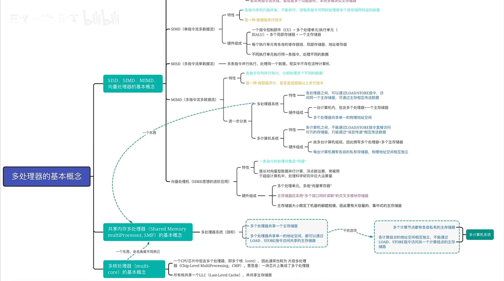
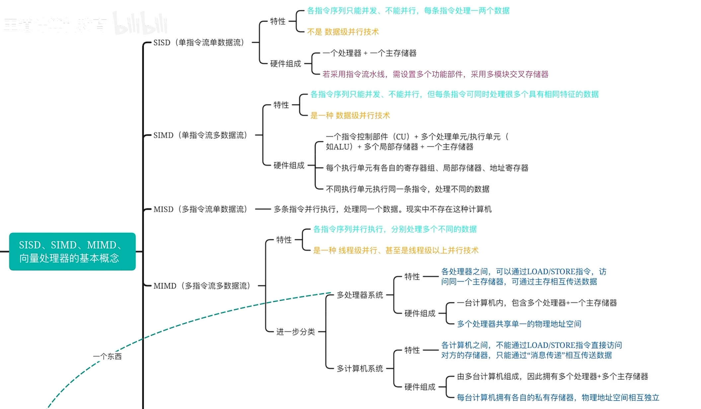
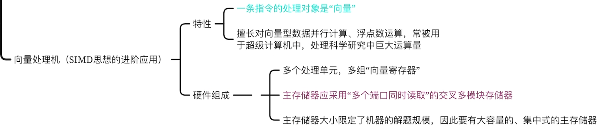
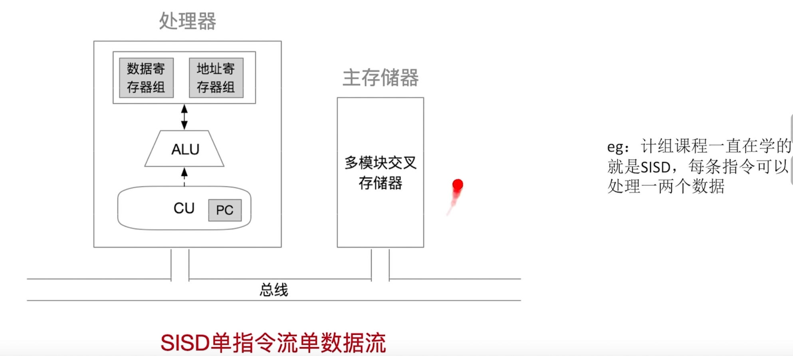
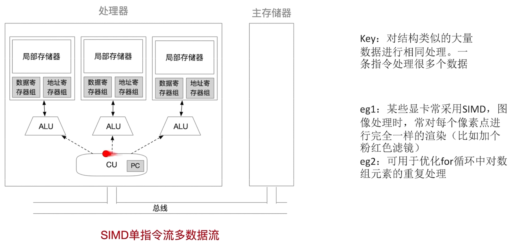
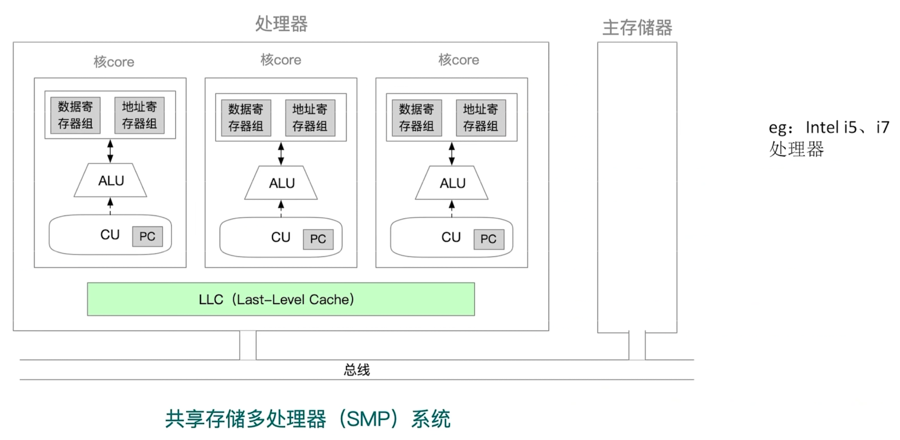
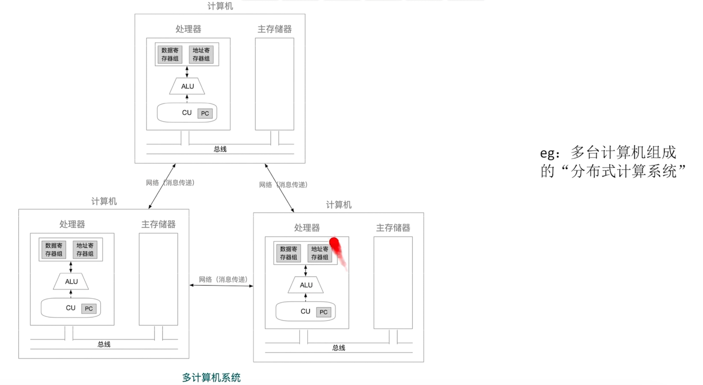
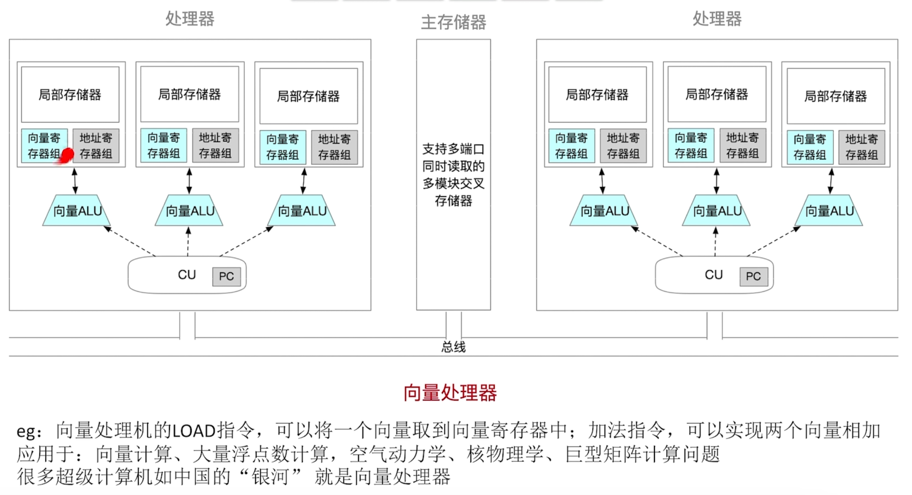
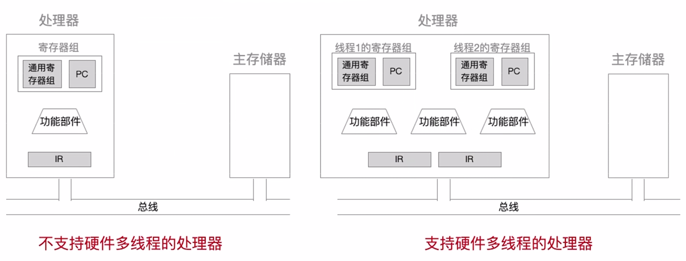
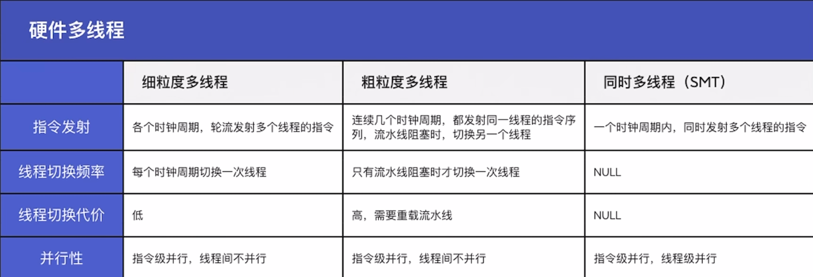

## SISD

- 只能并发，不能并行，每条指令处理一两个数据
- 不是数据级并行技术

## SIMD

- 只能并发，不能并行，每条指令处理很多个具有相同特性的数据
- 是一种数据级并行技术

## MISD

多条指令处理同一数据，没必要，因此不存在这类计算机

## MIMD

- 各指令序列并行执行，处理多个不同数据
- 线程级并行、甚至是线程级以上的并行技术

### 多处理器系统

- 各处理器之间，可以通过Load、Store指令，访问同一主存储器，通过主存相互传递数据

### 多计算机系统

- 各计算机之间，不可以通过Load、Store指令访问对方主存储器，只能通过“消息传递”相互传送数据

## 向量处理机

- 一条指令处理对象是向量
- 采用多端口同时读取的交叉多模块存储器

## 共享内存多处理器SMP

=多核处理器=多处理器系统

就是多个处理器共享一个主存

单一地址空间的多处理器分为两类

- 统一访问处理器UMA---根据处理器与共享存储器之间的连接方式分
  - 基于总线
  - 基于交叉开关网络
  - 基于多级交换网络连接
- 非统一访问处理器NUMA -- 根据处理器中不带高速缓存
  - 不带时，NC-NUMA
  - 带有一致性高速缓存， CC-NUMA

## 多核处理器

一个CPU中包含多个处理器，所有核共享一个LLC(Last- Level-Cache),并共享主存储器

## 硬件多线程

细粒度

粗粒度

同时多线程- Intel中叫超线程HT

## 题目补充

超线程技术是在一个CPU中，提供两套线程处理单元，让单个处理器实现线程级并行。但是使用同一个资源时，需要其中一个线程需要挂起。

和双核CPU区别：

- 双核CPU是将两个不一样的CPU集成到一个封装内
- 超线程技术是复制必要的线程资源让两个线程同时运行。

