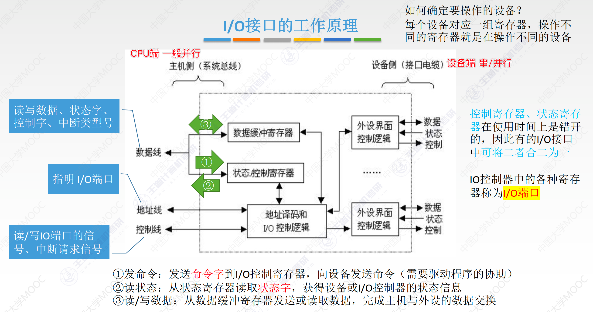
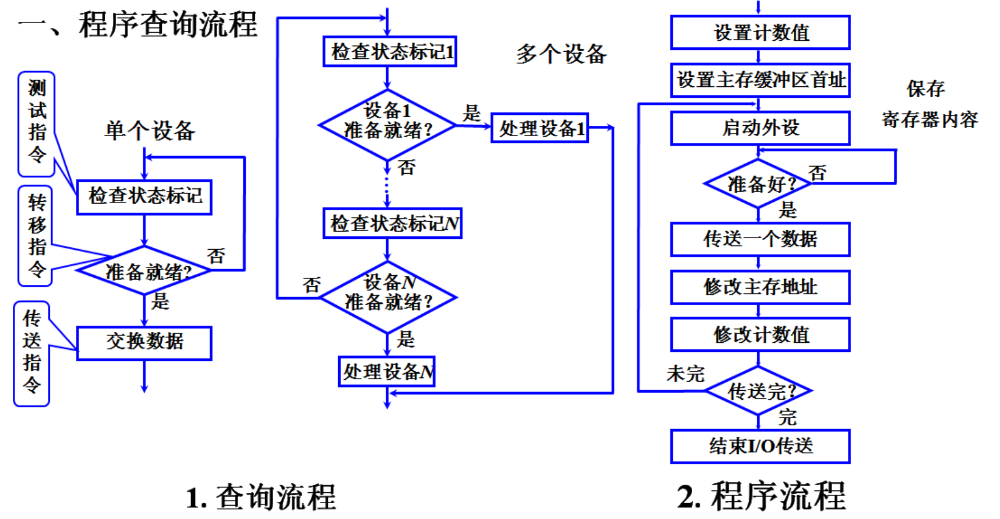
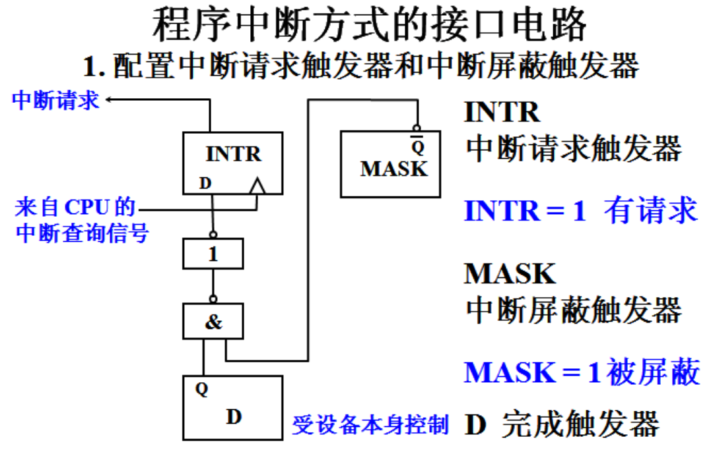
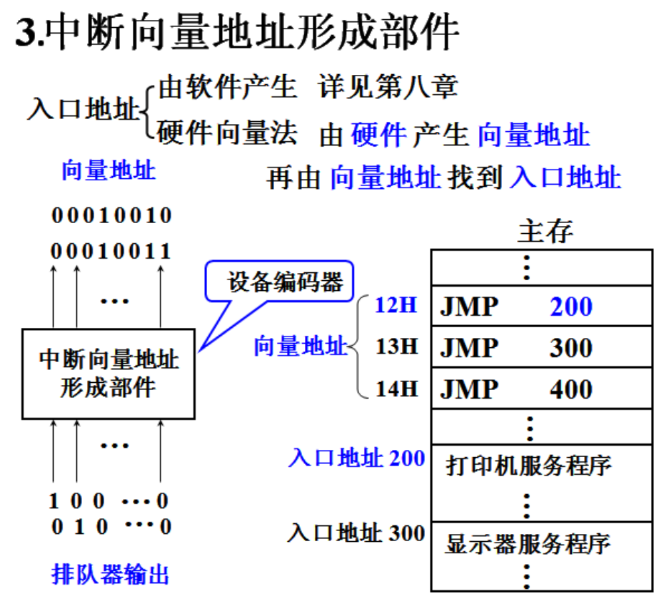
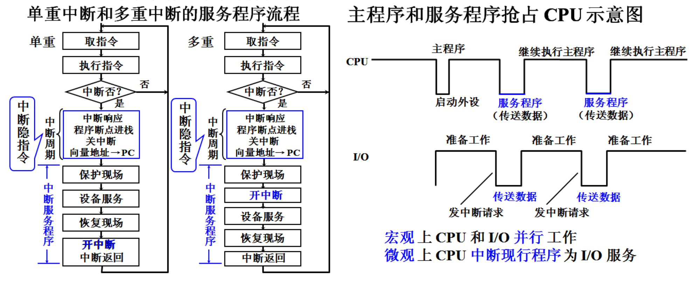
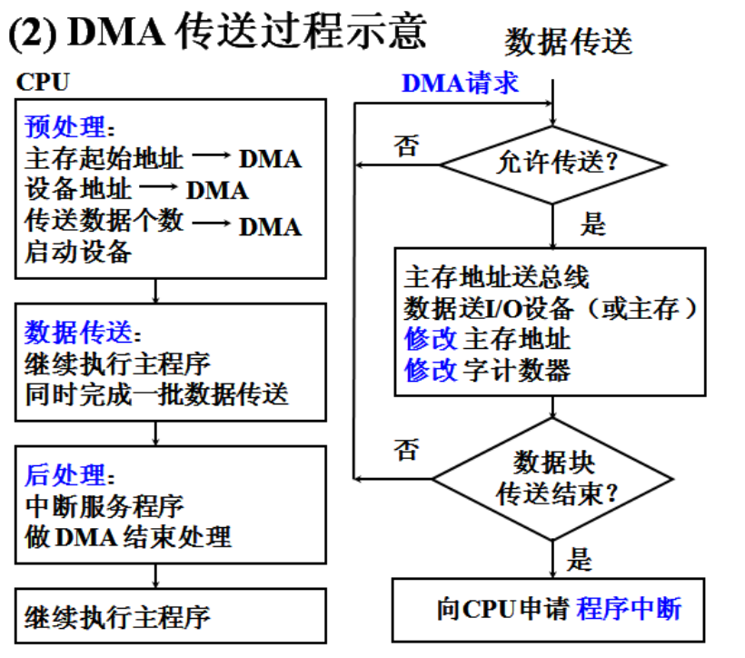
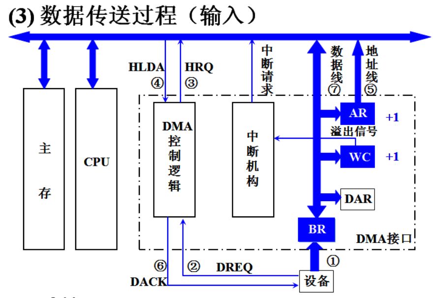
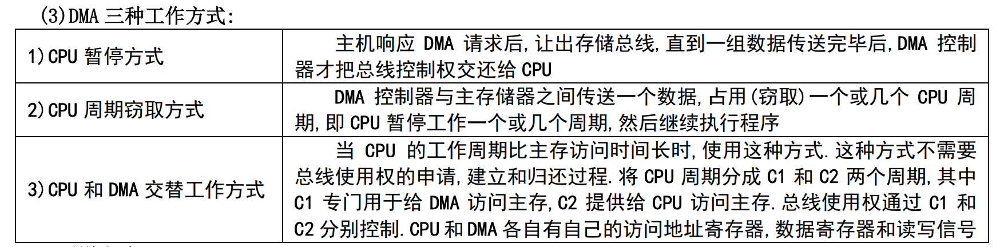
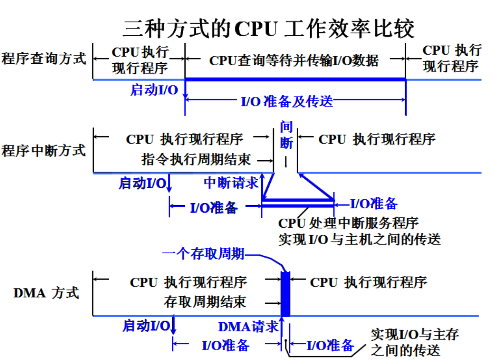
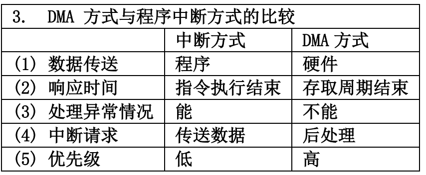

# I/O设备

I/O系统由I/O软件和I/O硬件组成。

I/O软件：驱动程序--采用I/O指令和通道指令实现CPU和I/O设备的信息交换。

I/O硬件：设备控制器来控制设备具体操作，I/O接口与主机总线相连。

I/O控制方式：程序查询、程序中断、DMA方式和通道方式。

显示器：

- 屏幕大小、分辨率、灰度级、刷新频率和显示存储器(VRAM)

- VRAM容量=分辨率*灰度级**位数**

- VRAM带宽=容量*帧频

打印机：

- 工作方式分：针式打印机（票据）、喷模式打印机、激光打印机
- 原理分：击打式和非击打式
- 能否打汉字：点阵式和活字式

## I/O接口

I/O接口作用

- 数据缓冲：通过数据缓冲寄存器（DBR）达到主机和外设工作速度的匹配
- 错误或状态监测：通过**状态寄存器**反馈设备的各种错误、状态信息，供CPU查用
- 控制和定时：接收从控制总线发来的控制信号、时钟信号
- 数据格式转换：串-并、并-串 等格式转换
- 与主机和设备通信：实现 主机—I/O接口—I/O设备 之间的通信

模拟CPU控制打印机：【状态/控制寄存器】- 两个寄存器合为一个，因为两种不一起使用可以合一起

1.通过数据线向【状态/控制寄存器】中的的状态寄存器发送命令字(控制字，一串二进制)存储，然后通过【I/O控制逻辑】对命令读取执行，此时通过打印机接口启动了打印机并且将打印机状态存到【状态/控制寄存器】。

2.CPU对【状态/控制寄存器】进行状态检测，如果打印机准备就绪，就向数据缓冲寄存器中输入数据，同样数据在【I/O控制逻辑】的作用下对打印机进行数据传输（匹配速度）。

3.打印机完成后会向控制寄存器中反馈信息，CPU通过读取状态寄存器检测传输完成

- 对应对I/O方式
- CPU一直轮询的检测状态寄存器
- 通过控制线向CPU发一个中断请求信号
  - 说明：打印机发出的中断可以是完成后的请求也可能是设备故障的请求，这时候打印机同时会向数据缓冲寄存器中发送一个【中断类型号】，CPU结合发过来的中断信号进行不同的处理

4.一个I/O接口可以对应多台打印机，那么需要通过通过【地址线】发送【地址码】进行【地址译码】选择打印机

- I/O接口中的**各种寄存器就是I/O端口**
- CPU对端口的操作：数据端口-读写，状态端口-读，控制端口-写

串行：**一位**一位的传（USB）

**并行**：一个字节或一个字所有位一起传输

ASCII7位+1位奇偶验证码，故键盘的缓冲区DBR一般式8位。 其他情况若涉及到起始位则再+2.

| 统一编址                           | 独立编址                                    |
| :--------------------------------- | :------------------------------------------ |
| 访存指令访问                       | 专门的I/O指令                               |
| 靠地址码区分内存和设备             | 靠指令区分内存和设备                        |
| 占用主存地址空间，主存地址空间变小 | 不占用主存地址空间，地址位数少，译码快      |
| 较大的编编址空间，读写控制电路简单 | I/O指令少，只能对端口读写，程序设计灵活性差 |
| 内存地址和I/O地址不同              | 内存地址和I/O地址可能相同                   |

I/O指令只能在OS内核中使用，属于特权指令。通常是对数据、状态控制寄存器的访问操作，实现的数据传输发生在CPU的通用寄存器和I/O端口之间。

磁盘驱动器不是I/O接口

## I/O方式

### 直接查询方式

当I/O设备较多的时候，CPU按优先级进行查询，需要用到三个指令：测试指令、转移指令、传送指令。转移指令：当检测到当前指令没有准备就绪就向下一个设备跳转。

查询整个流程如上图，补充：

- 传送数据是在CPU的【寄存器】和I/O接口的【数据缓冲寄存器】之间，因此要先将CPU的寄存器原来的内容保存起来。
- 由于传输的数据往往是一批数据，因此要设置一个计数值，如果用原码表示，每次-1，如果用计数值为负数的补码，则每次+1，当计数值为0的时候表示数据传输完成。
- 由于数据是从主存中传输过去，因此还要设置一个主存缓冲区的首地址。
- 接口电路中有两个触发器表示设备工作状态：D-完成触发器  B-工作触发器  D=1就绪 、B=1工作

结合I/O接口理解：通过数据总线查询I/O接口的状态寄存器的状态，其中包括通过地址线传输地址码选择设备过程，传输过程就是在CPU的寄存器和接口的数据缓冲寄存器之间。

### 程序中断方式

中断请求触发器 INTR=1 向CPU发送中断、中断屏蔽触发器MASK=1表示被屏蔽

可见当D=1 和 MASK=0 时候出发 INTR=1

**每条指令执行阶段结束前向接口发送查询信号**

链式排队器-根据优先级选择电路：

- 不可屏蔽中断>内部异常>可屏蔽中断
- 内部异常中，硬件故障>软件中断
- DMA中断>I/O中断
- 高速设备>低速设备

向量中断：CPU响应中断--获得中断型号--计算中断向量地址存入PC（向量地址中存放的是无条件转移指令，直接跳转到入口地址）--执行中断服务程序

1. 中断处理过程：

   - 整体中断周期：中断响应-程序断点进栈-关中断-向量地址存到PC

   - 细节：设备工作结束后 D=1 MASK=0时，且指令执行阶段的结束时刻，由CPU发出查询信号。INTR=1向CPU发出中断请求，INTR进入排队器进行中断判优(看优先级决定是否响应)。CPU允许中断(EINT=1)，进入**中断响应阶段**，中断响应信号INTA将排队器输出送到编译器形成向量地址，找到中断服务程序并且执行。

   - 补充：中断响应过程其实就是执行了中断隐指令:关中断-保存断点(将原程序的断点PUSH进栈或保存在特定寄存器中)-引出中断服务程序(识别中断源--硬件向量法和软件查询法)。
   - 补充：**异常断点**-没有成功执行指令因此要重新执行，断点就是当前指令地址。**中断的断点**是下一条指令的地址。
   - 关注点：CPU是的开/关中断，多重中断CPU的开/关中断变化，多重中断的优先级
   - 多重中断：中断源+屏蔽字的表格 MASK=1表示中断源A屏蔽中断源B，会画出CPU执行程序的过程。

2. 中断服务程序流程：

   

   - 保护现场
     - 程序断点-由隐指令在中断周期完成
     - 保存通用寄存器和状态寄存器的内容-由中断程序完成- Push到堆栈或保存到存储器
   - 开中断（多重中断才有）
   - 设备服务-就是对打印机或者显示器这些设备的操作
   - 恢复现场-Pop堆栈
   - 开中断 中断返回

### DMA方式

主要节约的时间是I/O准备数据的时间而不是I/O存到主存的时间

- 预处理
  - 指明数据是输入还是输出
  - 向DMA设备地址寄存器DAR送入设备号，并启动设备。DAR--表示设备信息存储区的寻址信息，如磁盘的区号，盘面号和柱面号。
  - 向主存地址寄存器AR送入交换数据的主存地址。 AR--将主存中的首地址送到AR
  - 给字计数器WC赋值交换数据的个数。 -- WC通常以补码表示，传输一个字就+1，传输完成就溢出为全0
- 数据传输

BR-数据缓冲寄存器 

DMA接口<=>主存 以字传输 

DMA接口<=>设备 以字节或位传输

传输过程：

1. 准备好一个字，选择设备，将该字读到DMA的BR，BR满（如果是一位一位传，传到一个字就会满）
2. 同时设备向DMA接口发送请求DREQ
3. DMA接口向CPU申请总线控制权HRQ
4. CPU发送HLDA允许
5. 将AR中的主存地址送到地址总线，写命令
6. 通知设备已被授予一个DMA周期（DACK），准备下一个字
7. 将BR中的数据送至数据总线
8. 将BR的数据写到AR指定的地址
9. 修改AR，WC的值
10. 继续传输直到结束

- 后处理

检验送入主存的数是否正确、是否继续使用DMA、测试传送过程是否正确。

DMA访存优先级高于CPU，因为不立即访存就会丢失数据。

交替工作方式适用于CPU的工作周期比主存存取周期长的情况。

存取周期-整个环节

存储周期-一个环节

### 三种方式比较

