计组应用题

# IO专题

day1

- 单独中断传输情况下的cpu时间计算

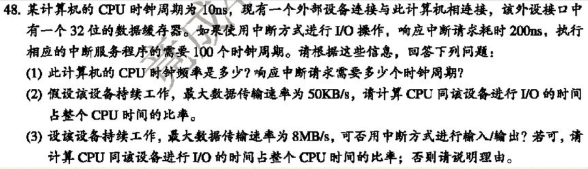


- 不同速率单独中断情况下cpu时间占比

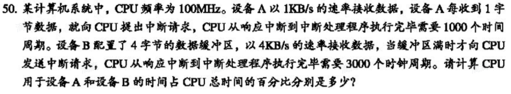


- DMA与中断方式下cpu处理时间占比

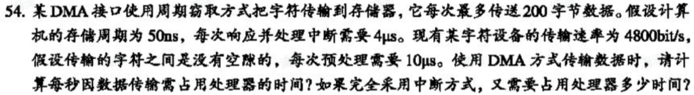


- 程序查询，中断，DMA综合传输题目

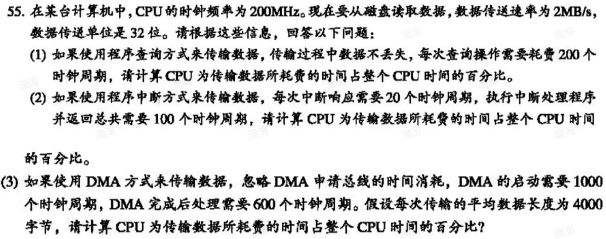


day2

- 文字阅读，定时查询，独占查询，程序中断，DMA周期挪用综合大题

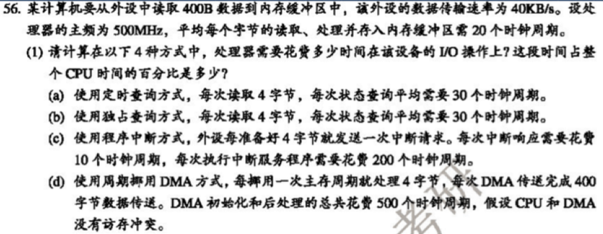


- 中断源与处理机相应请求的关系（选做）

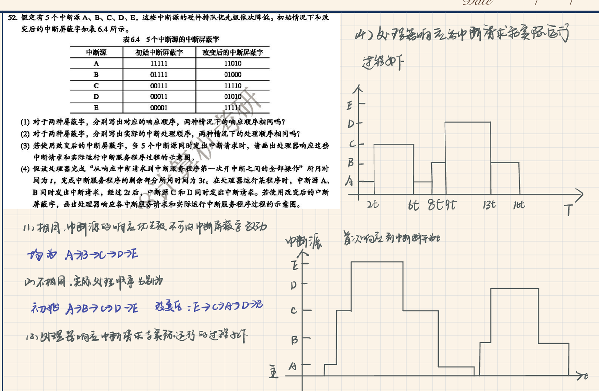


- 三种不同程序查询下cpu处理时间占比

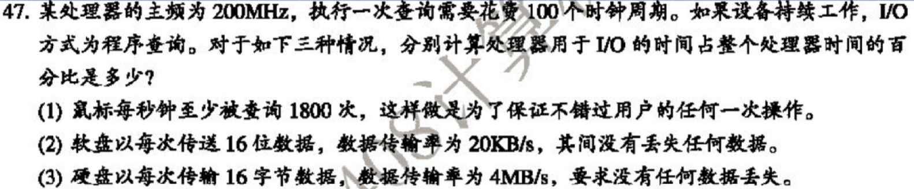


Day3 真题

- 三种传输方式均有，综合性强-18年真题

【2018统考真题】假定计算机的主频为500MHz，CPI为4。现有设备A和B，其数据传输率分别为2MB/s 和40MB/S，对应I/O接口中各有一个32位数据缓冲寄存器。回答下列问题，要求给出计算过程。

1）若设备A采用定时查询I/O方式，每次输入/输出都至少执行10条指令。设备A最 多间隔多长时间查询 一次才能不丢失数据？ CPU用于设备A输入/输出的时间占 CPU总时间的百分比至少是多少？

2）在中断I/O方式下，若每次中断响应和中断处理的总时钟周期数至少为400,则设 备B能否采用中断I/O 方式？为什么？

3）若设备B采用DMA方式，每次DMA传送的数据块大小为1000B，CPU用于DMA预处理和后处理的总 时钟周期数为500，则CPU用于设备B输入/输出的时间占CPU总时间的百分比最多是多少？


- 看c程序计算cache容量与命中率执行速度—10年真题

某计算机的主存地址空间为256MB，按字节编址，指令Cache分离和数据Cache分离，均有8个Cache 行，每个Cache行的大小为64B，数据Cache采用直接映射方式，现有两个功能相同的程序A和B,其伪代 码如下所示：

程序A：

```c
int a[256][256];
int sum_array1(){
  int i,j,sum = 0;
  for(i=0;i<256;i++)
    for(j=0;j<256;j++)
      sum += a[i][j];
  return sum;
}
```

程序B：

```c
int a[256][256];
int sum_array2(){
  int i,j,sum = 0;
  for(j=0;j<256;j++)
    for(i=0;i<256;i++)
      sum += a[i][j];
  return sum;
}
```

假定int 类型数据用32位补码表示，程序编译时，i，j， sum 均分配在寄存器中，数据a按行优先方式存 放，其地址为320（十进制数），请回答下列问题，要求说明理由或给出计算过程。 

（1）不考虑用于cache一致性维护和替换算法的控制位，则数据Cache的总容量是多少？ 

（2）要组元素a [0] [31]和a [1] [1]各自所在的主存块对应的Cache行号分别是多少（Cache行号从0开 始）？ 

（3）程序A和B的数据访问命令中各是多少？那个程序的执行时间更短？


- 三种不同程序查询下cpu处理时间占比

【2009统考真题】某计算机的 CPU 主频为 500MHz，CPI为 5（即执行每条指令平均需 5个时钟周 期）。假定某外设的数据传输率为 0.5MB/S，采用中断方式与主机进行数据传送，以 32 位为传输单 位，对应的中断服务程序包含 18 条指令，中断服务的其他开销相当于2条指令的执行时间。回答下列问 题，要求给出计算过程。

1）在中断方式下，CPU用于该外设I/O的时间占整个CPU时间的百分比是多少？

2）当该外设的数据传输率达到5MB/S时，改用DMA方式传送数据。假定每次DMA 传送块大小为 5000B，且DMA预处理和后处理的总开销为500个时钟周期，则 CPU用于该外设I/O的时间占整个CPU时 间的百分比是多少（假设DMA与CPU之间没有访存冲突）？


- 低位交叉与顺序存储带宽计算—流水线方式


day4

- 文字阅读，IO传输与cache结合DMA与交叉存储，考察面广综合性强-12年真 题

【2012统考真题】假定某计算机的CPU主频为80MHz，CPI为4，平均每条指令访存 1.5次，主存与 Cache之间交换的块大小为16B，Cache的命中率为99%，存储器总线宽带为32位。回答下列问题。

1）该计算机的MIPS数是多少？平均每秒Cache缺失的次数是多少？在不考虑DMA 传送的情况下，主存 带宽至少达到多少才能满足CPU的访存要求？ 2）假定在Cache缺失的情况下访问主存时，存在0.0005%的缺页率，则CPU平均每秒 产生多少次缺页异 常？若页面大小为4KB，每次缺页都需要访问磁盘，访问磁盘时 DMA传送采用周期挪用方式，磁盘I/O 接口的数据缓冲寄存器为32位，则磁盘I/O接口平均每秒发出的DMA请求次数至少是多少？

3）CPU和DMA控制器同时要求使用存储器总线时，哪个优先级更高？为什么？

4）为了提高性能，主存采用4体低位交叉存储模式，工作时每1/4个存储周期启动一个体。若每个体的 存储周期为50ns,则该主存能提供的最大带宽是多少？


- 看图读文字阅读题目明白传输过程和中断传输的各种操作—16年真题

【2016统考真题】假定CPU主频为50MHz，CPI为4，设备D采用异步串行通信方式向主机传送7位ASCII 码字符，通信规程中有1位奇校脸位和1位停止位，从D接收启动命令到字符送入I/O端口需要0.5ms。回 答下列问题，要求说明理由。

1）每传送一个字符，在异步串行通信线上共需传输多少位？在设备D持续工作过程 中，每秒最多可向 I/O端口送入多少个字符？

2）设备D采用中断方式进行输入/输出，示意图如下所示


I/O端口每收到一个字符申请一次中断，中断响应需10个时钟周期，中断服务程序共 有20条指令，其中 第15条指令启动D工作。若CPU需从D读取1000个字符，则完成这一任务所需时间大约是多少个时钟周 期？CPU用于完成这一任务的时间大约是多少个时钟周期？在中断响应阶段CPU进行了哪些操作？


- 读文字磁盘传输与DMA数据传输（第一次综合考察）—22真题

假设某磁盘驱动器中有4个双面盘片，每个盘面有20000个磁道，每个磁道有500个扇区，每个扇区可记 录512字节的数据，盘片转速为7200r/m (转/分)，平均寻道时间为5ms。请回答下列问题。

(1) 每个扇区包含数据及其地址信息，地址信息分为3个字段。这3个字段的名称各是什么? 对于该磁盘， 各字段至少占多少位?

(2) 一个扇区的平均访问时间约为多少 ?

(3) 若采用周期挪用DMA方式进行磁盘与主机之间的数据传送，磁盘控制器中的数据缓冲区大小为64 位，则在一个扇区读写过程中,DMA控制器向CPU发送了多少次总线请求?若CPU检测到DMA控制器的总 线请求信号时也需要访问主存，则DMA控制器是否可以获得总线使用权? 为什么?


- 读题目理解题目要求突发传送事务过程与IO传输和 cache综合—13真题

【2013统考真题】某32位计算机，CPU主频为800MHz， Cache命中时的CPI为4， Cache块大小为32B; 主存采用8体交叉存储方式，每个体的存储字长为32位、存储 周期为40ns;存储器总线宽度为32位，总 线.时钟频率为200MHz，支持突发传送总线 事务。每次读突发传送总线事务的过程包括：送首地址和命 令、存储器准备数据、传 送数据。每次突发传送32B，传送地址或32位数据均需要一个总线时钟周期。 请回答 下列问题，要求给出理由或计算过程。

1）CPU和总线的时钟周期各为多少？总线的带宽（即最大数据传输率）为多少？

2）Cache缺失时，需要用几个读突发传送总线事务来完成一个主存块的读取？

3）存储器总线完成一次读突发传送总线事务所需的时间是多少？

4）若程序BP执行过程中共执行了100条指令，平均每条指令需进行1.2次访存


# 存储专题

day5 

- cache访存和标记命中率等的计算

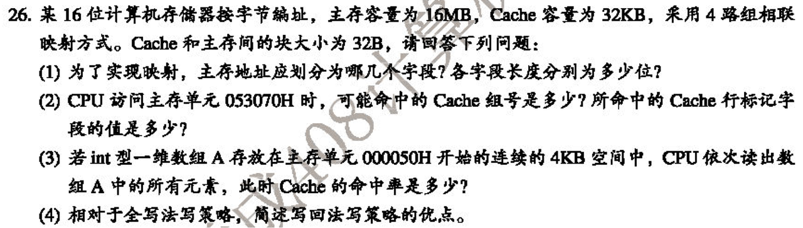


- cache访存格式，cache总容量计算

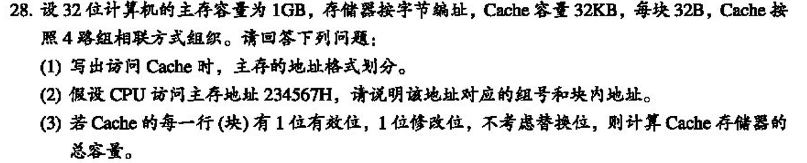


- cache寻址命中率与读取时间计算

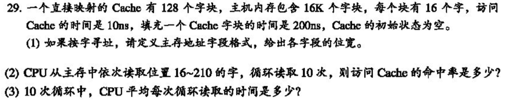


Day6

- 读c程序读文字解决cache主存相关题目，cache行划分

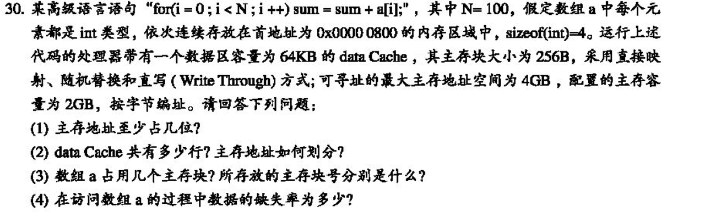


- 看c程序计算caache命中率和储存块变化求命中率

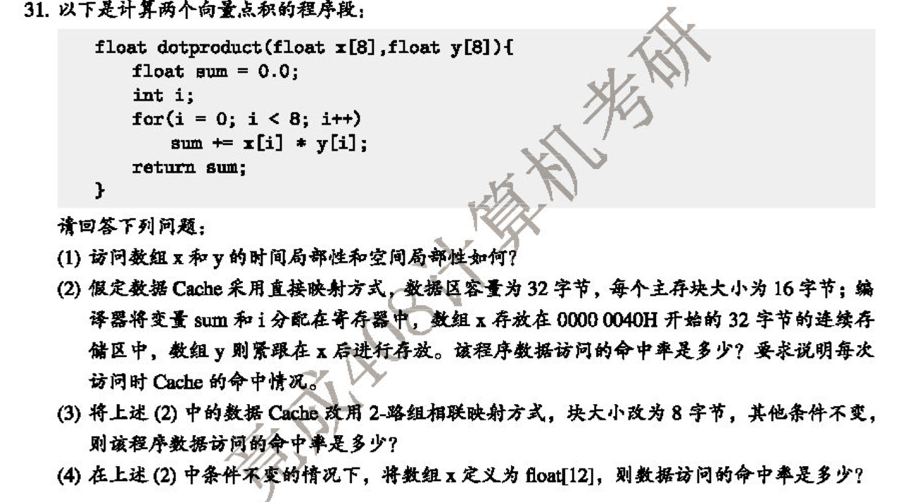


- 虚拟内存与cache结合与具体地址读取过程


- 虚拟内存页表与cache与进程切换相关的理解

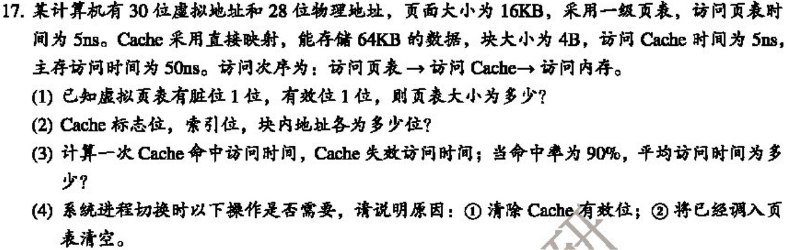


Day7-真题

- 看图虚拟页式存储与cache结合-16年真题

【2016统考真题】某计算机采用页式虚拟存储管理方式，按字节编址，虚拟地址为32 位，物理地址为 24位，页大小为8KB；TLB采用全相联映射；Cache数据区大小为 64KB，按二路组相联方式组织，主存 块大小为64B。存储访问过程的示意图如下。

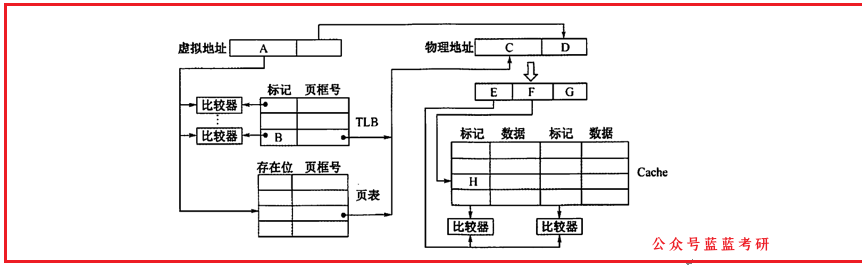

回答下列问题：

 1）图中字段A-G的位数各是多少？TLB标记字段B中存放的是什么信息？

 2）将块号为4099的主存块装入Cache时，所映射的Cache组号是多少？对应的H字 段内容是什么？

 3）是Cache缺失处理的时间开销大还是缺页处理的时间开销大？为什么？

 4）为什么Cache可以采用直写策略，而修改页面内容时总是采用回写策略？


- 看图虚拟页式访存与cache结合—18年真题

【2020统考真题】有实现x*y的两个C语言函数如下：

unsigned umul （unsigned x， unsigned y） {return x*y;}

int imul （int x， int y） {return x * y; }

假定某计算机 M 中的 ALU 只能进行加减运算和逻辑运算。请回答下列问题。 

1）若M的指令系统中没有乘法指令，但有加法、减法和位移等指令，则在M上也能 实现上述两个函数 中的乘法运算，为什么？ 

2）若M的指令系统中有乘法指令，则基于ALU、位移器、寄存器及相应控制逻辑实 现乘法指令时，控制 逻辑的作用是什么？ 

3） 针对以下三种情况：a）没有乘法指令；b）有使用ALU和位移器实现的乘法指令；c）有使用阵列乘 法器实现的乘法指令，函数umul（）在哪种情况下执行的时间最长？在哪种情况下执行的时间最短？说 明理由。

4）n位整数乘法指令可保存 2n 位乘积，当仅取低 n 位作为乘积时，其结果可能会发生 溢出。当 n=32、x = 2 ^31 -1、 y = 2时，带符号整数乘法指令和无符号整数乘法指令得到的 x X y 的 2n 位乘积分 别是什么（用十六进制表示）？此时函数umul（）和 imul（）的返回结果是否溢出？对于无符号整数 乘法运算，当仅取乘积的低n位作为 乘法结果时，如何用2n位乘积进行溢出判断？


- 文字叙述虚拟分页与cache综合—21年真题

【2021统考真题】假设计算机M的主存地址为24位，按字节编址；采用分页存储管理 方式，虚拟地址为 30位，页大小为4KB；TLB采用二路组相联方式和LRU替换策 略，共8组。请回答下列问题

1）虚拟地址中哪几位表示虚页号？哪几位表示页内地址？

2）已知访问TLB时虚页号高位部分用作TLB标记，4氐位部分用作TLB组号，M的虚 拟地址中哪几位是 TLB标记？哪几位是TLB组号？

3）假设TLB初始时为空，访问的虚页号依次为10，12，16，7，26，4，12和20，在此过程 中，哪一个 虚页号对应的TLB表项被替换？说明理由。

4）若将M中的虚拟地址位数增加到32位，则TLB表项的位数增加几位


day8-真题

- 看图cache访存于虚拟页式综合-11年真题

【2011统考真题】某计算机存储器按字节编址，虚拟（逻辑）地址空间大小为16MB，主存（物理）地 址空间大小为1MB，页面大小为4KB；Cache采用直接映射方式，共8行；主存与Cache之间交换的块大 小为32B。系统运行到某一时刻时，页表的部分内容和Cache的部分内容分别如下的左图和右图所示， 图中页框号及标记字段的内容为十六进制形式。

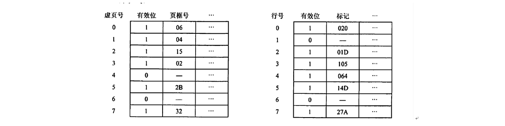

回答下列问题:

1）虚拟地址共有几位，哪几位表示虚页号？物理地址共有几位，哪几位表示页框号 （物理页号）？[公 众号：蓝蓝考研]

2）使用物理地址访问Cache时，物理地址应划分成哪几个字段？要求说明每个字段的 位数及在物理地 址中的位置

3）虚拟地址001C60H所在的页面是否在主存中？若在主存中，则该虚拟地址对应的物理地址是什么？ 访问该地址时是否Cache命中？要求说明理由。

4）假定为该机配置一个四路组相联的TLB，共可存放8个页表项，若其当前内容（十 六进制）如下图所 示，则此时虚拟地址024BACH所在的页面是否存在主存中？要 求说明理由。

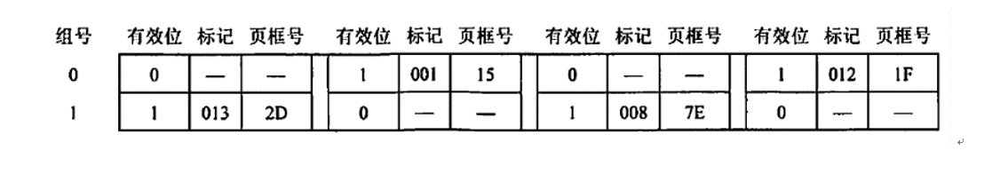


- 看c程序计算cache容量与命中率执行速度—10年真题

Day3- 第二题


- 看c程序计算cache格式与命中率，缺失处理流程—20真题

【2020统考真题】假定主存地址为32位，按字节编址，指令Cache和数据Cache与主存之间均采用8路 组相联映射方式，直写（Write Through）写策略和LRU替换算 法，主存块大小为64B，数据区容量各 为32KB。开始时Cache均为空。请回答下列问题。

1 ）Cache每一行中标记（Tag）、LRU位各占几位？是否有修改位？

 2）有如下C语言程序段：

​	for（k = 0；k < 1024；k++）

​		s[k] = 2 * s[k];

若数组s及其变量k均为int型，int型数据占4B，变量k分配在寄存器中，数组s在主存中的起始地址为 008000C0H，则在该程序段执行过程中，访问数组s的数据Cache缺失次数为多少？

3）若CPU最先开始的访问操作是读取主存单元00010003H中的指令，简要说明从 Cache中访问该指令 的过程，包括Cache缺失处理过程


- 看文字计算cache缺失时的突发传送与I/O传输结合， 根据题目传输方式阅读理解做题（题目灵活综合性强，需要 多培养理解能力）—13真题

【2013统考真题】某32位计算机，CPU主频为800MHz， Cache命中时的CPI为4， Cache块大小为32B; 主存采用8体交叉存储方式，每个体的存储字长为32位、存储 周期为40ns；存储器总线宽度为32位，总 线时钟频率为200MHz，支持突发传送总线 事务。每次读突发传送总线事务的过程包括：送首地址和命 令、存储器准备数据、传 送数据。每次突发传送32B，传送地址或32位数据均需要一个总线时钟周期。 请回答 下列问题，要求给出理由或计算过程。[公众号：蓝蓝考研]

1）CPU和总线的时钟周期各为多少？总线的带宽（即最大数据传输率）为多少？ 2）Cache缺失时，需要用几个读突发传送总线事务来完成一个主存块的读取？

3）存储器总线完成一次读突发传送总线事务所需的时间是多少？ 4）若程序BP执行过程中共执行了100条指令，平均每条指令需进行1.2次访存


