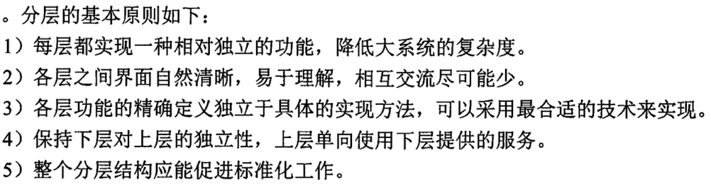
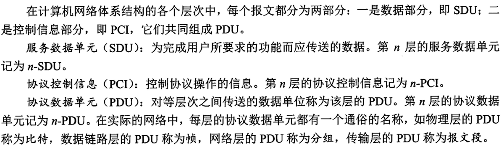
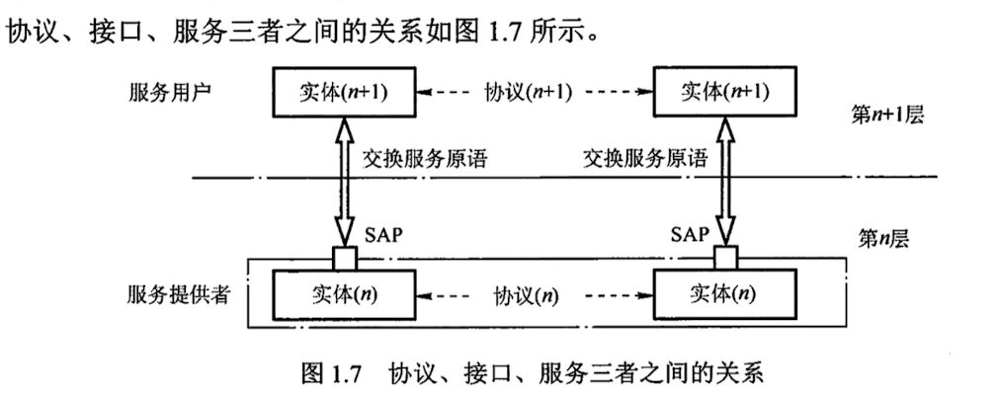
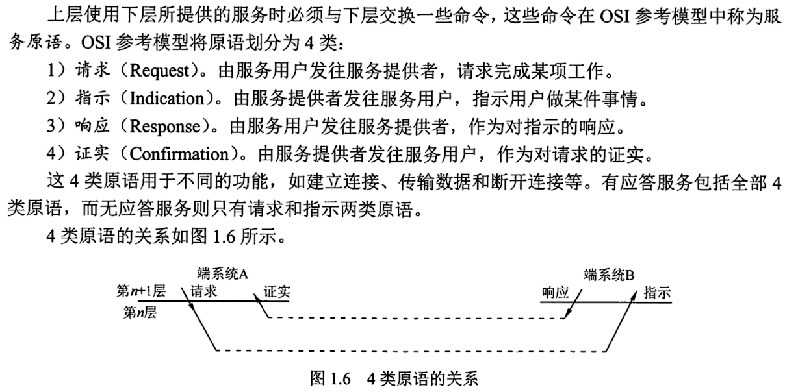
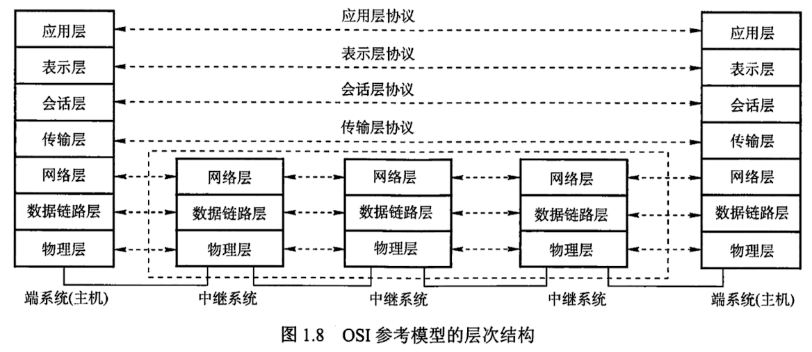
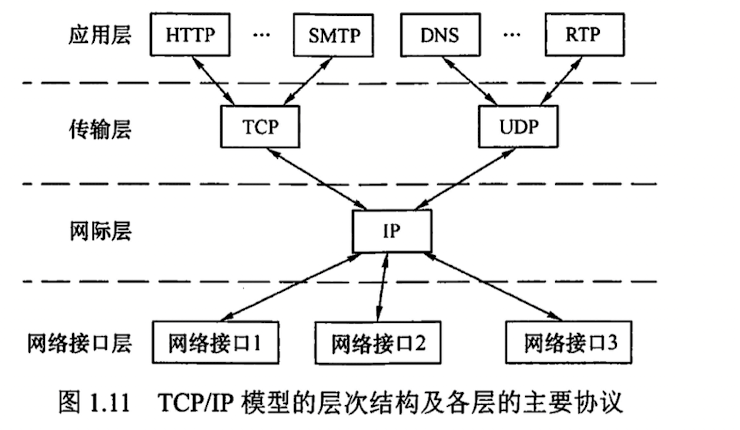
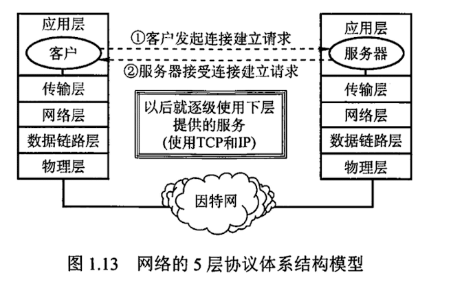

# 第1章 计算机网络体系结构

## 1.1 计算机网络概述
### 1.1.1 计算机网络的概念

- 互连的、自治的计算机系统的集合
- 以能够互相共享资源的方式互联起来的自治计算机系统的集合

### 1.1.2 计算机网络的组成

### 组成部分

- 硬件
  - 主机（端系统）
  - 通信链路（双绞线、光纤）
  - 交换设备（路由器、交换机）
  - 通信处理机（网卡）
- 软件
  - 资源共享的软件
  - 工具软件
- 协议
  - 规定了网络传输数据时所遵循的规范

### 工作方式

- 边缘部分
  - 供用户使用的主机（用来通信和资源共享）
- 核心部分
  - 连接这些的路由器

### 功能组成

- 通信子网
  - 传输介质+通信设备+相应的网络协议
- 资源子网
  - 实现资源共享的设备+软件

### 1.1.3 计算机网络的功能

- 数据通信

- 资源共享
- 分布式处理
- 提高可靠性
- 负载均衡

### 1.1.4 计算机网络的分类

#### 按分布范围

- 广域网（WAN）
- 城域网（MAN）
- 局域网（LAN）
- 个人局域网（PAN）

#### 传输技术分类

- 广播式网络
- 点对点网络

#### 按拓扑结构分类

#### 按使用者分类

- 公用网
- 专用网

#### 按交换技术分类

- 电路交换网络
- 报文交换网络
- 分组交换网络

#### 按传输介质分类

- 有线
- 无线

### 1.1.5 计算机网络的标准化工作(已删)

### 1.1.6 计算机网络的性能指标(✅✅)

#### 带宽

- 通信线路允许通过的信号频带范围 HZ
- 数字通道所能传送的最高数据传输速率 b/s

#### 时延

- 发送时延
- 传播时延
- 处理时延
- 排队时延

#### 时延宽带积

传播时延*信道带宽

#### 往返时延

#### 吞吐量

单位时间内通过某个网络的数据量

#### 速率

> 也称数据传输率、数据率、比特率

#### 信道利用率

有数据通过时间/（有+无）数据通过时间

## 1.2 计算机网络体系结构与参考模型
### 1.2.1 计算机网络分层结构

### 1.2.2 计算机网络协议、接口、服务的概念(✅)

- 协议
  - 语法 -- 传输数据的格式
  - 语义 -- 需要发出的何种控制信息、完成何种动作以及做出何种应答
  - 同步 -- 同步规定执行各种操作的条件、时序关系。
- 接口
  - 每层只为紧邻的层次之间定义接口
  - 同一节点相邻两层的实体通过服务访问点（SAP）进行交互
- 服务
  - 下层为紧邻的上层提供功能调用，垂直的
  - 
  - 面向连接服务和无连接服务
  - 可靠服务和不可靠服务
  - 有应答服务和无应答服务

### 1.2.3 ISO/OSI参考模型和 TCP/IP 模型(✅✅)

