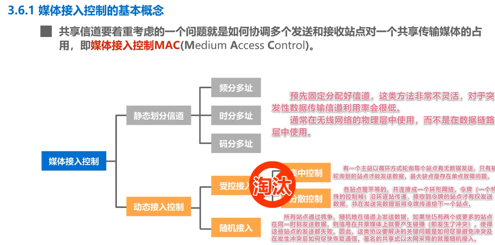
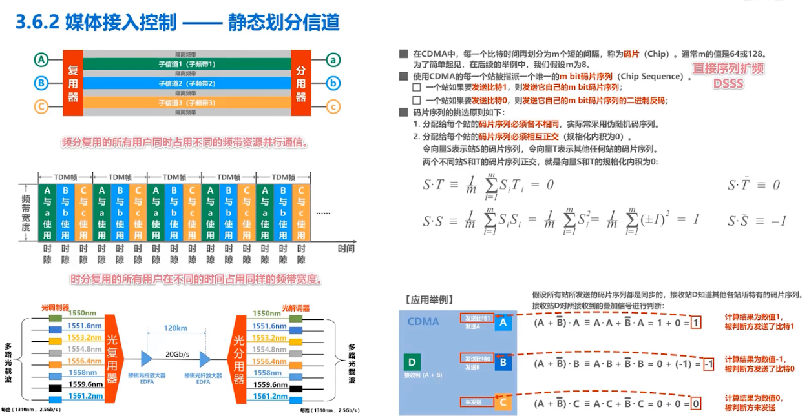
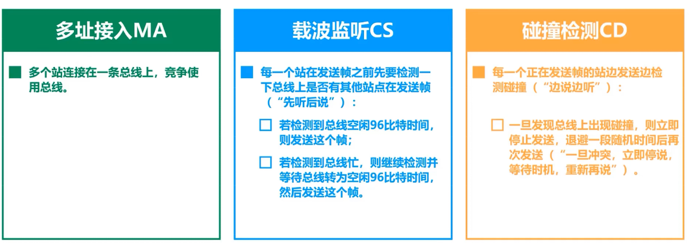

## 介质访问控制

点对点链路和链路层交换机的交换式局域网在有线领域已经完全取代了共享式局域网

### 静态划分信道

- 频分复用FDM
- 时分复用TDM
- 波分复用WDM
- 码分复用CDM
  - 码分多址CDMA- Code Division Multiple Access
  - 一个比特时间分成m个短的间隔，称为码片Chip m--一般64或者128，举例方便一般取8
  -  

小结：

### 动态接入

> 引入：主机向总线同时传输数据会发生碰撞

载波监听多址接入/碰撞检测CSMA/CD（Carrier Sense Multiple Access / Collision Detection）

 

