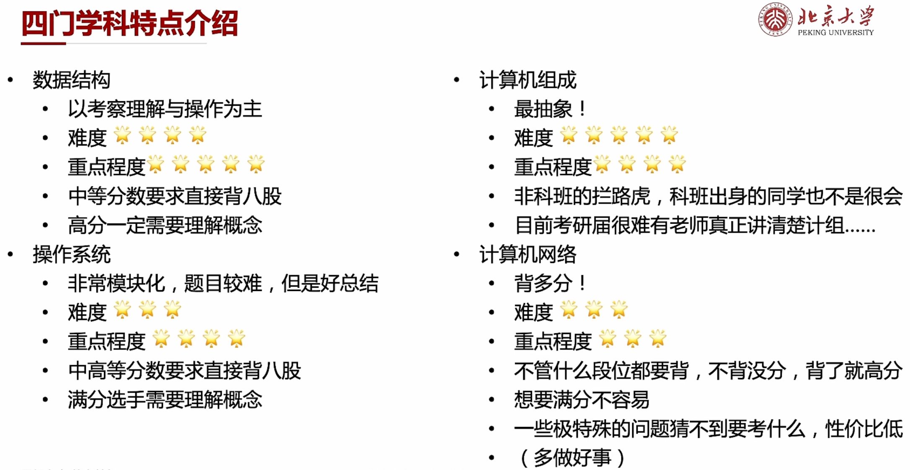

## 目录

1. 目标设定：明确要实现的目标，确保目标具体、可衡量、可实现和与整体愿景一致。
2. 目标分解：将主要目标分解为具体的、可操作的子目标，以便更好地管理和实现它们。
3. 优先级排序：根据目标的重要性和紧迫性，确定每个目标的优先级，以确保资源的合理分配。
4. 制定行动计划：为每个目标制定详细的行动计划，包括具体的任务、时间表、责任人和资源需求。
5. 资源分配：分配适当的资源，包括人力、财力、技术和设备，以支持目标的实现。
6. 监测和评估：定期监测目标的进展，并进行评估和调整。识别问题和挑战，并采取必要的纠正措施。
7. 激励和奖励：提供适当的激励和奖励机制，以鼓励团队成员积极参与和实现目标。
8. 持续改进：不断反思和改进目标规划过程，以提高效率和成果。

落地：

- 目标要落实
- 目标要具体
- 目标要实际
- 目标要极限

短期目标：一天或者一周--具体到每个时间段

- 可持续
- 可操作
- 可检验

长期目标：

- 无数个小目标
- 兼顾梦想和合理性
- 总分是个重要指标
- 具体到每个科目的小分

好的规划：

- 一个刚刚好可以完成
- 做完有成就感
- 自己最合适

“三天一个单位”--一天学习+一天做题+一天复盘/预习

> 针对408每个章节

比较稳的分数400

- 数学：130 
- 408：120
- 英语：75
- 政治：75

| 日期   | 时间            | 学习内容                      |
| ------ | --------------- | ----------------------------- |
| 第一天 | 下午1:00 - 1:45 | 学习3.1 存储器概述            |
|        | 下午1:45 - 2:30 | 学习3.2 主存储器              |
|        | 下午2:30 - 3:00 | 复习前面学习内容，整理笔记    |
| 第二天 | 下午1:00 - 1:45 | 学习3.3 主存储器与 CPU 的连接 |
|        | 下午1:45 - 2:30 | 学习3.4 外部存储器            |
|        | 下午2:30 - 3:00 | 复习前面学习内容，整理笔记    |
| 第三天 | 下午1:00 - 1:45 | 学习3.5 高速缓冲存储器        |
|        | 下午1:45 - 2:30 | 学习3.6 虚拟存储器            |
|        | 下午2:30 - 3:00 | 复习前面学习内容，整理笔记    |

## 1.目标设定

> 明确要实现的目标，确保目标具体、可衡量、可实现和与整体愿景一致。
>
> 落地：
>
> - 目标要落实
> - 目标要具体
> - 目标要实际
> - 目标要**极限**
>
> 短期目标：一天或者一周--具体到每个时间段
>
> - 可持续
> - 可操作
> - 可检验
>
> 长期目标：
>
> - 无数个小目标
> - 兼顾梦想和合理性
> - 总分是个重要指标
> - 具体到每个科目的小分

比较稳的分数400

- 数学：130 
- 408：120
- 英语：75
- 政治：75

长期目标：

短期目标：

## 2.目标分解

## 3.优先级排序

> 进度+占比

## 4.制定行动计划

> 好的规划：
>
> - 一个刚刚好可以完成
> - 做完有成就感
> - 自己最合适

七月前的时间表

| 时间段      | 任务          | 备注 |
| ----------- | ------------- | ---- |
| 7:00-8:00   | 自由安排      |      |
| 8:00-9:00   | 单词整理      |      |
| 9:00-10:00  | 线代 -n维向量 |      |
| 10:00-11:00 | 线代-n维向量  |      |
| 11:00-12:00 | 线代-660题目  |      |
| 14:00-15:00 | 英语外刊      |      |
| 15:00-16:00 | 英语外刊      |      |
| 16:00-17:00 | 组成原理      |      |
| 19:00-20:00 | 组成原理      |      |
| 20:00-21:00 | 组成原理      |      |
| 21:00-22:00 | 优化安排      |      |

## 5.资源分配

> 时间+金钱💰

## 6.监测和评估

> 1. 进度报告和里程碑：设定关键的里程碑和截止日期，并要求团队成员定期提交进度报告。通过跟踪任务的完成情况和与预期进度的对比，可以评估项目的整体进展。
> 2. 绩效评估和指标：制定关键绩效指标（KPIs），用于衡量任务的完成情况和质量。这些指标可以是时间性的，如任务完成时间；也可以是质量性的，如任务的准确性或用户满意度。通过定期评估这些指标，可以判断任务执行的效果。
> 3. 会议和讨论：定期召开团队会议，讨论任务的进展和遇到的问题。这样可以及时发现并解决问题，确保任务按计划进行。会议还可以提供一个交流和分享的平台，促进团队合作和知识共享。
> 4. 项目管理工具：使用项目管理工具（如Trello、Asana、Jira等）来跟踪任务的状态和进展。这些工具提供了任务分配、进度追踪、团队协作等功能，可以方便地监测和评估任务的执行情况。
> 5. 反馈和评估：定期收集团队成员的反馈和意见，了解任务执行过程中的问题和改进点。可以通过匿名调查、一对一面谈或团队评估等方式进行，以便及时纠正和改进任务执行的方法和流程。
> 6. 问题解决和风险管理：设立问题解决和风险管理机制，及时处理和解决任务执行中遇到的问题和风险。通过追踪问题解决的效果和风险控制的情况，评估任务执行的可行性和可靠性。

## 7.激励和奖励

> 玩+休息+写作

## 8.持续改进

> 1. 数据驱动决策：强调数据分析和指标监测的重要性，确保决策和改进的依据是可靠的数据。采用数据驱动的方法，基于数据进行决策和优化，而不是凭主观感觉或直觉。
>
> 2. 迭代式改进：采用迭代的方式进行改进，将任务分解为小步骤，每次改进都要有明确的目标和期望结果。通过迭代的方式逐步优化任务执行过程，避免一次性的大规模改变，减少风险和不确定性。
>
> 3. 反馈机制：建立有效的反馈机制，包括团队内部和外部的反馈渠道。收集来自团队成员、客户、用户等的反馈意见，及时了解问题和改进的需求。鼓励开放和诚实的沟通，接受建设性的反馈。
>
> 4. 创新思维和实验精神：鼓励团队成员提出新的想法和创新解决方案。为团队提供创新的环境和资源，鼓励尝试新的方法和实验。允许失败和学习，从失败中吸取教训，并调整方法和策略。
>
> 5. 自动化和工具支持：利用现代技术和工具来支持任务的持续改进。自动化重复性的任务，减少人工操作的错误和成本。采用适合的项目管理和协作工具，提高团队的效率和协作能力。
>
> 6. 绩效评估和奖励机制：建立明确的绩效评估和奖励机制，与持续改进的目标和成果相匹配。奖励团队成员对任务改进做出的贡献，鼓励积极参与和持续改进的行为。
>
> 7. 持续学习和分享：鼓励团队成员进行持续学习和知识分享，保持对行业最新趋势和最佳实践的关注。定期组织内部分享会议或培训，促进团队成员之间的学习和交流，推动持续改进的知识共享。
>

## 9.灵感

在制定计划时，经常遇到头脑一片空白的情况是很常见的。这可能是由于以下一些原因：

1. 缺乏清晰的目标：如果没有明确的目标或任务，你可能会感到困惑和无所适从。在制定计划之前，确保你对自己要实现的目标和任务有清晰的认识。

2. 信息过载：当面对大量的信息和选项时，思维可能会变得混乱，难以做出决策。在这种情况下，尝试将信息进行分类和整理，以便更好地理清思路。

3. 缺乏启发和灵感：有时候我们需要一些灵感或启发来帮助我们思考和制定计划。寻找一些刺激思维的方法，如阅读相关的书籍、寻找灵感的图片或图表，或与他人进行头脑风暴。

4. 担心失败和不确定性：担心计划失败或不确定的结果可能阻碍你的思考。尝试放下担忧，专注于你能够控制和影响的方面，并制定出可行的计划。

5. 缺乏经验或知识：如果你对任务或领域不熟悉，可能会感到无从下手。在这种情况下，进行一些研究和学习，获取必要的知识和信息，以便更好地制定计划。

解决这种情况的方法包括：

1. 放松和冥想：尝试放松身心，冥想一段时间，以清空思维并提高专注力。

2. 做头脑风暴：将所有的想法和可能的选项记录下来，不加限制地思考，并在之后进行筛选和整理。

3. 借鉴他人的经验：寻找类似任务或领域的成功案例，并从中获得灵感和启示。

4. 采用工具和方法：使用一些计划和组织工具，如思维导图、任务管理工具等，来帮助整理和组织思维。

5. 寻求他人的意见和建议：与他人进行讨论和交流，听取他们的意见和建议，可以帮助你打开思路和发现新的想法。

当制定考研学习计划时，如果感到头脑过载，可以采取以下方法来解决这个问题：

1. 分解目标：将大的目标（考研）分解为更小的里程碑和任务。将整个备考过程划分为阶段，并为每个阶段确定明确的目标。例如，可以将备考阶段划分为复习基础知识、做题训练、模拟考试等，然后为每个阶段制定具体的任务和时间安排。

2. 制定详细计划：将每个阶段的任务进一步细化，制定详细的计划。将任务分解为更小的子任务，为每个子任务设定截止日期和优先级，以确保学习计划的可操作性和可实现性。

3. 设置时间段：将每天的学习时间划分为不同的时间段，并为每个时间段确定特定的任务。例如，早上专注于复习理论知识，下午进行做题训练，晚上进行总结和复习。合理安排时间段可以帮助你更好地集中注意力并提高效率。

4. 制定详细的任务清单：每天开始前，制定一份详细的任务清单，列出当天要完成的具体任务。将任务按优先级排序，并在完成每个任务后进行勾选或标记，以保持清晰的工作进度。

5. 利用时间管理工具：使用时间管理工具，如任务管理应用程序、待办事项列表或日程安排工具，帮助你组织和跟踪任务。这些工具可以提醒你任务的截止日期，并帮助你合理分配时间。

6. 寻求帮助和建议：如果头脑过载，不知道如何开始或如何安排任务，可以寻求他人的帮助和建议。和老师、学长/学姐、考研辅导员或其他备考者进行交流，听取他们的经验和建议，可以为你提供一些建设性的指导。

7. 灵活调整计划：学习计划不是一成不变的，随着实际情况的变化，你可能需要进行一些调整和修改。如果发现某个任务过于困难或时间不够充裕，可以重新评估和调整计划，以适应当前的情况。

> 当制定学习计划时，里程碑和任务是用来划分学习过程和目标的重要概念。
>
> 1. 里程碑（Milestone）：里程碑是指整个学习过程中的重要阶段或关键点，代表着你在备考过程中的重要进展或达到的目标。每个里程碑通常对应着一个具体的时间点或一段时间。以下是一个例子：
>
>    - 里程碑：完成基础知识复习
>      - 时间：7月1日至7月15日
>      - 描述：在这个阶段，你的目标是完成考研所需的基础知识复习，包括各科目的重点概念、公式和定义的掌握。这个阶段的里程碑是基础知识复习的结束，为接下来的做题训练和模拟考试做好准备。
>
> 2. 任务（Task）：任务是在每个里程碑中具体需要完成的工作或学习任务，是里程碑实现的具体步骤。任务通常是具体、可量化的行动，能够直接推动你朝着里程碑和最终目标的方向前进。以下是一个例子：
>
>    - 任务：完成线性代数章节的复习笔记
>      - 描述：在基础知识复习阶段的任务之一是复习线性代数章节。具体任务是编写复习笔记，包括重要概念、定理、公式和例题的总结。这个任务可以进一步分解为每天的具体学习任务，如每天复习一个小节，做相关的练习题等。
>
> 通过明确的里程碑和任务，你可以更好地组织和规划学习过程，确保每个阶段和任务的顺利完成，从而逐步实现最终的考研目标。

~~~python
制定详细的考研学习计划示例：

目标院校：某大学计算机科学与技术专业研究生

分数线要求：总分不低于320分，专业课不低于150分

时间范围：2023年7月1日至2024年12月31日（18个月）

1. 里程碑：基础知识复习阶段（7月1日至8月31日）
   - 任务：
     - 制定每周复习计划，包括数学、英语和计算机基础等科目
     - 重点复习数学的代数、微积分、概率论等内容
     - 复习英语的词汇、阅读理解和写作技巧
     - 温习计算机基础知识，包括数据结构、算法、操作系统等
   - 每周进度目标：
     - 数学：完成两章的复习，包括概念梳理和相关题目练习
     - 英语：背诵并掌握100个单词，完成一篇阅读理解练习
     - 计算机基础：复习并做完一套相关题目
   - 预期成果：基础知识复习全面展开，对重点内容有初步掌握

2. 里程碑：专业课程复习阶段（9月1日至12月31日）
   - 任务：
     - 制定每周专业课程复习计划，涵盖计算机网络、数据库、操作系统等科目
     - 深入学习每个科目的核心知识点和重点概念
     - 解析历年真题，分析考点和题型特点
     - 完成每周的专业课题目练习和模拟考试
   - 每周进度目标：
     - 计算机网络：复习一章的核心知识点，做完一套相关题目
     - 数据库：学习一章的重点内容，完成一套数据库设计题目
     - 操作系统：温习一章的概念和原理，解析一套操作系统的真题
   - 预期成果：对专业课程的核心知识有较深入的理解和掌握，能够熟练应对考试中的相关题目

3. 里程碑：模拟考试与弱项攻克阶段（2024年1月1日至4月30日）
   - 任务：
     - 参加每月一次的模拟考试，模拟考试环境和时间要求与实际考试接近
     - 分析

模拟考试成绩，找出自己的弱项和薄弱环节
     - 针对弱项进行有针对性的复习和强化训练
     - 解析模拟考试和历年真题，加强对考点和解题技巧的理解
   - 每月进度目标：
     - 参加模拟考试并及时分析成绩，记录弱项和改进计划
     - 每周针对一个弱项进行复习和练习，完成相关题目
   - 预期成果：熟悉考试环境，提高应试能力，并显著提升弱项的掌握程度

4. 里程碑：冲刺阶段（5月1日至考试结束）
   - 任务：
     - 制定每日复习计划，涵盖所有科目的重点内容
     - 解析历年真题和模拟题，强化题型和考点的熟悉程度
     - 完成每日的综合复习和模拟考试
     - 积极参加各类复习班、辅导课程和讲座
   - 每日进度目标：
     - 完成每个科目的综合复习，温故而知新
     - 解析并做完一套历年真题或模拟题
   - 预期成果：全面回顾知识点，熟悉考试题型和解题思路，达到最佳状态进行考试准备

这是一个考研学习计划的示例，你可以根据自己的情况和需求进行调整和修改。请记得根据计划的实际执行情况进行评估和调整，灵活应对学习过程中的变化和挑战。

当制定里程碑时，可以考虑以下原则以优化计划：

1. 目标明确性：确保每个里程碑与你的总体目标和期望结果相关。明确指定每个里程碑所要实现的具体目标，以便更好地衡量和评估进度。

2. 时间可行性：合理分配每个里程碑的时间，确保它们在时间上可行并与整体计划相匹配。避免过于紧凑的时间表，给予足够的时间来完成关键任务。

3. 阶段划分：将学习任务划分为清晰的阶段，并在每个阶段设定相应的里程碑。确保每个里程碑标志着学习过程中的重要里程碑，使整个计划更具可控性。

4. 关键任务：每个里程碑应涵盖关键任务或重要里程碑。这些任务可能涉及关键概念的学习、练习题的完成或实践项目的实施。确保每个里程碑对于整体学习目标的达成至关重要。

5. 可测量性：设定具体的标准或指标来衡量里程碑的完成情况。这些指标可以是学习材料的掌握程度、完成的练习题数量或特定项目的进展。确保这些标准是明确可衡量的。

6. 监测和调整：跟踪每个里程碑的进展，并定期评估计划的有效性。根据实际情况进行必要的调整和优化，以确保整个学习计划能够顺利进行。

通过遵循这些优化原则，你可以制定一个更加明确、可行和可追踪的里程碑计划。这将帮助你更好地管理学习进度，及时调整计划，并达到预期的学习目标。
~~~

